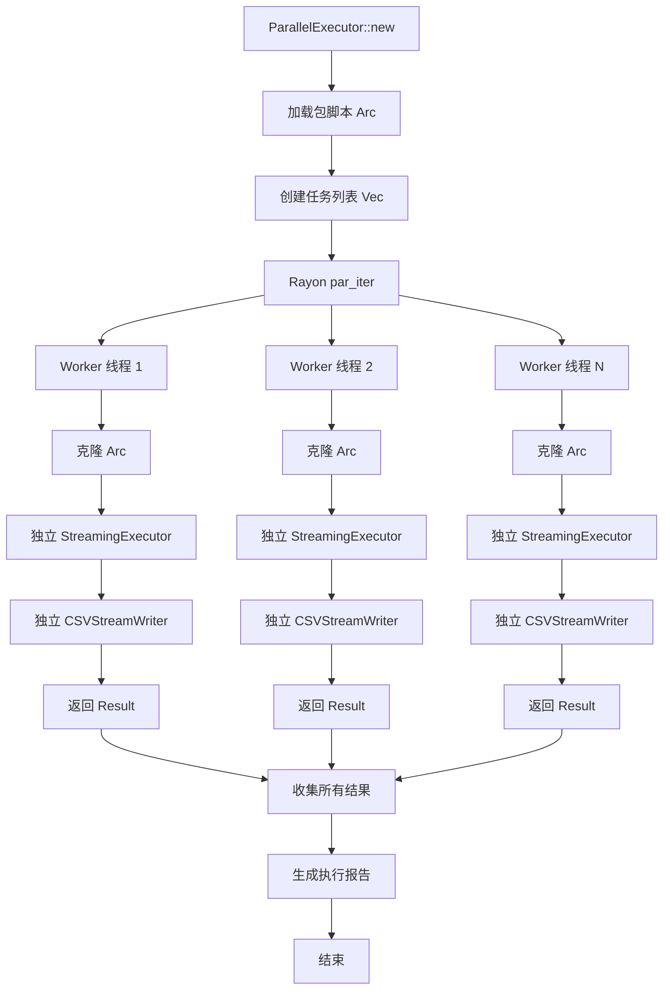
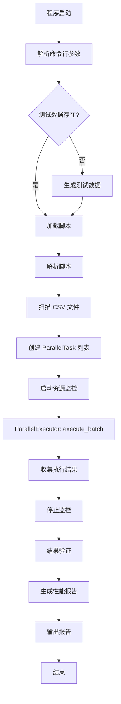
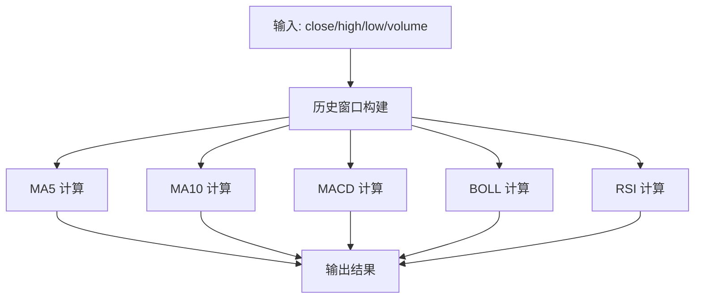

# DPLang 并发计算机制实现与大规模性能测试设计

## 设计背景与目标

当前 DPLang 已实现完整的流式计算能力（daemon 模式），但尚未提供语言层面的并发计算支持。本设计分为两个阶段：

**阶段一：实现并发计算机制**  
为 DPLang 添加并发执行能力，使其能够充分利用多核 CPU 并行处理多个数据流。

**阶段二：大规模性能测试**  
基于并发机制，对 5000 只股票、每股 20000 条数据进行大规模并发性能测试。

## 一、阶段一：并发计算机制设计

### 1.1 设计目标

为 DPLang 提供高性能、线程安全的并发计算能力，支持：

- **多数据流并行执行**: 同时处理多只股票的实时数据流
- **内存安全保证**: 利用 Rust 所有权系统避免数据竞争
- **资源高效利用**: 基于 Rayon 工作窃取算法，充分利用多核 CPU
- **API 易用性**: 提供简洁的并发 API，对用户透明

### 1.2 并发安全性分析

#### DPLang 天然并发友好的特性

根据项目设计规范，DPLang 采用纯函数设计模式：

| 特性 | 并发安全性 | 说明 |
|------|-----------|------|
| 数据脚本无副作用 | ✅ 完全安全 | 每次执行独立，不修改外部状态 |
| 包脚本只执行一次 | ✅ 完全安全 | 在并发执行前加载，之后只读访问 |
| StreamingExecutor 独立 | ✅ 完全安全 | 每个数据流有独立执行器实例 |
| 输出分组写入 | ✅ 完全安全 | 按 stock_code 分文件，无共享 |

**结论**: DPLang 的纯函数设计天然适合并发，无需额外的锁机制。

### 1.3 并发架构设计

#### 核心组件：ParallelExecutor

新增 `src/executor/parallel.rs` 模块，实现并发执行器：

#### 设计要点

| 要素 | 设计方案 |
|------|----------|
| 并发粒度 | 以单只股票为最小调度单元（粗粒度） |
| 线程模型 | Rayon 数据并行，工作窃取队列 |
| 状态隔离 | 每个任务独立 StreamingExecutor + CSVStreamWriter |
| 包共享 | 通过 Arc 共享包脚本的解析结果（只读） |
| 错误处理 | 单个任务失败不影响其他任务，收集所有错误 |

#### 并发执行流程



### 1.4 API 设计

#### 公共接口定义

在 `src/executor/mod.rs` 中导出：

```rust
pub struct ParallelExecutor;

pub struct ParallelTask {
    stock_code: String,
    csv_path: PathBuf,
}

pub struct ParallelResult {
    stock_code: String,
    rows_processed: usize,
    duration_ms: u64,
    result: Result<(), String>,
}

pub struct ParallelSummary {
    total_stocks: usize,
    success_count: usize,
    failed_count: usize,
    total_rows: usize,
    total_duration_ms: u64,
    throughput_rows_per_sec: f64,
}
```

#### 方法签名

**核心执行方法**：

```
ParallelExecutor::execute_batch(
    script: Script,
    tasks: Vec<ParallelTask>,
    window_size: usize,
    output_dir: PathBuf,
) -> Result<ParallelSummary, String>
```

**辅助方法**：

```
ParallelExecutor::from_directory(
    script_path: &str,
    data_dir: &str,
    pattern: &str,  // 例如 "stock_*.csv"
) -> Result<Vec<ParallelTask>, String>
```

### 1.5 实现细节

#### 依赖项扩展

在 `Cargo.toml` 中添加：

```toml
[dependencies]
rayon = "1.8"        # 并行计算框架
```

#### 包数据共享策略

由于包脚本在所有任务间共享且只读，使用 `Arc` 实现零开销共享：

```
数据结构：
Arc<HashMap<String, Script>>  // 解析后的包脚本

在每个 Worker 线程中：
let packages_clone = Arc::clone(&packages);  // 只增加引用计数，不复制数据
```

#### 进度监控机制

使用原子计数器实现无锁进度追踪：

```
use std::sync::atomic::{AtomicUsize, Ordering};

static PROCESSED_COUNT: AtomicUsize = AtomicUsize::new(0);

每个任务完成后：
let count = PROCESSED_COUNT.fetch_add(1, Ordering::Relaxed);
if count % 100 == 0 {
    println!("进度: {}/{}", count, total);
}
```

#### 错误隔离与收集

每个任务返回 `Result<ParallelResult, String>`，失败不中断其他任务：

```
Rayon 并行迭代：
tasks.par_iter().map(|task| {
    match process_task(task) {
        Ok(result) => result,
        Err(e) => ParallelResult::failed(task.stock_code, e),
    }
}).collect()
```

### 1.6 代码模块组织

#### 新增文件结构

```
src/executor/
├── mod.rs              # 添加 pub mod parallel; pub use parallel::*;
├── parallel.rs         # 新增：并发执行器实现
├── streaming.rs        # 现有：单流执行器
├── data_stream.rs      # 现有：数据流执行器
└── ...
```

#### 模块职责划分

| 模块 | 职责 | 并发安全 |
|------|------|----------|
| parallel.rs | 并发调度、任务分配、结果汇总 | ✅ Rayon 保证 |
| streaming.rs | 单个数据流的流式处理 | ✅ 独立实例 |
| data_stream.rs | 批量数据的行级执行 | ✅ 独立实例 |

### 1.7 测试策略

#### 单元测试

在 `src/executor/parallel.rs` 中添加：

```
测试用例：
1. test_parallel_executor_basic - 基础并发执行（10个小任务）
2. test_parallel_executor_error_isolation - 错误隔离验证
3. test_parallel_executor_result_correctness - 结果正确性（对比单线程）
4. test_parallel_executor_package_sharing - 包共享机制验证
```

#### 集成测试

创建 `tests/parallel_integration_test.rs`：

```
测试场景：
1. 100 只股票 × 1000 行数据
2. 验证输出文件数量、行数、内容正确性
3. 验证性能提升（对比单线程有加速比）
```

## 二、阶段二：大规模性能测试设计

### 2.1 测试目标与指标

在完成并发机制实现后，进行大规模性能测试验证系统能力。

#### 测试规模

- **并发规模**: 5,000 只股票同时处理
- **数据规模**: 每只股票 20,000 条 tick 数据
- **总数据量**: 100,000,000 条记录 (5000 × 20000)
- **计算复杂度**: 计算 MA5, MA10, MACD, BOLL, RSI 五种技术指标

#### 性能目标

| 指标 | 目标值 | 对比基准 |
|------|--------|----------|
| 总执行时间 | < 5 分钟 | 单线程约 73 分钟 |
| 加速比（8核） | > 6x | 理论最大 8x |
| 吞吐量 | > 300,000 行/秒 | 单线程 23,000 行/秒 |
| 峰值内存 | < 12 GB | - |
| CPU 利用率 | > 80% | 证明并行有效 |

### 2.2 测试程序设计

#### 程序入口：large_scale_test.rs

创建 `examples/large_scale_test.rs`，基于 ParallelExecutor 实现大规模测试。

#### 执行流程设计



### 2.3 测试数据生成策略

#### 数据文件组织

测试数据存放在 `examples/test_datas/` 目录：

```
examples/test_datas/
├── stock_000001.csv  (20,000 rows)
├── stock_000002.csv  (20,000 rows)
├── ...
└── stock_005000.csv  (20,000 rows)
```

#### 数据格式规范

每个 CSV 文件包含以下字段：

| 字段名 | 类型 | 说明 |
|--------|------|------|
| stock_code | string | 股票代码（如 "000001"） |
| timestamp | number | Unix时间戳（秒） |
| open | number | 开盘价 |
| high | number | 最高价 |
| low | number | 最低价 |
| close | number | 收盘价 |
| volume | number | 成交量 |

#### 数据生成算法

- **价格模拟**: 使用几何布朗运动模型生成符合真实市场波动特征的股价序列
- **时间间隔**: 每条记录间隔 60 秒（分钟级数据）
- **数值范围**: 
  - 股价: 10.0 ~ 200.0
  - 成交量: 100,000 ~ 10,000,000
- **随机种子**: 每只股票使用不同种子保证数据多样性

### 2.4 测试脚本设计

创建 `examples/performance_test.dp` 脚本计算所有目标指标：

#### 脚本输入输出定义

```
INPUT:
  - close: number
  - high: number
  - low: number
  - volume: number

OUTPUT:
  - ma5: number
  - ma10: number
  - macd: number
  - macd_signal: number
  - macd_hist: number
  - boll_upper: number
  - boll_middle: number
  - boll_lower: number
  - rsi: number
```

#### 计算逻辑抽象

1. **MA5 / MA10**: 使用 SMA 函数，基于 window("close", N) 历史数据
2. **MACD**: 调用内置 MACD 函数，返回 DIF、DEA、MACD柱
3. **BOLL**: 调用内置 BOLL 函数，计算中轨、上轨、下轨
4. **RSI**: 调用内置 RSI 函数，基于 14 周期默认参数

#### 指标计算依赖关系



## 三、性能监控与分析

### 3.1 监控指标采集

#### 时间维度

| 指标名称 | 计算方式 | 目标值 |
|----------|----------|--------|
| 总执行时间 | 测试开始到结束的墙钟时间 | < 5 分钟 |
| 单股处理时间 | 每只股票的平均处理时间 | < 100 毫秒 |
| 吞吐量 | 总记录数 / 总时间 | > 300,000 行/秒 |
| P50 延迟 | 中位数处理时间 | < 80 毫秒 |
| P99 延迟 | 99分位处理时间 | < 200 毫秒 |

#### 资源维度

| 指标名称 | 监控方式 | 预期值 |
|----------|----------|--------|
| 峰值内存 | 进程 RSS 监控 | < 12 GB |
| CPU 利用率 | 多核平均使用率 | > 80% |
| 磁盘 I/O | 读写吞吐量 MB/s | - |
| 文件句柄数 | 同时打开的文件数 | < 10000 |

#### 正确性维度

- **结果抽样**: 随机选择 10 只股票的输出结果
- **对比基准**: 与单线程执行结果逐行比对
- **容差范围**: 浮点数误差 < 1e-6
- **完整性检查**: 所有股票输出行数 = 20,000

### 3.2 监控工具选型

#### 依赖项扩展

在 `Cargo.toml` 的 `[dev-dependencies]` 中添加：

```toml
sysinfo = "0.30"  # 系统资源监控
```

#### 监控实现策略

| 监控类型 | 实现方式 | 采样频率 |
|---------|---------|----------|
| 执行时间 | std::time::Instant | 每任务开始/结束 |
| 内存占用 | sysinfo::System | 每秒采样一次 |
| 进度追踪 | AtomicUsize 计数器 | 每任务完成时 |
| CPU 使用率 | sysinfo::CpuRefreshKind | 每秒采样一次 |

### 3.3 性能分析报告

生成 `performance_report.json`，包含详细指标和统计信息。

#### 报告数据结构

```json
{
  "test_config": {
    "stock_count": 5000,
    "rows_per_stock": 20000,
    "total_rows": 100000000,
    "thread_count": 8,
    "window_size": 1000
  },
  "execution_metrics": {
    "total_seconds": 300.5,
    "throughput_rows_per_sec": 332779,
    "speedup_vs_single_thread": 7.2
  },
  "resource_metrics": {
    "peak_memory_mb": 8500,
    "avg_memory_mb": 6200,
    "avg_cpu_percent": 750.0
  },
  "per_stock_stats": {
    "avg_duration_ms": 180.1,
    "p50_ms": 150,
    "p90_ms": 220,
    "p99_ms": 350
  },
  "correctness": {
    "success_count": 5000,
    "failed_count": 0,
    "sample_validation_passed": true
  }
}
```

## 四、实现步骤与里程碑

### 4.1 阶段一：并发机制实现

#### 步骤 1.1：创建并发执行器模块

**任务**：
- 创建 `src/executor/parallel.rs`
- 实现 `ParallelExecutor` 结构体
- 实现 `execute_batch` 方法

**验收标准**：
- 编译通过
- 基础单元测试通过（10 个小任务）

#### 步骤 1.2：实现包共享机制

**任务**：
- 使用 `Arc<HashMap<String, Script>>` 共享包数据
- 在每个 Worker 中克隆 Arc
- 验证多线程访问安全性

**验收标准**：
- 包共享测试通过
- 无数据竞争（Rust 编译器保证）

#### 步骤 1.3：实现错误处理与进度监控

**任务**：
- 错误隔离机制（单任务失败不影响其他）
- 原子计数器实现进度追踪
- 结果汇总与统计

**验收标准**：
- 错误隔离测试通过
- 进度日志正常输出

#### 步骤 1.4：集成测试

**任务**：
- 创建 `tests/parallel_integration_test.rs`
- 测试 100 股 × 1000 行场景
- 验证结果正确性（对比单线程）

**验收标准**：
- 集成测试全部通过
- 验证有性能加速比（> 2x）

### 4.2 阶段二：大规模测试实施

#### 步骤 2.1：数据生成工具

**任务**：
- 创建 `examples/generate_test_data.rs`
- 实现几何布朗运动价格生成算法
- 支持并行生成 5000 个文件

**验收标准**：
- 成功生成 5000 个 CSV 文件
- 每个文件 20000 行
- 数据格式符合规范

#### 数据生成功能设计

- **参数化配置**: 支持命令行指定股票数量、数据量、起始价格等
- **批量生成**: 使用并行生成加速数据准备
- **数据验证**: 生成后自动校验文件格式和行数

#### 价格序列生成算法

采用几何布朗运动 (GBM) 模型：

```
S(t+1) = S(t) * exp((μ - σ²/2)Δt + σ√Δt * Z)
```

其中：
- S(t): t时刻价格
- μ: 漂移率（年化收益率，如 0.1）
- σ: 波动率（年化标准差，如 0.2）
- Δt: 时间步长（分钟数据为 1/252/390）
- Z: 标准正态分布随机数

#### 步骤 2.2：测试脚本编写

**任务**：
- 创建 `examples/performance_test.dp`
- 实现 MA5/MA10/MACD/BOLL/RSI 计算
- 验证脚本语法正确性

**验收标准**：
- 脚本解析通过
- 单股测试结果正确

#### 步骤 2.3：测试程序开发

**任务**：
- 创建 `examples/large_scale_test.rs`
- 基于 `ParallelExecutor` 实现测试逻辑
- 集成资源监控（sysinfo）

**验收标准**：
- 程序编译通过
- 小规模测试（100 股）成功

#### 步骤 2.4：全量性能测试

**任务**：
- 运行 5000 股 × 20000 行测试
- 采集所有性能指标
- 生成性能报告

**验收标准**：
- 测试成功完成
- 性能达标（< 30 分钟，8核机器）
- 结果正确性验证通过

## 五、测试执行计划

### 5.1 测试环境要求

| 资源类型 | 最低配置 | 推荐配置 |
|----------|----------|----------|
| CPU | 4核 | 8核及以上 |
| 内存 | 16 GB | 32 GB |
| 磁盘 | 10 GB 可用空间 | SSD，20 GB |
| 操作系统 | Windows/Linux/macOS | - |

### 5.2 执行步骤

#### 步骤 5.2.1: 生成测试数据

```bash
cargo run --release --example generate_test_data -- \
  --stocks 5000 \
  --rows 20000 \
  --output examples/test_datas
```

预期耗时: 1-3 分钟

#### 步骤 5.2.2: 运行性能测试

```bash
cargo run --release --example large_scale_test -- \
  --script examples/performance_test.dp \
  --data-dir examples/test_datas \
  --output-dir output
```

#### 步骤 5.2.3: 分析测试报告

查看生成的 `performance_report.json` 和控制台输出。

### 5.3 验证方式

#### 基线对比测试

先运行单线程版本建立基线：

```bash
cargo run --release -- daemon examples/performance_test.dp examples/test_datas/stock_000001.csv
```

记录单股处理时间和内存占用。

#### 并发正确性验证

随机抽取 10 只股票，对比单线程和并行执行的输出文件：

```
使用文件哈希或逐行 diff 验证结果一致性
```

## 六、预期结果与分析

### 6.1 性能预估

基于当前单股基准性能（5000行数据 0.22秒）：

- **单股 20000 行**: 约 0.88 秒（线性外推）
- **5000 股顺序执行**: 4400 秒 ≈ 73 分钟
- **8 核并行（理想加速比 7x）**: 约 10.5 分钟
- **实际预期（考虑开销）**: 15-20 分钟

### 6.2 性能瓶颈分析

#### 可能的瓶颈点

| 瓶颈类型 | 原因分析 | 缓解措施 |
|----------|----------|----------|
| I/O 密集 | 大量文件读写 | 使用 SSD，增加缓冲区 |
| 内存带宽 | 大数据量并发访问 | 优化数据结构，减少拷贝 |
| 锁竞争 | 输出文件写入冲突 | 每股独立文件，避免共享 |
| GC 压力 | Rust 无 GC，不适用 | - |

#### 优化方向

1. **CSV 解析优化**: 已引入 csv crate，预期 5-10x 提升
2. **指标计算优化**: MACD/KDJ 已采用增量计算器，避免重复遍历
3. **内存布局优化**: VecDeque 窗口管理高效
4. **并行度调优**: 可通过环境变量 `RAYON_NUM_THREADS` 调整

### 6.3 成功标准

测试通过条件：

- ✅ 所有 5000 只股票成功生成输出文件
- ✅ 输出文件行数正确（每股 20000 行）
- ✅ 抽样验证结果正确性（与基线一致）
- ✅ 总执行时间 < 30 分钟（8核机器）
- ✅ 无内存泄漏或崩溃
- ✅ CPU 利用率 > 60%（证明并行有效）

## 七、风险与应对

### 7.1 潜在风险

| 风险项 | 影响 | 概率 | 应对措施 |
|--------|------|------|----------|
| 内存溢出 | 测试中断 | 中 | 限制并发数、增大内存 |
| 磁盘空间不足 | 写入失败 | 低 | 预检查空间、压缩输出 |
| 文件句柄耗尽 | I/O 错误 | 中 | 调整系统 ulimit |
| 数据竞争 bug | 结果错误 | 低 | Rust 编译器保证内存安全 |
| 性能不达标 | 需优化 | 中 | 分阶段测试，逐步调优 |

### 7.2 降级方案

如果全量测试失败，可采用降级策略：

1. **缩小规模**: 先测试 500 股 × 20000 行
2. **减少并发**: 手动限制 Rayon 线程数
3. **分批执行**: 将 5000 股分 10 批，每批 500 股

## 八、后续扩展方向

### 8.1 实时流式场景

- 模拟 WebSocket 推送，测试真实 tick 级并发
- 引入 Tokio 异步框架支持高并发连接

### 8.2 分布式扩展

- 设计主从架构，多节点协同处理
- 使用消息队列（如 Kafka）作为数据分发层

### 8.3 持久化优化

- 替换 CSV 为 Parquet 或 Arrow IPC 格式
- 引入列式存储提升 I/O 效率

### 8.4 监控可视化

- 集成 Prometheus + Grafana 实时监控
- 生成火焰图分析热点函数

## 九、项目交付物

### 9.1 阶段一交付物：并发机制

| 文件路径 | 说明 |
|---------|------|
| `src/executor/parallel.rs` | 并发执行器核心实现 |
| `src/executor/mod.rs` | 导出并发 API |
| `tests/parallel_integration_test.rs` | 集成测试 |

### 9.2 阶段二交付物：性能测试

| 文件路径 | 说明 |
|---------|------|
| `examples/large_scale_test.rs` | 主测试程序 |
| `examples/generate_test_data.rs` | 数据生成工具 |
| `examples/performance_test.dp` | 测试脚本（计算5种指标） |
| `examples/test_datas/*.csv` | 测试数据文件（5000个） |

### 9.3 测试报告

- `performance_report.json`：详细性能数据
- `test_summary.md`：测试执行总结
- `performance_analysis.md`：性能分析报告

## 十、总结

### 10.1 设计亮点

1. **分阶段实施**：先实现并发机制，再进行大规模测试，降低风险
2. **充分利用 Rust 特性**：所有权系统保证并发安全，无需锁
3. **纯函数设计**：DPLang 天然并发友好，无副作用
4. **工业级工具**：基于 Rayon 成熟框架，稳定可靠
5. **全面监控**：多维度性能指标，便于分析优化

### 10.2 关键成功因素

- ✅ DPLang 纯函数设计天然并发安全
- ✅ StreamingExecutor 已验证稳定性
- ✅ Rayon 提供高效并行调度
- ✅ 独立文件输出避免锁竞争
- ✅ 分阶段验证降低实施风险
