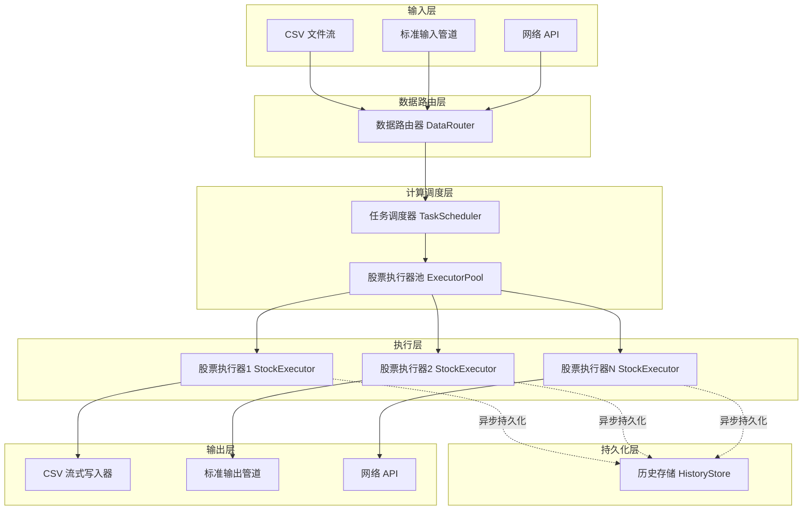
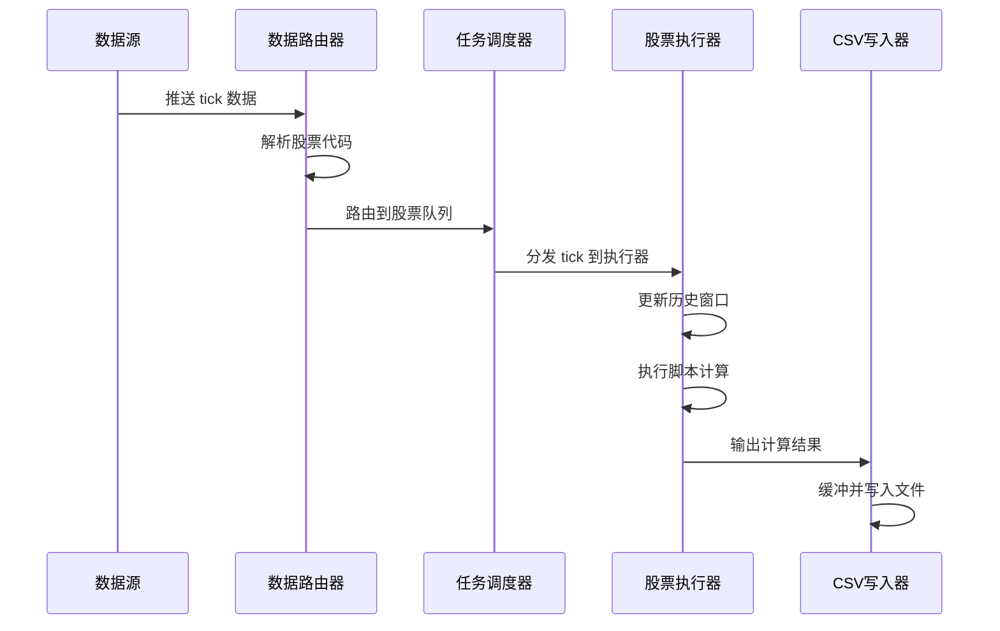
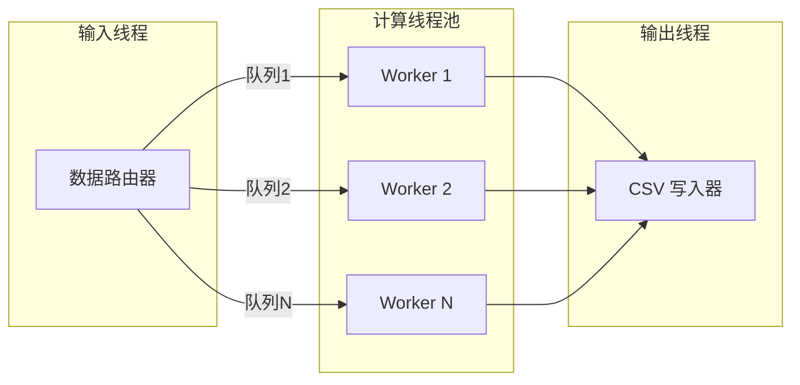
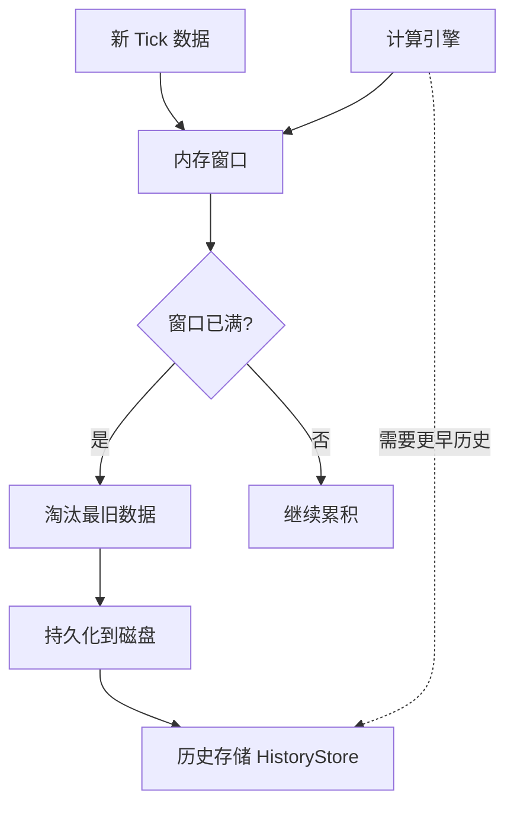
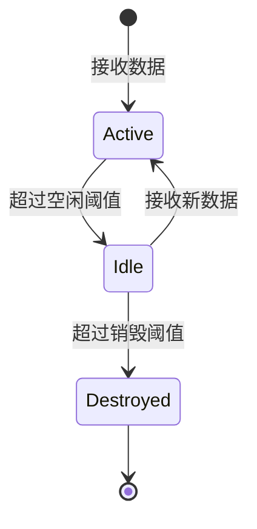
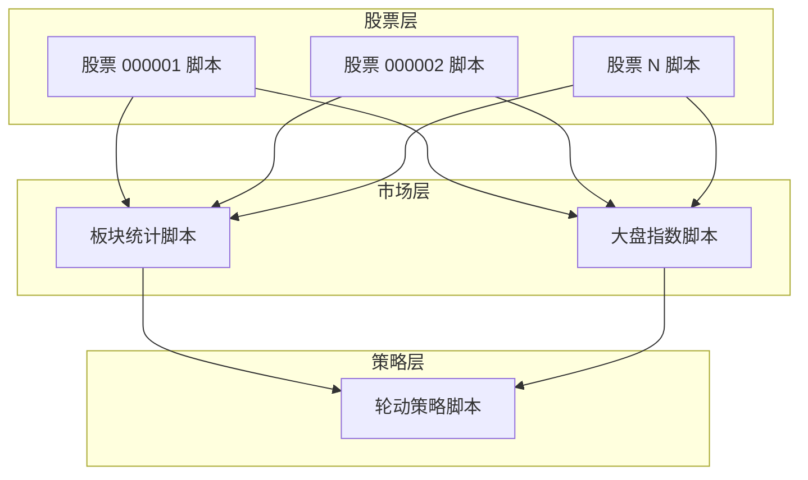

# DPLang 实时流式计算架构设计

## 一、产品定位

**DPLang 是一个为金融数据分析设计的实时高性能流式计算脚本语言**

### 1.1 核心特性

- **流式处理范式**：数据以 tick 级流式输入，逐条实时计算输出
- **分层编排能力**：支持多层流式计算编排（股票层 → 市场层 → N 层）
- **内存高效设计**：历史数据持久化，内存仅保留计算窗口
- **天然并发安全**：脚本纯函数设计，无副作用，无竞态条件

### 1.2 运行模式

DPLang 支持三种核心运行模式：
- **批处理模式**：一次性处理历史数据（已实现）
- **回测模式**：基于历史数据模拟实时执行
- **实时流式模式**：常驻进程持续处理 tick 级数据流

本设计聚焦于**实时流式模式**的架构设计，需要满足以下核心需求：
- 支持 Daemon 方式常驻运行
- 支持持续的 tick 数据输入（CSV/管道/API）
- 支持实时计算输出（CSV文件/管道/API）
- 支持并行计算处理上万只股票
- 提供内建的 CSV 流式写入能力
- 支持与其他程序的管道级联调用
- 支持多层流式脚本编排（未来扩展）

## 三、架构设计

### 3.1 整体架构



### 3.2 核心组件说明

#### 3.2.1 数据路由器 DataRouter

**职责**：
- 接收多源数据输入（CSV 文件流、标准输入管道、网络 API）
- 解析数据格式，提取股票代码标识
- 将 tick 数据路由到对应的股票执行器队列

**关键设计**：
- 支持数据源热插拔
- 提供统一的数据格式转换接口
- 支持背压机制（当执行器繁忙时暂缓读取）

**输入数据格式规范**：

| 格式类型 | 数据结构 | 示例 |
|---------|---------|------|
| CSV 行格式 | `stock_code,timestamp,field1,field2,...` | `000001,2024-01-01 09:30:00,100.5,1000` |
| JSON 行格式 | `{"stock":"code","ts":"...","data":{...}}` | `{"stock":"000001","ts":"...","close":100.5}` |
| 管道协议 | 与 CSV 行格式一致 | 同上 |

#### 3.2.2 任务调度器 TaskScheduler

**职责**：
- 管理股票执行器的生命周期（创建、复用、销毁）
- 调度 tick 数据到对应的执行器线程
- 负载均衡（避免单个执行器过载）

**关键设计**：
- 采用线程池模型，复用执行器减少创建开销
- 使用无锁消息队列（如 crossbeam-channel）传递 tick 数据
- 支持动态调整线程池大小（根据股票数量和系统负载）

**配置参数**：

| 参数名 | 类型 | 默认值 | 说明 |
|-------|-----|-------|------|
| worker_threads | 整数 | CPU核心数 | 工作线程数量 |
| max_executors | 整数 | 10000 | 最大执行器数量 |
| queue_size | 整数 | 1000 | 每个执行器的队列长度 |
| idle_timeout | 秒 | 300 | 执行器空闲超时销毁时间 |

#### 3.2.3 股票执行器 StockExecutor

**职责**：
- 每个股票维护独立的执行上下文
- 维护股票的历史数据窗口（用于 ref/past/window 函数）
- 执行脚本计算，生成输出结果
- 管理历史数据持久化和内存窗口

**关键设计**：
- 基于现有 DataStreamExecutor 改造，支持增量 tick 推送
- **内存窗口 + 磁盘持久化**：内存仅保留计算窗口，历史数据自动持久化
- 执行器间完全隔离，无共享状态（天然并发安全，符合纯函数设计）

**状态管理**：

| 状态项 | 数据结构 | 说明 |
|-------|---------|------|
| 执行上下文 | ExecutionContext | 变量作用域和值 |
| 内存窗口 | VecDeque | 固定长度的热数据（用于快速计算） |
| 历史存储句柄 | HistoryStore | 磁盘持久化的历史数据访问接口 |
| 脚本定义 | Script | 编译后的脚本 AST |

#### 3.2.4 历史存储 HistoryStore

**职责**：
- 接收执行器淘汰的历史数据，持久化到磁盘
- 提供历史数据查询接口（当计算需要访问超出内存窗口的数据时）
- 管理磁盘文件的生命周期（压缩、归档、清理）

**关键设计**：
- 异步写入队列，不阻塞计算线程
- 按股票代码分文件存储，支持并发访问
- 支持多种存储格式（CSV、Parquet、内存映射文件）

**接口设计**：

| 方法 | 参数 | 返回值 | 说明 |
|-----|------|-------|------|
| append | stock_code, data_row | Result | 追加历史数据行 |
| query | stock_code, start_index, end_index | Vec | 查询历史数据范围 |
| flush | stock_code | Result | 强制刷盘指定股票数据 |
| cleanup | before_date | Result | 清理指定日期之前的数据 |

#### 3.2.5 CSV 流式写入器 CSVStreamWriter

**职责**：
- 接收执行器输出结果，追加写入 CSV 文件
- 支持按股票分文件或统一文件两种模式
- 提供缓冲和批量写入优化

**关键设计**：
- 使用带缓冲的文件写入，减少系统调用
- 支持文件滚动（按时间或大小分片）
- 提供刷盘策略配置（立即刷盘 vs 批量刷盘）

**写入模式**：

| 模式 | 文件命名规则 | 适用场景 |
|-----|-------------|---------|
| 按股票分文件 | `output_{stock_code}_{date}.csv` | 小规模股票（< 1000） |
| 统一文件 | `output_all_{date}.csv` | 大规模股票（> 1000） |
| 按分组分文件 | `output_{group}_{date}.csv` | 行业/板块分组 |

### 3.3 数据流设计

#### 3.3.1 实时处理流程



#### 3.3.2 并行计算模型



**并行策略**：
- 输入线程负责数据解析和路由（单线程，避免乱序）
- 计算线程池并行处理不同股票（多线程，互不干扰）
- 输出线程负责结果收集和写入（单线程或按分组多线程）

### 3.4 内存管理策略

#### 3.4.1 内存窗口 + 磁盘持久化架构

**核心思路**：内存仅保留计算所需的热数据窗口，历史数据自动持久化到磁盘



**窗口配置**：

| 窗口类型 | 默认长度 | 配置参数 | 说明 |
|---------|---------|---------|------|
| 内存窗口 | 1000 行 | memory_window_size | 内存中保留的热数据 |
| 磁盘历史 | 无限制 | 无 | 自动持久化，按需加载 |

**窗口淘汰策略**：
- 当内存窗口达到上限时，自动将最旧数据持久化到磁盘
- 计算过的历史数据不再变化，可安全持久化
- 若计算需要访问更早历史（超出内存窗口），从磁盘加载

#### 3.4.2 历史数据持久化设计

**存储格式**：

| 格式类型 | 文件命名 | 适用场景 |
|---------|---------|----------|
| CSV 文件 | `{stock_code}_history.csv` | 简单场景，便于调试 |
| Parquet 文件 | `{stock_code}_history.parquet` | 高性能场景，列式压缩 |
| 内存映射文件 | `{stock_code}_history.mmap` | 超大数据集，按需加载 |

**持久化策略**：
- **异步写入**：历史数据持久化不阻塞计算线程
- **批量刷盘**：累积一定数量后批量写入，减少 IO 开销
- **惰性加载**：历史数据仅在需要时从磁盘加载（通常不需要）

#### 3.4.3 执行器回收机制

当股票执行器长时间未接收到数据时，自动回收释放内存：



**超时配置**：
- 空闲阈值：60 秒（停止计算但保留状态）
- 销毁阈值：300 秒（释放内存和资源）

## 四、接口设计

### 4.1 命令行接口

#### 4.1.1 实时模式启动

```
dplang daemon <script.dp> [options]
```

**参数说明**：

| 参数 | 类型 | 默认值 | 说明 |
|-----|-----|-------|------|
| --input-mode | csv/pipe/api | csv | 输入数据模式 |
| --input-source | 路径 | stdin | 输入数据源（文件路径或 API 端点） |
| --output-mode | csv/pipe/api | csv | 输出数据模式 |
| --output-path | 路径 | ./output | 输出目录或文件路径 |
| --workers | 整数 | CPU核心数 | 工作线程数 |
| --window-size | 整数 | 1000 | 历史窗口长度 |
| --csv-mode | split/unified | split | CSV 文件模式 |

**示例**：

```bash
# CSV 文件流输入，按股票分文件输出
dplang daemon strategy.dp --input-mode csv --input-source data.csv --output-mode csv --output-path ./output --csv-mode split

# 标准输入管道，标准输出管道
dplang daemon strategy.dp --input-mode pipe --output-mode pipe

# 自定义线程数和窗口大小
dplang daemon strategy.dp --workers 16 --window-size 2000
```

### 4.2 管道协议设计

#### 4.2.1 输入管道协议

**格式**：CSV 行格式，每行一个 tick 数据

```
stock_code,timestamp,field1,field2,...
000001,2024-01-01 09:30:00,100.5,1000
000002,2024-01-01 09:30:01,50.2,2000
```

**字段约定**：
- `stock_code`：股票代码（必需，用于路由）
- `timestamp`：时间戳（可选，用于回测）
- 其他字段：与脚本 INPUT 定义对应

#### 4.2.2 输出管道协议

**格式**：与输入一致，追加计算结果字段

```
stock_code,timestamp,field1,field2,output1,output2,...
000001,2024-01-01 09:30:00,100.5,1000,102.3,buy
```

#### 4.2.3 级联管道调用示例

```bash
# 数据生成器 | DPLang 计算 | 结果过滤器
data_generator | dplang daemon strategy.dp --input-mode pipe --output-mode pipe | result_filter
```

### 4.3 API 接口设计

#### 4.3.1 启动实时引擎

**接口原型**：

```
RealtimeEngine::new(script_source, config) -> Result<RealtimeEngine>
```

**参数**：

| 参数 | 类型 | 说明 |
|-----|-----|------|
| script_source | 字符串 | 脚本源代码 |
| config | RealtimeConfig | 配置参数 |

#### 4.3.2 推送 tick 数据

**接口原型**：

```
engine.push_tick(stock_code, tick_data) -> Result<()>
```

**参数**：

| 参数 | 类型 | 说明 |
|-----|-----|------|
| stock_code | 字符串 | 股票代码 |
| tick_data | HashMap | tick 数据字段映射 |

#### 4.3.3 订阅输出结果

**接口原型**：

```
engine.subscribe_output(callback) -> SubscriptionHandle
```

**回调函数签名**：

```
callback(stock_code: String, result: HashMap<String, Value>)
```

#### 4.3.4 停止引擎

**接口原型**：

```
engine.shutdown() -> Result<()>
```

**行为说明**：
- 停止接收新数据
- 等待所有正在计算的任务完成
- 刷新所有缓冲的输出
- 释放资源

## 五、性能优化策略

### 5.1 零拷贝优化

**策略**：
- 输入数据使用引用计数（Rc）共享，避免深拷贝
- 历史窗口使用环形缓冲区，减少内存移动
- 字符串字段使用 Rc 共享，避免重复分配

### 5.2 批量处理优化

**策略**：
- CSV 写入器采用批量缓冲，减少系统调用
- 支持配置批量大小（默认 100 行）
- 提供强制刷盘接口（确保数据持久化）

### 5.3 无锁通信优化

**策略**：
- 使用无锁队列（crossbeam-channel）进行线程间通信
- 避免全局锁，每个执行器独立状态
- 使用原子操作进行计数器和标志位更新

### 5.4 内存池复用

**策略**：
- 执行器对象池复用，避免频繁创建销毁
- HashMap 容量预分配，减少扩容开销
- 字符串缓冲区复用（解析和格式化）

## 六、监控与可观测性

### 6.1 性能指标

**实时采集指标**：

| 指标名 | 类型 | 说明 |
|-------|-----|------|
| tick_input_rate | 计数器 | 每秒输入 tick 数 |
| tick_process_rate | 计数器 | 每秒处理 tick 数 |
| tick_output_rate | 计数器 | 每秒输出结果数 |
| executor_active_count | 仪表盘 | 活跃执行器数量 |
| executor_idle_count | 仪表盘 | 空闲执行器数量 |
| queue_depth | 仪表盘 | 各队列堆积深度 |
| process_latency_ms | 直方图 | 处理延迟分布 |
| memory_usage_mb | 仪表盘 | 内存占用 |

### 6.2 日志输出

**日志级别设计**：

| 级别 | 适用场景 | 示例内容 |
|-----|---------|---------|
| ERROR | 执行错误、数据解析失败 | 股票 000001 计算错误：除零异常 |
| WARN | 队列堆积、执行器超时 | 股票 000002 队列深度达到 500 |
| INFO | 启动停止、配置变更 | 实时引擎启动，工作线程数：8 |
| DEBUG | 数据路由、执行器调度 | 路由 tick 到股票 000001 执行器 |

### 6.3 监控数据输出

**输出方式**：

| 方式 | 格式 | 适用场景 |
|-----|-----|---------|
| 标准错误输出 | 文本日志 | 调试和排错 |
| Prometheus 格式 | HTTP 接口 | Grafana 可视化 |
| JSON 日志文件 | 结构化日志 | 日志分析系统 |

## 七、容错与稳定性设计

### 7.1 异常隔离

**设计原则**：
- 单个股票执行器异常不影响其他股票
- 捕获脚本执行错误，记录日志并跳过该 tick
- 输入数据解析失败跳过该行，记录警告

### 7.2 背压处理

**策略**：
- 当执行器队列堆积达到阈值时，暂停数据路由
- 输出缓冲区满时，阻塞执行器输出
- 提供丢弃策略选项（可选：丢弃最旧数据）

### 7.3 优雅停机

**流程**：
1. 接收停机信号（SIGTERM/SIGINT）
2. 停止接收新数据
3. 等待所有队列清空（超时时间可配置）
4. 强制刷盘所有缓冲输出
5. 清理资源并退出

## 八、实现路径

### 8.1 第一阶段：基础实时能力

**目标**：支持单线程实时计算

**任务清单**：
- 改造 DataStreamExecutor 支持增量 tick 推送
- 实现 CSV 流式读取器（监听文件追加）
- 实现 CSV 流式写入器（带缓冲）
- 实现命令行 daemon 模式入口

### 8.2 第二阶段：并行计算能力

**目标**：支持多股票并行计算

**任务清单**：
- 实现数据路由器（按股票代码分发）
- 实现任务调度器（线程池模型）
- 改造 StockExecutor 为线程安全
- 实现执行器池和生命周期管理

### 8.3 第三阶段：管道与 API 接口

**目标**：支持多种输入输出模式

**任务清单**：
- 实现标准输入/输出管道协议
- 实现 RealtimeEngine API 接口
- 实现订阅回调机制
- 完善错误处理和日志输出

### 8.4 第四阶段：性能优化与监控

**目标**：满足万级股票实时计算

**任务清单**：
- 实现零拷贝和内存池优化
- 实现无锁队列通信
- 实现性能指标采集
- 实现 Prometheus 监控接口
- 压力测试和性能调优

## 九、配置文件设计

### 9.1 配置文件格式

采用 TOML 格式配置文件 `dplang.toml`：

```
[engine]
worker_threads = 8
max_executors = 10000
input_window_size = 1000
output_window_size = 1000

[input]
mode = "csv"              # csv / pipe / api
source = "data.csv"       # 文件路径或 API 端点
buffer_size = 1000        # 输入缓冲区大小

[output]
mode = "csv"              # csv / pipe / api
path = "./output"         # 输出目录
csv_mode = "split"        # split / unified
buffer_size = 100         # 输出缓冲区大小
flush_interval_ms = 1000  # 刷盘间隔（毫秒）

[scheduler]
queue_size = 1000         # 每个执行器队列长度
idle_timeout_sec = 60     # 空闲超时
destroy_timeout_sec = 300 # 销毁超时

[monitoring]
enabled = true
metrics_port = 9090       # Prometheus 指标端口
log_level = "info"        # error / warn / info / debug
```

### 9.2 配置优先级

命令行参数 > 配置文件 > 默认值

## 十、依赖库选择

| 功能模块 | 依赖库 | 说明 |
|---------|-------|------|
| 线程间通信 | crossbeam-channel | 高性能无锁队列 |
| CSV 解析 | csv | 标准 CSV 读写库 |
| 并发执行 | rayon | 数据并行处理框架 |
| 监控指标 | prometheus-client | Prometheus 指标导出 |
| 配置解析 | toml | TOML 配置文件解析 |
| 日志输出 | log + env_logger | 标准日志框架 |
| 历史存储(可选) | parquet | 高效列式存储格式 |

## 十一、风险与挑战

### 11.1 内存管理风险

**设计思路**：支持多层流式脚本编排，上层输出作为下层输入



### 12.2 层级编排示例

**第1层：股票层脚本**（单股票计算）

输入：单股票 tick 数据流
输出：股票技术指标、信号

```
-- INPUT close:number, volume:number --
-- OUTPUT ma5:number, signal:string --

ma5 = SMA(ref(close, 5), 5)
signal = ma5 > ref(ma5, 1) ? "buy" : "hold"
return [ma5, signal]
```

**第2层：市场层脚本**（聚合所有股票输出）

输入：所有股票层脚本的输出流
输出：市场统计指标

```
-- INPUT stock_code:string, ma5:number, signal:string --
-- OUTPUT buy_count:number, avg_ma5:number --

buy_stocks = filter(signal == "buy")
buy_count = len(buy_stocks)
avg_ma5 = AVG(ma5)
return [buy_count, avg_ma5]
```

### 12.3 层间数据流转换

**转换规则**：

| 转换类型 | 输入模式 | 输出模式 | 说明 |
|---------|---------|---------|------|
| 1:1 映射 | 单股票流 | 单股票流 | 股票层内计算 |
| N:1 聚合 | 多股票流 | 单一流 | 市场层聚合计算 |
| 1:N 广播 | 单一流 | 多股票流 | 市场信号下发 |

### 10.4 实现路径

分层编排作为**未来扩展特性**，当前设计阶段需要：

1. **预留架构空间**：设计接口时考虑分层扩展性
2. **数据流标准化**：统一 tick 数据格式（带 stock_code 标识）
3. **输出管道化**：股票层输出可直接管道到市场层输入

具体实现在第一阶段完成后进行设计。

## 十一、风险与挑战

## 十二、未来扩展：分层流式编排架构

### 12.1 多层计算模型

**应对策略**：
- 实现严格的历史窗口限制
- 实现执行器空闲回收机制
- 提供内存占用监控和告警

### 11.2 计算延迟风险

**风险描述**：复杂脚本可能导致实时性不足

**应对策略**：
- 提供脚本复杂度静态分析
- 实现执行超时保护机制
- 支持动态调整线程池大小

### 11.3 数据乱序风险

**风险描述**：并行处理可能导致输出结果乱序

**应对策略**：
- 输出结果带时间戳和序列号
- 提供排序缓冲区选项（可选）
- 文档明确说明并行模式下的顺序语义

### 11.4 依赖兼容性风险

**风险描述**：新增依赖库可能与现有代码冲突

**应对策略**：
- 优先选择成熟稳定的社区库
- 充分测试依赖集成
- 保持最小依赖原则

### 11.5 磁盘 IO 性能风险

**风险描述**：历史数据持久化频繁可能导致磁盘 IO 成为瓶颈

**应对策略**：
- 采用异步写入，不阻塞计算线程
- 批量刷盘减少 IO 次数
- 使用 SSD 磁盘提升 IO 性能
- 可配置关闭持久化（仅内存窗口模式）- 充分测试依赖集成
