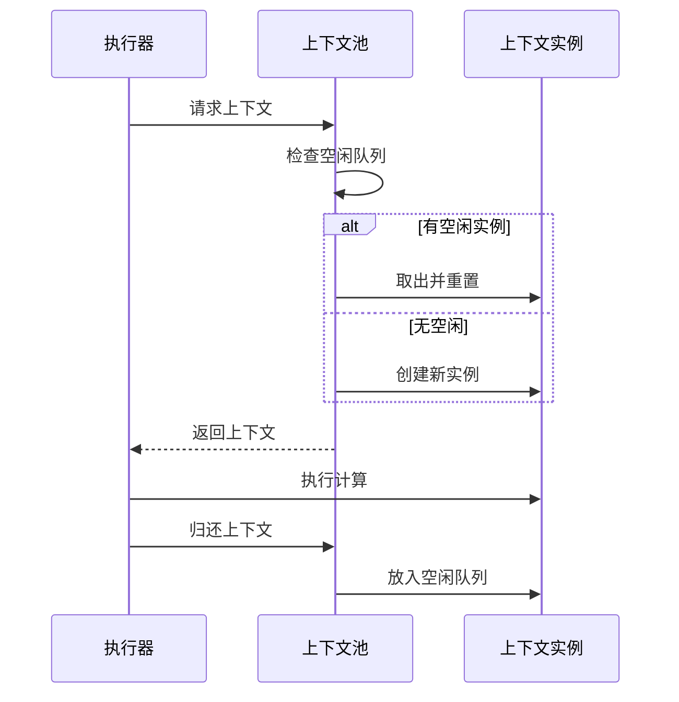
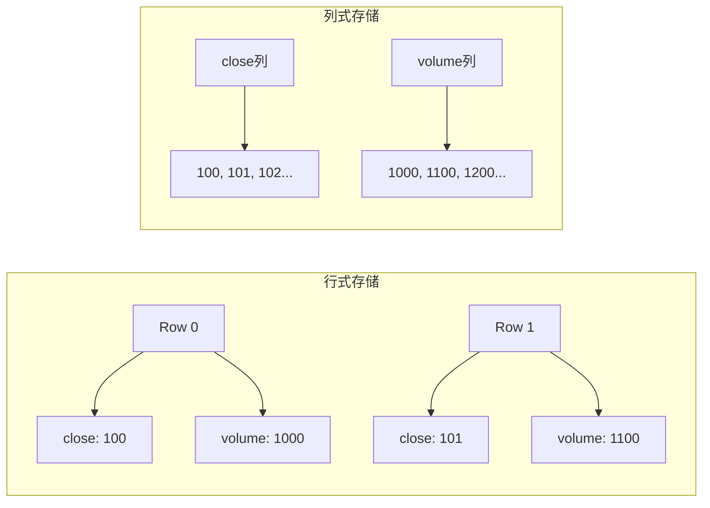
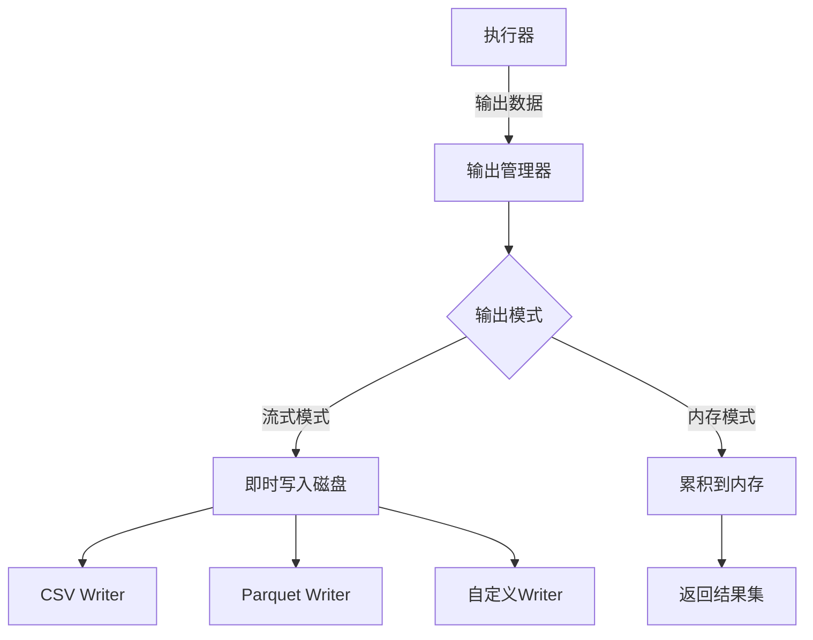
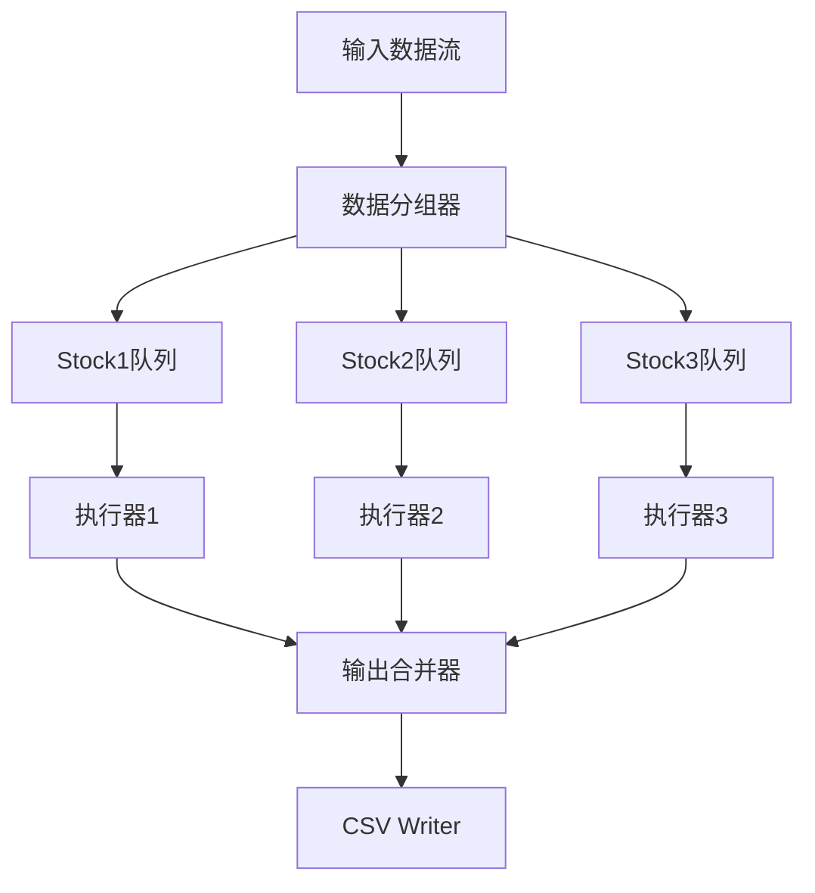

# DPLang 输入输出管理优化设计

## 一、性能评估分析

### 1.1 现有架构分析

#### 数据流执行模式
当前系统支持两种执行模式：

| 执行器类型 | 用途 | 数据存储 | 适用场景 |
|----------|-----|---------|---------|
| DataStreamExecutor | 批量处理 | 完整输入矩阵（Rc共享） | 历史数据回测 |
| StreamingExecutor | 实时流式 | 固定窗口（VecDeque） | 实时行情计算 |

#### 数据管理机制
- **输入数据管理**：使用 `Rc<Vec<HashMap<String, Value>>>` 实现零拷贝共享
- **历史数据访问**：通过 ThreadLocal 全局变量 `CURRENT_DATA_STREAM` 提供 ref() 函数历史回溯
- **输出数据管理**：逐行累积到 `Vec<HashMap<String, Value>>` 向量
- **CSV输出**：带缓冲的流式写入器，支持分文件和统一文件模式

### 1.2 性能瓶颈识别

#### 高并发场景问题

**瓶颈1：HashMap键值查找开销**
- 每次变量访问都需要字符串哈希计算
- 在高频访问场景下（每行数据多次读取），HashMap查找成为热点路径
- 影响程度：中等

**瓶颈2：数据克隆成本**
- ExecutionContext 每行创建新实例
- Value枚举大量clone操作（尤其是Array类型）
- 包数据每行重复注入到package_vars
- 影响程度：高

**瓶颈3：线程局部变量的锁竞争**
- CURRENT_DATA_STREAM 使用 RefCell，每次访问需要借用检查
- 虽然是单线程，但运行时开销仍存在
- 影响程度：低

**瓶颈4：内存分配密集**
- 每行执行创建多个临时HashMap
- 频繁的堆内存分配和释放
- 影响程度：中等

#### 大规模数据场景问题

**问题1：内存占用**
- DataStreamExecutor 持有完整输入矩阵的 Rc 引用
- 输出矩阵全量存储在内存中
- 千万级数据时内存压力巨大
- 影响程度：高

**问题2：输出缓冲策略**
- CSV写入器默认100行缓冲，可配置但缺乏动态调整
- 分文件模式下多个股票并发写入时文件句柄管理不够高效
- 影响程度：中等

**问题3：无批量处理优化**
- 逐行串行执行，无法利用SIMD或批量处理
- 影响程度：中等

### 1.3 并发支持评估

**当前状态：单线程设计**
- ThreadLocal变量限制了多线程扩展
- ExecutionContext非线程安全
- 缺乏任务调度和并行执行机制

**多股票并行处理限制**
- daemon模式下只能串行处理多只股票数据
- 无法充分利用多核CPU资源
- 影响程度：高

## 二、优化设计方案

### 2.1 核心设计目标

| 目标维度 | 具体指标 | 优先级 |
|---------|---------|-------|
| 内存效率 | 支持10亿行级数据流式处理，内存占用控制在GB级 | 高 |
| 执行性能 | 单核吞吐量提升50%以上 | 高 |
| 并发能力 | 支持多股票并行计算，CPU利用率达到80%+ | 中 |
| 兼容性 | 保持现有API接口不变 | 高 |

### 2.2 数据管理模块重构

#### 2.2.1 内存池化执行上下文

**设计思路**
避免每行创建新的ExecutionContext，改用对象池复用机制。

**结构设计**

| 组件 | 职责 | 关键特性 |
|-----|------|---------|
| ContextPool | 管理ExecutionContext对象池 | 预分配、按需扩展、重置复用 |
| PooledContext | 可重置的上下文实例 | 提供reset()清空状态 |

**生命周期流程**

**内存管理策略**

| 参数 | 默认值 | 说明 |
|-----|-------|-----|
| 初始池大小 | 16 | 预分配实例数 |
| 最大池大小 | 1024 | 限制内存上限 |
| 收缩策略 | 定期清理 | 空闲超过1分钟的实例释放 |

#### 2.2.2 列式数据存储优化

**现状问题**
当前使用行式存储 `Vec<HashMap<String, Value>>`，每行数据查找都需要HashMap键查询。

**优化方案：混合列式存储**

**数据结构设计**

| 字段 | 类型 | 用途 |
|-----|------|-----|
| column_store | `HashMap<String, Vec<Value>>` | 列数据存储 |
| column_index | `HashMap<String, usize>` | 列名到索引映射 |
| row_count | usize | 总行数 |

**访问优化**
- 首次访问列时缓存索引，后续通过索引直接访问
- 历史数据切片操作零拷贝
- 减少字符串哈希计算频率

**内存布局对比**

**适用场景判断**

| 数据特征 | 存储方式 | 原因 |
|---------|---------|-----|
| 列数 < 10 | 列式 | 减少HashMap开销 |
| 列数 > 50 | 行式 | 避免过多列对象 |
| 频繁切片访问 | 列式 | 零拷贝优势 |
| 稀疏数据 | 行式 | 避免空值存储 |

#### 2.2.3 值类型引用语义

**问题分析**
Value枚举每次传递都克隆，大数组尤其昂贵。

**优化策略**

| Value类型 | 优化方式 | 效果 |
|----------|---------|-----|
| Array | 内部使用Rc共享 | 避免深拷贝 |
| String | 使用Rc\<str\>或Cow | 减少字符串拷贝 |
| Decimal/Number | 保持栈拷贝 | 性能已优化 |
| Function | 已使用Box | 无需改动 |

**实现方式**
在Value枚举中引入共享所有权：

| 变体 | 当前定义 | 优化后 |
|-----|---------|-------|
| Array | `Array(Vec<Value>)` | `Array(Rc<Vec<Value>>)` |
| String | `String(String)` | `String(Rc<str>)` |

**兼容性保证**
- 提供 `to_owned()` 方法获取独占副本
- 内部自动判断是否需要COW（写时复制）

#### 2.2.4 流式输出管理器

**设计目标**
支持超大规模数据输出，避免全量内存累积。

**架构设计**

**接口设计**

| 方法 | 参数 | 返回值 | 说明 |
|-----|------|-------|-----|
| set_output_mode | mode: OutputMode | - | 设置输出模式 |
| write_row | row: &OutputRow | Result | 写入单行 |
| flush | - | Result | 刷新缓冲 |
| finalize | - | Option\<Vec\<Row\>\> | 完成输出并返回结果 |

**输出模式**

| 模式 | 内存占用 | 适用场景 |
|-----|---------|---------|
| InMemory | 全量 | 小数据集、需返回结果 |
| StreamToFile | 缓冲区 | 大数据集、落盘需求 |
| Callback | 无累积 | 实时推送、事件驱动 |

**缓冲优化策略**

| 参数 | 默认值 | 自适应规则 |
|-----|-------|----------|
| buffer_size | 1000行 | 内存充足时扩大到10000行 |
| flush_interval | 5秒 | 高吞吐时缩短到1秒 |
| batch_write | 否 | 检测到顺序写入时启用 |

### 2.3 解释器并发优化

#### 2.3.1 多股票并行执行架构

**设计原则**
- 股票间数据独立，天然适合并行
- 单个股票内保持串行，确保历史数据依赖正确

**架构设计**

**任务调度策略**

| 策略 | 适用场景 | 优缺点 |
|-----|---------|--------|
| 静态分区 | 股票数量固定 | 简单但负载可能不均 |
| 工作窃取 | 股票计算量差异大 | 负载均衡好但有调度开销 |
| 混合模式 | 通用场景 | 大股票静态分区+小股票动态调度 |

**线程池配置**

| 参数 | 推荐值 | 依据 |
|-----|-------|-----|
| 核心线程数 | CPU核心数 | 充分利用CPU |
| 最大线程数 | CPU核心数*2 | 避免过度上下文切换 |
| 队列容量 | 10000 | 平衡内存和响应性 |

#### 2.3.2 状态隔离机制

**问题**
ThreadLocal方案无法支持多线程并行。

**解决方案：执行上下文本地化**

| 改造点 | 原方案 | 新方案 |
|-------|-------|-------|
| 历史数据访问 | ThreadLocal全局变量 | 通过上下文参数传递 |
| ref()函数实现 | 访问全局CURRENT_DATA_STREAM | 访问当前执行器实例 |
| 包数据注入 | 每行重复注入 | 执行器初始化时注入一次 |

**实现细节**

ref()函数需要访问执行器实例，设计两种方案：

| 方案 | 实现方式 | 优缺点 |
|-----|---------|--------|
| 显式传递 | ref(ctx, var, offset) | 侵入性强，需修改语法 |
| 闭包捕获 | 在表达式求值时注入执行器引用 | 对用户透明，实现复杂 |

推荐方案：闭包捕获
- 在Executor中增加 `self_ref: *const Self` 字段
- 执行时通过不安全指针访问自身历史数据
- 确保单线程执行或使用Arc保证安全性

#### 2.3.3 批量表达式求值

**优化机会**
数组运算可以批量计算，减少循环开销。

**向量化计算策略**

| 运算类型 | 优化方式 | 性能提升 |
|---------|---------|---------|
| 数组算术运算 | 展开循环+SIMD提示 | 2-4倍 |
| 条件筛选 | 位向量+掩码运算 | 3-5倍 |
| 聚合函数 | 缓存友好的遍历 | 1.5-2倍 |

**实现示例（伪代码描述）**

对于表达式 `close > 100`，当close是数组时：
- 当前：逐元素循环比较
- 优化：检测到数组运算，调用向量化比较函数
- 优化后流程：提取数值数组 → SIMD比较 → 生成布尔数组

**适用条件检测**

| 条件 | 检测方式 | 触发阈值 |
|-----|---------|---------|
| 数组长度 | 运行时检查 | 长度 > 64 |
| 数据类型 | 静态分析 | 全为Number/Decimal |
| 运算类型 | 表达式类型 | 算术/比较/逻辑运算 |

### 2.4 监控与诊断

#### 2.4.1 性能指标采集

**关键指标**

| 指标 | 单位 | 采集位置 | 作用 |
|-----|------|---------|-----|
| 行吞吐量 | 行/秒 | 执行器 | 评估整体性能 |
| 内存占用 | MB | 全局 | 监控内存泄漏 |
| HashMap查找次数 | 次/行 | ExecutionContext | 优化热点 |
| Value克隆次数 | 次/行 | Value类型 | 定位拷贝开销 |
| 线程利用率 | % | 线程池 | 并发效果评估 |

**采集机制**

| 模式 | 开销 | 适用场景 |
|-----|------|---------|
| 采样模式 | 低（<1%） | 生产环境 |
| 全量模式 | 中（5-10%） | 性能测试 |
| 关闭 | 无 | 极致性能场景 |

#### 2.4.2 基准测试框架扩展

**新增测试场景**

| 测试名称 | 数据规模 | 关注指标 |
|---------|---------|---------|
| large_scale_sequential | 1000万行 | 内存占用、吞吐量 |
| multi_stock_parallel | 100股票*10万行 | 并行效率、CPU利用率 |
| streaming_latency | 实时流 | 单行延迟、抖动 |
| memory_stress | 持续1小时 | 内存泄漏、稳定性 |

**性能基线**

| 场景 | 优化前 | 目标 | 验收标准 |
|-----|-------|-----|---------|
| 单线程吞吐 | 10万行/秒 | 15万行/秒 | >14万 |
| 内存效率 | 5GB/千万行 | 1GB/千万行 | <1.5GB |
| 并行加速比 | 1.0 | 6.0（8核） | >5.0 |

## 三、实施策略

### 3.1 分阶段实施计划

**阶段一：内存优化（优先级：高）**

| 任务 | 工作量 | 依赖 | 风险 |
|-----|-------|-----|-----|
| 实现上下文对象池 | 3天 | 无 | 低 |
| Value引用语义改造 | 5天 | 无 | 中（API兼容性） |
| 列式存储实现 | 4天 | 无 | 低 |
| 流式输出管理器 | 3天 | 无 | 低 |

**阶段二：并发支持（优先级：中）**

| 任务 | 工作量 | 依赖 | 风险 |
|-----|-------|-----|-----|
| 状态隔离重构 | 5天 | 阶段一 | 中（ThreadLocal替换） |
| 多股票并行调度 | 6天 | 状态隔离 | 中（线程安全） |
| 线程池集成 | 3天 | 并行调度 | 低 |

**阶段三：执行优化（优先级：中）**

| 任务 | 工作量 | 依赖 | 风险 |
|-----|-------|-----|-----|
| 批量表达式求值 | 7天 | 阶段一 | 高（复杂度） |
| SIMD向量化 | 5天 | 批量求值 | 中（平台兼容） |

**阶段四：监控与测试（优先级：低）**

| 任务 | 工作量 | 依赖 | 风险 |
|-----|-------|-----|-----|
| 性能指标采集 | 3天 | 阶段一 | 低 |
| 基准测试扩展 | 4天 | 阶段二 | 低 |

### 3.2 兼容性保证

**API稳定性承诺**

| 模块 | 保持不变 | 可能变化 | 迁移方案 |
|-----|---------|---------|---------|
| DPLangInterpreter | execute()系列方法 | 内部实现 | 无需迁移 |
| DataStreamExecutor | new()、execute_all() | 内部字段 | 无需迁移 |
| StreamingExecutor | push_tick() | 窗口管理 | 参数增加可选配置 |
| Value类型 | 公开方法 | 内部表示 | 提供兼容层 |

**回退机制**

| 场景 | 检测方式 | 回退行为 |
|-----|---------|---------|
| 列式存储失败 | 运行时异常 | 降级到行式存储 |
| 并行执行错误 | 线程panic | 切换到串行模式 |
| 向量化计算错误 | 结果校验失败 | 回退到标量计算 |

### 3.3 风险控制

**技术风险**

| 风险 | 影响 | 缓解措施 |
|-----|------|---------|
| Value引用改造引入bug | 高 | 全面单元测试+渐进式替换 |
| 并发引入数据竞争 | 高 | ThreadSanitizer检测+代码审查 |
| 性能提升不及预期 | 中 | 提前基准测试+预留备选方案 |
| 内存优化导致延迟增加 | 低 | 监控P99延迟+调整池参数 |

**项目风险**

| 风险 | 概率 | 影响 | 应对 |
|-----|-----|------|-----|
| 开发周期超期 | 中 | 中 | 缩减阶段三范围 |
| 人员变动 | 低 | 高 | 详细文档+知识共享 |
| 依赖库升级破坏兼容 | 低 | 中 | 锁定版本+定期测试 |

## 四、验收标准

### 4.1 性能指标

| 指标 | 基线 | 目标 | 测试方法 |
|-----|-----|------|---------|
| 单核吞吐量 | 10万行/秒 | 15万行/秒 | criterion基准测试 |
| 内存占用（千万行） | 5GB | 1GB | 流式执行+内存监控 |
| 8核并行加速比 | 1.0 | 6.0 | 多股票并行测试 |
| P99延迟（实时模式） | 10ms | 15ms | 流式推送测试 |

### 4.2 功能正确性

| 测试项 | 覆盖范围 | 通过标准 |
|-------|---------|---------|
| 单元测试 | 所有公开API | 100%通过 |
| 集成测试 | 典型使用场景 | 100%通过 |
| 回归测试 | 现有测试套件 | 无新增失败 |
| 压力测试 | 连续运行24小时 | 无崩溃、无泄漏 |

### 4.3 兼容性验证

| 验证项 | 方法 | 通过标准 |
|-------|-----|---------|
| API兼容性 | 对比新旧版本调用 | 行为一致 |
| 脚本兼容性 | 运行现有.dp脚本 | 结果完全一致 |
| 数据格式兼容 | CSV/JSON输入输出 | 格式无变化 |

## 五、后续演进方向

### 5.1 增量计算引擎

**动机**
实时场景下大部分历史数据不变，可复用先前计算结果。

**设计方向**
- 识别有状态计算（如EMA、MACD）
- 仅对新增tick执行增量更新
- 维护中间状态缓存

**预期收益**
实时模式下延迟降低70%以上。

### 5.2 分布式执行支持

**应用场景**
- 超大规模历史数据回测（百亿行级别）
- 多策略并行运算

**技术选型**

| 方案 | 优势 | 劣势 |
|-----|------|-----|
| 基于Arrow Flight | 标准协议、零拷贝 | 需要额外服务 |
| 自研RPC | 灵活可控 | 开发成本高 |
| 集成DataFusion | 成熟生态 | 依赖重 |

### 5.3 GPU加速

**适用计算**
- 大数组的数学运算（如矩阵乘法）
- 技术指标批量计算（如1000只股票同时计算SMA）

**技术路径**
- 使用CUDA或OpenCL
- 通过rust-gpu或cudarc集成
- 仅加速数值密集型算子

**挑战**
- 数据传输开销
- GPU内存限制
- 复杂度显著增加
