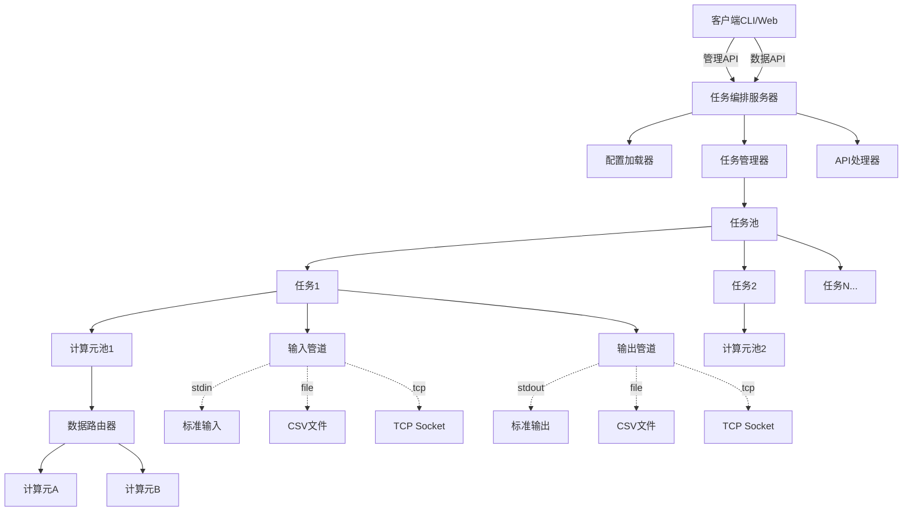
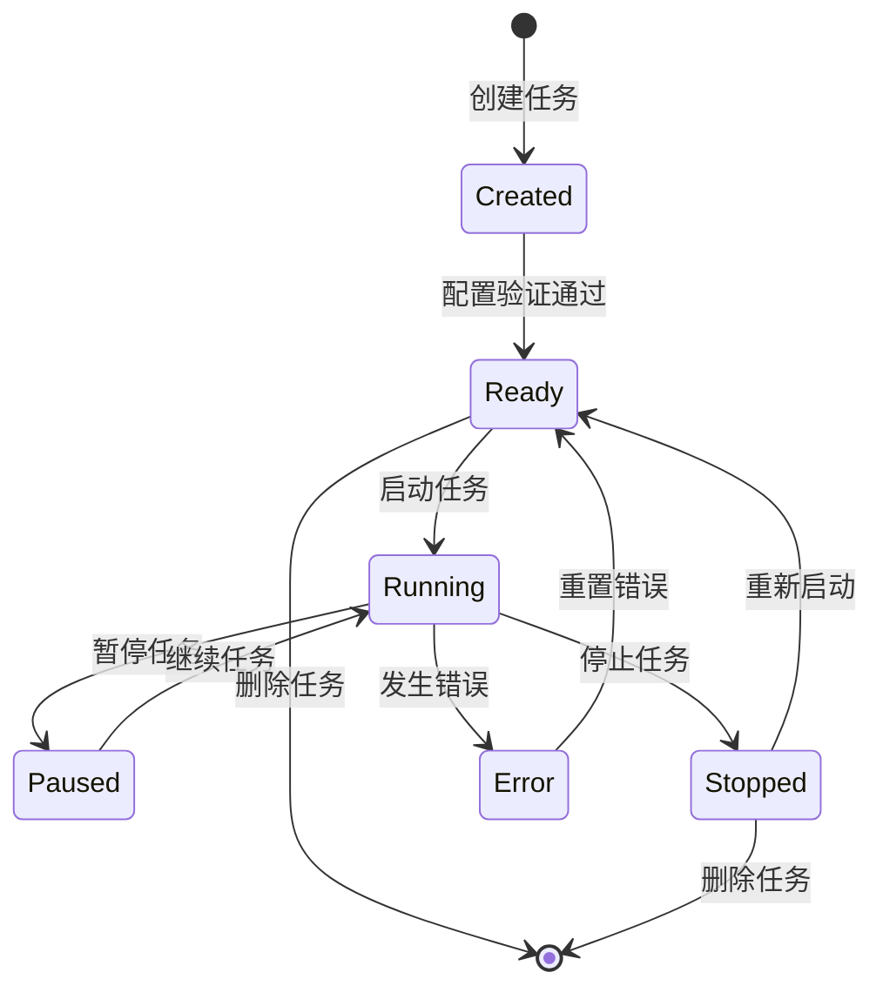
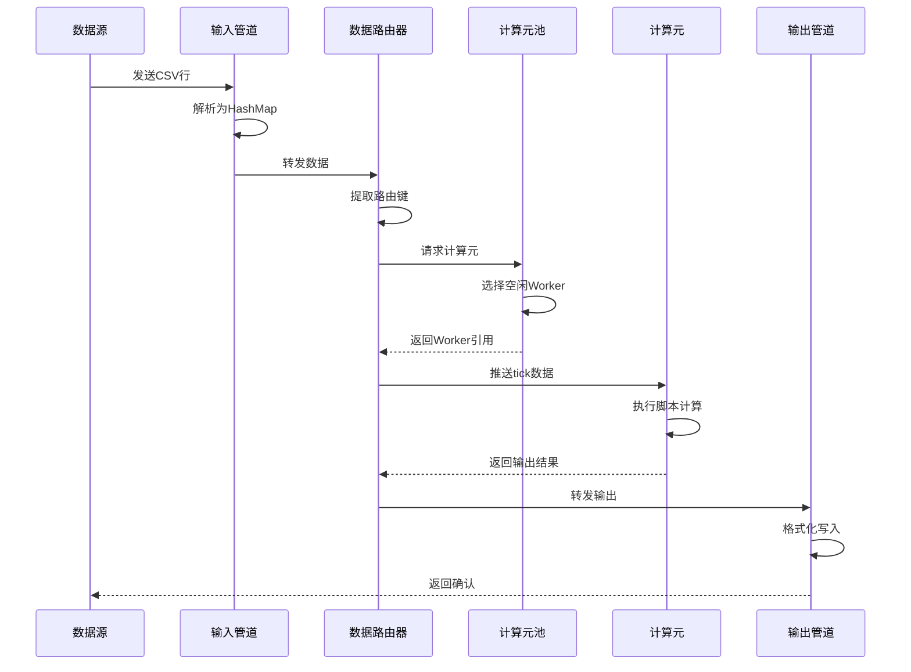

# DPLang 任务编排系统设计

## 一、系统概述

### 1.1 设计目标

在现有daemon模式基础上，构建一个完整的任务编排与管理系统，支持多任务并行执行、动态资源调度、灵活的数据路由与多种I/O模式，满足实时股票数据分析、历史数据批处理等多种场景需求。

### 1.2 核心特性

- **双模式任务编排**：配置文件启动 + 实时API调用
- **灵活的计算资源管理**：计算元池化复用，支持动态扩缩容
- **智能数据路由**：基于路由键（如股票代码）分配计算资源
- **多种I/O模式**：标准输入输出、文件、TCP网络流
- **完整的生命周期管理**：创建、启动、暂停、继续、停止、删除任务
- **实时数据交互**：推送数据、获取输出、附加文件数据
- **简易客户端界面**：交互式命令行工具

### 1.3 适用场景

| 场景类型 | 数据特点 | 计算资源策略 |
|---------|---------|------------|
| 实时Tick流 | 低频、多股票并发 | 计算元池复用，按需分配 |
| 历史数据回测 | 高频、单股票密集 | 独占计算元，并行处理 |
| 盘中监控 | 中等频率 | 混合模式，动态调整 |

---

## 二、系统架构

### 2.1 整体架构图



### 2.2 核心组件说明

#### 2.2.1 任务编排服务器（TaskOrchestrationServer）

系统的核心协调器，负责：
- 启动时加载配置文件中的任务定义
- 监听API请求，处理任务管理和数据交互
- 维护全局任务注册表
- 协调计算资源分配

#### 2.2.2 任务管理器（TaskManager）

管理任务的完整生命周期：
- 任务创建、删除、编辑
- 任务状态控制：待机、运行中、暂停、停止、错误
- 任务配置验证与存储
- 任务隔离与依赖管理

#### 2.2.3 任务实例（Task）

单个任务的执行单元，包含：
- **脚本队列**：按顺序执行的多个DPLang脚本
- **数据列结构定义**：输入数据的Schema
- **计算元池**：维护一组StreamingExecutor实例
- **数据路由器**：根据路由键分配数据到计算元
- **输入输出管道**：处理数据的读取与写入

#### 2.2.4 计算元池（ComputePool）

计算资源的池化管理：
- 预创建一定数量的StreamingExecutor实例
- 动态扩容/缩容机制
- 计算元状态跟踪：空闲、繁忙、错误
- 负载均衡策略

#### 2.2.5 数据路由器（DataRouter）

智能数据分发：
- 根据路由键（如stock_code）哈希或轮询分配
- 会话保持：同一路由键的数据分配到同一计算元
- 故障转移：计算元异常时重新分配

#### 2.2.6 I/O管道（IOPipeline）

统一的数据输入输出抽象：
- **输入管道**：标准输入、文件流、TCP Socket
- **输出管道**：标准输出、文件写入、TCP Socket
- 缓冲与批量写入优化
- 错误重试与降级策略

---

## 三、任务配置规范

### 3.1 配置文件格式（TOML）

```toml
# tasks.toml - 任务编排配置文件

# 全局默认配置
[global]
default_window_size = 1000
default_pool_size = 10
default_pool_max_size = 100

# 任务定义
[[task]]
id = "realtime-stock-analysis"
name = "实时股票技术指标计算"
enabled = true

# 脚本队列（按顺序执行）
scripts = [
    "scripts/preprocess.dp",
    "scripts/indicators.dp"
]

# 数据列结构定义
[task.schema]
columns = [
    { name = "stock_code", type = "string", required = true },
    { name = "timestamp", type = "string", required = true },
    { name = "open", type = "number" },
    { name = "high", type = "number" },
    { name = "low", type = "number" },
    { name = "close", type = "number" },
    { name = "volume", type = "number" }
]

# 数据路由配置
[task.routing]
enabled = true
key_column = "stock_code"  # 路由键字段
strategy = "hash"          # 路由策略: hash | round_robin | sticky

# 计算元池配置
[task.compute_pool]
initial_size = 5           # 初始计算元数量
max_size = 50              # 最大计算元数量
window_size = 1000         # 每个计算元的历史窗口大小
auto_scale = true          # 是否自动扩缩容
scale_threshold = 0.8      # 负载阈值触发扩容

# 输入管道配置
[task.input]
type = "tcp"               # stdin | file | tcp
host = "0.0.0.0"          # TCP模式专用
port = 9001               # TCP模式专用
format = "csv"            # 数据格式: csv | json
buffer_size = 1024        # 读取缓冲区大小

# 输出管道配置
[task.output]
type = "file"             # stdout | file | tcp
path = "./output/{stock_code}.csv"  # 文件路径模板
mode = "split"            # split（按路由键分文件） | merge（合并）
buffer_size = 100         # 写入缓冲行数
auto_flush = false        # 是否自动刷新

# 错误处理
[task.error_handling]
retry_count = 3           # 计算错误重试次数
skip_on_error = true      # 错误时跳过当前行
log_errors = true         # 记录错误日志

# 第二个任务示例
[[task]]
id = "backtest-history"
name = "历史数据回测"
enabled = false
scripts = ["scripts/backtest.dp"]

[task.schema]
columns = [
    { name = "stock_code", type = "string" },
    { name = "date", type = "string" },
    { name = "close", type = "number" }
]

[task.routing]
enabled = false  # 单股票独占计算元

[task.compute_pool]
initial_size = 1
max_size = 1
window_size = 5000

[task.input]
type = "file"
path = "./data/history.csv"
format = "csv"

[task.output]
type = "stdout"
format = "csv"
```

### 3.2 配置字段说明

#### 任务基础信息
- **id**：任务唯一标识符，用于API调用
- **name**：任务描述性名称
- **enabled**：启动时是否自动激活
- **scripts**：脚本队列，支持多个脚本顺序执行

#### Schema定义
- **columns**：数据列定义数组
  - **name**：列名
  - **type**：数据类型（string, number, boolean）
  - **required**：是否必填

#### 路由配置
- **enabled**：是否启用数据路由
- **key_column**：路由键字段名
- **strategy**：路由策略
  - `hash`：根据路由键哈希值分配
  - `round_robin`：轮询分配
  - `sticky`：会话保持，同key始终分配到同一计算元

#### 计算元池配置
- **initial_size**：启动时预创建的计算元数量
- **max_size**：最大计算元数量上限
- **window_size**：每个计算元维护的历史窗口大小
- **auto_scale**：自动扩缩容开关
- **scale_threshold**：负载率超过此阈值触发扩容

#### I/O管道配置
- **type**：管道类型
  - `stdin/stdout`：标准输入输出
  - `file`：文件读写
  - `tcp`：TCP Socket网络流
- **format**：数据格式（csv, json）
- **path**：文件路径，支持模板变量 `{stock_code}`, `{date}` 等
- **mode**：输出模式
  - `split`：按路由键分文件
  - `merge`：合并到单文件
- **host/port**：TCP模式的网络地址

---

## 四、API接口设计

### 4.1 API通信协议

采用基于TCP的简单文本协议，每个请求/响应为一行JSON格式。

**请求格式**：
```json
{"action": "操作名", "params": {...参数}}
```

**响应格式**：
```json
{"status": "ok|error", "data": {...数据}, "message": "说明信息"}
```

### 4.2 任务管理API

#### 4.2.1 创建任务

**请求**：
```json
{
  "action": "create_task",
  "params": {
    "id": "task-001",
    "name": "新任务",
    "scripts": ["script1.dp", "script2.dp"],
    "schema": {
      "columns": [
        {"name": "stock_code", "type": "string", "required": true},
        {"name": "close", "type": "number"}
      ]
    },
    "routing": {
      "enabled": true,
      "key_column": "stock_code",
      "strategy": "hash"
    },
    "compute_pool": {
      "initial_size": 5,
      "max_size": 20,
      "window_size": 1000
    },
    "input": {
      "type": "tcp",
      "host": "0.0.0.0",
      "port": 9001,
      "format": "csv"
    },
    "output": {
      "type": "file",
      "path": "./output/{stock_code}.csv",
      "mode": "split"
    }
  }
}
```

**响应**：
```json
{
  "status": "ok",
  "data": {"task_id": "task-001"},
  "message": "任务创建成功"
}
```

#### 4.2.2 删除任务

**请求**：
```json
{
  "action": "delete_task",
  "params": {"task_id": "task-001"}
}
```

**响应**：
```json
{
  "status": "ok",
  "message": "任务已删除"
}
```

#### 4.2.3 编辑任务

**请求**：
```json
{
  "action": "update_task",
  "params": {
    "task_id": "task-001",
    "updates": {
      "compute_pool": {
        "max_size": 50
      }
    }
  }
}
```

**响应**：
```json
{
  "status": "ok",
  "message": "任务配置已更新"
}
```

#### 4.2.4 获取任务列表

**请求**：
```json
{
  "action": "list_tasks",
  "params": {}
}
```

**响应**：
```json
{
  "status": "ok",
  "data": {
    "tasks": [
      {
        "id": "task-001",
        "name": "实时股票分析",
        "status": "running",
        "compute_pool_size": 5,
        "processed_count": 12345
      }
    ]
  }
}
```

#### 4.2.5 获取任务详情

**请求**：
```json
{
  "action": "get_task",
  "params": {"task_id": "task-001"}
}
```

**响应**：
```json
{
  "status": "ok",
  "data": {
    "id": "task-001",
    "name": "实时股票分析",
    "status": "running",
    "config": {...完整配置},
    "stats": {
      "processed_count": 12345,
      "error_count": 23,
      "compute_pool_size": 5,
      "active_workers": 3
    }
  }
}
```

### 4.3 任务控制API

#### 4.3.1 启动任务

**请求**：
```json
{
  "action": "start_task",
  "params": {"task_id": "task-001"}
}
```

**响应**：
```json
{
  "status": "ok",
  "message": "任务已启动"
}
```

#### 4.3.2 暂停任务

**请求**：
```json
{
  "action": "pause_task",
  "params": {"task_id": "task-001"}
}
```

**响应**：
```json
{
  "status": "ok",
  "message": "任务已暂停"
}
```

#### 4.3.3 继续任务

**请求**：
```json
{
  "action": "resume_task",
  "params": {"task_id": "task-001"}
}
```

**响应**：
```json
{
  "status": "ok",
  "message": "任务已继续"
}
```

#### 4.3.4 停止任务

**请求**：
```json
{
  "action": "stop_task",
  "params": {"task_id": "task-001"}
}
```

**响应**：
```json
{
  "status": "ok",
  "message": "任务已停止"
}
```

### 4.4 数据交互API

#### 4.4.1 推送数据

**请求**：
```json
{
  "action": "push_data",
  "params": {
    "task_id": "task-001",
    "data": [
      {"stock_code": "000001", "close": 15.32, "volume": 123456},
      {"stock_code": "000002", "close": 28.67, "volume": 234567}
    ]
  }
}
```

**响应**：
```json
{
  "status": "ok",
  "data": {"accepted_count": 2},
  "message": "数据已推送"
}
```

#### 4.4.2 附加文件数据

**请求**：
```json
{
  "action": "attach_file",
  "params": {
    "task_id": "task-001",
    "file_path": "/data/stocks.csv"
  }
}
```

**响应**：
```json
{
  "status": "ok",
  "data": {"processed_count": 5000},
  "message": "文件数据已处理"
}
```

#### 4.4.3 获取输出

**请求**：
```json
{
  "action": "fetch_output",
  "params": {
    "task_id": "task-001",
    "limit": 100,
    "offset": 0
  }
}
```

**响应**：
```json
{
  "status": "ok",
  "data": {
    "total_count": 12345,
    "rows": [
      {"stock_code": "000001", "ma5": 15.23, "ma10": 15.45},
      {"stock_code": "000002", "ma5": 28.56, "ma10": 28.78}
    ]
  }
}
```

#### 4.4.4 订阅实时输出（流式）

**请求**：
```json
{
  "action": "subscribe_output",
  "params": {
    "task_id": "task-001",
    "filter": {"stock_code": "000001"}
  }
}
```

**持续响应**（每产生新输出时推送）：
```json
{
  "status": "ok",
  "event": "output",
  "data": {"stock_code": "000001", "ma5": 15.23, "timestamp": "2024-01-01 10:00:00"}
}
```

---

## 五、核心机制设计

### 5.1 任务状态机



**状态说明**：
- **Created**：任务已创建，配置待验证
- **Ready**：配置验证通过，等待启动
- **Running**：任务运行中，正在处理数据
- **Paused**：任务暂停，暂停接收新数据但保留状态
- **Stopped**：任务已停止，清理计算资源
- **Error**：任务异常，需人工介入

### 5.2 计算元池动态调度

#### 5.2.1 负载评估指标

| 指标名称 | 计算方式 | 权重 |
|---------|---------|------|
| 活跃计算元比例 | 繁忙计算元数 / 总计算元数 | 0.5 |
| 数据队列长度 | 待处理数据行数 | 0.3 |
| 平均响应时间 | 最近100次处理的平均耗时 | 0.2 |

**负载率公式**：
```
LoadRate = 0.5 * (BusyWorkers / TotalWorkers) 
         + 0.3 * min(QueueLength / 1000, 1.0)
         + 0.2 * min(AvgLatency / 100ms, 1.0)
```

#### 5.2.2 扩缩容策略

**扩容触发条件**：
- 负载率 > scale_threshold（默认0.8）
- 持续时间 > 30秒
- 当前池大小 < max_size

**扩容步长**：
- 当前大小 < 10：每次 +2
- 当前大小 >= 10：每次 +20%

**缩容触发条件**：
- 负载率 < 0.3
- 持续时间 > 5分钟
- 当前池大小 > initial_size

**缩容步长**：
- 每次 -1，直至initial_size

#### 5.2.3 计算元分配算法

**策略1：哈希分配（Hash）**
```
worker_index = hash(routing_key) % pool_size
```
优点：同一路由键始终分配到同一计算元，保证时间序列连续性
缺点：可能负载不均衡

**策略2：轮询分配（Round Robin）**
```
worker_index = (last_index + 1) % pool_size
```
优点：负载均衡
缺点：同一路由键可能分配到不同计算元，历史窗口不连续

**策略3：粘性会话（Sticky Session）**
- 维护 routing_key -> worker_index 映射表
- 首次分配时选择最空闲计算元
- 后续相同key复用同一计算元
- 计算元失效时重新分配并更新映射

优点：兼顾负载均衡与时间序列连续性

### 5.3 数据流处理流程



### 5.4 错误处理与容错

#### 5.4.1 错误分类

| 错误类型 | 处理策略 | 影响范围 |
|---------|---------|---------|
| 数据解析错误 | 记录日志，跳过该行 | 单条数据 |
| 脚本执行错误 | 重试3次，失败则跳过 | 单条数据 |
| 计算元崩溃 | 标记失效，重新分配路由 | 单个计算元 |
| I/O管道异常 | 尝试重连，失败则暂停任务 | 整个任务 |
| 配置错误 | 拒绝启动任务 | 任务创建阶段 |

#### 5.4.2 重试机制

- **指数退避**：第n次重试延迟 = 100ms * 2^n
- **最大重试次数**：可配置，默认3次
- **重试范围**：仅脚本执行错误可重试，I/O错误不重试

#### 5.4.3 故障转移

计算元失效时：
1. 标记该计算元状态为 `Error`
2. 从池中移除
3. 清空该计算元的路由映射
4. 后续相同路由键的数据重新分配到其他计算元
5. 记录警告日志

---

## 六、I/O管道实现方案

### 6.1 输入管道抽象

**trait定义**：
```
trait InputPipeline {
    // 初始化管道
    fn initialize() -> Result
    
    // 读取下一条数据（阻塞）
    fn read_next() -> Result<Option<HashMap<String, Value>>>
    
    // 关闭管道
    fn close() -> Result
}
```

**实现类型**：
- `StdinInputPipeline`：从标准输入读取CSV
- `FileInputPipeline`：从文件流式读取
- `TcpInputPipeline`：监听TCP端口接收数据

### 6.2 输出管道抽象

**trait定义**：
```
trait OutputPipeline {
    // 初始化管道
    fn initialize() -> Result
    
    // 写入单行数据
    fn write_row(routing_key: String, data: HashMap<String, Value>) -> Result
    
    // 刷新缓冲区
    fn flush() -> Result
    
    // 关闭管道
    fn close() -> Result
}
```

**实现类型**：
- `StdoutOutputPipeline`：写入标准输出
- `FileOutputPipeline`：写入文件（支持split/merge模式）
- `TcpOutputPipeline`：通过TCP发送数据

### 6.3 TCP管道实现细节

#### 6.3.1 TCP输入管道

**监听模式**：
- 绑定指定端口（如9001）
- 接受客户端连接
- 每个连接一个独立线程
- 首行为CSV表头，后续为数据行

**协议示例**：
```
客户端连接 -> 发送表头
stock_code,timestamp,close,volume
客户端发送数据 ->
000001,2024-01-01 10:00:00,15.32,123456
000002,2024-01-01 10:00:01,28.67,234567
...
客户端断开连接
```

#### 6.3.2 TCP输出管道

**连接模式**：
- 连接到指定目标地址
- 发送CSV格式输出
- 支持批量缓冲

**协议示例**：
```
服务端连接 -> 发送表头
stock_code,ma5,ma10,rsi
服务端发送数据 ->
000001,15.23,15.45,65.3
000002,28.56,28.78,72.1
...
```

---

## 七、客户端工具设计

### 7.1 交互式命令行客户端（推荐实现）

#### 7.1.1 功能特性

- REPL（读取-求值-输出循环）交互界面
- 命令自动补全
- 彩色输出，状态可视化
- 命令历史记录

#### 7.1.2 命令列表

| 命令 | 说明 | 示例 |
|------|------|------|
| `connect <host:port>` | 连接到服务器 | `connect localhost:8888` |
| `list` | 列出所有任务 | `list` |
| `show <task_id>` | 查看任务详情 | `show task-001` |
| `create <config_file>` | 从配置文件创建任务 | `create task.toml` |
| `start <task_id>` | 启动任务 | `start task-001` |
| `pause <task_id>` | 暂停任务 | `pause task-001` |
| `resume <task_id>` | 继续任务 | `resume task-001` |
| `stop <task_id>` | 停止任务 | `stop task-001` |
| `delete <task_id>` | 删除任务 | `delete task-001` |
| `push <task_id> <file>` | 推送CSV文件数据 | `push task-001 data.csv` |
| `attach <task_id> <file>` | 附加文件数据 | `attach task-001 data.csv` |
| `output <task_id> [limit]` | 获取输出 | `output task-001 100` |
| `subscribe <task_id>` | 订阅实时输出 | `subscribe task-001` |
| `help` | 显示帮助 | `help` |
| `exit` | 退出客户端 | `exit` |

#### 7.1.3 交互示例

```
DPLang 任务编排客户端 v1.0
> connect localhost:8888
✅ 已连接到 localhost:8888

> list
ID              名称                状态      计算元池  已处理行数
task-001        实时股票分析        运行中    5/20      12,345
task-002        历史回测            已停止    1/1       0

> show task-001
任务详情:
  ID: task-001
  名称: 实时股票分析
  状态: 运行中
  脚本: preprocess.dp, indicators.dp
  计算元池: 5个活跃 (最大20)
  已处理: 12,345 行
  错误: 23 行
  负载率: 65%

> push task-001 realtime_data.csv
📤 正在推送数据...
✅ 已推送 1,000 行数据

> output task-001 10
输出结果 (最近10行):
stock_code  ma5     ma10    rsi     timestamp
000001      15.23   15.45   65.3    2024-01-01 10:00:00
000002      28.56   28.78   72.1    2024-01-01 10:00:01
...

> pause task-001
⏸ 任务已暂停

> exit
👋 再见！
```

### 7.2 简易Web界面（可选实现）

#### 7.2.1 技术选型

- 纯HTML + JavaScript（无框架依赖）
- 使用WebSocket连接服务器
- 简洁的Bootstrap样式

#### 7.2.2 页面布局

**任务列表页**：
- 任务卡片展示（ID、名称、状态、统计）
- 操作按钮：启动、暂停、停止、删除
- 创建新任务按钮

**任务详情页**：
- 配置展示
- 实时统计图表（处理速度、负载率）
- 数据推送表单
- 输出日志滚动窗口

#### 7.2.3 优先级

- 命令行客户端为主要实现路径（更简单、更实用）
- Web界面作为可选增强功能

---

## 八、实现路径与优先级

### 8.1 第一阶段：核心框架（MVP）

**优先级：P0（必须实现）**

#### 实现内容

1. **配置文件加载**
   - TOML格式解析
   - 任务配置结构体定义
   - 配置验证逻辑

2. **任务管理器**
   - 任务创建、删除、查询
   - 任务状态机基础实现
   - 内存中任务注册表

3. **计算元池**
   - StreamingExecutor池化封装
   - 基础负载均衡（轮询策略）
   - 固定大小池（暂不支持自动扩缩容）

4. **数据路由器**
   - 哈希路由策略
   - 路由键提取逻辑

5. **I/O管道**
   - 标准输入输出管道
   - 文件输入输出管道

6. **API处理器**
   - TCP服务器监听
   - JSON请求解析与分发
   - 基础任务管理API（创建、删除、启动、停止）

7. **命令行客户端（简化版）**
   - 基础命令：connect, list, start, stop, exit
   - 简单文本输出

### 8.2 第二阶段：功能增强

**优先级：P1（重要）**

#### 实现内容

1. **任务控制完善**
   - 暂停/继续功能
   - 任务编辑功能

2. **数据交互API**
   - push_data
   - attach_file
   - fetch_output

3. **TCP I/O管道**
   - TCP输入管道
   - TCP输出管道

4. **错误处理**
   - 重试机制
   - 错误日志记录
   - 计算元故障转移

5. **命令行客户端完善**
   - 全部命令支持
   - 彩色输出
   - 命令历史

### 8.3 第三阶段：性能优化

**优先级：P2（可选）**

#### 实现内容

1. **动态扩缩容**
   - 负载监控
   - 自动扩缩容逻辑

2. **高级路由策略**
   - 粘性会话
   - 加权负载均衡

3. **性能监控**
   - 处理速度统计
   - 延迟分析
   - 资源使用监控

4. **配置持久化**
   - 任务配置保存到文件
   - 运行时状态快照

5. **Web界面**
   - 基础任务管理页面
   - 实时监控图表

### 8.4 实现时间估算

| 阶段 | 预估工作量 | 关键里程碑 |
|------|-----------|-----------|
| 第一阶段 | 3-5天 | 能够启动配置文件中的任务，通过CLI基础管理 |
| 第二阶段 | 2-3天 | 支持完整API，TCP管道，健壮错误处理 |
| 第三阶段 | 3-4天 | 性能优化，动态调度，监控可视化 |

---

## 九、现有代码改造建议

### 9.1 需要新增的模块

在 `src/` 目录下新增：

```
src/
  orchestration/          # 任务编排模块
    mod.rs
    config.rs             # 配置文件解析
    task.rs               # 任务定义与管理
    task_manager.rs       # 任务管理器
    compute_pool.rs       # 计算元池
    router.rs             # 数据路由器
    pipeline/             # I/O管道
      mod.rs
      input.rs            # 输入管道trait与实现
      output.rs           # 输出管道trait与实现
      tcp.rs              # TCP管道
    server.rs             # 编排服务器
    api.rs                # API处理器
```

### 9.2 需要修改的模块

#### 9.2.1 StreamingExecutor扩展

在 `src/executor/streaming.rs` 中：
- 添加 `clone()` 方法支持（用于池化）
- 添加 `reset()` 方法清空历史窗口（用于复用）
- 添加状态查询接口（繁忙/空闲）

#### 9.2.2 主程序重构

在 `src/main.rs` 中：
- 新增 `orchestrate` 命令
- 新增配置文件路径参数
- 保留现有 `run`、`daemon` 命令兼容性

**新命令示例**：
```bash
# 启动任务编排服务器
dplang orchestrate --config tasks.toml --port 8888

# 或使用默认配置
dplang orchestrate
```

### 9.3 保持向后兼容

- 原有 `run` 和 `daemon` 命令继续保留
- 新系统作为独立模式，不影响现有功能
- 共享底层执行器代码

---

## 十、测试策略

### 10.1 单元测试

- 配置解析器测试
- 数据路由器测试（各种策略）
- 计算元池扩缩容逻辑测试
- I/O管道读写测试

### 10.2 集成测试

- 端到端任务执行流程
- API调用完整性测试
- 多任务并行测试
- 错误恢复测试

### 10.3 性能测试

- 高频数据流吞吐量测试（如每秒10000行）
- 多任务并发性能测试
- 计算元池扩缩容响应时间测试
- 内存占用与泄漏检测

### 10.4 压力测试

- 极限数据量测试（百万级行数）
- 大量任务并发（100+任务）
- 长时间运行稳定性测试（24小时+）

---

## 十一、风险与挑战

### 11.1 技术风险

| 风险项 | 影响 | 缓解措施 |
|-------|------|---------|
| TCP管道实现复杂度 | 延长开发周期 | 第一阶段先实现文件管道，TCP管道放第二阶段 |
| 多线程并发问题 | 数据竞争、死锁 | 使用消息传递模式，避免共享状态 |
| 内存泄漏风险 | 长时间运行不稳定 | 严格的资源管理，定期压力测试 |
| StreamingExecutor非线程安全 | 池化困难 | 每个计算元独占一个Executor，不跨线程共享 |

### 11.2 性能风险

| 风险项 | 影响 | 缓解措施 |
|-------|------|---------|
| 单任务成为瓶颈 | 无法充分利用多核 | 增大计算元池，并行处理 |
| 路由开销过大 | 降低吞吐量 | 优化哈希算法，批量路由 |
| I/O成为瓶颈 | 整体性能下降 | 增大缓冲区，批量读写 |

### 11.3 用户体验风险

| 风险项 | 影响 | 缓解措施 |
|-------|------|---------|
| 配置文件过于复杂 | 学习成本高 | 提供默认配置模板，详细文档 |
| 错误信息不清晰 | 排查问题困难 | 结构化日志，详细的错误提示 |
| CLI客户端功能不足 | 操作不便 | 优先完善CLI，延后Web界面 |

---

## 十二、后续演进方向

### 12.1 分布式扩展

- 多节点任务编排
- 任务跨机器调度
- 分布式计算元池

### 12.2 持久化与恢复

- 任务状态持久化到数据库
- 异常中断后自动恢复
- 历史数据回放

### 12.3 高级调度

- 任务依赖关系管理
- DAG工作流编排
- 条件触发与定时任务

### 12.4 可观测性

- Prometheus指标导出
- OpenTelemetry集成
- 实时性能Dashboard

---

## 十三、总结

本设计提供了一个完整的任务编排系统架构，核心特点包括：

1. **双模式启动**：配置文件 + 实时API，灵活适应不同场景
2. **计算资源池化**：动态扩缩容，高效复用，适应不同数据流速
3. **智能数据路由**：支持哈希、轮询、粘性会话多种策略
4. **多样化I/O**：标准输入输出、文件、TCP，满足各种集成需求
5. **完整生命周期**：从创建到删除的全流程管理
6. **渐进式实现**：分三阶段推进，优先交付MVP

系统设计充分复用现有 `StreamingExecutor` 和 `CSVStreamWriter`，在现有daemon模式基础上扩展，保持向后兼容，适合快速迭代开发。
