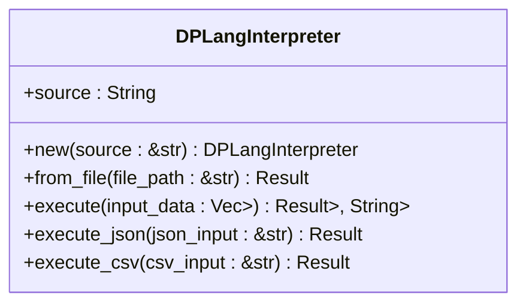
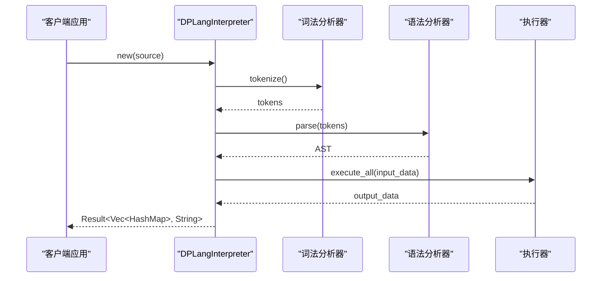

# API参考

<cite>
**本文档引用的文件**
- [api.rs](file://src/api.rs)
- [runtime.rs](file://src/runtime.rs)
- [data_stream.rs](file://src/executor/data_stream.rs)
- [lexer.rs](file://src/lexer.rs)
- [parser/mod.rs](file://src/parser/mod.rs)
</cite>

## 目录
1. [简介](#简介)
2. [DPLangInterpreter结构体](#dplanginterpreter结构体)
3. [核心执行方法](#核心执行方法)
4. [便捷执行方法](#便捷执行方法)
5. [集成示例](#集成示例)
6. [错误处理](#错误处理)

## 简介
DPLang是一个专为金融分析设计的高性能领域专用脚本语言，通过`DPLangInterpreter`结构体提供简洁的公共API。本参考文档详细介绍了`api.rs`中暴露的`DPLangInterpreter`结构体及其所有公共方法，为Rust项目集成者提供完整的指南。

**Section sources**
- [api.rs](file://src/api.rs#L1-L364)

## DPLangInterpreter结构体
`DPLangInterpreter`是DPLang解释器的核心入口，负责脚本的解析、执行和结果输出。它通过内部状态`source`存储脚本源码，并提供多种方法来创建实例和执行脚本。



**Diagram sources**
- [api.rs](file://src/api.rs#L10-L12)

**Section sources**
- [api.rs](file://src/api.rs#L10-L12)

## 核心执行方法

### new方法
`new`方法用于从字符串创建一个新的解释器实例。它接收一个字符串切片作为脚本源码，并返回一个`DPLangInterpreter`实例。

**参数**
- `source: &str` - DPLang脚本的源代码字符串

**返回值**
- `DPLangInterpreter` - 新创建的解释器实例

**示例**
```rust
let source = "-- INPUT x:number --\n-- OUTPUT y:number --\ny = x * 2\nreturn [y]";
let interpreter = DPLangInterpreter::new(source);
```

**Section sources**
- [api.rs](file://src/api.rs#L16-L20)

### from_file方法
`from_file`方法用于从文件加载DPLang脚本并创建解释器实例。它读取指定路径的文件内容作为脚本源码。

**参数**
- `file_path: &str` - 脚本文件的路径

**返回值**
- `Result<DPLangInterpreter, String>` - 成功时返回解释器实例，失败时返回错误信息字符串

**可能的错误**
- 文件读取失败（如文件不存在、权限不足等）

**示例**
```rust
match DPLangInterpreter::from_file("scripts/strategy.dpl") {
    Ok(interpreter) => println!("脚本加载成功"),
    Err(e) => println!("加载失败: {}", e),
}
```

**Section sources**
- [api.rs](file://src/api.rs#L23-L27)

### execute方法
`execute`方法是核心的脚本执行函数，负责执行已加载的DPLang脚本并返回处理结果。

**参数**
- `input_data: Vec<HashMap<String, Value>>` - 输入数据矩阵，每行是一个键值对映射

**返回值**
- `Result<Vec<HashMap<String, Value>>, String>` - 成功时返回输出数据矩阵，失败时返回错误信息字符串

**执行流程**
1. 词法分析：将源码分解为Token序列
2. 语法分析：构建抽象语法树(AST)
3. 执行：在数据流执行器中处理输入数据

**示例**
```rust
use std::collections::HashMap;
use crate::runtime::Value;

let interpreter = DPLangInterpreter::new("y = x * 2\nreturn [y]");

let mut input_row = HashMap::new();
input_row.insert("x".to_string(), Value::Number(5.0));

let result = interpreter.execute(vec![input_row]);
```

**Section sources**
- [api.rs](file://src/api.rs#L30-L45)

## 便捷执行方法

### execute_json方法
`execute_json`方法提供了一种便捷的方式，直接从JSON格式的输入执行脚本并返回JSON格式的结果。

**参数**
- `json_input: &str` - JSON格式的输入数据，必须是对象数组

**返回值**
- `Result<String, String>` - 成功时返回JSON格式的输出结果，失败时返回错误信息

**输入格式**
```json
[
  {"x": 1, "y": 2},
  {"x": 3, "y": 4}
]
```

**输出格式**
```json
[
  {"result": 2},
  {"result": 6}
]
```

**处理流程**
1. 解析JSON输入为内部数据结构
2. 调用`execute`方法执行脚本
3. 将结果格式化为JSON字符串

**示例**
```rust
let interpreter = DPLangInterpreter::new("result = x * 2\nreturn [result]");
let json_input = r#"[{"x": 5}, {"x": 10}]"#;

match interpreter.execute_json(json_input) {
    Ok(json_output) => println!("结果: {}", json_output),
    Err(e) => println!("执行错误: {}", e),
}
```

**Section sources**
- [api.rs](file://src/api.rs#L48-L52)

### execute_csv方法
`execute_csv`方法提供了从CSV格式输入执行脚本的便捷方式，并返回CSV格式的结果。

**参数**
- `csv_input: &str` - CSV格式的输入数据

**返回值**
- `Result<String, String>` - 成功时返回CSV格式的输出结果，失败时返回错误信息

**输入格式**
```
name,age,score
Alice,30,95.5
Bob,25,88.0
```

**输出格式**
```
name,score
Alice,191
Bob,176
```

**处理流程**
1. 解析CSV输入为内部数据结构
2. 调用`execute`方法执行脚本
3. 将结果格式化为CSV字符串

**示例**
```rust
let interpreter = DPLangInterpreter::new("double_score = score * 2\nreturn [name, double_score]");
let csv_input = "name,score\nAlice,95.5\nBob,88.0";

match interpreter.execute_csv(csv_input) {
    Ok(csv_output) => println!("结果:\n{}", csv_output),
    Err(e) => println!("执行错误: {}", e),
}
```

**Section sources**
- [api.rs](file://src/api.rs#L55-L59)

## 集成示例
以下是一个完整的Rust项目集成DPLang的示例，展示了如何准备输入数据、调用API和处理结果。



**Diagram sources**
- [api.rs](file://src/api.rs#L30-L45)
- [lexer.rs](file://src/lexer.rs#L120-L140)
- [parser/mod.rs](file://src/parser/mod.rs#L26-L34)
- [data_stream.rs](file://src/executor/data_stream.rs#L40-L66)

```rust
use std::collections::HashMap;
use dplang::api::DPLangInterpreter;
use dplang::runtime::Value;

fn main() -> Result<(), Box<dyn std::error::Error>> {
    // 1. 创建解释器实例
    let source = r#"
-- INPUT price:number, volume:number --
-- OUTPUT total_value:number, avg_price:number --

total_value = price * volume
avg_price = price
return [total_value, avg_price]
"#;
    
    let interpreter = DPLangInterpreter::new(source);
    
    // 2. 准备输入数据
    let mut row1 = HashMap::new();
    row1.insert("price".to_string(), Value::Number(100.0));
    row1.insert("volume".to_string(), Value::Number(10.0));
    
    let mut row2 = HashMap::new();
    row2.insert("price".to_string(), Value::Number(150.0));
    row2.insert("volume".to_string(), Value::Number(5.0));
    
    let input_data = vec![row1, row2];
    
    // 3. 执行脚本
    match interpreter.execute(input_data) {
        Ok(output) => {
            println!("执行成功，输出 {} 行数据", output.len());
            for (i, row) in output.iter().enumerate() {
                if let Some(total) = row.get("total_value") {
                    println!("第{}行: 总价值 = {:?}", i + 1, total);
                }
            }
        },
        Err(error) => {
            println!("执行失败: {}", error);
            return Err(error.into());
        }
    }
    
    // 4. 使用便捷方法
    let json_input = r#"[{"price": 200, "volume": 3}]"#;
    match interpreter.execute_json(json_input) {
        Ok(json_output) => println!("JSON结果: {}", json_output),
        Err(e) => println!("JSON执行错误: {}", e),
    }
    
    Ok(())
}
```

**Section sources**
- [api.rs](file://src/api.rs#L30-L59)

## 错误处理
DPLang的API方法通过`Result`类型返回错误信息，所有错误都以字符串形式表示。

**错误类型**
- 词法分析错误：源码包含非法字符或格式错误
- 语法分析错误：脚本语法不符合DPLang规范
- 执行错误：运行时错误，如除零、类型不匹配等
- 文件读取错误：`from_file`方法无法读取指定文件

**错误处理最佳实践**
```rust
// 使用match处理结果
match interpreter.execute(input_data) {
    Ok(results) => process_results(results),
    Err(error_msg) => handle_error(&error_msg),
}

// 或使用问号操作符
let results = interpreter.execute(input_data)?;
```

**Section sources**
- [api.rs](file://src/api.rs#L34-L39)
- [api.rs](file://src/api.rs#L38-L39)
- [api.rs](file://src/api.rs#L43-L44)