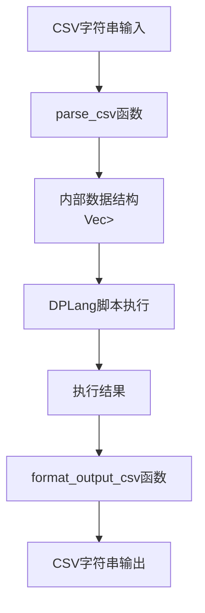

# CSV解析与格式化函数

<cite>
**Referenced Files in This Document**  
- [api.rs](file://src/api.rs)
- [runtime.rs](file://src/runtime.rs)
- [dev_logs/4.内置函数参考.md](file://dev_logs/4.内置函数参考.md)
</cite>

## 目录
1. [简介](#简介)
2. [核心功能概述](#核心功能概述)
3. `parse_csv`函数详解
4. `format_output_csv`函数详解
5. [输入输出示例](#输入输出示例)
6. [兼容性与注意事项](#兼容性与注意事项)

## 简介
本文档详细说明DPLang中用于处理CSV数据的两个核心辅助函数：`parse_csv`和`format_output_csv`。这两个函数构成了DPLang数据输入输出的基础，使得用户能够方便地在CSV格式和内部数据结构之间进行转换。文档将深入解析这两个函数的实现逻辑、数据处理策略以及使用方法。

## 核心功能概述
DPLang的CSV处理功能旨在提供一个简单而强大的接口，用于在文本格式的CSV数据和程序内部的结构化数据之间进行转换。`parse_csv`函数负责将CSV字符串解析为`Vec<HashMap<String, Value>>`类型的数据结构，而`format_output_csv`函数则执行相反的操作，将内部数据结构重新格式化为CSV字符串。这一对函数的设计考虑了数据类型推断、空值处理、安全转义等关键问题，确保了数据处理的准确性和可靠性。

### CSV处理流程


**Diagram sources**
- [api.rs](file://src/api.rs#L144-L190)
- [api.rs](file://src/api.rs#L243-L282)

**Section sources**
- [api.rs](file://src/api.rs#L144-L282)

## `parse_csv`函数详解

`parse_csv`函数是DPLang数据输入的核心，它将一个CSV格式的字符串转换为程序内部可以处理的`Vec<HashMap<String, Value>>`数据结构。该函数的实现遵循了严格的解析规则，确保了数据的准确性和一致性。

### 函数签名
```rust
pub fn parse_csv(csv_str: &str) -> Result<Vec<HashMap<String, Value>>, String>
```

### 处理逻辑
`parse_csv`函数的处理流程可以分为以下几个步骤：

1. **输入预处理**：首先对输入的CSV字符串进行修剪（trim），去除首尾的空白字符，然后按行分割。
2. **表头处理**：将第一行识别为表头（headers），并将其分割为列名数组。
3. **数据行解析**：遍历剩余的每一行，将其分割为值数组，并与表头对应，构建一个`HashMap<String, Value>`。
4. **数据类型推断**：对每个字段的值进行自动类型推断，将其转换为最合适的`Value`类型。
5. **空值处理**：对空字符串或"null"文本进行特殊处理，将其转换为`Value::Null`。

### 数据类型推断逻辑
`parse_csv`函数采用了一套优先级规则来推断数据类型，其逻辑如下：

```mermaid
flowchart TD
Start["原始字符串值"] --> IsEmpty{"是否为空或'null'?"}
IsEmpty --> |是| Null[Value::Null]
IsEmpty --> |否| IsNumber{"是否为有效数字?"}
IsNumber --> |是| Number[Value::Number(f64)]
IsNumber --> |否| IsTrue{"是否为'true'?"}
IsTrue --> |是| True[Value::Bool(true)]
IsTrue --> |否| IsFalse{"是否为'false'?"}
IsFalse --> |是| False[Value::Bool(false)]
IsFalse --> |否| String[Value::String]
```

**Diagram sources**
- [api.rs](file://src/api.rs#L168-L178)

**Section sources**
- [api.rs](file://src/api.rs#L144-L190)

### 空值处理策略
`parse_csv`函数对空值的处理非常明确。当一个字段的值为空字符串（`""`）或文本"null"时，该字段将被解析为`Value::Null`。这种设计使得数据中的缺失值能够被清晰地表示，避免了将其误认为是空字符串或其他默认值。在后续的数据处理中，可以使用`is_null`等内置函数来检查和处理这些空值。

## `format_output_csv`函数详解

`format_output_csv`函数负责将DPLang内部的执行结果（`Vec<HashMap<String, Value>>`）格式化为标准的CSV字符串。该函数的设计考虑了列名的收集、值的转义以及数组的特殊序列化，确保了输出的CSV文件既符合标准又包含了所有必要的信息。

### 函数签名
```rust
pub fn format_output_csv(output: &[HashMap<String, Value>]) -> String
```

### 处理逻辑
`format_output_csv`函数的处理流程如下：

1. **列名收集**：遍历所有行，收集所有出现过的列名，确保输出的CSV包含所有可能的字段。
2. **列名排序**：对收集到的列名进行排序，保证输出的列顺序是确定的，便于数据的可读性和一致性。
3. **表头生成**：将排序后的列名用逗号连接，生成CSV的表头行。
4. **数据行生成**：对于每一行数据，按照列名的顺序获取对应的值，并使用`format_value_csv`函数进行格式化。
5. **值的CSV安全转义**：对每个值进行适当的转义处理，确保生成的CSV是有效的。

### 列名收集与排序
由于DPLang的内部数据结构是基于`HashMap`的，不同行可能包含不同的键（列名）。`format_output_csv`函数通过遍历所有行来收集所有唯一的列名，并对其进行排序。这确保了即使某些行缺少某些字段，输出的CSV文件仍然具有完整的表头，缺失的字段将以空值填充。

### 值的CSV安全转义
为了确保生成的CSV文件是有效的，`format_value_csv`函数对每个值进行了安全转义：

- **字符串转义**：如果字符串包含逗号（`,`）或引号（`"`），则整个字符串会被双引号包围，并且字符串内部的引号会被转义为两个连续的引号（`""`）。
- **数组序列化**：数组类型的值会被特殊序列化为`"[item1; item2; ...]"`的格式，并用双引号包围，以避免与CSV的分隔符冲突。
- **其他类型**：数字、布尔值和`null`值则直接转换为字符串。

```mermaid
flowchart TD
Start["Value类型"] --> IsNull{"是否为Null?"}
IsNull --> |是| Empty[空字符串]
IsNull --> |否| IsString{"是否为String?"}
IsString --> |是| HasSpecial{"是否包含','或'\"'?"}
HasSpecial --> |是| Quote["用\"包围，\"转义为\"\""]
HasSpecial --> |否| NoQuote["直接输出"]
IsString --> |否| IsArray{"是否为Array?"}
IsArray --> |是| ArrayFormat["格式化为'[item1; item2]'"]
IsArray --> |否| Default["直接to_string()"]
```

**Diagram sources**
- [api.rs](file://src/api.rs#L286-L314)

**Section sources**
- [api.rs](file://src/api.rs#L243-L282)

## 输入输出示例

### 输入CSV示例
假设我们有以下CSV字符串作为输入：
```
name,age,price,active
Alice,30,100.5,true
Bob,25,200.0,false
Charlie,,50.0,null
```

### 解析后的内部数据结构
`parse_csv`函数会将其解析为以下`Vec<HashMap<String, Value>>`：
```rust
[
  {
    "name": Value::String("Alice".to_string()),
    "age": Value::Number(30.0),
    "price": Value::Number(100.5),
    "active": Value::Bool(true)
  },
  {
    "name": Value::String("Bob".to_string()),
    "age": Value::Number(25.0),
    "price": Value::Number(200.0),
    "active": Value::Bool(false)
  },
  {
    "name": Value::String("Charlie".to_string()),
    "age": Value::Null,
    "price": Value::Number(50.0),
    "active": Value::Null
  }
]
```

### 输出CSV示例
如果执行结果与上述内部数据结构相同，`format_output_csv`函数将生成以下CSV字符串：
```
active,age,name,price
true,30,Alice,100.5
false,25,Bob,200.0
,,"Charlie",50.0
```

**Section sources**
- [api.rs](file://src/api.rs#L319-L340)
- [dev_logs/4.内置函数参考.md](file://dev_logs/4.内置函数参考.md)

## 兼容性与注意事项

### 与标准`csv` crate的兼容性
DPLang的CSV处理函数是手动实现的，而非依赖于Rust的`csv` crate。这种设计选择带来了以下影响：

- **优点**：减少了外部依赖，使代码库更轻量；可以完全控制解析和格式化的逻辑，以满足DPLang特定的需求。
- **缺点**：可能无法处理一些极端的CSV格式（如包含换行符的字段），而标准`csv` crate对此有更完善的处理。

在大多数常规使用场景下，DPLang的CSV处理函数能够正确地处理标准CSV数据。然而，对于包含复杂转义或非标准格式的CSV文件，建议先进行预处理。

### 注意事项
- **列名大小写敏感**：`HashMap`的键是大小写敏感的，因此`"Name"`和`"name"`会被视为两个不同的列。
- **性能考虑**：`format_output_csv`函数在处理大量数据时，列名的收集和排序可能会成为性能瓶颈。
- **数组序列化**：数组被序列化为`"[item1; item2]"`的格式，这并非标准的CSV格式，但在DPLang内部是可逆的。

**Section sources**
- [api.rs](file://src/api.rs#L144-L282)
- [dev_logs/4.内置函数参考.md](file://dev_logs/4.内置函数参考.md)