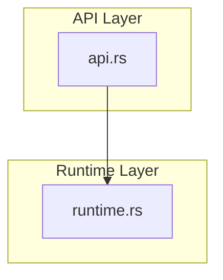
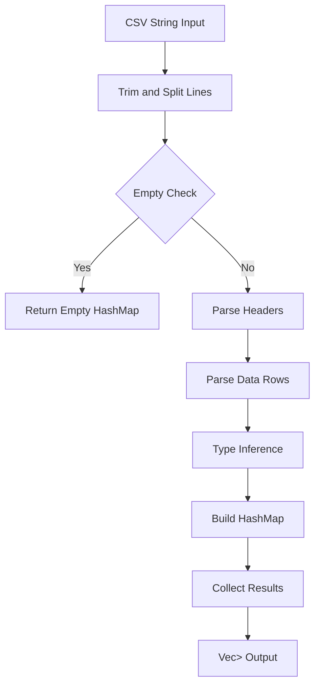
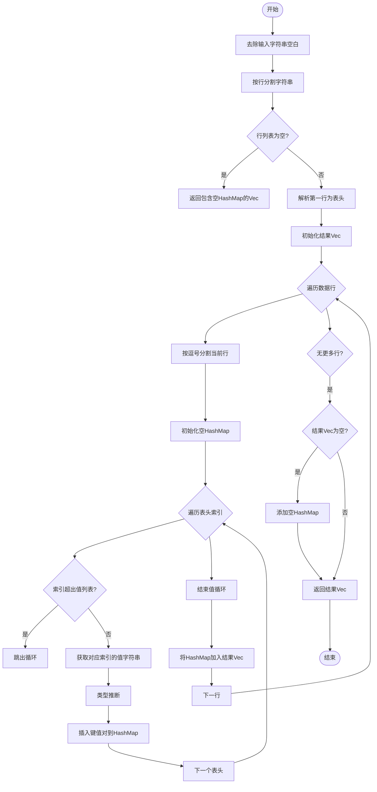
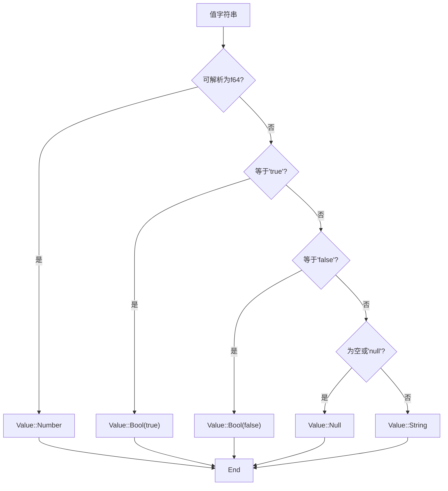
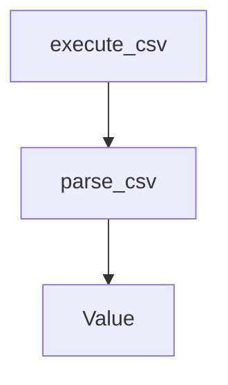

# parse_csv 函数

<cite>
**Referenced Files in This Document**   
- [api.rs](file://src/api.rs)
- [runtime.rs](file://src/runtime.rs)
</cite>

## Table of Contents
1. [Introduction](#introduction)
2. [Project Structure](#project-structure)
3. [Core Components](#core-components)
4. [Architecture Overview](#architecture-overview)
5. [Detailed Component Analysis](#detailed-component-analysis)
6. [Dependency Analysis](#dependency-analysis)
7. [Performance Considerations](#performance-considerations)
8. [Troubleshooting Guide](#troubleshooting-guide)
9. [Conclusion](#conclusion)
10. [Appendices](#appendices) (if necessary)

## Introduction
`parse_csv` 函数是 DPLang 语言中用于解析 CSV 格式输入的核心工具。该函数将 CSV 字符串转换为 `Vec<HashMap<String, Value>>` 类型的数据结构，实现了从文本数据到结构化数据的转换。函数具备自动类型推断能力，能够识别数字、布尔值、null 和字符串等不同类型的数据，并正确处理空值和缺失列的情况。本文档详细说明了该函数的实现机制、行为特征和使用方法。

## Project Structure
DPLang 项目采用模块化设计，`parse_csv` 函数位于 `src/api.rs` 文件中，属于公共 API 模块。该函数依赖于 `src/runtime.rs` 中定义的 `Value` 枚举类型来表示解析后的数据值。项目结构清晰，核心功能模块分离，便于维护和扩展。



**Diagram sources**
- [api.rs](file://src/api.rs#L144-L190)
- [runtime.rs](file://src/runtime.rs#L6-L33)

**Section sources**
- [api.rs](file://src/api.rs)
- [runtime.rs](file://src/runtime.rs)

## Core Components
`parse_csv` 函数的核心功能是将 CSV 字符串解析为结构化的数据集合。函数首先处理输入字符串的空白字符，然后按行分割。第一行被视为表头，后续行被视为数据行。对于每一数据行，函数将其按逗号分割，并将表头作为键，数据作为值，构建 `HashMap<String, Value>` 对象。最终返回包含所有行数据的 `Vec` 集合。

**Section sources**
- [api.rs](file://src/api.rs#L144-L190)

## Architecture Overview
`parse_csv` 函数的架构设计简洁高效，遵循了典型的解析器模式。函数接收一个字符串输入，经过预处理、行分割、表头解析、数据行解析和类型推断等步骤，最终输出结构化的数据集合。该函数与 `Value` 类型紧密耦合，利用 `Value` 枚举的丰富类型系统来表示各种数据类型。



**Diagram sources**
- [api.rs](file://src/api.rs#L144-L190)

## Detailed Component Analysis

### parse_csv 函数分析
`parse_csv` 函数是 DPLang 中处理 CSV 数据的核心组件。该函数实现了完整的 CSV 解析逻辑，包括空白处理、行分割、表头解析、数据行解析和类型推断。函数设计考虑了多种边界情况，如空输入、仅有表头等，确保了健壮性和可靠性。

#### 函数实现流程


**Diagram sources**
- [api.rs](file://src/api.rs#L144-L190)

#### 数据类型推断逻辑


**Diagram sources**
- [api.rs](file://src/api.rs#L168-L178)

**Section sources**
- [api.rs](file://src/api.rs#L144-L190)

### Value 枚举类型分析
`Value` 枚举是 DPLang 运行时系统的核心数据类型，用于表示所有可能的值。`parse_csv` 函数的输出依赖于 `Value` 类型来存储解析后的数据。该枚举支持多种数据类型，包括数字、字符串、布尔值、null、数组等，为数据解析提供了灵活的类型系统。

#### Value 枚举结构
```mermaid
classDiagram
class Value {
+Number(f64)
+Decimal(Decimal)
+String(String)
+Bool(bool)
+Null
+Array(Vec~Value~)
+ArraySlice{column_data : Rc~Vec~Value~~, start : usize, len : usize}
+Lambda{params : Vec~String~, body : Box~Expr~, captures : HashMap~String, Box~Value~~~}
+Function(Box~FunctionDef~)
}
```

**Diagram sources**
- [runtime.rs](file://src/runtime.rs#L6-L33)

**Section sources**
- [runtime.rs](file://src/runtime.rs#L6-L33)

## Dependency Analysis
`parse_csv` 函数与 `Value` 枚举类型存在强依赖关系。函数的输出类型 `Vec<HashMap<String, Value>>` 直接使用了 `Value` 枚举来表示值的类型。这种设计使得函数能够灵活处理不同类型的数据，并保持类型安全。同时，`parse_csv` 函数也被 `DPLangInterpreter` 类中的 `execute_csv` 方法所依赖，作为 CSV 输入的解析入口。



**Diagram sources**
- [api.rs](file://src/api.rs#L144-L190)
- [runtime.rs](file://src/runtime.rs#L6-L33)

**Section sources**
- [api.rs](file://src/api.rs#L55-L58)
- [runtime.rs](file://src/runtime.rs#L6-L33)

## Performance Considerations
`parse_csv` 函数在设计上考虑了性能因素。函数使用了 `split` 和 `map` 等高效的操作来处理字符串，避免了不必要的内存分配。对于类型推断，函数采用了短路求值的策略，一旦匹配成功就立即返回，减少了不必要的检查。然而，对于大型 CSV 文件，函数可能会产生大量的 `HashMap` 和 `String` 对象，这可能会导致内存使用增加。在处理大规模数据时，可以考虑使用流式解析器来减少内存占用。

## Troubleshooting Guide
当 `parse_csv` 函数出现异常时，可以参考以下常见问题和解决方案：

1. **输入为空字符串**：函数会返回包含一个空 `HashMap` 的 `Vec`，这是预期行为。
2. **数据行字段数少于表头**：函数会忽略多余的表头字段，不会产生错误。
3. **数字解析失败**：如果字符串无法解析为 `f64`，会被视为字符串类型。
4. **特殊字符处理**：函数目前不支持引号包围的字段，复杂的 CSV 格式可能无法正确解析。

**Section sources**
- [api.rs](file://src/api.rs#L144-L190)

## Conclusion
`parse_csv` 函数是 DPLang 中一个功能完整、设计良好的 CSV 解析器。它能够正确处理各种数据类型，具有良好的错误处理机制，并且代码结构清晰。通过结合 `Value` 枚举的丰富类型系统，函数实现了灵活的数据表示。该函数的实现为 DPLang 处理结构化数据提供了坚实的基础，同时也展示了 Rust 语言在数据处理方面的优势。