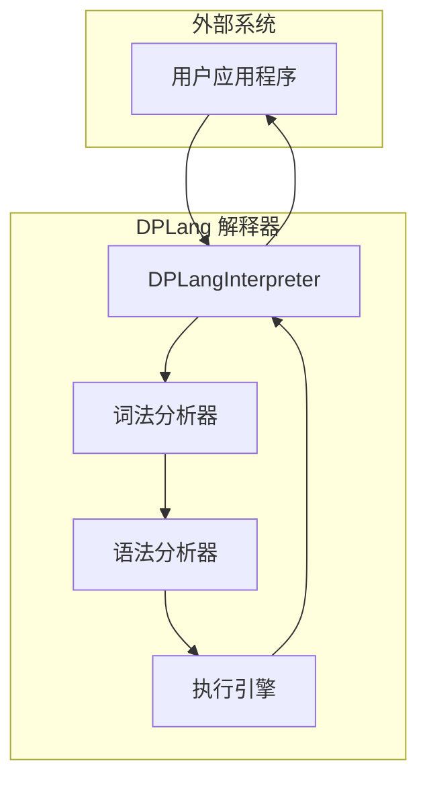
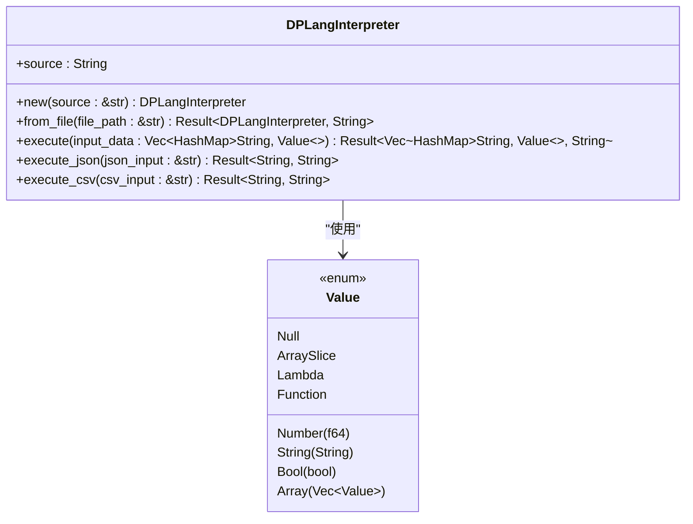
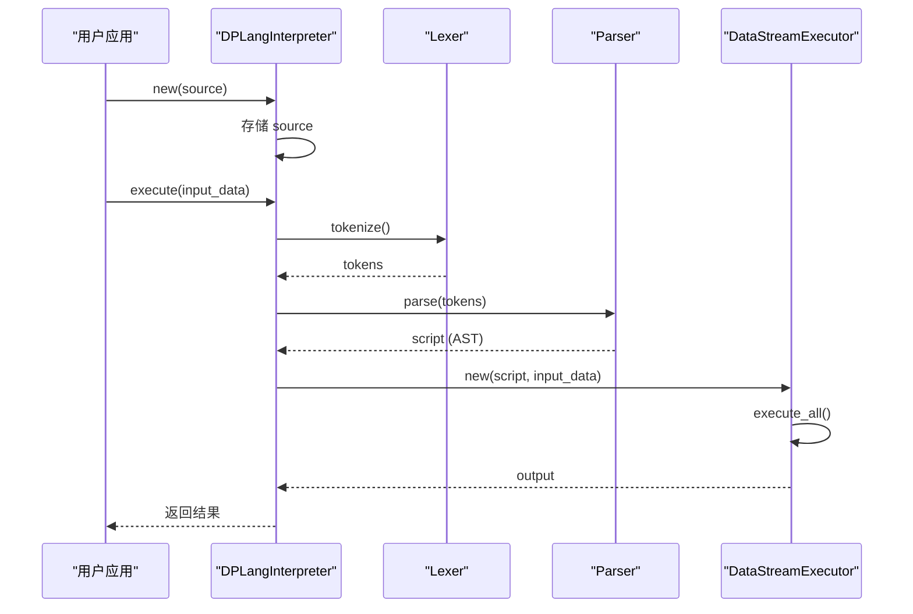
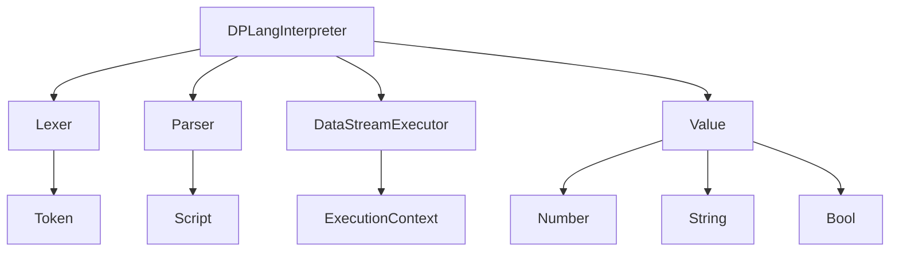

# DPLangInterpreter 类

<cite>
**本文档引用文件**   
- [api.rs](file://src/api.rs)
- [lexer.rs](file://src/lexer.rs)
- [parser/mod.rs](file://src/parser/mod.rs)
- [executor/data_stream.rs](file://src/executor/data_stream.rs)
- [runtime.rs](file://src/runtime.rs)
- [lib.rs](file://src/lib.rs)
</cite>

## 目录
1. [简介](#简介)
2. [核心组件](#核心组件)
3. [架构概述](#架构概述)
4. [详细组件分析](#详细组件分析)
5. [依赖分析](#依赖分析)
6. [性能考虑](#性能考虑)
7. [故障排除指南](#故障排除指南)
8. [结论](#结论)

## 简介
`DPLangInterpreter` 是 DPLang 脚本语言的公共 API 核心类，作为嵌入式脚本引擎的入口点。该类封装了从脚本源码到执行结果的完整生命周期，为外部系统提供了与 DPLang 解释器交互的桥梁。它连接了词法分析、语法分析和执行引擎，支持多种输入格式（如 JSON、CSV）和执行模式，是集成 DPLang 功能到 Rust 应用程序的关键组件。

## 核心组件

`DPLangInterpreter` 结构体定义在 `api.rs` 文件中，其主要职责是存储脚本源码并提供执行接口。该结构体包含一个 `source` 字段，用于保存待执行的脚本内容。通过 `new` 和 `from_file` 方法可以创建解释器实例，而 `execute` 及其变体方法则负责启动整个执行流程。该类的设计体现了不可变性原则，确保脚本源码在实例化后不会被修改。

**Section sources**
- [api.rs](file://src/api.rs#L9-L27)

## 架构概述

`DPLangInterpreter` 在 DPLang 解释器的整体架构中扮演着核心协调者的角色。它作为外部调用者与内部执行引擎之间的中介，负责将用户提供的脚本源码传递给底层的词法分析器和语法分析器，并最终将解析后的抽象语法树（AST）交给执行引擎进行处理。这种分层设计实现了关注点分离，使得解释器的各个组件可以独立演化和优化。

**Diagram sources **
- [api.rs](file://src/api.rs#L9-L45)
- [lexer.rs](file://src/lexer.rs#L120-L127)
- [parser/mod.rs](file://src/parser/mod.rs#L25-L34)
- [executor/data_stream.rs](file://src/executor/data_stream.rs#L16-L38)

## 详细组件分析

### DPLangInterpreter 结构体分析

`DPLangInterpreter` 结构体的设计简洁而高效，其核心是 `source` 字段，该字段以 `String` 类型存储了完整的脚本源码。此设计的意图是确保脚本内容在解释器实例的整个生命周期内保持不变，从而保证执行的可预测性和线程安全性。`source` 字段的不可变性是通过其私有性（未提供公共 setter 方法）和构造函数中的一次性初始化来实现的。

#### 类图

**Diagram sources **
- [api.rs](file://src/api.rs#L10-L12)
- [runtime.rs](file://src/runtime.rs#L8-L34)

#### 执行流程序列图

**Diagram sources **
- [api.rs](file://src/api.rs#L29-L45)
- [lexer.rs](file://src/lexer.rs#L142-L156)
- [parser/mod.rs](file://src/parser/mod.rs#L36-L46)
- [executor/data_stream.rs](file://src/executor/data_stream.rs#L42-L66)

## 依赖分析

`DPLangInterpreter` 依赖于 DPLang 项目中的多个核心模块。它直接依赖于 `lexer` 模块进行词法分析，将源码字符串转换为标记流；依赖于 `parser` 模块进行语法分析，将标记流解析为抽象语法树（AST）；并依赖于 `executor` 模块中的 `DataStreamExecutor` 来执行解析后的脚本。此外，它还依赖于 `runtime` 模块中的 `Value` 枚举来表示运行时值。这些依赖关系通过 `use` 语句在 `api.rs` 文件的顶部声明。

**Diagram sources **
- [api.rs](file://src/api.rs#L3-L7)
- [lib.rs](file://src/lib.rs#L3-L9)

**Section sources**
- [api.rs](file://src/api.rs#L3-L7)
- [lib.rs](file://src/lib.rs#L3-L9)

## 性能考虑

`DPLangInterpreter` 的设计对性能有积极影响。由于 `source` 字段是不可变的，多个解释器实例可以安全地共享同一份脚本源码，减少了内存占用。执行流程是线性的，从词法分析到语法分析再到执行，避免了不必要的中间状态。对于需要频繁执行同一脚本的场景，建议复用 `DPLangInterpreter` 实例，因为实例化过程涉及字符串拷贝，而执行过程则可以高效地重用已解析的 AST（尽管当前实现中每次执行都会重新解析，但这是可以优化的点）。

## 故障排除指南

当使用 `DPLangInterpreter` 遇到问题时，应首先检查错误返回值。常见的错误包括词法分析错误（如无效字符）、语法分析错误（如括号不匹配）和执行错误（如除零）。`execute` 方法返回 `Result` 类型，其错误分支包含详细的错误信息。对于输入格式问题，如 JSON 或 CSV 解析失败，应检查输入数据的格式是否符合预期。确保脚本文件路径正确，且文件具有读取权限。

**Section sources**
- [api.rs](file://src/api.rs#L34-L44)
- [api.rs](file://src/api.rs#L49-L58)

## 结论

`DPLangInterpreter` 类是 DPLang 脚本语言的公共 API 入口，它提供了一个简洁而强大的接口，用于在 Rust 应用程序中嵌入和执行 DPLang 脚本。其设计遵循了不可变性和关注点分离的原则，通过连接词法分析、语法分析和执行引擎，实现了从源码到结果的完整转换。对于库集成者而言，理解其初始化、执行流程和错误处理机制是成功集成的关键。未来可以通过缓存解析结果来进一步优化其性能。