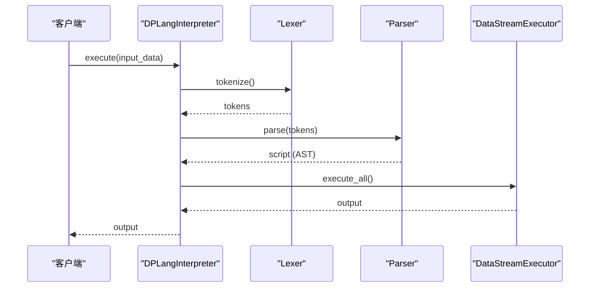

# execute 方法

<cite>
**本文档引用文件**   
- [api.rs](file://src/api.rs)
- [lexer.rs](file://src/lexer.rs)
- [parser/mod.rs](file://src/parser/mod.rs)
- [executor/data_stream.rs](file://src/executor/data_stream.rs)
- [runtime.rs](file://src/runtime.rs)
</cite>

## 目录
1. [方法概述](#方法概述)
2. [处理流程](#处理流程)
3. [输入参数](#输入参数)
4. [返回类型](#返回类型)
5. [调用序列图](#调用序列图)
6. [代码示例](#代码示例)

## 方法概述

`execute` 方法是 DPLang 解释器的核心执行入口，负责将源代码从字符串形式转换为可执行的程序，并使用提供的输入数据进行计算。该方法通过串联词法分析、语法分析和流式执行引擎三个主要阶段，实现了从源代码到结果输出的完整处理流程。

**Section sources**
- [api.rs](file://src/api.rs#L29-L45)

## 处理流程

`execute` 方法的处理流程分为三个主要阶段：词法分析、语法分析和执行。每个阶段都有明确的职责和输出，确保了代码的正确解析和执行。

1. **词法分析**：将源代码字符串分解为一系列的 Token。这一阶段由 `Lexer` 类完成，它会识别关键字、标识符、字面量、运算符等，并生成一个 Token 序列。
2. **语法分析**：将 Token 序列转换为抽象语法树（AST）。这一阶段由 `Parser` 类完成，它会根据语言的语法规则，构建出一个表示程序结构的树形结构。
3. **执行**：遍历 AST 并执行相应的操作。这一阶段由 `DataStreamExecutor` 类完成，它会根据 AST 的结构，逐行处理输入数据，并生成输出结果。



**Diagram sources**
- [api.rs](file://src/api.rs#L32-L43)
- [lexer.rs](file://src/lexer.rs#L143-L156)
- [parser/mod.rs](file://src/parser/mod.rs#L37-L45)
- [executor/data_stream.rs](file://src/executor/data_stream.rs#L146-L155)

## 输入参数

`execute` 方法接受一个 `Vec<HashMap<String, Value>>` 类型的输入参数 `input_data`，表示输入数据矩阵。每一行数据是一个 `HashMap<String, Value>`，其中键是字段名，值是对应的值。`Value` 枚举类型支持多种数据类型，包括数字、字符串、布尔值、数组等。

```rust
pub fn execute(&self, input_data: Vec<HashMap<String, Value>>) -> Result<Vec<HashMap<String, Value>>, String>
```

输入数据的结构要求如下：
- 每一行数据必须是一个 `HashMap<String, Value>`。
- 字段名必须是字符串类型。
- 值可以是 `Value` 枚举中的任意类型。

**Section sources**
- [api.rs](file://src/api.rs#L30)
- [runtime.rs](file://src/runtime.rs#L6-L33)

## 返回类型

`execute` 方法返回一个 `Result<Vec<HashMap<String, Value>>, String>` 类型的结果。如果执行成功，返回一个包含输出数据的 `Vec<HashMap<String, Value>>`；如果执行失败，返回一个包含错误信息的字符串。

```rust
pub fn execute(&self, input_data: Vec<HashMap<String, Value>>) -> Result<Vec<HashMap<String, Value>>, String>
```

内部错误转换机制如下：
- 词法分析错误会被转换为 `"词法分析错误: {:?}"` 格式的字符串。
- 语法分析错误会被转换为 `"语法分析错误: {:?}"` 格式的字符串。
- 执行错误会被转换为 `"执行错误: {:?}"` 格式的字符串。

**Section sources**
- [api.rs](file://src/api.rs#L34-L44)

## 调用序列图

以下是 `execute` 方法的调用序列图，展示了从客户端调用到最终输出的完整流程。


**Diagram sources**
- [api.rs](file://src/api.rs#L32-L43)
- [lexer.rs](file://src/lexer.rs#L143-L156)
- [parser/mod.rs](file://src/parser/mod.rs#L37-L45)
- [executor/data_stream.rs](file://src/executor/data_stream.rs#L146-L155)

## 代码示例

以下是一个使用 `execute` 方法的代码示例，展示了如何准备输入数据并处理输出结果。

```rust
use std::collections::HashMap;
use crate::runtime::Value;
use crate::api::DPLangInterpreter;

fn main() {
    let source = r#"
-- INPUT x:number --
-- OUTPUT result:number --

result = x * 2
return [result]
"#;

    let interpreter = DPLangInterpreter::new(source);

    let mut input = HashMap::new();
    input.insert("x".to_string(), Value::Number(5.0));

    let output = interpreter.execute(vec![input]).unwrap();

    assert_eq!(output.len(), 1);
    assert_eq!(output[0].get("result"), Some(&Value::Number(10.0)));
}
```

在这个示例中，我们创建了一个 `DPLangInterpreter` 实例，并使用 `execute` 方法执行了一个简单的脚本。输入数据包含一个名为 `x` 的字段，其值为 `5.0`。执行结果是一个包含 `result` 字段的输出数据，其值为 `10.0`。

**Section sources**
- [api.rs](file://src/api.rs#L349-L362)
- [runtime.rs](file://src/runtime.rs#L6-L33)