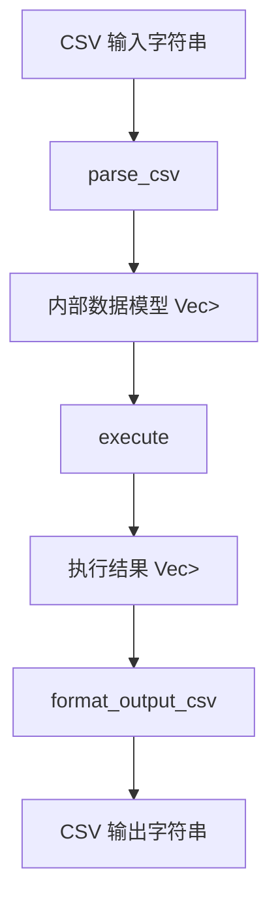
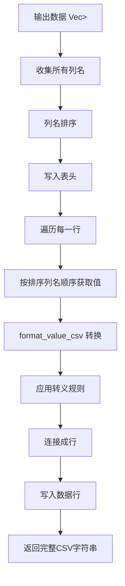

# execute_csv 方法

<cite>
**本文档引用的文件**
- [api.rs](file://src/api.rs)
- [runtime.rs](file://src/runtime.rs)
- [output_manager.rs](file://src/executor/output_manager.rs)
</cite>

## 目录
1. [简介](#简介)
2. [核心功能流程](#核心功能流程)
3. [CSV解析逻辑](#csv解析逻辑)
4. [结果格式化流程](#结果格式化流程)
5. [输入输出示例](#输入输出示例)
6. [性能特征与边界情况](#性能特征与边界情况)

## 简介
`execute_csv` 方法是 DPLang 解释器的核心 API 之一，它提供了一种便捷的方式，将 CSV 格式的输入数据转换为内部数据模型，执行 DPLang 脚本，并将结果以标准化的 CSV 格式返回。该方法极大地简化了数据管道的集成，使得用户无需手动处理数据序列化和反序列化，即可将结构化数据直接输入到 DPLang 脚本中进行处理。

**Section sources**
- [api.rs](file://src/api.rs#L54-L59)

## 核心功能流程
`execute_csv` 方法的执行流程是一个清晰的三步管道：**解析 (Parse) -> 执行 (Execute) -> 格式化 (Format)**。

1.  **解析 (Parse)**：方法首先调用 `parse_csv` 函数，将传入的 CSV 字符串（`csv_input`）解析成一个 `Vec<HashMap<String, Value>>` 类型的内部数据结构。这个结构代表了一个数据表，其中外层的 `Vec` 存储多行数据，内层的 `HashMap` 以列名为键、以 `Value` 枚举类型为值存储每一行的字段。
2.  **执行 (Execute)**：解析得到的数据被作为输入传递给核心的 `execute` 方法。`execute` 方法会启动词法分析、语法分析，并创建一个 `DataStreamExecutor` 来逐行处理输入数据，执行 DPLang 脚本，最终生成一个包含计算结果的输出数据表（同样是 `Vec<HashMap<String, Value>>` 类型）。
3.  **格式化 (Format)**：最后，方法调用 `format_output_csv` 函数，将执行得到的内部数据结构重新转换为一个格式良好的 CSV 字符串并返回。



**Diagram sources**
- [api.rs](file://src/api.rs#L55-L58)

## CSV解析逻辑
`parse_csv` 函数负责将原始的 CSV 文本转换为解释器内部使用的数据结构。其解析逻辑如下：

1.  **行分割与表头处理**：函数首先使用 `lines()` 方法按行分割输入字符串，并将第一行识别为表头（headers）。表头中的每个字段通过 `split(',')` 分割，并去除首尾空格，形成列名列表。
2.  **数据行解析**：对于后续的每一行数据，函数同样使用 `split(',')` 进行分割，得到一个值的列表。
3.  **类型推断**：这是解析过程的核心。函数对每个字段值进行类型推断，顺序如下：
    *   **数字 (Number)**：尝试使用 `parse::<f64>()` 将字符串解析为浮点数。如果成功，则创建 `Value::Number`。
    *   **布尔值 (Bool)**：如果值是 `"true"` 或 `"false"`（不区分大小写），则分别创建 `Value::Bool(true)` 或 `Value::Bool(false)`。
    *   **空值 (Null)**：如果值为空字符串或 `"null"`，则创建 `Value::Null`。
    *   **字符串 (String)**：如果以上类型均不匹配，则将该值作为字符串处理，创建 `Value::String`。
4.  **行构建**：将推断出的值与对应的表头列名配对，存入一个 `HashMap` 中，形成一行数据。
5.  **结果组装**：所有行数据被收集到一个 `Vec` 中，最终返回。

**Section sources**
- [api.rs](file://src/api.rs#L145-L190)

## 结果格式化流程
`format_output_csv` 函数负责将内部的执行结果转换回 CSV 字符串，其流程如下：

1.  **列名收集与排序**：由于输出数据的每一行可能包含不同的列（例如，某些行有 `result` 列，某些行有 `status` 列），函数首先遍历所有行，收集所有出现过的列名到一个 `Vec` 中。然后对列名进行字典序排序，以保证输出的 CSV 列顺序是稳定和可预测的。
2.  **表头写入**：将排序后的列名列表用逗号连接，形成 CSV 的第一行（表头），并添加换行符。
3.  **数据行写入**：
    *   对于每一行输出数据，函数按照排序后的列名顺序，依次查找该列的值。
    *   如果某列在该行中不存在，则输出一个空字符串。
    *   如果存在，则调用 `format_value_csv` 函数将 `Value` 类型的值转换为 CSV 安全的字符串。
4.  **值转义规则**：`format_value_csv` 函数根据值的类型应用不同的转义规则：
    *   **空值 (Null)**：输出空字符串。
    *   **布尔值 (Bool)**：输出 `"true"` 或 `"false"`。
    *   **数字 (Number, Decimal)**：直接输出数字字符串。
    *   **字符串 (String)**：这是转义的关键。如果字符串中包含逗号 `,` 或双引号 `"`，则整个字符串会被双引号包围，并且字符串内部的每一个双引号都会被转义为两个双引号（`""`）。例如，`"Hello, "World""` 会被正确转义。
    *   **复杂类型 (Array, Lambda等)**：这些类型会被转换为一个带引号的描述性字符串，如 `"[array]"` 或 `"<lambda>"`。



**Diagram sources**
- [api.rs](file://src/api.rs#L243-L282)

## 输入输出示例
以下示例展示了 `execute_csv` 方法如何处理包含特殊字符的输入。

**示例 1：基础输入输出**
```csv
# 输入 CSV
name,age,price
Alice,30,100.5
Bob,25,200.0

# 输出 CSV (假设脚本返回相同数据)
age,name,price
30,Alice,100.5
25,Bob,200.0
```
*说明：列名被自动排序，数字和字符串被原样输出。*

**示例 2：特殊字符处理**
```csv
# 输入 CSV
description,flag
Hello, "World"!,true
Simple text,false

# 输出 CSV
description,flag
"Hello, ""World""!",true
Simple text,false
```
*说明：第一行的 `description` 字段包含逗号和引号。在输出时，该字段被双引号包围，并且内部的引号被转义为两个引号。*

**Section sources**
- [api.rs](file://src/api.rs#L320-L327)
- [api.rs](file://src/api.rs#L329-L340)

## 性能特征与边界情况
`execute_csv` 方法在设计上考虑了性能和鲁棒性，但也存在一些需要注意的边界情况。

*   **性能特征**：
    *   **内存使用**：该方法是内存驻留的。它会将整个输入 CSV 和输出结果都加载到内存中。对于非常大的数据集，这可能会导致较高的内存消耗。
    *   **解析效率**：`parse_csv` 使用了简单的 `split` 方法，对于标准的、无嵌套引号的 CSV 数据非常高效。但它不支持复杂的 CSV 标准（如 RFC 4180 中定义的多行字段），因此在处理简单数据时性能良好。
    *   **格式化效率**：`format_output_csv` 在格式化前会遍历所有数据以收集和排序列名，这增加了 O(n*m) 的时间复杂度（n为行数，m为平均列数），但对于大多数场景是可接受的。

*   **边界情况处理**：
    *   **空输入**：如果输入的 CSV 字符串为空或只包含空白字符，`parse_csv` 会返回一个包含单个空 `HashMap` 的 `Vec`，确保执行器至少处理一行“空”数据。
    *   **缺失列**：在解析时，如果某一行的字段数少于表头，超出部分的列将被忽略。在格式化时，如果某行缺少某些列，这些列的值将被输出为空字符串。
    *   **类型推断失败**：任何无法被推断为数字、布尔或空值的字符串都会被作为普通字符串处理，不会导致解析失败。
    *   **空输出**：如果执行结果为空（`Vec` 长度为0），`format_output_csv` 会直接返回一个空字符串。

**Section sources**
- [api.rs](file://src/api.rs#L148-L150)
- [api.rs](file://src/api.rs#L163-L164)
- [api.rs](file://src/api.rs#L246-L247)
- [api.rs](file://src/api.rs#L186-L188)