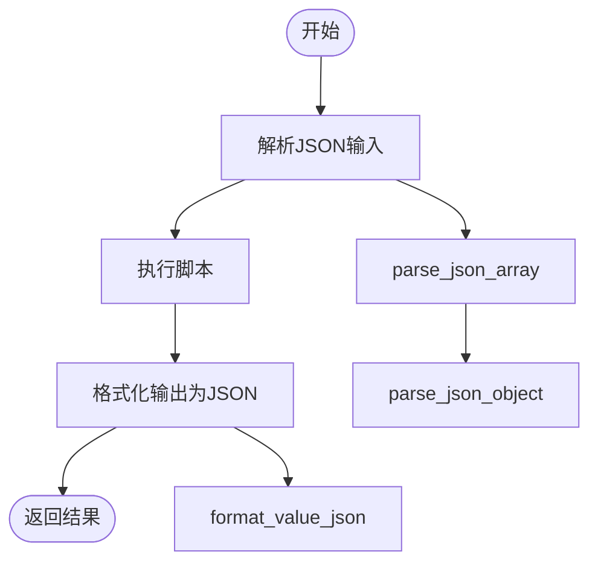
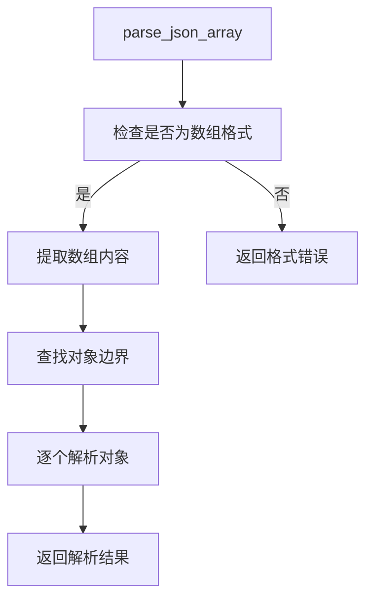
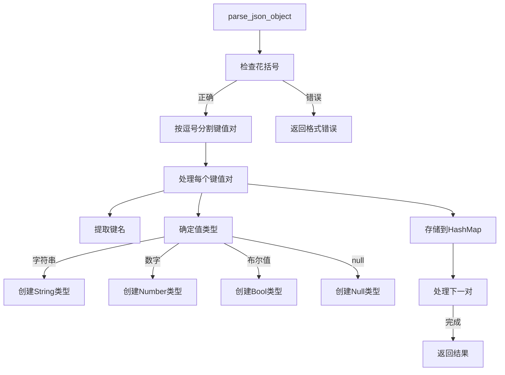
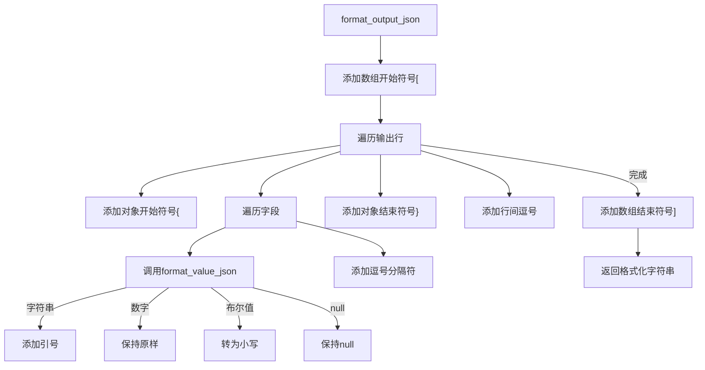
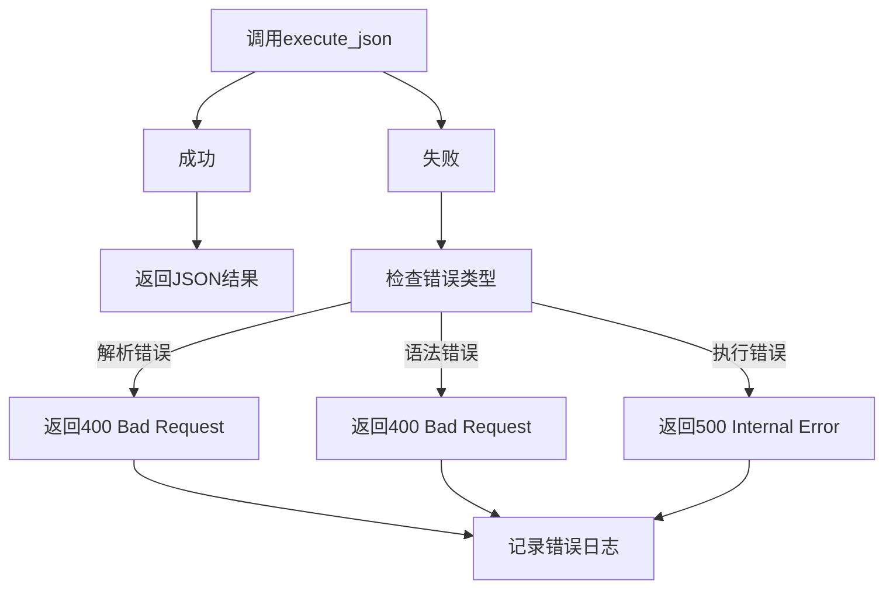

# execute_json 方法

<cite>
**本文档引用文件**   
- [api.rs](file://src/api.rs)
- [runtime.rs](file://src/runtime.rs)
</cite>

## 目录
1. [方法概述](#方法概述)
2. [执行流程](#执行流程)
3. [JSON解析逻辑](#json解析逻辑)
4. [结果序列化](#结果序列化)
5. [输入输出示例](#输入输出示例)
6. [Web API集成注意事项](#web-api集成注意事项)

## 方法概述

`execute_json`方法是DPLang解释器的核心API之一，用于执行JSON格式输入的脚本。该方法接收JSON字符串作为输入，将其解析为内部数据结构，执行脚本，并将结果以JSON字符串形式返回。

该方法的设计目标是简化Web API集成，使前端应用能够方便地与DPLang解释器交互。通过统一的JSON格式输入输出，实现了语言无关的接口规范。

**Section sources**
- [api.rs](file://src/api.rs#L47-L52)

## 执行流程

`execute_json`方法的执行流程分为三个主要阶段：JSON解析、脚本执行和结果序列化。



**Diagram sources **
- [api.rs](file://src/api.rs#L48-L52)
- [api.rs](file://src/api.rs#L62-L143)

**Section sources**
- [api.rs](file://src/api.rs#L47-L52)

## JSON解析逻辑

### 数组格式处理

`execute_json`方法依赖`parse_json_array`函数来解析JSON数组输入。该函数要求输入必须是数组格式，即以方括号`[]`包围。



**Diagram sources **
- [api.rs](file://src/api.rs#L62-L103)

### 对象结构处理

`parse_json_object`函数负责解析单个JSON对象。它将对象内的键值对分离，并根据值的类型创建相应的`Value`枚举实例。



**Diagram sources **
- [api.rs](file://src/api.rs#L106-L143)

### 基本数据类型处理规则

`parse_json_object`函数支持以下基本数据类型的解析：

- **字符串**: 以双引号包围的文本，如`"hello"`
- **数字**: 支持整数和浮点数，如`42`或`3.14`
- **布尔值**: `true`或`false`
- **null**: 表示空值

解析时会跳过格式不正确的键值对，确保解析过程的健壮性。

**Section sources**
- [api.rs](file://src/api.rs#L106-L143)

## 结果序列化

### 返回值设计原因

`execute_json`方法返回`String`类型而非结构化数据，主要基于以下设计考虑：

1. **API兼容性**: 便于Web API直接返回，无需额外的序列化步骤
2. **性能优化**: 避免双重序列化开销
3. **错误处理统一**: 错误信息也以字符串形式返回，保持接口一致性
4. **流式处理**: 适合大结果集的流式输出

### 序列化完整流程

结果序列化通过`format_output_json`函数完成，将内部的`Vec<HashMap<String, Value>>`结构转换为标准JSON字符串。



**Diagram sources **
- [api.rs](file://src/api.rs#L193-L217)
- [api.rs](file://src/api.rs#L220-L242)

**Section sources**
- [api.rs](file://src/api.rs#L48-L52)

## 输入输出示例

### 典型JSON输入

```json
[
  {"price": 100, "quantity": 2, "discount": 0.1},
  {"price": 200, "quantity": 1, "discount": 0.2}
]
```

### 复杂结构处理

```json
[
  {
    "name": "Alice",
    "scores": [85, 90, 95],
    "metadata": {
      "active": true,
      "tags": ["student", "honors"]
    }
  },
  {
    "name": "Bob",
    "scores": [70, 80, null],
    "metadata": {
      "active": false,
      "tags": []
    }
  }
]
```

### 特殊值处理

- **null值**: 直接转换为`Value::Null`
- **布尔值**: `true`/`false`转换为`Value::Bool`
- **嵌套对象**: 递归解析为嵌套的`HashMap`
- **数组**: 转换为`Value::Array`

**Section sources**
- [api.rs](file://src/api.rs#L48-L52)

## Web API集成注意事项

### 输入验证

在将JSON输入传递给`execute_json`方法前，建议进行以下验证：

1. **格式验证**: 确保输入是有效的JSON
2. **结构验证**: 确认输入符合预期的数据结构
3. **大小限制**: 防止过大的输入导致内存问题
4. **超时设置**: 为长时间运行的脚本设置合理的超时

### 错误处理



**Diagram sources **
- [api.rs](file://src/api.rs#L48-L52)

### 性能优化建议

1. **连接池**: 对于频繁调用的场景，考虑使用解释器实例池
2. **缓存**: 缓存已编译的脚本以提高重复执行的性能
3. **异步处理**: 对于耗时较长的脚本，采用异步处理模式
4. **批量处理**: 尽可能使用批量输入而非单个调用

**Section sources**
- [api.rs](file://src/api.rs#L47-L52)