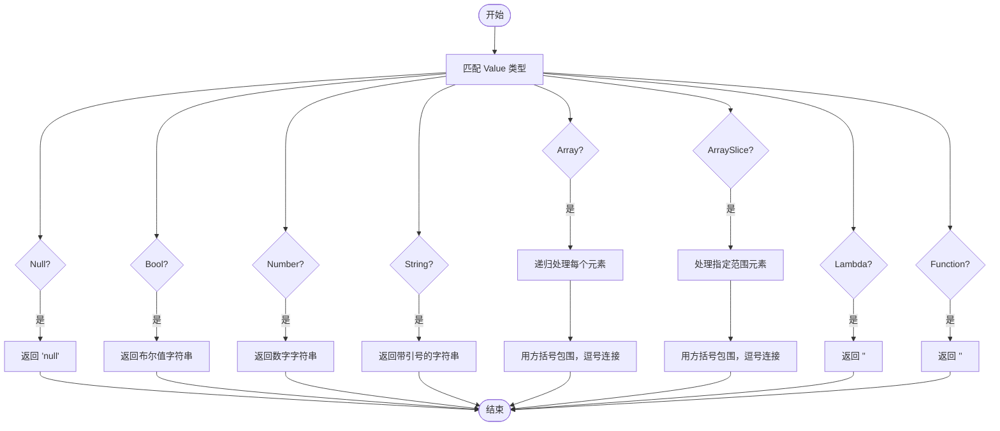

# JSON解析与格式化函数

<cite>
**Referenced Files in This Document**  
- [api.rs](file://src/api.rs)
- [runtime.rs](file://src/runtime.rs)
</cite>

## Table of Contents
1. [JSON解析与格式化函数](#json解析与格式化函数)
2. [JSON数组解析](#json数组解析)
3. [JSON对象解析](#json对象解析)
4. [输出格式化](#输出格式化)
5. [值序列化](#值序列化)
6. [边界情况处理](#边界情况处理)

## JSON数组解析

`parse_json_array`函数负责解析JSON格式的输入字符串并将其转换为`Vec<HashMap<String, Value>>`类型的数据结构。该函数首先验证输入字符串是否以方括号`[`开头并以`]`结尾，确保其为有效的JSON数组格式。若格式不符合要求，则返回"JSON 必须是数组格式"的错误信息。

在解析过程中，函数通过字符级别的遍历和大括号计数器来分割数组中的各个对象。当遇到左大括号`{`时，记录对象的起始位置并增加计数器；当遇到右大括号`}`时，减少计数器并在计数器归零时确定一个完整对象的结束位置。这种基于括号平衡的解析方法能够正确处理嵌套结构，确保每个对象被完整提取。

对于提取出的每个对象字符串，函数调用`parse_json_object`进行进一步解析，并将解析结果添加到结果向量中。若最终结果为空，函数会自动添加一个空的`HashMap`，确保返回结果至少包含一个元素。

**Section sources**
- [api.rs](file://src/api.rs#L61-L103)

## JSON对象解析

`parse_json_object`函数专门用于解析单个JSON对象，将其键值对映射到`HashMap<String, Value>`数据结构中。函数首先验证输入是否为有效的JSON对象格式（以`{`开头，`}`结尾），然后提取对象内容并按逗号分割各个键值对。

对于每个键值对，函数使用冒号`:`进行分割，提取键名和值字符串。键名会被去除首尾的双引号并转换为`String`类型。值的解析支持多种数据类型：
- **字符串**: 以双引号包围的文本，解析为`Value::String`
- **数字**: 可解析为`f64`的数值，解析为`Value::Number`
- **布尔值**: "true"或"false"，解析为`Value::Bool`
- **null**: 特殊值"null"，解析为`Value::Null`

函数采用宽松的解析策略，对于无法识别的值或格式错误的键值对，会直接跳过而不中断整个解析过程。这种容错机制确保了即使输入数据存在部分错误，也能尽可能多地提取有效信息。

**Section sources**
- [api.rs](file://src/api.rs#L105-L142)

## 输出格式化

`format_output_json`函数负责将执行结果序列化为标准的JSON数组格式。该函数接收一个`HashMap<String, Value>`类型的向量作为输入，并生成格式化的JSON字符串输出。

输出格式采用多行缩进样式，提高可读性。函数首先添加数组起始标记`[\n`，然后遍历每个结果行。对于每行数据，添加适当的缩进和对象起始标记`{`，并逐个处理键值对。键值对之间用逗号分隔，第一个键值对前不添加逗号。每个键值对的值通过`format_value_json`函数进行格式化。

在处理完所有行后，函数添加数组结束标记`\n]`。这种格式化方式生成的JSON既符合标准规范，又便于人类阅读和调试。

**Section sources**
- [api.rs](file://src/api.rs#L192-L217)

## 值序列化

`format_value_json`函数实现递归的值序列化逻辑，能够处理`Value`枚举的各种类型。该函数是JSON格式化的核心，负责将内部数据结构转换为标准的JSON表示。

对于基本类型，函数直接转换：
- `Value::Null` 转换为字符串"null"
- `Value::Bool` 转换为"true"或"false"
- `Value::Number` 转换为数字字符串
- `Value::String` 转换为带双引号包围的字符串

对于复杂类型，函数采用递归处理：
- **数组**: 将数组中的每个元素递归调用`format_value_json`，然后用方括号包围并用逗号连接
- **数组切片**: 类似数组处理，但只处理指定范围内的元素
- **Lambda和函数**: 特殊处理为字符串"<lambda>"或"<function>"

这种递归设计能够正确处理任意深度的嵌套结构，确保复杂数据的完整序列化。

**Diagram sources**
- [api.rs](file://src/api.rs#L219-L241)

**Section sources**
- [api.rs](file://src/api.rs#L219-L241)
- [runtime.rs](file://src/runtime.rs#L6-L33)

## 边界情况处理

这些JSON处理函数在设计时充分考虑了各种边界情况和异常输入，确保系统的健壮性。

对于`parse_json_array`，空输入或无效格式会返回明确的错误信息。即使输入数组为空，函数也会返回包含一个空对象的结果，避免空结果带来的后续处理问题。

`parse_json_object`对格式错误的键值对采用宽容策略，跳过无法解析的部分而非完全失败。这在处理不完美的实际数据时特别有用。

`format_output_json`和`format_value_json`则专注于正确处理各种`Value`类型，包括嵌套数组和复杂结构。对于特殊值如Lambda和函数，函数提供有意义的字符串表示而非抛出错误。

这些函数共同构成了DPLang的数据输入输出基础，为系统提供了可靠的JSON数据处理能力。

**Section sources**
- [api.rs](file://src/api.rs#L61-L241)