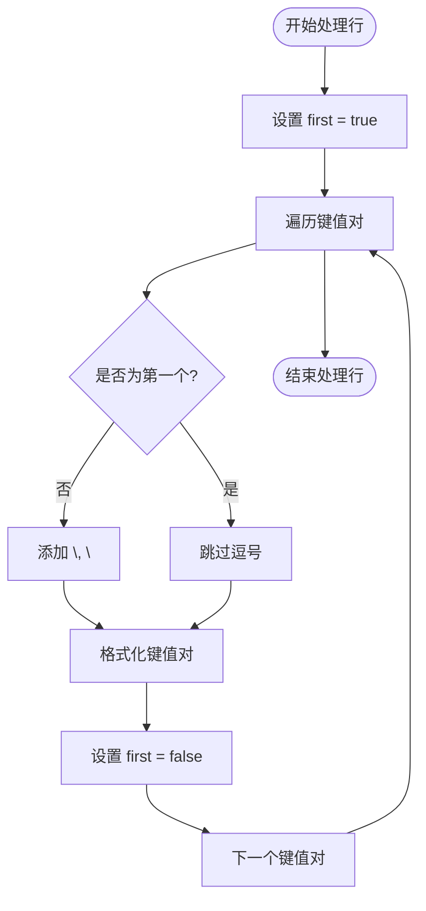
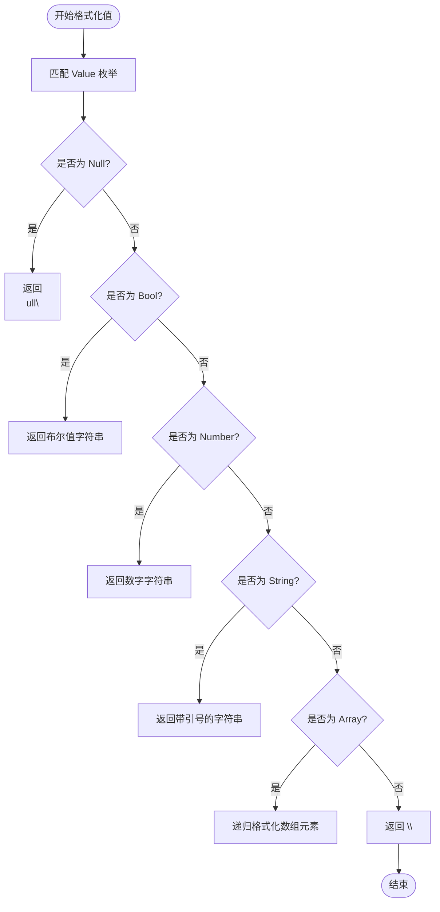

# format_output_json 函数

<cite>
**本文档引用的文件**
- [api.rs](file://src/api.rs#L192-L241)
</cite>

## 目录
1. [函数概述](#函数概述)
2. [输出结构构建](#输出结构构建)
3. [行与行之间的分隔处理](#行与行之间的分隔处理)
4. [对象内部键值对的分隔处理](#对象内部键值对的分隔处理)
5. [值的JSON格式化](#值的json格式化)
6. [空结果集处理](#空结果集处理)
7. [输出格式示例](#输出格式示例)

## 函数概述

`format_output_json` 函数负责将执行结果（`Vec<HashMap<String, Value>>`）序列化为标准的JSON数组字符串。该函数通过构建包含换行和缩进的格式化输出结构，使生成的JSON数据具有良好的可读性。函数接收一个包含多行结果的向量，每行是一个键值对映射，最终将其转换为符合JSON标准的字符串格式。

**Section sources**
- [api.rs](file://src/api.rs#L192-L217)

## 输出结构构建

函数首先初始化一个字符串 `result`，并添加JSON数组的开始符号 `[` 和换行符 `\n`。这确保了输出的JSON数组以正确的格式开始，并且每一行数据都从新的一行开始，提高了可读性。

```mermaid
flowchart TD
Start([开始]) --> InitResult["初始化 result = \"[\\n\""]
InitResult --> CheckEmpty["检查输出是否为空"]
CheckEmpty --> End([结束])
```

**Diagram sources**
- [api.rs](file://src/api.rs#L195)

## 行与行之间的分隔处理

函数通过遍历 `output` 向量中的每一行结果来处理行与行之间的分隔。在遍历过程中，使用 `enumerate()` 方法获取当前行的索引 `i`。如果当前行不是第一行（即 `i > 0`），则在添加新行之前插入一个逗号 `,` 和换行符 `\n`，以确保每行数据之间正确分隔。

```mermaid
flowchart TD
Start([开始遍历]) --> IsFirstRow{"是否为第一行?"}
IsFirstRow --> |否| AddComma["添加 \",\\n\""]
IsFirstRow --> |是| SkipComma["跳过逗号"]
AddComma --> AddObjectStart["添加 \" {\""]
SkipComma --> AddObjectStart
AddObjectStart --> ProcessPairs["处理键值对"]
```

**Diagram sources**
- [api.rs](file://src/api.rs#L197-L200)

## 对象内部键值对的分隔处理

在处理每一行结果时，函数遍历该行的哈希映射 `row` 中的每个键值对。为了正确分隔对象内部的键值对，函数使用一个布尔变量 `first` 来标记是否为第一个键值对。如果不是第一个键值对，则在添加新的键值对之前插入一个逗号 `, `，以确保键值对之间正确分隔。



**Diagram sources**
- [api.rs](file://src/api.rs#L203-L207)

## 值的JSON格式化

对于每个键值对，函数调用 `format_value_json` 函数来获取值的JSON格式字符串。`format_value_json` 函数根据 `Value` 枚举的不同变体（如 `Null`、`Bool`、`Number`、`String` 等）返回相应的JSON字符串表示。然后，函数将键用双引号包围，并与格式化后的值拼接成 `"key": value` 的形式，最后添加到 `result` 字符串中。



**Diagram sources**
- [api.rs](file://src/api.rs#L219-L241)

## 空结果集处理

当输入的 `output` 向量为空时，函数仍然会生成一个有效的JSON数组。由于 `result` 字符串在初始化时已经包含了 `[` 和换行符，在遍历结束后会添加 `]` 和换行符，因此即使没有数据，输出也将是一个空的JSON数组 `[\n]`，符合JSON标准。

```mermaid
flowchart TD
Start([开始]) --> InitResult["初始化 result = \"[\\n\""]
InitResult --> NoRows["无数据行"]
NoRows --> AddEnd["添加 \"\\n]\""]
AddEnd --> End([结束])
```

**Diagram sources**
- [api.rs](file://src/api.rs#L215-L216)

## 输出格式示例

假设输入的 `output` 包含两行数据：
```rust
vec![
    hashmap!{"name".to_string() => Value::String("Alice".to_string()), "age".to_string() => Value::Number(30.0)},
    hashmap!{"name".to_string() => Value::String("Bob".to_string()), "age".to_string() => Value::Number(25.0)}
]
```
则 `format_output_json` 函数将生成如下JSON字符串：
```json
[
  {"name": "Alice", "age": 30},
  {"name": "Bob", "age": 25}
]
```
此输出展示了函数如何正确地构建包含换行和缩进的格式化JSON数组，同时正确处理行与行之间以及对象内部的逗号分隔。

**Section sources**
- [api.rs](file://src/api.rs#L192-L217)