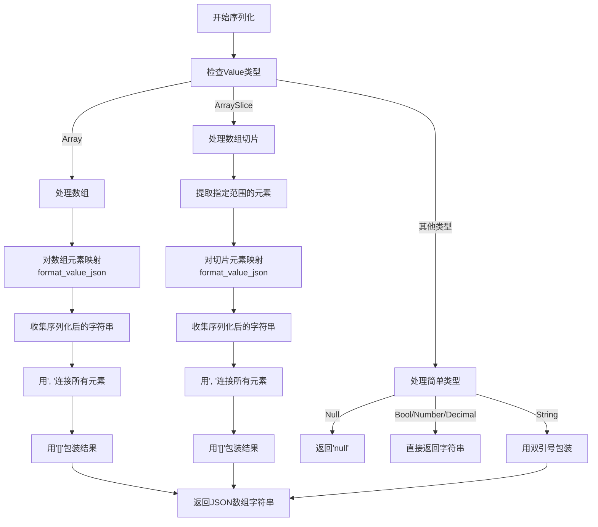
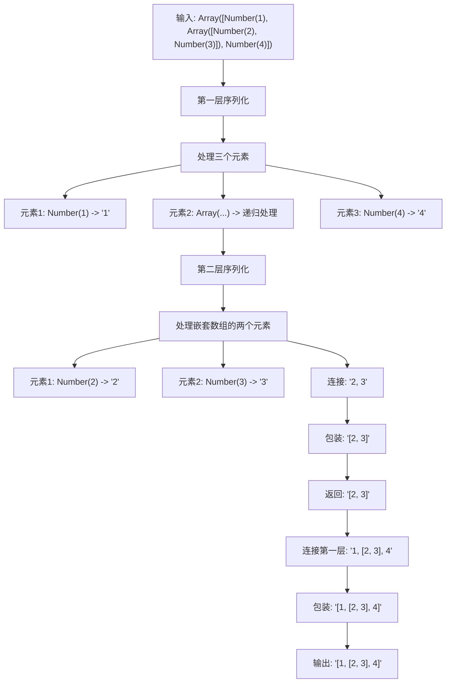

# format_value_json 函数

<cite>
**本文档引用的文件**   
- [api.rs](file://src/api.rs#L219-L241)
- [runtime.rs](file://src/runtime.rs#L6-L33)
</cite>

## 目录
1. [函数概述](#函数概述)
2. [Value类型处理逻辑](#value类型处理逻辑)
3. [递归序列化机制](#递归序列化机制)
4. [特殊类型处理](#特殊类型处理)
5. [复杂值处理示例](#复杂值处理示例)
6. [降级策略](#降级策略)

## 函数概述
`format_value_json`函数负责将`Value`枚举的各个变体转换为JSON字符串表示。该函数通过模式匹配处理`Value`枚举的所有可能变体，实现递归序列化逻辑，是处理嵌套JSON结构的核心函数。

**Section sources**
- [api.rs](file://src/api.rs#L219-L241)

## Value类型处理逻辑
函数对每种`Value`类型采用不同的处理方式：

- **Null**: 输出'null'字符串
- **Bool**: 直接转换为字符串表示
- **Number**: 直接转换为字符串表示
- **Decimal**: 直接转换为字符串表示
- **String**: 添加双引号并保持原样，不进行额外转义处理
- **Array**: 递归调用自身处理每个元素，并用逗号连接
- **ArraySlice**: 递归调用自身处理切片中的每个元素，并用逗号连接

**Section sources**
- [api.rs](file://src/api.rs#L219-L241)
- [runtime.rs](file://src/runtime.rs#L6-L33)

## 递归序列化机制
`Array`和`ArraySlice`类型的递归机制是处理嵌套JSON结构的关键：

**Diagram sources**
- [api.rs](file://src/api.rs#L219-L241)

**Section sources**
- [api.rs](file://src/api.rs#L219-L241)

## 特殊类型处理
对于`Lambda`和`Function`类型，函数采用特殊处理策略：

- **Lambda**: 序列化为占位符字符串"<lambda>"
- **Function**: 序列化为占位符字符串"<function>"

这种处理方式确保了函数类型不会被直接序列化，而是以可识别的占位符形式表示，避免了序列化不可序列化对象的问题。

**Section sources**
- [api.rs](file://src/api.rs#L219-L241)

## 复杂值处理示例
函数能够处理包含数组的复杂值，例如嵌套数组：

**Diagram sources**
- [api.rs](file://src/api.rs#L219-L241)

**Section sources**
- [api.rs](file://src/api.rs#L219-L241)

## 降级策略
当遇到不支持的类型时，函数采用安全的降级策略：

- 所有`Value`枚举的变体都被显式处理，没有遗漏的模式匹配
- `Lambda`和`Function`类型被序列化为占位符而非抛出错误
- 函数设计确保了对所有可能的`Value`类型都有相应的处理逻辑
- 使用穷尽的模式匹配避免了运行时错误

这种降级策略保证了函数的健壮性，即使面对复杂或特殊的数据类型也能产生有效的JSON输出。

**Section sources**
- [api.rs](file://src/api.rs#L219-L241)