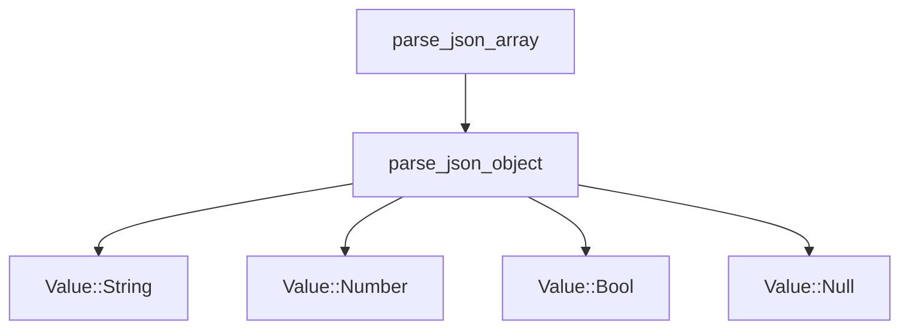
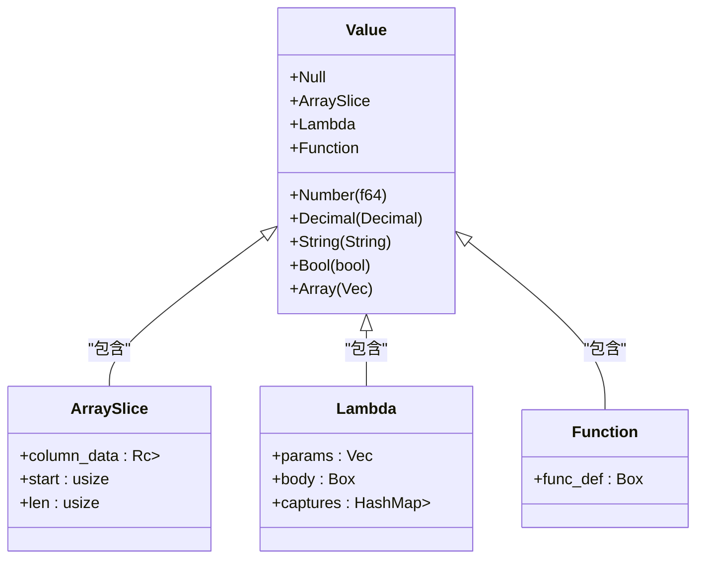

# parse_json_array 函数

<cite>
**Referenced Files in This Document**  
- [api.rs](file://src/api.rs#L61-L103)
- [api.rs](file://src/api.rs#L105-L142)
- [runtime.rs](file://src/runtime.rs#L6-L33)
</cite>

## 目录
1. [函数概述](#函数概述)
2. [输入验证机制](#输入验证机制)
3. [数组对象分割逻辑](#数组对象分割逻辑)
4. [对象解析与结果处理](#对象解析与结果处理)
5. [空数组处理逻辑](#空数组处理逻辑)
6. [边界情况与错误处理](#边界情况与错误处理)
7. [调用关系分析](#调用关系分析)
8. [相关数据结构](#相关数据结构)

## 函数概述

`parse_json_array`函数是DPLang解析系统中的核心JSON处理函数，负责将JSON格式的字符串输入解析为程序内部可处理的数据结构。该函数实现了简化版的JSON解析器，专门用于处理对象数组格式的输入数据。

该函数的主要职责包括：
- 验证输入字符串是否符合JSON数组格式
- 通过字符遍历和大括号计数机制分割数组中的各个JSON对象
- 调用`parse_json_object`函数解析每个分割出的JSON对象
- 处理特殊边界情况，如空数组输入
- 返回标准化的结果结构

**Section sources**
- [api.rs](file://src/api.rs#L61-L103)

## 输入验证机制

`parse_json_array`函数首先对输入字符串进行基本格式验证，确保其符合JSON数组的基本语法要求。

函数执行以下验证步骤：
1. 使用`trim()`方法去除输入字符串首尾的空白字符
2. 检查字符串是否以左方括号`[`开头
3. 检查字符串是否以右方括号`]`结尾

如果输入字符串不满足上述任一条件，函数将立即返回错误信息"JSON 必须是数组格式"。这种验证机制确保了只有格式正确的JSON数组才能进入后续的解析流程。

该验证逻辑体现了防御性编程原则，能够在解析过程的早期阶段捕获明显的格式错误，避免在无效输入上浪费计算资源。

**Section sources**
- [api.rs](file://src/api.rs#L61-L103)

## 数组对象分割逻辑

在通过基本格式验证后，`parse_json_array`函数进入核心的对象分割阶段。该阶段采用字符遍历和大括号计数的策略来准确识别和分割数组中的各个JSON对象。

具体实现机制如下：
1. 提取数组内容：通过`&json_str[1..json_str.len()-1]`去除数组的外层方括号，获取内部内容
2. 字符预处理：将内容字符串转换为字符向量`Vec<char>`，便于索引访问
3. 初始化状态变量：
   - `obj_start`：记录当前对象的起始位置
   - `brace_count`：大括号嵌套层级计数器
4. 遍历字符序列：
   - 遇到`{`时，如果`brace_count`为0，记录当前索引为`obj_start`，然后递增计数器
   - 遇到`}`时，递减计数器，当计数器归零时表示一个完整的JSON对象结束
   - 根据`obj_start`和当前索引提取完整的对象字符串

这种基于计数器的分割方法能够正确处理嵌套对象，确保即使对象内部包含复杂的结构也能被完整识别。

**Section sources**
- [api.rs](file://src/api.rs#L61-L103)

## 对象解析与结果处理

当成功分割出一个完整的JSON对象字符串后，`parse_json_array`函数调用`parse_json_object`函数对其进行解析，并处理解析结果。

处理流程如下：
1. 调用`parse_json_object(&obj_str)`解析提取的对象字符串
2. 如果解析成功（返回`Ok`），将解析得到的`HashMap<String, Value>`添加到结果向量中
3. 如果解析失败（返回`Err`），跳过该对象并继续处理下一个对象

这种"尽力而为"的处理策略确保了即使数组中部分对象格式不正确，其他有效对象仍能被成功解析。函数通过`if let Ok(obj) = parse_json_object(&obj_str)`模式匹配来优雅地处理可能的解析错误，体现了Rust语言的错误处理哲学。

**Section sources**
- [api.rs](file://src/api.rs#L61-L103)

## 空数组处理逻辑

`parse_json_array`函数包含一个特殊的逻辑分支，用于处理空数组或解析结果为空的情况。

当函数完成所有对象的解析后，会检查结果向量是否为空：
- 如果结果向量为空，函数会向其中添加一个空的`HashMap`
- 然后返回包含这个空哈希映射的向量

这一设计决策确保了函数总是返回非空的结果，避免了调用方需要处理空结果的复杂性。这种"最小保证"的设计模式提高了API的可用性，使得调用方可以假设至少会收到一个数据行。

**Section sources**
- [api.rs](file://src/api.rs#L61-L103)

## 边界情况与错误处理

`parse_json_array`函数设计了完善的错误处理机制来应对各种边界情况和异常输入。

### 支持的边界情况

1. **空输入**：输入为空字符串或仅包含空白字符时，验证阶段会失败并返回格式错误
2. **空数组**：输入`[]`时，函数会返回包含一个空哈希映射的向量
3. **单对象数组**：输入`[{"key":"value"}]`时，正常解析并返回包含一个对象的结果
4. **多对象数组**：输入`[{"a":1},{"b":2}]`时，正确分割并解析每个对象
5. **嵌套对象**：输入`[{"outer":{"inner":"value"}}]`时，能够正确处理嵌套结构

### 错误处理机制

1. **格式错误**：非数组格式的输入（如`{}`或`"string"`）会触发"JSON 必须是数组格式"错误
2. **不完整对象**：输入`[{"key":"value"`（缺少闭合括号）会导致解析不完整，但不会崩溃
3. **无效对象**：数组中包含格式错误的对象时，该对象会被跳过，不影响其他对象的解析
4. **混合类型**：目前实现仅支持对象数组，不支持基本类型数组（如`[1,2,3]`）

错误处理采用Rust的`Result`类型系统，将成功结果包装在`Ok`中，将错误信息包装在`Err`中，为调用方提供了清晰的错误处理接口。

**Section sources**
- [api.rs](file://src/api.rs#L61-L103)

## 调用关系分析

`parse_json_array`函数在代码库中扮演着输入解析的入口角色，与其他组件存在明确的调用关系。

### 调用的函数

`parse_json_array`函数直接调用`parse_json_object`函数来解析分割出的单个JSON对象。这种职责分离的设计模式使得代码更加模块化和可维护。

**Diagram sources**
- [api.rs](file://src/api.rs#L61-L103)
- [api.rs](file://src/api.rs#L105-L142)

### 被调用的上下文

虽然`search_symbol`工具未能返回调用关系，但根据函数命名和位置可以推断，`parse_json_array`很可能是被`DPLangInterpreter::execute_json`方法调用，作为JSON输入格式的解析器。

**Section sources**
- [api.rs](file://src/api.rs#L61-L103)

## 相关数据结构

`parse_json_array`函数的返回值依赖于`Value`枚举类型，该类型定义了DPLang运行时支持的所有数据类型。

### Value 枚举

`Value`枚举定义了以下数据类型：
- `Number(f64)`：浮点数
- `Decimal(Decimal)`：高精度小数
- `String(String)`：字符串
- `Bool(bool)`：布尔值
- `Null`：空值
- `Array(Vec<Value>)`：值数组
- `ArraySlice`：数组切片（零拷贝引用）
- `Lambda`：Lambda函数
- `Function`：用户定义函数

**Diagram sources**
- [runtime.rs](file://src/runtime.rs#L6-L33)

### 返回值结构

`parse_json_array`函数返回`Result<Vec<HashMap<String, Value>>, String>`类型，其中：
- 成功时返回包含多个`HashMap<String, Value>`的向量，每个哈希映射代表一个解析后的JSON对象
- 失败时返回描述错误原因的字符串

这种返回类型设计使得调用方能够清晰地区分成功和失败情况，并获取相应的数据或错误信息。

**Section sources**
- [runtime.rs](file://src/runtime.rs#L6-L33)
- [api.rs](file://src/api.rs#L61-L103)