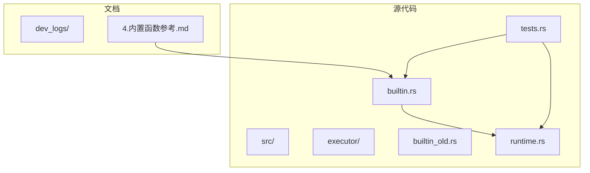
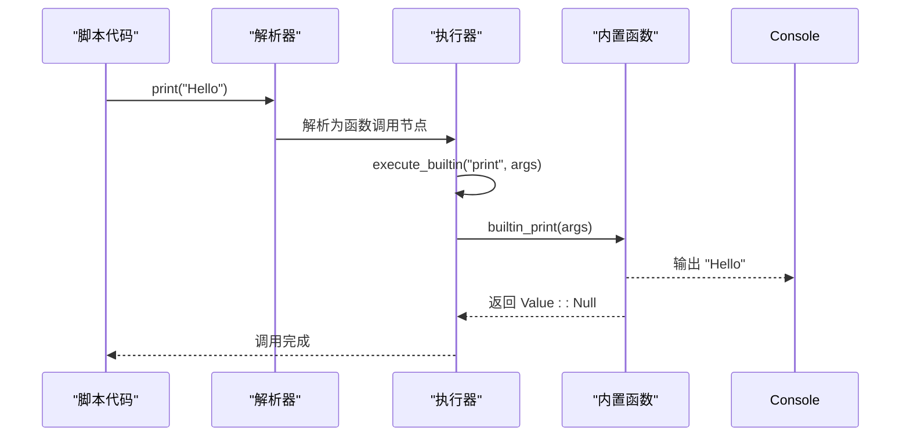
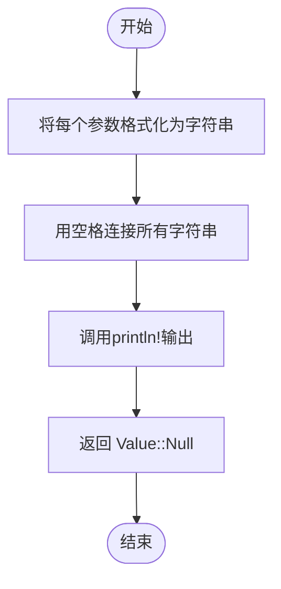
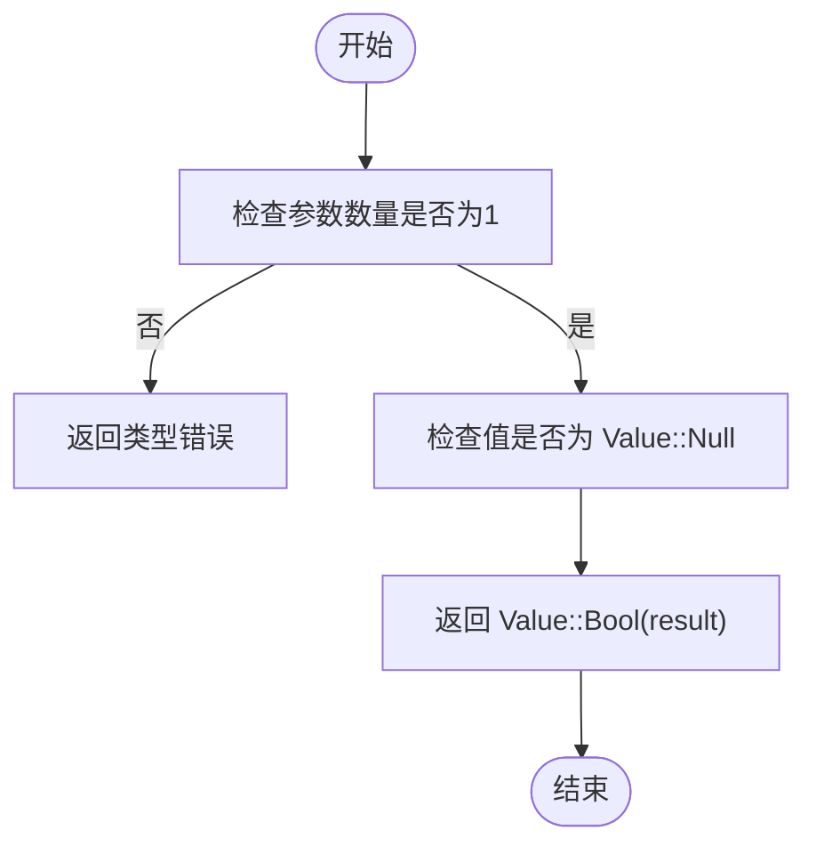
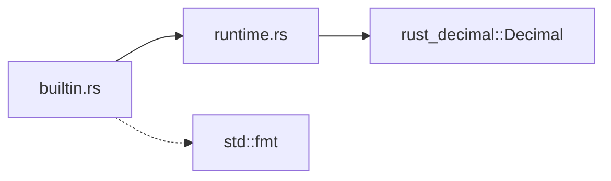

# 工具函数

<cite>
**Referenced Files in This Document**   
- [builtin.rs](file://src/executor/builtin.rs)
- [builtin_old.rs](file://src/executor/builtin_old.rs)
- [runtime.rs](file://src/runtime.rs)
- [tests.rs](file://src/executor/tests.rs)
- [4.内置函数参考.md](file://dev_logs/4.内置函数参考.md)
</cite>

## Table of Contents
1. [Introduction](#introduction)
2. [Project Structure](#project-structure)
3. [Core Components](#core-components)
4. [Architecture Overview](#architecture-overview)
5. [Detailed Component Analysis](#detailed-component-analysis)
6. [Dependency Analysis](#dependency-analysis)
7. [Performance Considerations](#performance-considerations)
8. [Troubleshooting Guide](#troubleshooting-guide)
9. [Conclusion](#conclusion)
10. [Appendices](#appendices) (if necessary)

## Introduction
本文档全面记录了DPLang语言中两个核心工具函数`print`和`is_null`的实现与用途。`print`函数用于输出调试信息，其返回值为`null`；`is_null`函数用于检查一个值是否为`null`。这两个函数在脚本调试和条件判断中扮演着至关重要的角色。文档将详细描述它们的输出格式、性能影响和使用注意事项，并提供在金融脚本开发中的调试模式使用示例以及处理`null`值的最佳实践。

## Project Structure
项目结构清晰，主要分为`dev_logs`（开发日志）和`src`（源代码）两个核心目录。`dev_logs`目录包含了项目的各种设计文档、语法参考和最佳实践，其中`4.内置函数参考.md`文件是理解内置函数的关键文档。`src`目录是代码的主体，`executor`子目录下的`builtin.rs`文件是本分析的核心，它包含了所有内置函数的实现，包括`print`和`is_null`。`runtime.rs`文件定义了运行时值类型`Value`，是理解`null`值处理的基础。`tests.rs`文件则包含了对这些函数的单元测试。

**Diagram sources**
- [builtin.rs](file://src/executor/builtin.rs)
- [builtin_old.rs](file://src/executor/builtin_old.rs)
- [runtime.rs](file://src/runtime.rs)
- [tests.rs](file://src/executor/tests.rs)
- [4.内置函数参考.md](file://dev_logs/4.内置函数参考.md)

**Section sources**
- [builtin.rs](file://src/executor/builtin.rs)
- [builtin_old.rs](file://src/executor/builtin_old.rs)
- [runtime.rs](file://src/runtime.rs)
- [tests.rs](file://src/executor/tests.rs)
- [4.内置函数参考.md](file://dev_logs/4.内置函数参考.md)

## Core Components
`print`和`is_null`函数是DPLang内置函数的核心组成部分，它们在`Executor`结构体的`execute_builtin`方法中被注册和调用。`print`函数通过`println!`宏将参数输出到控制台，而`is_null`函数则通过模式匹配检查`Value`枚举是否为`Value::Null`。这些函数的实现位于`builtin.rs`文件中，其行为在`tests.rs`中有相应的单元测试进行验证。

**Section sources**
- [builtin.rs](file://src/executor/builtin.rs#L39-L44)
- [tests.rs](file://src/executor/tests.rs#L697-L722)

## Architecture Overview
从架构上看，`print`和`is_null`函数是DPLang执行器（Executor）的一部分，它们作为内置函数暴露给脚本层。当脚本调用`print("Hello")`时，解析器会将其解析为一个函数调用表达式，然后执行器的`execute_builtin`方法会根据函数名`"print"`找到对应的`builtin_print`实现并执行。`is_null`函数的调用流程与此类似。这种设计将核心功能与脚本逻辑解耦，保证了语言的可扩展性和安全性。

**Diagram sources**
- [builtin.rs](file://src/executor/builtin.rs#L273-L282)
- [builtin.rs](file://src/executor/builtin.rs#L40-L41)

## Detailed Component Analysis

### print函数分析
`print`函数是一个用于调试的工具函数，它接收任意数量的参数，将它们转换为字符串后用空格连接并输出到标准输出。

#### 实现细节
`print`函数的实现非常直接。它接收一个`&[Value]`类型的参数切片，遍历每个参数，使用`format!("{:?}", v)`将其格式化为字符串，然后用`println!`宏输出。最后，它返回一个`Value::Null`。

**Diagram sources**
- [builtin.rs](file://src/executor/builtin.rs#L274-L281)

**Section sources**
- [builtin.rs](file://src/executor/builtin.rs#L273-L282)
- [tests.rs](file://src/executor/tests.rs#L697-L722)

### is_null函数分析
`is_null`函数用于检查一个值是否为`null`，在数据处理和条件判断中至关重要，尤其是在处理可能缺失的数据时。

#### 实现细节
`is_null`函数首先检查参数数量，确保只有一个参数。然后，它使用Rust的`matches!`宏检查该参数是否为`Value::Null`，并返回一个布尔值封装在`Value::Bool`中。

**Diagram sources**
- [builtin.rs](file://src/executor/builtin.rs#L284-L290)

**Section sources**
- [builtin.rs](file://src/executor/builtin.rs#L284-L291)
- [runtime.rs](file://src/runtime.rs#L115-L118)

## Dependency Analysis
`print`和`is_null`函数依赖于`Value`枚举类型，该类型在`runtime.rs`中定义。`print`函数依赖于Rust的标准库`println!`宏。`is_null`函数的实现逻辑与`Value`类型的`is_null`方法一致，后者在`runtime.rs`中提供，确保了`null`值检查的一致性。

**Diagram sources**
- [builtin.rs](file://src/executor/builtin.rs)
- [runtime.rs](file://src/runtime.rs)

**Section sources**
- [builtin.rs](file://src/executor/builtin.rs)
- [runtime.rs](file://src/runtime.rs)

## Performance Considerations
`print`函数的性能影响主要在于I/O操作。频繁调用`print`会显著降低脚本执行速度，因为它涉及系统调用。因此，它应仅用于调试，避免在生产环境或性能敏感的循环中使用。`is_null`函数的性能开销极小，它只是一个简单的模式匹配，可以安全地在任何地方使用。

## Troubleshooting Guide
在使用`print`函数时，如果发现控制台没有输出，首先检查脚本是否正确执行。`is_null`函数的常见问题是误用，例如`is_null()`（无参数）或`is_null(value1, value2)`（多参数），这会抛出类型错误。应始终确保传递一个且仅一个参数。

**Section sources**
- [builtin.rs](file://src/executor/builtin.rs#L286-L287)
- [builtin.rs](file://src/executor/builtin.rs#L274-L281)

## Conclusion
`print`和`is_null`是DPLang中两个简单但极其重要的工具函数。`print`为开发者提供了强大的调试能力，而`is_null`则是处理不完整数据集的基石。通过理解它们的实现和最佳实践，开发者可以编写出更健壮、更易于调试的金融脚本。