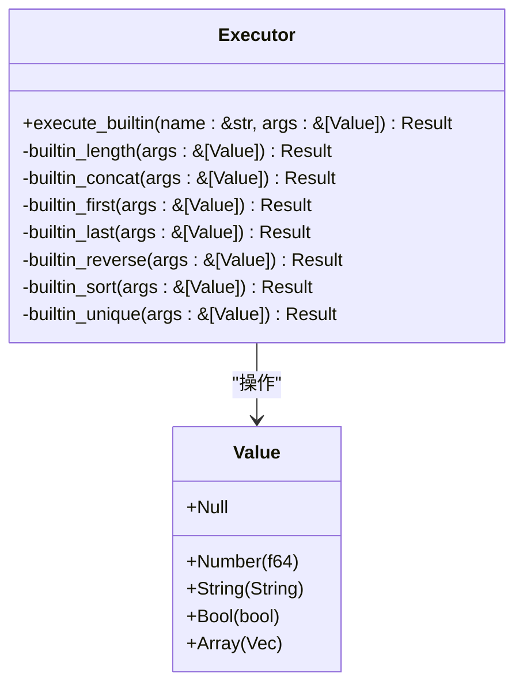
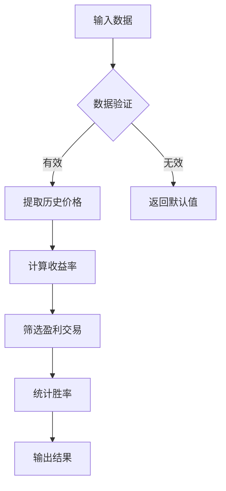

# 数组操作函数

<cite>
**Referenced Files in This Document**   
- [builtin.rs](file://src/executor/builtin.rs)
- [runtime.rs](file://src/runtime.rs)
- [5.完整示例.md](file://dev_logs/5.完整示例.md)
</cite>

## 目录
1. [简介](#简介)
2. [核心数组操作函数](#核心数组操作函数)
3. [length函数](#length函数)
4. [concat函数](#concat函数)
5. [first和last函数](#first和last函数)
6. [reverse函数](#reverse函数)
7. [sort函数](#sort函数)
8. [unique函数](#unique函数)
9. [金融数据处理示例](#金融数据处理示例)
10. [性能分析](#性能分析)

## 简介
本文档详细说明DPLang语言中基于`builtin.rs`实现的核心数组操作函数。这些函数为数据处理提供了基础支持，特别适用于金融时间序列数据的分析和处理场景。文档涵盖函数签名、参数验证规则、返回值特性、时间复杂度分析，并结合金融数据处理场景提供使用示例。

**Section sources**
- [builtin.rs](file://src/executor/builtin.rs#L1-L590)

## 核心数组操作函数
DPLang提供了一套完整的数组操作函数，包括`length`、`concat`、`first`、`last`、`reverse`、`sort`和`unique`。这些函数在`builtin.rs`文件中通过`Executor`结构体的实现提供，构成了数据处理的基础工具集。所有函数都遵循统一的错误处理机制，返回`Result<Value, RuntimeError>`类型，确保了执行的安全性和可预测性。

**Diagram sources**
- [builtin.rs](file://src/executor/builtin.rs#L6-L495)
- [runtime.rs](file://src/runtime.rs#L7-L16)

**Section sources**
- [builtin.rs](file://src/executor/builtin.rs#L1-L590)

## length函数
`length`函数用于获取数组或字符串的长度，是数据验证和循环控制的基础。

### 函数签名与参数验证
- **函数名**: `length`
- **参数数量**: 1个
- **参数类型**: 数组(`Array`)或字符串(`String`)
- **验证规则**: 
  - 参数数量必须为1
  - 参数必须是数组或字符串类型，否则抛出类型错误

### 返回值特性
- 返回`Value::Number`类型的长度值
- 空数组返回0
- 空字符串返回0
- 返回值为`f64`类型，但实际为整数值

### 时间复杂度分析
- **数组**: O(1) - 直接访问`Vec`的`len()`方法
- **字符串**: O(1) - 直接访问`String`的`len()`方法

### 实现细节
函数通过模式匹配处理数组和字符串两种情况，利用Rust标准库的高效实现获取长度。

**Section sources**
- [builtin.rs](file://src/executor/builtin.rs#L128-L139)

## concat函数
`concat`函数实现数组拼接和元素追加功能，支持灵活的数据组合。

### 函数签名与参数验证
- **函数名**: `concat`
- **参数数量**: 可变参数（0个或多个）
- **参数类型**: 数组(`Array`)或任意值
- **验证规则**: 
  - 无参数时返回空数组
  - 支持混合参数：数组和单个元素

### 返回值特性
- 返回`Value::Array`类型的新数组
- 保持原始数组的元素顺序
- 支持嵌套数组的扁平化拼接

### 时间复杂度分析
- **时间复杂度**: O(n) - n为所有输入元素的总数
- **空间复杂度**: O(n) - 需要创建新数组存储结果
- 每个数组元素的`extend`操作为O(k)，k为数组长度
- 单个元素的`push`操作为O(1)

### 实现细节
函数遍历所有参数，对数组类型使用`extend`方法批量添加元素，对单个值使用`push`方法添加。

**Section sources**
- [builtin.rs](file://src/executor/builtin.rs#L141-L157)

## first和last函数
`first`和`last`函数分别用于获取数组的首尾元素，是时间序列分析中的常用操作。

### 函数签名与参数验证
- **函数名**: `first`, `last`
- **参数数量**: 1个
- **参数类型**: 数组(`Array`)
- **验证规则**: 
  - 参数数量必须为1
  - 参数必须是数组类型
  - 空数组返回`Value::Null`

### 返回值特性
- 返回数组中对应位置的元素值
- 保持原始元素的类型和值
- 空数组返回`Null`值，便于后续的空值检查

### 时间复杂度分析
- **时间复杂度**: O(1) - 直接通过索引访问
- **空间复杂度**: O(1) - 仅返回引用，不创建新数据结构
- `first`: 访问索引0的元素
- `last`: 访问索引`len-1`的元素

### 实现细节
函数通过模式匹配确保输入为数组类型，然后直接访问首尾元素，对空数组进行特殊处理。

**Section sources**
- [builtin.rs](file://src/executor/builtin.rs#L396-L412)
- [builtin.rs](file://src/executor/builtin.rs#L414-L430)

## reverse函数
`reverse`函数用于反转数组元素的顺序，常用于时间序列的逆序处理。

### 函数签名与参数验证
- **函数名**: `reverse`
- **参数数量**: 1个
- **参数类型**: 数组(`Array`)
- **验证规则**: 
  - 参数数量必须为1
  - 参数必须是数组类型
  - 空数组或单元素数组原样返回

### 返回值特性
- 返回`Value::Array`类型的新数组
- 元素顺序完全反转
- 原始数组保持不变（函数式编程特性）

### 时间复杂度分析
- **时间复杂度**: O(n) - n为数组长度，需要遍历一半元素进行交换
- **空间复杂度**: O(n) - 创建新数组的副本
- 内部使用`Vec::reverse()`方法，通过首尾交换实现

### 实现细节
函数克隆输入数组，然后调用`reverse()`方法进行原地反转，最后包装为`Value::Array`返回。

**Section sources**
- [builtin.rs](file://src/executor/builtin.rs#L479-L493)

## sort函数
`sort`函数对数组进行排序，支持数字和字符串类型的比较。

### 函数签名与参数验证
- **函数名**: `sort`
- **参数数量**: 1个
- **参数类型**: 数组(`Array`)
- **验证规则**: 
  - 参数数量必须为1
  - 参数必须是数组类型
  - 数组元素应为同类型或可比较类型

### 返回值特性
- 返回`Value::Array`类型的新排序数组
- 支持多种数据类型的排序：
  - 数字：按数值大小升序
  - 字符串：按字典序升序
  - Null值：排在最后
- 原始数组保持不变

### 时间复杂度分析
- **时间复杂度**: O(n log n) - 使用Rust标准库的排序算法
- **空间复杂度**: O(n) - 创建新数组存储排序结果
- 内部使用`Vec::sort_by()`方法，稳定排序算法

### 实现细节
函数通过`sort_by`方法自定义比较逻辑，处理数字、字符串和Null值的比较规则。

**Section sources**
- [builtin.rs](file://src/executor/builtin.rs#L432-L457)

## unique函数
`unique`函数基于深度值比较实现数组去重，确保数据的唯一性。

### 函数签名与参数验证
- **函数名**: `unique`
- **参数数量**: 1个
- **参数类型**: 数组(`Array`)
- **验证规则**: 
  - 参数数量必须为1
  - 参数必须是数组类型

### 返回值特性
- 返回`Value::Array`类型的新数组
- 保持元素的原始顺序（稳定去重）
- 支持深度值比较，包括嵌套数组
- 使用`values_equal`辅助函数进行精确比较

### 时间复杂度分析
- **时间复杂度**: O(n²) - 对每个元素检查是否已存在于结果数组中
- **空间复杂度**: O(n) - 最坏情况下存储所有唯一元素
- 对于包含m个元素的数组，需要进行约n²/2次比较

### 实现细节
函数遍历输入数组，使用`values_equal`函数检查每个元素是否已存在于结果数组中，仅添加新元素。

**Section sources**
- [builtin.rs](file://src/executor/builtin.rs#L459-L477)
- [builtin.rs](file://src/executor/builtin.rs#L576-L587)

## 金融数据处理示例
在金融数据处理场景中，这些数组操作函数可以组合使用来分析时间序列数据。

### 时间序列数据处理
在回测数据处理示例中，`length`、`first`、`last`等函数可用于：
- 计算投资组合的总收益率
- 统计交易次数和胜率
- 分析历史价格序列的特征

**Diagram sources**
- [5.完整示例.md](file://dev_logs/5.完整示例.md#L313-L360)

**Section sources**
- [5.完整示例.md](file://dev_logs/5.完整示例.md#L313-L360)

## 性能分析
对数组操作函数的性能特征进行总结：

| 函数 | 时间复杂度 | 空间复杂度 | 典型应用场景 |
|------|-----------|-----------|-------------|
| length | O(1) | O(1) | 数据验证、循环控制 |
| concat | O(n) | O(n) | 数据合并、结果拼接 |
| first/last | O(1) | O(1) | 时间序列首尾分析 |
| reverse | O(n) | O(n) | 序列逆序处理 |
| sort | O(n log n) | O(n) | 数据排序、排名计算 |
| unique | O(n²) | O(n) | 数据去重、唯一性检查 |

在金融数据处理中，建议：
- 对大数据集避免频繁调用`unique`函数
- 使用`first`和`last`替代索引访问以提高代码可读性
- 在需要保持顺序的去重场景中，考虑使用哈希集合优化性能

**Section sources**
- [builtin.rs](file://src/executor/builtin.rs#L128-L493)