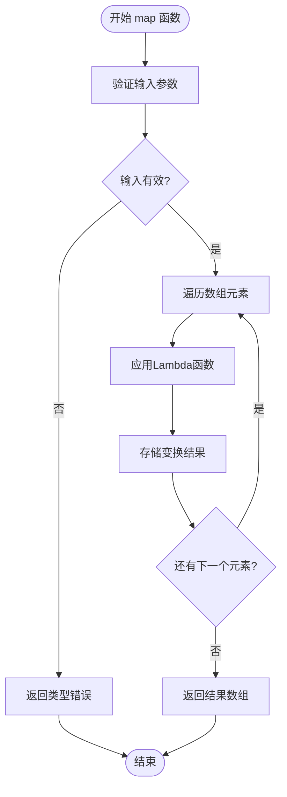
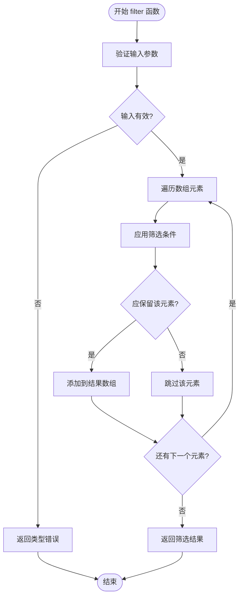
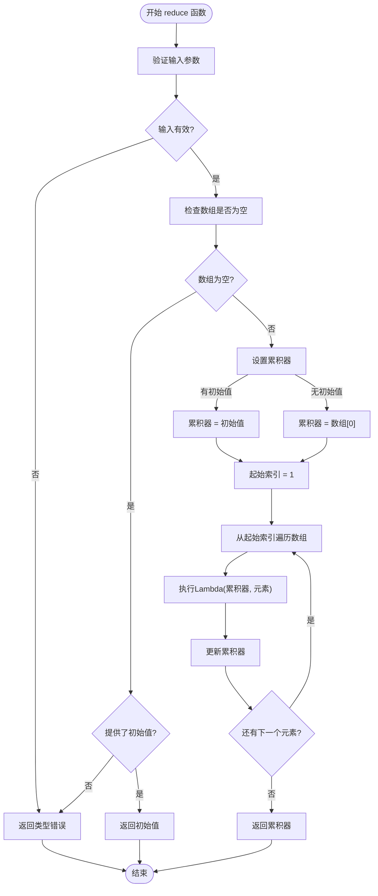

# 高阶函数

<cite>
**本文档引用文件**   
- [builtin.rs](file://src/executor/builtin.rs)
- [expression.rs](file://src/executor/expression.rs)
- [runtime.rs](file://src/runtime.rs)
- [4.内置函数参考.md](file://dev_logs/4.内置函数参考.md)
- [3.类型系统和错误处理.md](file://dev_logs/3.类型系统和错误处理.md)
- [6.最佳实践.md](file://dev_logs/6.最佳实践.md)
</cite>

## 目录
1. [引言](#引言)
2. [核心高阶函数实现](#核心高阶函数实现)
   - [map函数：Lambda变换](#map函数lambda变换)
   - [filter函数：条件筛选](#filter函数条件筛选)
   - [reduce函数：归约聚合](#reduce函数归约聚合)
3. [执行上下文与Lambda机制](#执行上下文与lambda机制)
4. [金融数据流处理应用模式](#金融数据流处理应用模式)
5. [高级用法与复杂示例](#高级用法与复杂示例)
6. [错误处理与性能考量](#错误处理与性能考量)
7. [结论](#结论)

## 引言

DPLang语言提供了一套强大的高阶函数系统，包括`map`、`filter`和`reduce`，这些函数在处理金融数据流时发挥着核心作用。本文档基于`builtin.rs`中的执行逻辑，深入文档化这些高阶函数的实现与使用。我们将详细探讨Lambda参数的绑定机制、执行上下文、错误处理策略，以及它们在金融数据分析中的高级应用模式。

**本文档引用文件**
- [builtin.rs](file://src/executor/builtin.rs#L1-L590)
- [4.内置函数参考.md](file://dev_logs/4.内置函数参考.md#L1-L263)

## 核心高阶函数实现

### map函数：Lambda变换

`map`函数是函数式编程的核心，它对数组中的每个元素应用一个Lambda函数，并返回一个包含变换后结果的新数组。在DPLang中，`map`函数的实现位于`builtin.rs`的`builtin_map`方法中。

该函数接受两个参数：一个数组和一个Lambda函数。它会遍历数组中的每个元素，将元素作为参数传递给Lambda函数执行，并将返回值收集到结果数组中。这种设计使得`map`函数非常适合进行数据转换，例如将价格数组转换为收益率数组。

**图示来源**
- [builtin.rs](file://src/executor/builtin.rs#L160-L188)

**本节来源**
- [builtin.rs](file://src/executor/builtin.rs#L160-L188)
- [4.内置函数参考.md](file://dev_logs/4.内置函数参考.md#L46-L48)

### filter函数：条件筛选

`filter`函数用于根据给定的条件筛选数组中的元素。它同样接受一个数组和一个Lambda函数作为参数。Lambda函数必须返回一个布尔值，`filter`函数会保留所有使Lambda函数返回`true`的元素。

在DPLang的实现中，`filter`函数通过`builtin_filter`方法执行。它会遍历数组，对每个元素执行Lambda函数，并根据返回的布尔值决定是否将该元素添加到结果数组中。这在金融分析中非常有用，例如筛选出所有收盘价高于某个阈值的股票。

**图示来源**
- [builtin.rs](file://src/executor/builtin.rs#L191-L222)

**本节来源**
- [builtin.rs](file://src/executor/builtin.rs#L191-L222)
- [4.内置函数参考.md](file://dev_logs/4.内置函数参考.md#L50-L51)

### reduce函数：归约聚合

`reduce`函数用于将数组中的元素聚合成一个单一的值。它接受一个数组、一个二元Lambda函数和一个可选的初始值。Lambda函数接收两个参数：累积器（accumulator）和当前元素。`reduce`函数从左到右遍历数组，将累积器和当前元素传递给Lambda函数，其返回值成为新的累积器。

在DPLang中，`reduce`函数的实现（`builtin_reduce`）支持初始值。如果提供了初始值，则从数组的第一个元素开始迭代；如果没有提供初始值，则使用数组的第一个元素作为初始累积器，并从第二个元素开始迭代。这使得`reduce`函数可以实现求和、求积、求最大值等聚合操作。

**图示来源**
- [builtin.rs](file://src/executor/builtin.rs#L224-L270)

**本节来源**
- [builtin.rs](file://src/executor/builtin.rs#L224-L270)
- [4.内置函数参考.md](file://dev_logs/4.内置函数参考.md#L53-L55)

## 执行上下文与Lambda机制

### Lambda参数绑定与执行上下文

在DPLang中，Lambda函数的执行依赖于一个精心设计的执行上下文（`ExecutionContext`）。当`map`、`filter`或`reduce`调用`execute_lambda`时，会创建一个新的执行上下文，并将Lambda函数捕获的外部变量（`captures`）和当前的参数绑定到该上下文中。

这个过程确保了Lambda函数可以在其定义的作用域之外安全地访问外部变量，同时避免了副作用。执行完成后，上下文被恢复，保证了外部环境的纯净。这种机制在`expression.rs`的`execute_lambda`方法中实现。

**本节来源**
- [expression.rs](file://src/executor/expression.rs#L290-L325)
- [runtime.rs](file://src/runtime.rs#L26-L31)

### 错误处理策略

DPLang的高阶函数在执行过程中会进行严格的类型检查。如果输入参数不符合预期（例如，第一个参数不是数组，或第二个参数不是Lambda），函数会立即抛出`RuntimeError::type_error`。此外，Lambda函数内部的执行错误（如除零）会通过`ERROR`块进行处理，这在`3.类型系统和错误处理.md`中有详细说明。

**本节来源**
- [builtin.rs](file://src/executor/builtin.rs#L163-L164)
- [3.类型系统和错误处理.md](file://dev_logs/3.类型系统和错误处理.md#L84-L154)

## 金融数据流处理应用模式

高阶函数在金融数据流处理中有着广泛的应用。例如，可以使用`map`函数将原始价格数据转换为对数收益率；使用`filter`函数筛选出波动率高于平均水平的股票；使用`reduce`函数计算投资组合的累计收益。

结合时间序列访问语法（如`close[-1]`），这些函数可以构建复杂的分析模型。例如，计算连续上涨天数的模式可以使用`Range`生成索引，然后用`map`和`reduce`来实现。

**本节来源**
- [4.内置函数参考.md](file://dev_logs/4.内置函数参考.md#L79-L100)
- [6.最佳实践.md](file://dev_logs/6.最佳实践.md#L234-L262)

## 高级用法与复杂示例

### 链式调用与管道操作

DPLang支持使用管道操作符`|>`进行链式调用，这使得数据处理流程更加清晰。例如，可以先`filter`筛选出符合条件的股票，然后`map`计算其收益率，最后`reduce`求和得到总收益。

### 嵌套Lambda与状态累积

虽然Lambda函数本身是纯函数，但可以通过`reduce`函数实现状态累积。例如，在计算移动平均时，`reduce`的累积器可以携带一个包含历史数据的数组。

**本节来源**
- [6.最佳实践.md](file://dev_logs/6.最佳实践.md#L221-L244)
- [4.内置函数参考.md](file://dev_logs/4.内置函数参考.md#L234-L262)

## 错误处理与性能考量

### 安全函数的使用

为了处理可预见的错误（如除零或数组越界），DPLang提供了`safe_div`、`safe_get`等安全函数。在高阶函数的Lambda中使用这些函数，可以避免程序崩溃，提高代码的健壮性。

### 性能优化

在处理大规模数据时，应避免在Lambda中进行重复计算。最佳实践建议将重复使用的计算结果存储在变量中。此外，利用`ArraySlice`的零拷贝特性可以显著提升性能。

**本节来源**
- [builtin.rs](file://src/executor/builtin.rs#L498-L555)
- [6.最佳实践.md](file://dev_logs/6.最佳实践.md#L311-L343)

## 结论

DPLang的高阶函数`map`、`filter`和`reduce`提供了一套强大而灵活的工具，用于处理和分析金融数据流。通过深入理解其底层实现、执行上下文和错误处理机制，开发者可以编写出高效、安全且易于维护的分析脚本。结合管道操作和安全函数，可以构建出复杂而健壮的金融分析模型。