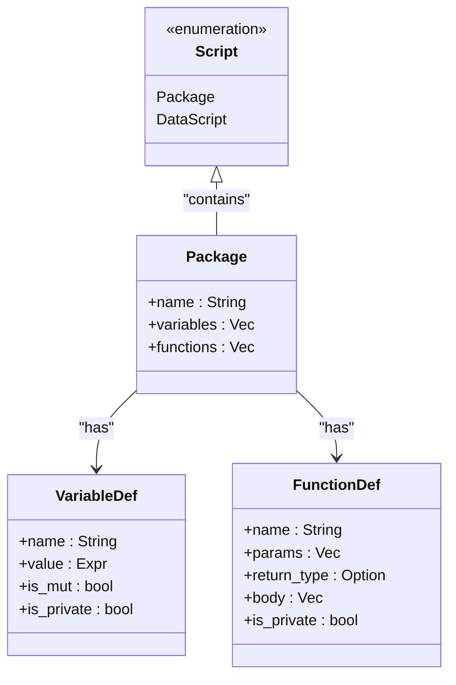

# 包管理系统

<cite>
**本文档引用的文件**   
- [package_loader.rs](file://src/package_loader.rs)
- [lexer.rs](file://src/lexer.rs)
- [parser/mod.rs](file://src/parser/mod.rs)
- [parser/ast.rs](file://src/parser/ast.rs)
- [runtime.rs](file://src/runtime.rs)
- [executor/mod.rs](file://src/executor/mod.rs)
- [indicators.dp](file://packages/indicators.dp)
</cite>

## 目录
1. [简介](#简介)
2. [包加载器实现机制](#包加载器实现机制)
3. [包搜索路径](#包搜索路径)
4. [包缓存策略](#包缓存策略)
5. [脚本中的包导入](#脚本中的包导入)
6. [包文件结构](#包文件结构)
7. [创建和使用自定义包](#创建和使用自定义包)
8. [总结](#总结)

## 简介
DPLang的包管理系统是其功能扩展的核心机制，允许用户通过`.dp`文件组织和复用代码。该系统通过`package_loader.rs`模块实现，提供了从文件系统加载包、支持多种搜索路径以及高效的缓存策略。用户可以在脚本中使用`-- IMPORT --`声明导入包，并访问包内的变量和函数。包文件以`-- PACKAGE --`声明开头，定义了可导出的成员。本文档将详细解释这些机制，并通过具体示例展示如何创建和使用自定义包。

## 包加载器实现机制
包加载器（`PackageLoader`）是DPLang中负责加载和管理包的核心组件。它通过`load_package`方法实现包的加载逻辑，该方法首先检查缓存中是否已存在指定的包，如果存在则直接返回缓存的脚本对象。若缓存中不存在，则调用`find_package_file`方法在预定义的搜索路径中查找对应的`.dp`文件。找到文件后，`load_from_file`方法会读取文件内容，并通过词法分析器（`Lexer`）和语法分析器（`Parser`）将源代码解析为抽象语法树（AST）。最后，加载器会验证解析结果是否为有效的包脚本（即`Script::Package`类型），并将结果缓存以供后续使用。

**Section sources**
- [package_loader.rs](file://src/package_loader.rs#L55-L132)

## 包搜索路径
DPLang的包加载器支持多种搜索路径，以确保包文件能够被正确找到。默认情况下，加载器会添加三个搜索路径：当前目录的`packages`子目录、当前目录本身以及`stdlib`目录（标准库）。这些路径在`add_default_paths`方法中被初始化。用户还可以通过`add_search_path`方法手动添加自定义的搜索路径。当调用`load_package`方法时，加载器会遍历所有搜索路径，查找与包名对应的`.dp`文件。例如，当加载名为`math`的包时，加载器会依次在各个搜索路径中查找`math.dp`文件，直到找到第一个匹配的文件为止。

**Section sources**
- [package_loader.rs](file://src/package_loader.rs#L32-L48)

## 包缓存策略
为了提高性能，DPLang的包加载器采用了缓存策略。加载器内部维护一个`HashMap<String, Script>`类型的缓存，用于存储已加载的包脚本。每当成功加载一个包时，其脚本对象会被插入到缓存中，键为包名。后续对同一包的加载请求将直接从缓存中返回，避免了重复的文件读取和解析操作。这种缓存机制显著减少了I/O开销和解析时间，特别是在频繁导入同一包的场景下。此外，加载器还提供了`clear_cache`方法，允许用户在需要时清空整个缓存，例如在开发过程中修改了包文件后，可以调用此方法强制重新加载。

**Section sources**
- [package_loader.rs](file://src/package_loader.rs#L146-L149)

## 脚本中的包导入
在DPLang脚本中，用户可以通过`-- IMPORT --`声明来导入所需的包。这一声明在词法分析阶段被识别为`TokenType::Import`，并在语法分析阶段由`parse_data_script`方法处理。具体来说，当解析器遇到`-- IMPORT --`声明时，它会提取声明中的包列表（如`math, utils`），并将其解析为一个字符串数组。这些包名随后被传递给包加载器进行加载。加载后的包脚本会被执行，其导出的变量和函数将被注入到当前脚本的执行上下文中，从而可以在脚本主体中直接访问。例如，导入`indicators`包后，可以直接调用其中定义的`MA`或`RSI`等函数。

**Section sources**
- [lexer.rs](file://src/lexer.rs#L21)
- [parser/mod.rs](file://src/parser/mod.rs#L95-L103)

## 包文件结构
DPLang的包文件以`.dp`为扩展名，其结构由`Script::Package`枚举定义。每个包文件必须以`package`关键字开头，后跟包名，例如`package math`。包文件中可以定义包级变量和函数，这些成员在包被导入时会被执行并暴露给导入者。包级变量通过`VariableDef`结构表示，包含变量名、值、是否可变以及是否私有等属性。包级函数则通过`FunctionDef`结构表示，包含函数名、参数列表、返回类型、函数体以及是否私有等信息。私有成员（以`_`开头的名称）不会被导出，只能在包内部访问。包文件的结构确保了代码的模块化和封装性。



**Diagram sources**
- [parser/ast.rs](file://src/parser/ast.rs#L247-L253)

**Section sources**
- [parser/ast.rs](file://src/parser/ast.rs#L245-L265)

## 创建和使用自定义包
创建和使用自定义包是DPLang功能扩展的重要方式。以下是一个完整的示例，展示如何创建一个名为`indicators`的自定义包，并在脚本中使用它。

首先，创建一个名为`indicators.dp`的包文件，内容如下：
```dp
package indicators

# 计算简单移动平均
def MA(data, period):
    return sum(data[-(period-1):0]) / period

# 计算相对强弱指数
def RSI(prices, period):
    # RSI计算逻辑
    ...
```

然后，在主脚本中导入并使用该包：
```dp
-- IMPORT indicators --

close = [100, 105, 110, 108, 112]
ma5 = MA(close, 5)
rsi14 = RSI(close, 14)
```

在这个示例中，`indicators.dp`文件定义了一个包含`MA`和`RSI`函数的包。主脚本通过`-- IMPORT indicators --`声明导入该包，并直接调用其中的函数。包加载器会自动在`packages/`目录下找到`indicators.dp`文件，解析并执行其内容，将`MA`和`RSI`函数注入到当前上下文中。这种方式使得代码复用变得简单而高效，是DPLang作为功能扩展核心机制的重要体现。

**Section sources**
- [indicators.dp](file://packages/indicators.dp#L1-L241)

## 总结
DPLang的包管理系统通过`package_loader.rs`模块实现了高效、灵活的包加载机制。它支持多种搜索路径和缓存策略，确保了包文件的快速定位和加载。用户可以通过`-- IMPORT --`声明在脚本中导入包，并访问包内的变量和函数。包文件以`-- PACKAGE --`声明开头，定义了可导出的成员，支持私有和公有成员的区分。通过创建和使用自定义包，用户可以轻松地组织和复用代码，极大地提升了开发效率和代码的可维护性。这一系统是DPLang作为功能扩展核心机制的重要组成部分。