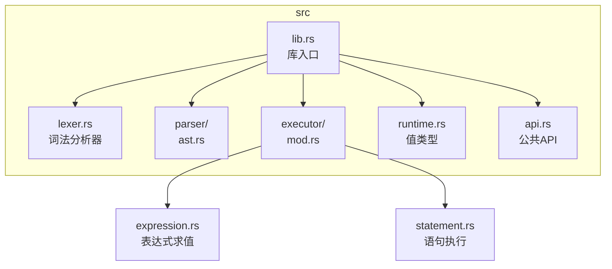

# 开发者指南

<cite>
**本文档引用的文件**   
- [lib.rs](file://src/lib.rs)
- [lexer.rs](file://src/lexer.rs)
- [parser/ast.rs](file://src/parser/ast.rs)
- [executor/mod.rs](file://src/executor/mod.rs)
- [executor/expression.rs](file://src/executor/expression.rs)
- [executor/statement.rs](file://src/executor/statement.rs)
- [runtime.rs](file://src/runtime.rs)
- [api.rs](file://src/api.rs)
- [dev_logs/7.解释器实现设计.md](file://dev_logs/7.解释器实现设计.md)
</cite>

## 目录
1. [项目结构概览](#项目结构概览)
2. [核心模块职责](#核心模块职责)
3. [解释器模式实现](#解释器模式实现)
4. [构建与测试](#构建与测试)
5. [贡献流程](#贡献流程)

## 项目结构概览

DPLang 项目采用清晰的模块化结构，核心代码位于 `src` 目录下，主要分为词法分析、语法分析、执行器和运行时环境等模块。`lib.rs` 作为库的入口，通过 `pub mod` 声明了所有对外公开的模块，并通过 `pub use` 导出了公共 API，使得外部使用者可以方便地访问解释器的核心功能。



**图示来源**
- [lib.rs](file://src/lib.rs#L1-L14)
- [项目结构](file://.)

## 核心模块职责

### lib.rs：库的入口

`lib.rs` 是 DPLang 作为 Rust 库的根模块。它不包含具体实现，而是负责模块的组织和 API 的导出。它通过 `pub mod` 将 `lexer`、`parser`、`executor` 等核心模块声明为公共模块，并通过 `pub use` 将 `api::DPLangInterpreter` 和 `parse_csv`、`format_output_csv` 等关键类型和函数提升到库的根命名空间，简化了外部调用。

**模块来源**
- [lib.rs](file://src/lib.rs#L1-L14)

### lexer（词法分析器）

`lexer.rs` 模块负责将源代码字符串分解为一系列有意义的标记（Token）。它定义了 `TokenType` 枚举，涵盖了关键字（如 `if`, `return`）、标识符、字面量、运算符和特殊声明（如 `-- INPUT --`）。`Lexer` 结构体实现了 `tokenize` 方法，能够处理缩进、中文标识符和注释，是解释器的第一道处理工序。

**模块来源**
- [lexer.rs](file://src/lexer.rs#L5-L76)

### parser（语法分析器与AST）

`parser` 模块包含 `ast.rs` 文件，定义了抽象语法树（AST）的数据结构。`Expr` 和 `Stmt` 枚举是 AST 的核心，分别代表表达式和语句。`Parser` 会将 `Lexer` 生成的 Token 流解析成 `Script` 结构，该结构是 AST 的根节点，包含了包定义或数据处理脚本的所有信息。

**模块来源**
- [parser/ast.rs](file://src/parser/ast.rs#L7-L265)

### executor（执行器）

`executor` 模块是解释器的执行引擎。`mod.rs` 定义了 `Executor` 结构体，它持有 `ExecutionContext` 并提供了 `execute_data_script` 和 `execute_package_script` 方法。`expression.rs` 和 `statement.rs` 分别实现了表达式求值和语句执行的具体逻辑，通过递归遍历 AST 节点来完成计算。

**模块来源**
- [executor/mod.rs](file://src/executor/mod.rs#L25-L34)
- [executor/expression.rs](file://src/executor/expression.rs#L8-L259)
- [executor/statement.rs](file://src/executor/statement.rs#L7-L67)

### runtime（运行时环境）

`runtime.rs` 模块定义了 `Value` 枚举，这是解释器中所有值的运行时表示，包括数字、字符串、布尔值、数组和 `Null`。它还实现了 `Value` 上的各种运算方法（如 `add`, `sub`），这些方法在执行器求值时被调用，确保了类型安全和正确的计算行为。

**模块来源**
- [runtime.rs](file://src/runtime.rs#L9-L171)

## 解释器模式实现

### AST设计

根据 `dev_logs/7.解释器实现设计.md` 文档，DPLang 的 AST 设计遵循解释器模式的经典结构。`Expr` 枚举中的每个变体（如 `Binary`, `Unary`, `Call`）都代表一种语言结构。例如，`Binary` 节点包含 `left` 和 `right` 两个 `Box<Expr>`，形成了树状的递归结构，能够精确地表示复杂的表达式。

```mermaid
classDiagram
class Expr {
<<enum>>
Number(f64)
String(String)
Bool(bool)
Null
Identifier(String)
Array(Vec~Expr~)
Binary{left, op, right}
Unary{op, operand}
Call{callee, args}
}
class Stmt {
<<enum>>
Assignment{name, value}
If{condition, then_block, else_block}
Return(Expr)
Expression(Expr)
}
class Script {
<<enum>>
Package{name, variables, functions}
DataScript{input, output, body}
}
Stmt "1" *-- "0..*" Expr : 包含
Script "1" *-- "0..*" Stmt : 包含
```

**图示来源**
- [parser/ast.rs](file://src/parser/ast.rs#L7-L178)
- [dev_logs/7.解释器实现设计.md](file://dev_logs/7.解释器实现设计.md#L179-L350)

### 执行器遍历AST

执行器通过递归下降的方式遍历 AST。`Executor` 的 `execute_stmt` 方法接收一个 `Stmt` 引用，根据其类型进行匹配。例如，当遇到 `Stmt::Assignment` 时，它会先调用 `execute_expr` 计算右侧表达式的值，然后将结果存储到执行上下文中。`execute_expr` 方法则负责处理所有类型的表达式，如 `Binary` 表达式会递归计算左右操作数，然后调用 `Value` 的 `add` 等方法进行运算。

**代码来源**
- [executor/statement.rs](file://src/executor/statement.rs#L9-L67)
- [executor/expression.rs](file://src/executor/expression.rs#L10-L259)

## 构建与测试

### 构建项目

DPLang 使用 Cargo 作为构建工具。要构建项目，请确保已安装 Rust 工具链，然后在项目根目录下运行：

```bash
cargo build
```

这将编译库并生成可执行文件。`Cargo.toml` 文件中定义了 `rust_decimal` 和 `csv` 等依赖项。

### 运行测试

项目包含单元测试，可以通过以下命令运行：

```bash
cargo test
```

测试覆盖了词法分析、语法分析和运行时值的运算等核心功能。例如，`lexer.rs` 中的 `test_chinese_identifier` 测试确保了中文标识符的正确解析。

**文件来源**
- [Cargo.toml](file://Cargo.toml#L1-L15)
- [lexer.rs](file://src/lexer.rs#L636-L657)

## 贡献流程

我们欢迎社区贡献！贡献流程如下：
1.  **Fork 仓库**：在 GitHub 上 Fork DPLang 仓库。
2.  **创建分支**：基于 `main` 分支创建新特性或修复分支。
3.  **编写代码**：遵循代码风格，添加必要的测试。
4.  **提交 Pull Request**：提交 PR 并详细描述更改内容。

我们特别鼓励对核心功能的开发和优化，例如：
- 增强 `lexer` 对新语法的支持。
- 优化 `executor` 的性能，特别是数组运算的效率。
- 扩展 `runtime` 的 `Value` 类型，支持更多数据结构。

**文件来源**
- [README.md](file://README.md)
- [CONTRIBUTING.md](file://CONTRIBUTING.md) (如果存在)