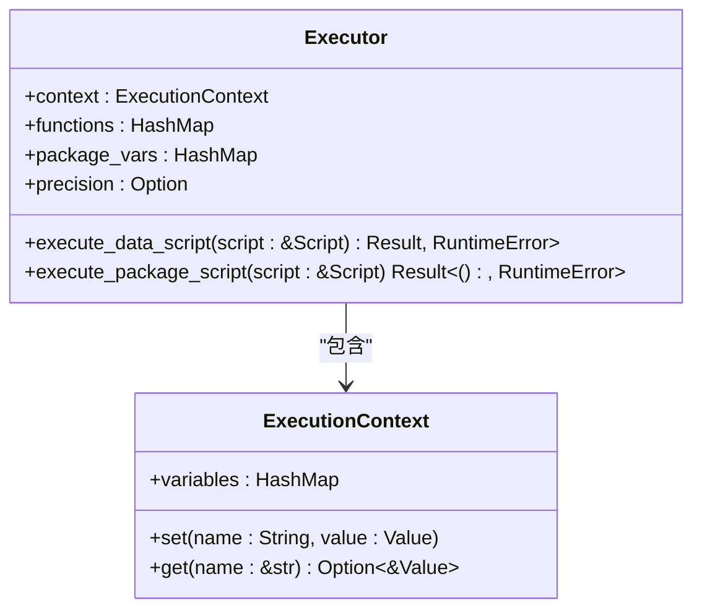
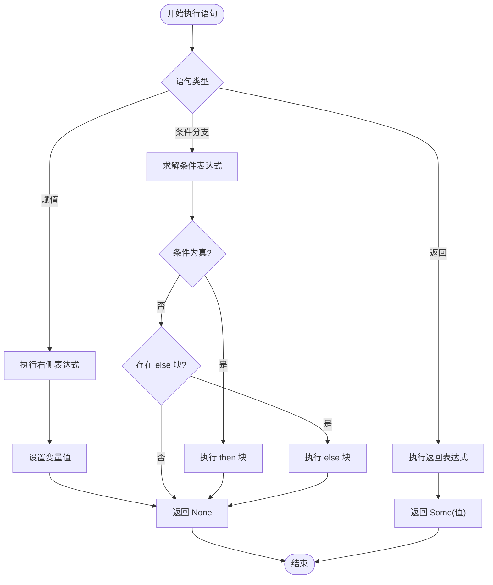
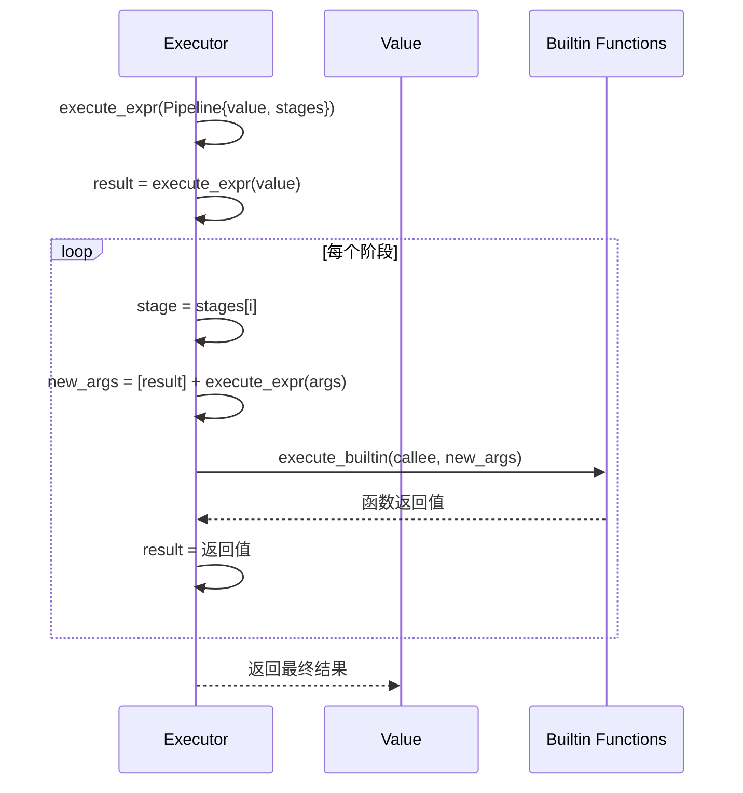
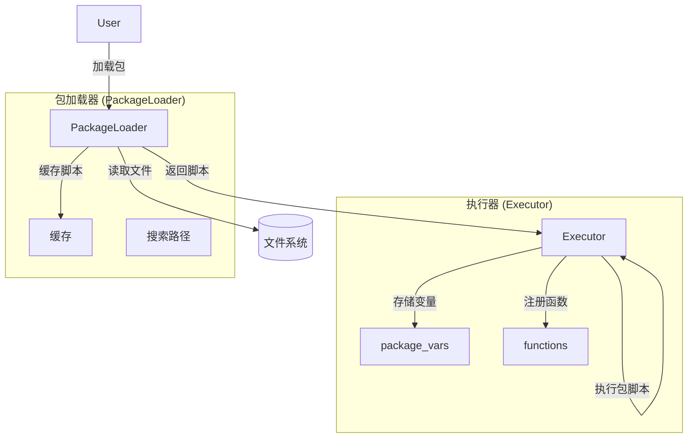

# 执行器实现

<cite>
**Referenced Files in This Document**   
- [src/executor/mod.rs](file://src/executor/mod.rs)
- [src/executor/context.rs](file://src/executor/context.rs)
- [src/executor/statement.rs](file://src/executor/statement.rs)
- [src/executor/expression.rs](file://src/executor/expression.rs)
- [src/executor/builtin.rs](file://src/executor/builtin.rs)
- [src/package_loader.rs](file://src/package_loader.rs)
</cite>

## 目录
1. [执行器结构体](#执行器结构体)
2. [执行上下文与作用域管理](#执行上下文与作用域管理)
3. [语句执行流程](#语句执行流程)
4. [表达式求值与管道操作](#表达式求值与管道操作)
5. [内置函数调用机制](#内置函数调用机制)
6. [包级变量与函数集成](#包级变量与函数集成)
7. [精度设置与错误处理](#精度设置与错误处理)

## 执行器结构体

`Executor` 结构体是 DPLang 解释器的核心执行组件，负责遍历抽象语法树（AST）并执行相应的语句。该结构体包含四个核心字段，共同构成了执行环境的基础。

- **context**: `ExecutionContext` 类型的字段，表示当前的执行上下文，用于存储和管理变量。
- **functions**: `HashMap<String, FunctionDef>` 类型的字段，作为函数注册表，存储所有已定义的包级函数。
- **package_vars**: `HashMap<String, Value>` 类型的字段，用于存储包级变量。
- **precision**: `Option<PrecisionSetting>` 类型的字段，用于存储当前的精度设置，影响数值计算的结果。

执行器通过 `new` 方法初始化，创建一个包含空上下文、空函数表、空变量表和无精度设置的实例。其主要功能通过 `execute_data_script` 和 `execute_package_script` 等方法对外暴露，分别用于执行数据脚本和包脚本。

**Section sources**
- [src/executor/mod.rs](file://src/executor/mod.rs#L25-L44)

## 执行上下文与作用域管理

`ExecutionContext` 结构体是执行器中负责变量存储和作用域管理的关键组件。它通过一个 `HashMap<String, Value>` 来存储变量名与值的映射关系，实现了基本的变量存取功能。

该结构体提供了 `set` 和 `get` 两个核心方法。`set` 方法用于将一个变量名和其对应的值存入上下文中，如果变量已存在，则会覆盖其旧值。`get` 方法则根据变量名从上下文中检索值，如果变量不存在，则返回 `None`。

执行器在执行用户定义函数（`execute_user_function`）和 Lambda 函数（`execute_lambda`）时，会利用 `ExecutionContext` 实现作用域隔离。具体做法是：在函数执行前，先保存当前上下文的所有变量；然后在函数体执行期间，将参数和局部变量绑定到上下文中；函数执行完毕后，再将上下文恢复到调用前的状态。这种“保存-修改-恢复”的模式确保了函数内部的变量修改不会影响到外部作用域，从而实现了安全的作用域管理。

**Diagram sources**
- [src/executor/mod.rs](file://src/executor/mod.rs#L25-L34)
- [src/executor/context.rs](file://src/executor/context.rs#L7-L10)

**Section sources**
- [src/executor/context.rs](file://src/executor/context.rs#L6-L26)
- [src/executor/expression.rs](file://src/executor/expression.rs#L310-L323)
- [src/executor/expression.rs](file://src/executor/expression.rs#L360-L362)

## 语句执行流程

执行器通过 `execute_stmt` 方法来遍历和执行 AST 中的语句节点。该方法接收一个 `Stmt` 枚举，根据其不同的变体（variant）执行相应的逻辑。

- **变量赋值 (Assignment)**: 当遇到赋值语句时，执行器首先递归调用 `execute_expr` 求解右侧表达式的值，然后调用 `context.set` 将该值绑定到左侧的变量名上。
- **条件分支 (If)**: 对于 `if` 语句，执行器首先求解条件表达式的布尔值。如果为真，则按顺序执行 `then` 块中的所有语句；如果为假且存在 `else` 块，则执行 `else` 块中的语句。执行过程中，如果遇到 `return` 语句，则立即返回结果。
- **返回语句 (Return)**: 遇到 `return` 语句时，执行器会求解其表达式，并将结果包装在 `Some` 中返回，从而终止当前脚本的执行。
- **表达式语句 (Expression)**: 对于独立的表达式（如函数调用），执行器会求解其值，但不返回任何结果（返回 `Ok(None)`）。

整个语句体的执行由 `execute_body` 方法控制，它会按顺序遍历语句列表，直到遇到一个返回结果的语句（如 `return`）或所有语句执行完毕。

**Diagram sources**
- [src/executor/statement.rs](file://src/executor/statement.rs#L7-L67)

**Section sources**
- [src/executor/statement.rs](file://src/executor/statement.rs#L7-L67)

## 表达式求值与管道操作

表达式求值是执行器的核心功能之一，由 `execute_expr` 方法实现。该方法是一个递归函数，能够处理各种类型的表达式节点。

- **基本类型**: 对于数字、字符串、布尔值和空值，直接构造对应的 `Value` 枚举并返回。
- **标识符**: 处理变量名时，会先检查是否为以 `_` 开头的内置变量（如 `_index`, `_total`），这些变量的值由 `get_builtin_variable` 方法从数据流执行器中获取。对于普通变量，则从 `context` 中查找。
- **二元/一元操作**: 递归求解操作数的值，然后调用 `Value` 类型上的相应方法（如 `add`, `sub`, `neg`）进行计算。
- **函数调用**: 遇到函数调用表达式时，会调用 `execute_call` 方法进行处理。

**管道表达式 (Pipeline)** 的执行逻辑是 `execute_expr` 中的一个重要部分。当执行器遇到 `value |> func(arg)` 这样的管道时，它会：
1.  首先求解 `value` 的值。
2.  然后遍历管道中的每一个阶段（stage）。
3.  对于每个阶段，它会将前一个阶段的结果作为第一个参数，与阶段中函数调用的其他参数合并，形成新的参数列表。
4.  最后调用 `execute_builtin` 执行该函数，并将结果作为下一个阶段的输入。

这种机制使得数据可以像流水线一样被一系列函数处理，极大地提高了代码的可读性和表达能力。

**Diagram sources**
- [src/executor/expression.rs](file://src/executor/expression.rs#L231-L245)

**Section sources**
- [src/executor/expression.rs](file://src/executor/expression.rs#L8-L365)

## 内置函数调用机制

执行器通过 `execute_builtin` 方法来调用内置函数。该方法接收函数名和参数列表，利用 `match` 语句进行分发，调用相应的具体实现函数。

内置函数被组织成几个类别：
- **基础数据操作**: 如 `sum`, `max`, `min`, `length`, `concat`。
- **高阶函数**: 如 `map`, `filter`, `reduce`，它们接受 Lambda 函数作为参数，对数组进行变换。
- **数组构造与工具**: 如 `Range`, `Array`, `sort`, `unique`。
- **安全函数**: 如 `safe_div`, `safe_get`, `safe_number`，用于处理潜在的运行时错误。

当 `execute_call` 方法无法在上下文、包变量或函数注册表中找到被调用的函数时，它会最终调用 `execute_builtin`。如果 `execute_builtin` 也无法找到匹配的函数，则会抛出“未定义函数”的运行时错误。这种查找顺序确保了用户定义的函数优先于内置函数，提供了良好的扩展性。

**Section sources**
- [src/executor/builtin.rs](file://src/executor/builtin.rs#L6-L47)
- [src/executor/expression.rs](file://src/executor/expression.rs#L287-L288)

## 包级变量与函数集成

执行器与 `PackageLoader` 组件紧密集成，以支持包的加载和使用。`PackageLoader` 负责从文件系统中查找并解析 `.dp` 文件，将包脚本加载到内存中。

当执行器需要执行一个包脚本时，它会调用 `execute_package_script` 方法。该方法会遍历包定义中的变量和函数：
- 对于每个包级变量，执行器会求解其初始值表达式，并将其同时存入 `package_vars` 映射和当前的 `context` 中，确保在后续的脚本执行中可以访问。
- 对于每个包级函数，执行器会将其函数定义（`FunctionDef`）存入 `functions` 注册表中。

对于包级变量的访问，执行器通过 `MemberAccess` 表达式（如 `math.PI`）来实现。在 `execute_expr` 中，当遇到成员访问时，它会将包名和成员名拼接成一个完整的键（如 `math.PI`），然后在 `package_vars` 映射中查找对应的值。

**Diagram sources**
- [src/executor/mod.rs](file://src/executor/mod.rs#L98-L110)
- [src/executor/expression.rs](file://src/executor/expression.rs#L248-L257)
- [src/package_loader.rs](file://src/package_loader.rs#L56-L80)

**Section sources**
- [src/executor/mod.rs](file://src/executor/mod.rs#L97-L115)
- [src/executor/expression.rs](file://src/executor/expression.rs#L248-L257)
- [src/package_loader.rs](file://src/package_loader.rs#L11-L80)

## 精度设置与错误处理

执行器支持通过 `precision` 字段进行精度设置。当执行数据脚本时，`execute_data_script` 方法会捕获脚本中定义的 `precision` 设置，并将其存储在执行器中。在脚本执行完毕后，`apply_precision_to_value` 方法会被调用，以确保返回值符合指定的精度要求。

该方法会检查当前的精度设置。如果存在设置，它会递归地遍历返回值（特别是数组类型），对其中的 `Decimal` 类型值应用指定的小数位数精度，从而保证数值计算结果的一致性。

执行器还实现了完善的错误处理机制。当执行过程中发生错误（如变量未定义、函数未定义、类型错误等）时，会抛出 `RuntimeError`。如果脚本中定义了 `ERROR` 块，执行器会在捕获到错误后，将错误信息存入 `__error__` 变量，并执行 `ERROR` 块中的语句，为用户提供自定义错误处理的能力。

**Section sources**
- [src/executor/mod.rs](file://src/executor/mod.rs#L47-L83)
- [src/executor/mod.rs](file://src/executor/mod.rs#L123-L148)
- [src/executor/statement.rs](file://src/executor/statement.rs#L56-L71)