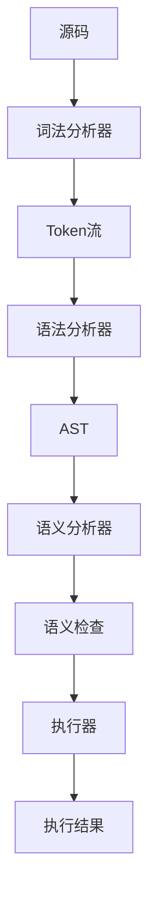
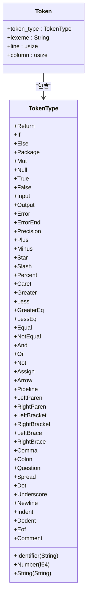
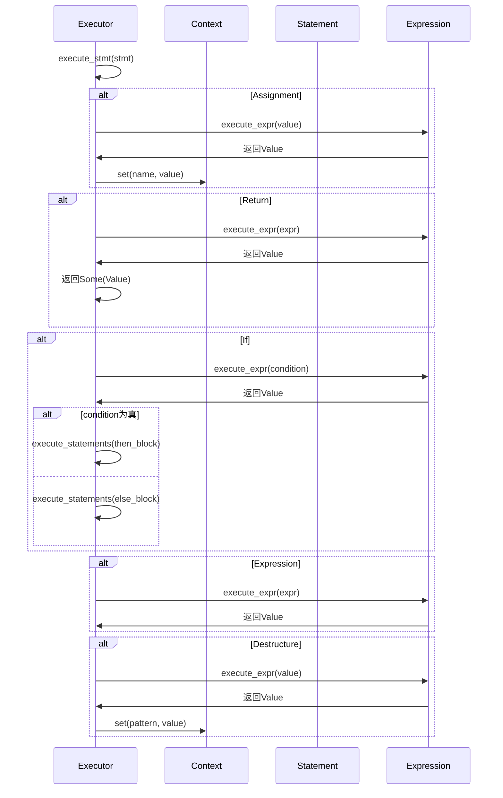
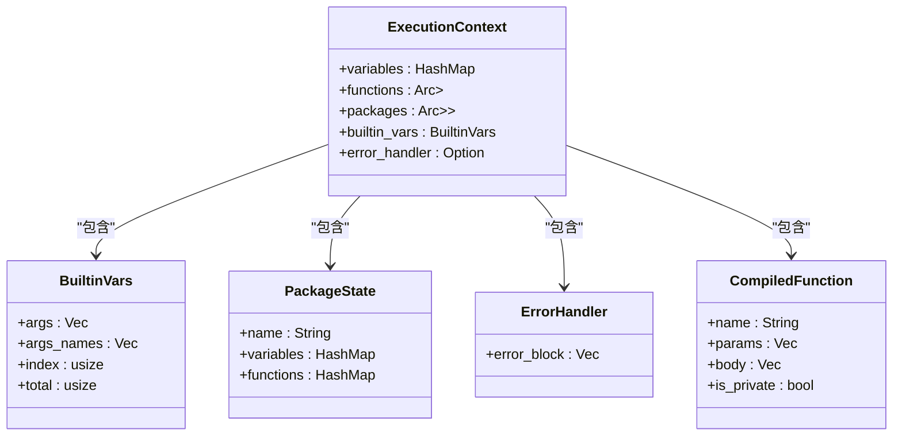
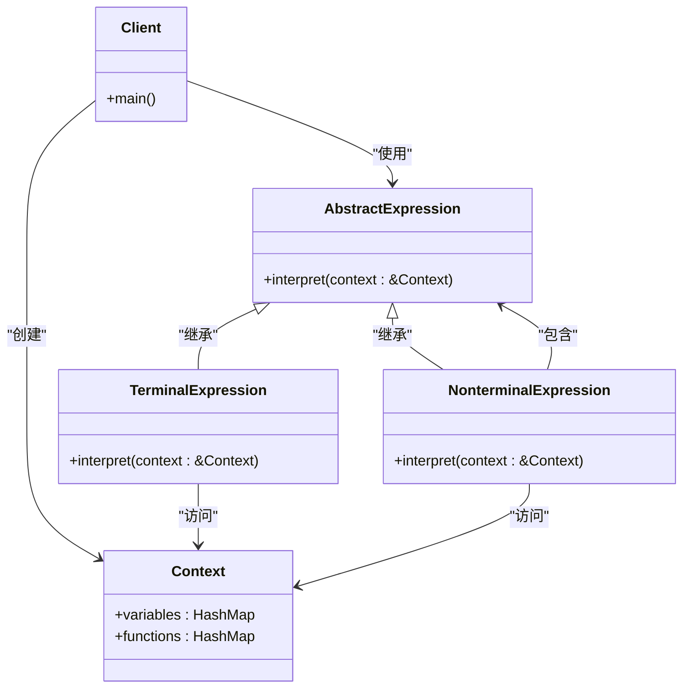

# 核心实现设计

<cite>
**本文档引用的文件**   
- [lexer.rs](file://src/lexer.rs)
- [parser/ast.rs](file://src/parser/ast.rs)
- [parser/mod.rs](file://src/parser/mod.rs)
- [semantic.rs](file://src/semantic.rs)
- [executor/expression.rs](file://src/executor/expression.rs)
- [executor/statement.rs](file://src/executor/statement.rs)
- [executor/mod.rs](file://src/executor/mod.rs)
- [runtime.rs](file://src/runtime.rs)
- [dev_logs/7.解释器实现设计.md](file://dev_logs/7.解释器实现设计.md)
</cite>

## 目录
1. [总体架构](#总体架构)
2. [词法分析器（Lexer）](#词法分析器lexer)
3. [语法分析器（Parser）](#语法分析器parser)
4. [语义分析器（Semantic Analyzer）](#语义分析器semantic-analyzer)
5. [执行器（Executor）](#执行器executor)
6. [AST节点设计](#ast节点设计)
7. [解释器模式应用](#解释器模式应用)

## 总体架构

DPLang解释器采用经典的编译器架构，将源代码转换为可执行结果的过程分为多个阶段。整个流程从源码输入开始，依次经过词法分析、语法分析、语义分析，最终由执行器完成代码的执行。



**图示来源**
- [dev_logs/7.解释器实现设计.md](file://dev_logs/7.解释器实现设计.md#L5-L41)

## 词法分析器（Lexer）

词法分析器负责将源代码字符串转换为Token流。它识别源码中的关键字、标识符、字面量和运算符等基本元素。

### Token定义

词法分析器定义了多种Token类型，包括关键字、标识符、字面量、运算符和特殊标记。



**图示来源**
- [dev_logs/7.解释器实现设计.md](file://dev_logs/7.解释器实现设计.md#L50-L121)
- [src/lexer.rs](file://src/lexer.rs#L7-L76)

### 实现要点

词法分析器实现了以下关键功能：
- 支持中文标识符（变量名、函数名）
- 缩进敏感（使用Indent/Dedent Token）
- 注释处理（`#` 开头，跳过）
- 特殊声明识别（`-- INPUT --`、`-- ERROR --` 等）
- 管道运算符 `|>` 和箭头 `->`

**代码来源**
- [src/lexer.rs](file://src/lexer.rs#L121-L680)

## 语法分析器（Parser）

语法分析器负责将Token流转换为抽象语法树（AST）。它使用递归下降解析方法，正确处理运算符优先级。

### AST节点定义

语法分析器定义了表达式和语句的AST节点结构。

```mermaid
classDiagram
class Expr {
+Number(f64)
+String(String)
+Bool(bool)
+Null
+Identifier(String)
+Array(Vec<Expr>)
+Binary{left : Box<Expr>, op : BinaryOp, right : Box<Expr>}
+Unary{op : UnaryOp, operand : Box<Expr>}
+Ternary{condition : Box<Expr>, then_expr : Box<Expr>, else_expr : Box<Expr>}
+Call{callee : String, args : Vec<Expr>}
+MemberAccess{object : String, member : String}
+Index{array : Box<Expr>, index : Box<Expr>}
+Spread(Box<Expr>)
+Lambda{params : Vec<String>, body : Box<Expr>, captures : Vec<String>}
+Pipeline{value : Box<Expr>, stages : Vec<Expr>}
}
class Stmt {
+Assignment{name : String, value : Expr, is_mut : bool}
+Destructure{pattern : Vec<DestructurePattern>, value : Expr}
+If{condition : Expr, then_block : Vec<Stmt>, else_block : Option<Vec<Stmt>>}
+Return(Expr)
+Expression(Expr)
}
class BinaryOp {
+Add
+Sub
+Mul
+Div
+Mod
+Pow
+Gt
+Lt
+GtEq
+LtEq
+Eq
+NotEq
+And
+Or
}
class UnaryOp {
+Neg
+Not
}
class DestructurePattern {
+Identifier(String)
+Ignore
+Spread(String)
}
class Script {
+Package{name : String, variables : Vec<VariableDef>, functions : Vec<FunctionDef>}
+DataScript{input : Vec<Parameter>, output : Vec<Parameter>, error_block : Option<Vec<Stmt>>, precision : Option<TypeAnnotation>, body : Vec<Stmt>}
}
Expr <|-- Binary : "继承"
Expr <|-- Unary : "继承"
Expr <|-- Ternary : "继承"
Expr <|-- Call : "继承"
Stmt <|-- Assignment : "继承"
Stmt <|-- If : "继承"
Stmt <|-- Return : "继承"
```

**图示来源**
- [dev_logs/7.解释器实现设计.md](file://dev_logs/7.解释器实现设计.md#L179-L350)
- [src/parser/ast.rs](file://src/parser/ast.rs#L7-L264)

### 实现要点

语法分析器实现了以下关键功能：
- 运算符优先级正确处理（递归下降）
- 管道运算符 `|>` 优先级最低
- Lambda表达式解析（单表达式）
- 解构赋值支持（`[a, b, c] = ...`）
- 展开运算符支持（`...`）
- 缩进块处理（if/else、函数体）

**代码来源**
- [src/parser/mod.rs](file://src/parser/mod.rs#L26-L800)

## 语义分析器（Semantic Analyzer）

语义分析器在执行前进行静态检查，确保代码的语义正确性。

### 作用域管理

语义分析器使用作用域栈来管理变量和函数的作用域。

```mermaid
classDiagram
class ScopeType {
+Global
+Package(String)
+Function(String)
+DataScript
+Lambda
}
class Symbol {
+name : String
+symbol_type : SymbolType
+is_mutable : bool
+is_private : bool
+declared_line : usize
}
class SymbolType {
+Variable(Option<TypeAnnotation>)
+Function{params : Vec<TypeAnnotation>, return_type : Option<TypeAnnotation>}
+Parameter(Option<TypeAnnotation>)
+LambdaParam
}
class Scope {
+scope_type : ScopeType
+symbols : HashMap<String, Symbol>
+parent : Option<usize>
}
class ScopeStack {
+scopes : Vec<Scope>
+push_scope(&mut self, scope_type : ScopeType)
+pop_scope(&mut self)
+declare(&mut self, symbol : Symbol) -> Result<(), SemanticError>
+lookup(&self, name : &str) -> Option<&Symbol>
+lookup_in_current(&self, name : &str) -> Option<&Symbol>
+check_shadowing(&self, name : &str) -> Result<(), SemanticError>
}
ScopeStack --> Scope : "包含"
Scope --> Symbol : "包含"
```

**图示来源**
- [dev_logs/7.解释器实现设计.md](file://dev_logs/7.解释器实现设计.md#L428-L468)
- [src/semantic.rs](file://src/semantic.rs#L88-L153)

### 实现要点

语义分析器实现了以下关键功能：
- 完全禁止变量遮蔽（编译期检测所有作用域）
- Lambda参数不能遮蔽外部变量
- Lambda不能修改外部变量（只读捕获）
- Lambda不能定义新变量
- 私有成员访问控制（`_` 前缀）
- 数据脚本不能定义函数
- 数据脚本不能修改包级状态

**代码来源**
- [src/semantic.rs](file://src/semantic.rs#L156-L571)

## 执行器（Executor）

执行器负责遍历AST并执行代码。它维护执行上下文，处理变量存储和函数调用。

### 执行流程

执行器的执行流程如下：



**图示来源**
- [src/executor/statement.rs](file://src/executor/statement.rs#L7-L67)
- [src/executor/expression.rs](file://src/executor/expression.rs#L8-L365)

### 执行上下文

执行器使用执行上下文来管理变量存储。



**图示来源**
- [dev_logs/7.解释器实现设计.md](file://dev_logs/7.解释器实现设计.md#L692-L734)
- [src/executor/mod.rs](file://src/executor/mod.rs#L26-L34)

## AST节点设计

AST节点的设计是解释器的核心，它决定了代码的结构和执行方式。

### 表达式节点

表达式节点表示可以求值的代码结构。

```mermaid
classDiagram
class Expr {
+Number(f64)
+String(String)
+Bool(bool)
+Null
+Identifier(String)
+Array(Vec<Expr>)
+Binary{left : Box<Expr>, op : BinaryOp, right : Box<Expr>}
+Unary{op : UnaryOp, operand : Box<Expr>}
+Ternary{condition : Box<Expr>, then_expr : Box<Expr>, else_expr : Box<Expr>}
+Call{callee : String, args : Vec<Expr>}
+MemberAccess{object : String, member : String}
+Index{base : Box<Expr>, index : Box<Expr>}
+Slice{base : Box<Expr>, start : Option<Box<Expr>>, end : Option<Box<Expr>>}
+Spread(Box<Expr>)
+Lambda{params : Vec<String>, body : Box<Expr>}
+Pipeline{value : Box<Expr>, stages : Vec<Expr>}
}
Expr <|-- Binary : "继承"
Expr <|-- Unary : "继承"
Expr <|-- Ternary : "继承"
Expr <|-- Call : "继承"
Expr <|-- Index : "继承"
Expr <|-- Slice : "继承"
Expr <|-- Lambda : "继承"
Expr <|-- Pipeline : "继承"
```

**代码来源**
- [src/parser/ast.rs](file://src/parser/ast.rs#L7-L85)

### 语句节点

语句节点表示执行操作的代码结构。

```mermaid
classDiagram
class Stmt {
+Assignment{name : String, value : Expr, is_mut : bool}
+Destructure{pattern : Vec<DestructurePattern>, value : Expr}
+If{condition : Expr, then_block : Vec<Stmt>, else_block : Option<Vec<Stmt>>}
+Return(Expr)
+Expression(Expr)
}
class DestructurePattern {
+Identifier(String)
+Ignore
+Spread(String)
}
Stmt <|-- Assignment : "继承"
Stmt <|-- Destructure : "继承"
Stmt <|-- If : "继承"
Stmt <|-- Return : "继承"
Stmt <|-- Expression : "继承"
```

**代码来源**
- [src/parser/ast.rs](file://src/parser/ast.rs#L152-L178)

## 解释器模式应用

解释器模式在DPLang中得到了广泛应用，它将语言的语法表示为AST，并通过遍历AST来执行代码。

### 模式结构

解释器模式的主要组件包括：



**图示来源**
- [src/executor/expression.rs](file://src/executor/expression.rs#L8-L365)
- [src/executor/statement.rs](file://src/executor/statement.rs#L7-L67)

### 具体应用

在DPLang中，解释器模式的具体应用体现在以下几个方面：

1. **表达式求值**：每个表达式节点都实现了求值逻辑
2. **语句执行**：每个语句节点都实现了执行逻辑
3. **作用域管理**：通过作用域栈管理变量和函数的作用域
4. **错误处理**：通过错误处理器处理运行时错误

**代码来源**
- [src/executor/expression.rs](file://src/executor/expression.rs#L8-L365)
- [src/executor/statement.rs](file://src/executor/statement.rs#L7-L67)
- [src/semantic.rs](file://src/semantic.rs#L156-L571)
- [src/runtime.rs](file://src/runtime.rs#L409-L503)