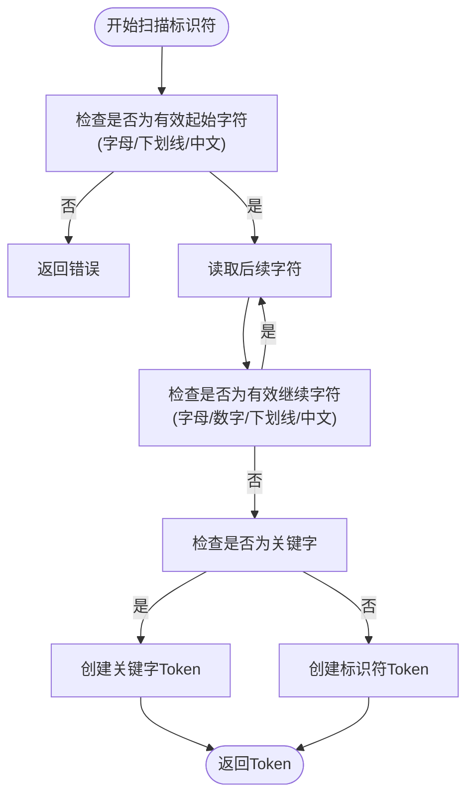
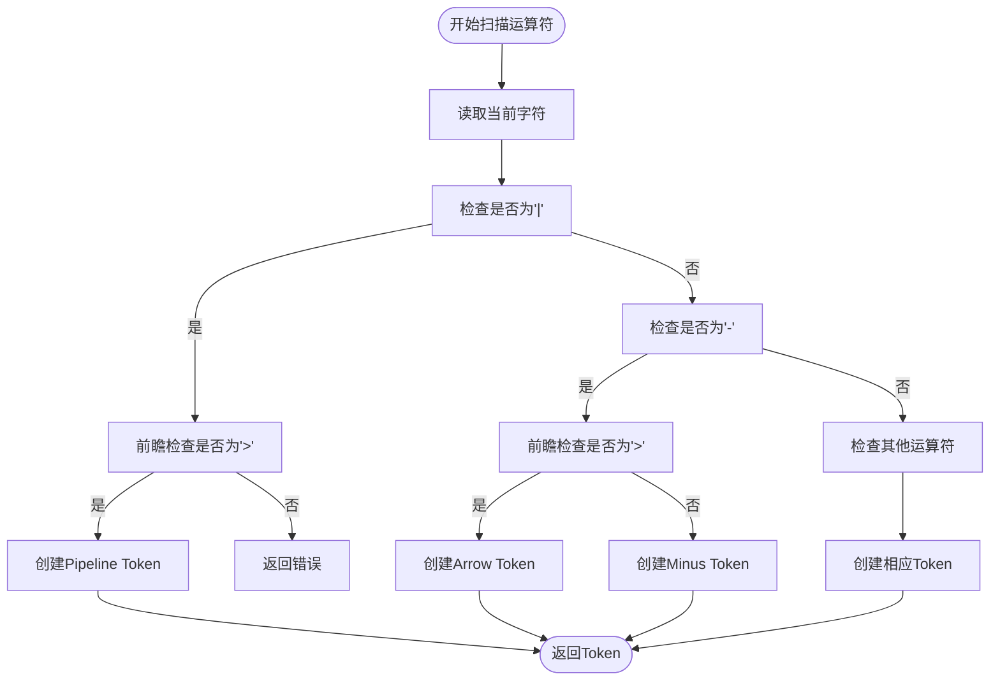

# 词法分析器实现

<cite>
**本文档引用文件**   
- [lexer.rs](file://src/lexer.rs)
- [7.解释器实现设计.md](file://dev_logs/7.解释器实现设计.md)
</cite>

## 目录
1. [词法分析器结构设计](#词法分析器结构设计)
2. [Token流生成机制](#token流生成机制)
3. [核心扫描方法实现](#核心扫描方法实现)
4. [特殊语法识别](#特殊语法识别)
5. [词法分析流程示例](#词法分析流程示例)

## 词法分析器结构设计

DPLang词法分析器（Lexer）采用状态机模式，通过维护源码字符流的解析状态来生成Token流。其核心结构体包含多个关键字段，共同协作完成词法分析任务。

`Lexer`结构体包含以下核心字段：
- `source`: 存储源码字符的向量，将输入字符串转换为字符数组进行处理
- `current`: 当前解析位置的索引，指示下一个待处理字符的位置
- `line`和`column`: 记录当前解析位置的行列信息，用于错误定位和调试
- `indent_stack`: 缩进栈，用于跟踪代码块的缩进级别，支持缩进敏感语法
- `pending_tokens`: 待发送的Token队列，用于处理文件结束时的Dedent Token

该设计通过`indent_stack`实现了Python风格的缩进敏感语法，当遇到换行符时，会计算当前行的缩进级别，并与栈顶的缩进级别比较，生成相应的`Indent`或`Dedent` Token。这种机制使得DPLang能够通过缩进来定义代码块，而不需要显式的括号或关键字。

**Section sources**
- [lexer.rs](file://src/lexer.rs#L121-L128)

## Token流生成机制

`next_token`方法是词法分析器的核心，负责将源码字符流转换为Token流。该方法采用优先级处理策略，按照特定顺序识别不同类型的Token。

方法执行流程如下：
1. 首先检查`pending_tokens`队列，如果有待发送的Token则优先返回
2. 跳过空白字符（除换行符外），保持解析的连续性
3. 检查是否到达源码末尾，如果是则处理文件结束时的缩进
4. 根据当前字符类型，调用相应的扫描方法生成Token

当到达源码末尾时，`handle_eof_dedents`方法会生成必要的`Dedent` Token，确保所有打开的代码块都被正确关闭。这种设计保证了语法结构的完整性，即使在文件末尾也能正确处理缩进层次。

对于换行符的处理，词法分析器会调用`handle_indent`方法计算新的缩进级别。如果缩进增加，则生成`Indent` Token并将新级别压入栈；如果缩进减少，则生成相应数量的`Dedent` Token并从栈中弹出级别。这种机制确保了缩进变化能够准确反映代码块的嵌套关系。

**Section sources**
- [lexer.rs](file://src/lexer.rs#L158-L197)
- [lexer.rs](file://src/lexer.rs#L273-L324)

## 核心扫描方法实现

词法分析器通过一系列专用的扫描方法来识别不同类型的字面量和标识符，每种方法都针对特定的语法结构进行了优化。

### 数字扫描

`scan_number`方法负责识别数字字面量，支持整数、小数和科学计数法。该方法首先读取整数部分，然后检查是否存在小数点，如果存在则继续读取小数部分。最后处理科学计数法表示，支持`e`或`E`后跟可选的正负号和数字。解析完成后，将字符串转换为`f64`类型，如果转换失败则返回词法错误。

### 字符串扫描

`scan_string`方法处理字符串字面量，支持双引号和单引号界定。该方法会跳过起始引号，然后逐字符读取直到遇到匹配的结束引号。在读取过程中，会处理转义序列如`\n`、`\t`、`\\`等。如果到达源码末尾仍未找到结束引号，则返回"未闭合的字符串"错误。

### 标识符扫描

`scan_identifier`方法识别标识符和关键字。该方法首先检查字符是否为有效的标识符起始字符，然后连续读取所有有效的标识符继续字符。读取完成后，通过模式匹配判断是否为关键字，如`return`、`if`、`else`等。如果不是关键字，则作为普通标识符处理。

中文标识符的支持通过`is_chinese_char`辅助方法实现，该方法使用Unicode范围匹配来识别中文字符（`\u{4E00}`到`\u{9FFF}`）。`is_identifier_start`和`is_identifier_continue`方法结合了字母、下划线和中文字符的检查，使得DPLang能够支持中文变量名和函数名。



**Diagram sources**
- [lexer.rs](file://src/lexer.rs#L414-L440)
- [lexer.rs](file://src/lexer.rs#L619-L625)

**Section sources**
- [lexer.rs](file://src/lexer.rs#L333-L369)
- [lexer.rs](file://src/lexer.rs#L372-L412)
- [lexer.rs](file://src/lexer.rs#L627-L629)

## 特殊语法识别

DPLang词法分析器支持多种特殊语法结构的识别，包括特殊声明和管道运算符，这些特性增强了语言的表达能力和实用性。

### 特殊声明识别

`scan_special_declaration`方法负责识别以`--`开头和结尾的特殊声明。该方法读取整个声明内容，然后转换为大写进行匹配。支持的声明类型包括：
- `-- INPUT --`：定义输入参数，提取参数列表
- `-- OUTPUT --`：定义输出参数
- `-- IMPORT --`：导入包列表
- `-- ERROR --`：错误处理块开始
- `-- ERROR_END --`：错误处理块结束
- `-- PRECISION --`：精度模式声明

该方法通过提取两个`--`之间的内容，并移除前缀（如"INPUT"、"input"等），保留实际的参数列表。这种设计使得DPLang能够通过简单的注释语法实现复杂的元数据声明。

### 运算符识别

`scan_operator`方法处理各种运算符的识别，特别关注多字符运算符的处理。该方法通过前瞻检查来区分单字符和多字符运算符：
- `->`：箭头运算符，用于函数定义
- `|>`：管道运算符，用于链式调用
- `>=`、`<=`、`==`、`!=`：比较运算符
- `...`：展开运算符

对于管道运算符`|>`，该方法首先检查当前字符是否为`|`，然后前瞻检查下一个字符是否为`>`，如果是则生成`Pipeline` Token。这种前瞻机制确保了多字符运算符能够被正确识别，避免了与单字符运算符的冲突。



**Diagram sources**
- [lexer.rs](file://src/lexer.rs#L442-L508)
- [lexer.rs](file://src/lexer.rs#L511-L577)

**Section sources**
- [lexer.rs](file://src/lexer.rs#L198-L200)
- [lexer.rs](file://src/lexer.rs#L511-L617)

## 词法分析流程示例

通过实际代码示例可以更好地理解词法分析器的工作流程。考虑以下DPLang代码：

```dplang
-- INPUT code:string, close:number --
ma5 = MA(close, 5)
if ma5 > 10:
    return [code, close]
```

词法分析器将生成以下Token序列：
1. `Input("code:string, close:number")` - 特殊声明Token
2. `Identifier("ma5")` - 标识符Token
3. `Assign("=")` - 赋值运算符
4. `Identifier("MA")` - 函数名标识符
5. `LeftParen("(")` - 左括号
6. `Identifier("close")` - 参数标识符
7. `Comma(",")` - 逗号分隔符
8. `Number(5)` - 数字字面量
9. `RightParen(")")` - 右括号
10. `Newline("\n")` - 换行符
11. `If("if")` - 关键字
12. `Identifier("ma5")` - 标识符
13. `Greater(">")` - 比较运算符
14. `Number(10)` - 数字字面量
15. `Colon(":")` - 冒号
16. `Newline("\n")` - 换行符
17. `Indent("    ")` - 缩进Token
18. `Return("return")` - 关键字
19. `LeftBracket("[")` - 左方括号
20. `Identifier("code")` - 标识符
21. `Comma(",")` - 逗号分隔符
22. `Identifier("close")` - 标识符
23. `RightBracket("]")` - 右方括号
24. `Eof` - 文件结束Token

这个示例展示了词法分析器如何将源码分解为有意义的Token序列，为后续的语法分析提供基础。特殊声明被识别为单一Token，保留了其内容信息；缩进被转换为`Indent` Token，反映了代码块的层次结构；各种运算符和分隔符都被正确识别，为构建抽象语法树提供了必要的信息。

**Section sources**
- [lexer.rs](file://src/lexer.rs#L636-L679)
- [7.解释器实现设计.md](file://dev_logs/7.解释器实现设计.md#L105-L138)