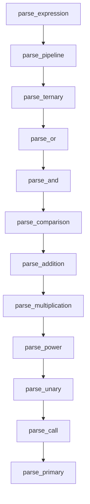

# 语法分析器实现

<cite>
**本文档引用文件**  
- [mod.rs](file://src/parser/mod.rs)
- [ast.rs](file://src/parser/ast.rs)
- [7.解释器实现设计.md](file://dev_logs/7.解释器实现设计.md)
</cite>

## 目录
1. [AST节点设计](#ast节点设计)  
2. [Parser结构与递归下降解析](#parser结构与递归下降解析)  
3. [表达式优先级解析机制](#表达式优先级解析机制)  
4. [Lambda表达式与解构赋值解析](#lambda表达式与解构赋值解析)  
5. [缩进块处理机制](#缩进块处理机制)  

## AST节点设计

DPLang的抽象语法树（AST）定义在`ast.rs`中，核心节点包括表达式（Expr）、语句（Stmt）和脚本（Script）三大类。表达式节点采用枚举形式，涵盖多种运算类型：

- **字面量表达式**：`Number`、`String`、`Bool`、`Null`
- **标识符表达式**：`Identifier`
- **复合表达式**：`Array`（数组字面量）
- **运算表达式**：
  - `Binary`：二元运算，包含左操作数、运算符和右操作数
  - `Unary`：一元运算，包含操作符和操作数
  - `Ternary`：三元条件表达式，包含条件、真值分支和假值分支
- **调用与访问表达式**：
  - `Call`：函数调用，包含被调用者名称和参数列表
  - `MemberAccess`：成员访问，如`object.member`
  - `Index`：数组或时间序列索引访问
  - `Slice`：切片访问，支持起始和结束索引
- **特殊表达式**：
  - `Spread`：展开运算符，用于解构或参数传递
  - `Lambda`：Lambda表达式，包含参数列表和表达式体
  - `Pipeline`：管道表达式，支持链式数据处理

语句节点（Stmt）包括：
- `Assignment`：变量赋值
- `Destructure`：解构赋值，支持忽略模式（`_`）和展开模式（`...rest`）
- `If`：条件语句，包含条件、真值块和可选的假值块
- `Return`：返回语句
- `Expression`：表达式语句

脚本类型（Script）分为`Package`（包脚本）和`DataScript`（数据处理脚本），分别用于定义可复用的包和处理数据流的脚本。

**Section sources**  
- [ast.rs](file://src/parser/ast.rs#L5-L265)

## Parser结构与递归下降解析

语法分析器（Parser）实现在`mod.rs`中，采用递归下降法进行解析。其核心结构为`Parser`结构体，包含词法单元列表（tokens）和当前解析位置（current）。

解析入口为`parse`方法，根据首个词法单元判断是包脚本还是数据处理脚本。包脚本以`package`关键字开头，包含包名、变量定义和函数定义；数据处理脚本则包含输入输出声明、精度设置和主体语句。

语句解析通过`parse_statement`方法实现，按顺序尝试解析不同类型的语句：
1. `return`语句：解析返回表达式
2. `if`语句：解析条件和缩进块
3. 解构赋值：检测`[...] =`模式
4. 普通赋值：检测`identifier =`模式
5. 表达式语句：作为默认情况

**Section sources**  
- [mod.rs](file://src/parser/mod.rs#L25-L370)

## 表达式优先级解析机制

表达式解析采用经典的递归下降优先级解析策略，从最低优先级到最高优先级逐层解析：

**Diagram sources**  
- [mod.rs](file://src/parser/mod.rs#L458-L654)

- `parse_pipeline`：处理管道运算符`|>`，优先级最低，支持多阶段管道
- `parse_ternary`：处理三元运算符`? :`，为右结合，支持嵌套
- `parse_or`和`parse_and`：处理逻辑或与逻辑与，左结合
- `parse_comparison`：处理比较运算符（`> < >= <= == !=`）
- `parse_addition`和`parse_multiplication`：处理加减和乘除模运算
- `parse_power`：处理幂运算`^`，为右结合
- `parse_unary`：处理一元运算符（`-`和`not`）
- `parse_call`：处理函数调用、成员访问和索引/切片操作
- `parse_primary`：解析基础表达式，如字面量、标识符和括号表达式

各层解析方法通过循环调用低优先级方法获取操作数，确保运算符优先级和结合性正确。

**Section sources**  
- [mod.rs](file://src/parser/mod.rs#L458-L654)

## Lambda表达式与解构赋值解析

Lambda表达式通过`parse_lambda`方法解析，支持两种形式：
1. 单参数形式：`x -> expr`
2. 多参数形式：`(a, b, c) -> expr`

解析时先收集参数列表，然后解析箭头后的表达式体。Lambda体为单个表达式，支持嵌套。

解构赋值通过`try_parse_destructure`方法实现，检测`[...] =`模式。解构模式支持：
- `Identifier`：绑定到变量
- `Ignore`：用`_`忽略元素
- `Spread`：用`...rest`捕获剩余元素

展开运算符`...`在`parse_primary`中处理，用于数组字面量或函数调用参数中。

**Section sources**  
- [mod.rs](file://src/parser/mod.rs#L815-L842)
- [mod.rs](file://src/parser/mod.rs#L427-L454)
- [mod.rs](file://src/parser/mod.rs#L806-L810)

## 缩进块处理机制

缩进块用于`if/else`语句和函数定义的主体，通过词法分析器生成的`Indent`和`Dedent`词法单元进行标记。

在`parse_if_statement`和`parse_function_def`中，解析器首先消耗`:`后的换行，然后要求下一个词法单元为`Indent`。接着循环解析语句直到遇到`Dedent`或文件结束。最后消耗`Dedent`词法单元，完成块的解析。

此机制确保了代码块的结构清晰，同时避免了使用大括号带来的视觉噪音。

**Section sources**  
- [mod.rs](file://src/parser/mod.rs#L372-L425)
- [mod.rs](file://src/parser/mod.rs#L295-L318)