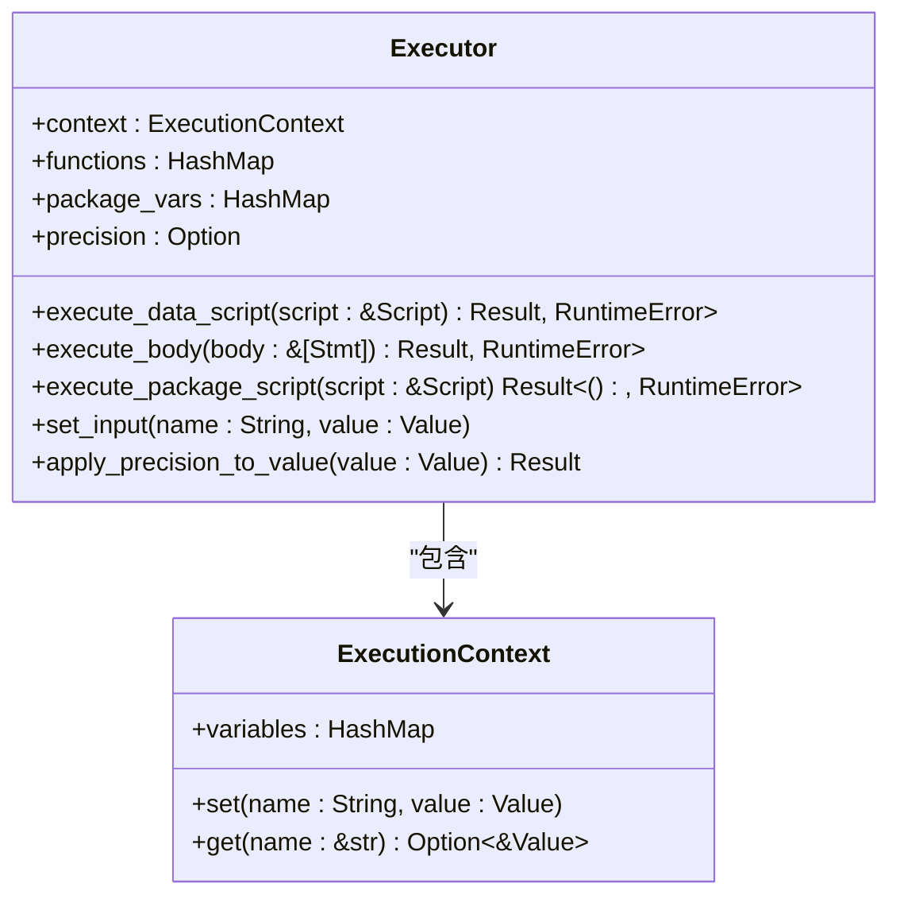
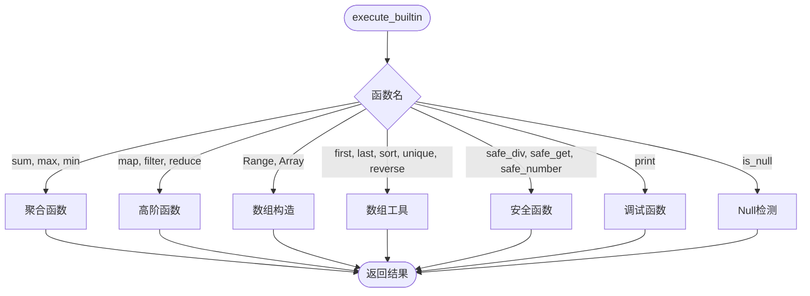
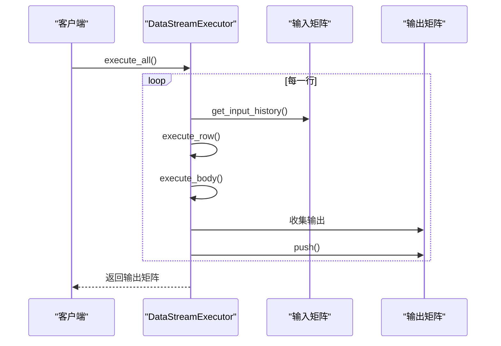

# 贡献指南

<cite>
**本文档引用的文件**   
- [Cargo.toml](file://Cargo.toml)
- [src/executor/tests.rs](file://src/executor/tests.rs)
- [src/executor/mod.rs](file://src/executor/mod.rs)
- [src/lib.rs](file://src/lib.rs)
- [README.md](file://README.md)
- [QUICKSTART.md](file://QUICKSTART.md)
- [dev_logs/7.解释器实现设计.md](file://dev_logs/7.解释器实现设计.md)
- [src/executor/builtin.rs](file://src/executor/builtin.rs)
- [src/executor/data_stream.rs](file://src/executor/data_stream.rs)
- [src/executor/context.rs](file://src/executor/context.rs)
- [src/executor/expression.rs](file://src/executor/expression.rs)
- [src/executor/statement.rs](file://src/executor/statement.rs)
- [src/parser/ast.rs](file://src/parser/ast.rs)
- [src/runtime.rs](file://src/runtime.rs)
- [src/lexer.rs](file://src/lexer.rs)
</cite>

## 目录
1. [开发环境设置](#开发环境设置)
2. [构建与测试](#构建与测试)
3. [代码格式化与规范](#代码格式化与规范)
4. [调试解释器组件](#调试解释器组件)
5. [贡献流程](#贡献流程)
6. [核心功能开发](#核心功能开发)

## 开发环境设置

为了开始对 DPLang 项目进行贡献，您需要设置一个合适的开发环境。本项目基于 Rust 语言开发，因此需要安装 Rust 工具链。

首先，确保您已安装 Rust 编译器和 Cargo 包管理器。推荐使用 [rustup](https://www.rust-lang.org/tools/install) 进行安装，它能帮助您管理不同版本的 Rust 工具链。

安装完成后，验证安装是否成功：
```bash
rustc --version
cargo --version
```

接下来，克隆本项目仓库到本地：
```bash
git clone https://github.com/your-username/DPLang.git
cd DPLang
```

项目依赖已定义在 `Cargo.toml` 文件中，包括 `rust_decimal` 用于高精度小数运算、`csv` 用于 CSV 文件处理、`thiserror` 用于错误处理等。这些依赖会在构建时自动下载。

**Section sources**
- [Cargo.toml](file://Cargo.toml#L1-L15)

## 构建与测试

### 构建项目

使用 Cargo 构建项目非常简单。在项目根目录下执行以下命令进行构建：
```bash
cargo build
```

对于发布版本，使用 `--release` 标志以启用优化：
```bash
cargo build --release
```

构建成功后，可执行文件将位于 `target/debug/` 或 `target/release/` 目录下。

### 运行测试

项目包含全面的单元测试，覆盖了词法分析、语法分析、语义分析、运行时类型系统、执行器逻辑、公共接口和包加载器等各个方面。

运行所有测试：
```bash
cargo test
```

您也可以运行特定模块的测试，例如：
```bash
cargo test lexer
cargo test parser
cargo test executor
```

测试文件 `src/executor/tests.rs` 包含了执行器模块的详细测试用例，涵盖了简单表达式求值、条件语句、Lambda 表达式、高阶函数（map、filter、reduce）、错误处理、精度控制、流式数据处理、包加载与执行、时间序列函数（past、window、offset）、技术指标（SMA、RSI）以及调试函数（print）等核心功能。

**Section sources**
- [src/executor/tests.rs](file://src/executor/tests.rs#L1-L800)

## 代码格式化与规范

为保持代码风格的一致性，本项目遵循 Rust 社区的标准代码格式化规范。请在提交代码前使用 `rustfmt` 格式化您的代码。

格式化整个项目：
```bash
cargo fmt
```

格式化特定文件：
```bash
cargo fmt -- src/executor/builtin.rs
```

此外，建议使用 `clippy` 进行代码检查，它能发现潜在的错误和不规范的代码：
```bash
cargo clippy
```

项目遵循 Rust 最佳实践，包括使用适当的错误处理（`thiserror`）、清晰的模块结构、有意义的变量和函数命名（支持中文标识符）、以及充分的文档注释。

**Section sources**
- [src/executor/builtin.rs](file://src/executor/builtin.rs#L1-L590)

## 调试解释器组件

### 解释器架构

DPLang 解释器采用经典的编译器架构，包含词法分析、语法分析、语义分析和执行四个主要阶段。

```mermaid
graph TD
A[源代码 *.dp] --> B[词法分析 (Lexer)]
B --> C[Tokens 流]
C --> D[语法分析 (Parser)]
D --> E[AST (抽象语法树)]
E --> F[语义分析 (Semantic)]
F --> G[执行器 (Executor)]
G --> H[输出结果 (Value)]
```

**Diagram sources**
- [dev_logs/7.解释器实现设计.md](file://dev_logs/7.解释器实现设计.md#L374-L393)

### 核心组件分析

#### 执行器 (Executor)

`Executor` 是解释器的核心，负责执行 AST 节点。它维护一个执行上下文（`ExecutionContext`），用于存储变量和状态。



**Diagram sources**
- [src/executor/mod.rs](file://src/executor/mod.rs#L25-L237)
- [src/executor/context.rs](file://src/executor/context.rs#L7-L27)

#### 内置函数 (Builtin Functions)

内置函数在 `src/executor/builtin.rs` 中实现，通过 `execute_builtin` 方法分发调用。



**Diagram sources**
- [src/executor/builtin.rs](file://src/executor/builtin.rs#L8-L47)

#### 流式执行器 (DataStreamExecutor)

`DataStreamExecutor` 用于处理时间序列数据，支持逐行流式处理和零拷贝设计。



**Diagram sources**
- [src/executor/data_stream.rs](file://src/executor/data_stream.rs#L17-L338)

## 贡献流程

### 提交 Issue

如果您发现了 bug 或有功能建议，请先在 GitHub 仓库中提交 Issue。在提交前，请先搜索是否已有类似的问题。

提交 Issue 时，请提供：
- 清晰的问题描述
- 复现步骤
- 预期行为和实际行为
- 相关的错误信息或日志
- 您的环境信息（操作系统、Rust 版本等）

### 创建 Pull Request

1. Fork 本仓库到您的 GitHub 账户。
2. 在本地创建一个新的分支：
   ```bash
   git checkout -b feature/your-feature-name
   ```
3. 进行代码修改，确保代码格式化并运行测试通过。
4. 提交更改：
   ```bash
   git add .
   git commit -m "描述您的更改"
   ```
5. 推送到您的 Fork：
   ```bash
   git push origin feature/your-feature-name
   ```
6. 在 GitHub 上创建 Pull Request，描述您的更改和动机。

### 代码审查标准

Pull Request 将根据以下标准进行审查：
- 代码功能正确性
- 代码风格符合 `rustfmt` 规范
- 充分的单元测试覆盖
- 清晰的文档和注释
- 向后兼容性
- 性能影响

**Section sources**
- [README.md](file://README.md#L350-L372)

## 核心功能开发

我们鼓励社区参与核心功能的开发，特别是以下方面：

### 新内置函数

您可以通过在 `src/executor/builtin.rs` 中添加新的方法来实现新内置函数。例如，添加一个计算标准差的函数：

```rust
fn builtin_std(&self, args: &[Value]) -> Result<Value, RuntimeError> {
    // 实现标准差计算
}
```

然后在 `execute_builtin` 的 `match` 语句中添加对应的分支。

### 性能优化

项目当前的性能优化方向包括：
- 并行执行：利用多核 CPU 并行处理数据流
- 向量化运算：优化数组运算的性能
- 内存优化：减少内存分配和拷贝
- JIT 编译：将频繁执行的代码编译为机器码

您可以从优化现有算法或实现新的优化策略入手。

### 包系统扩展

包系统允许用户通过 `.dp` 文件扩展语言功能。您可以在 `packages/` 目录下创建新的包，或改进 `PackageLoader` 的功能，如支持从远程仓库加载包。

**Section sources**
- [src/executor/builtin.rs](file://src/executor/builtin.rs#L8-L47)
- [README.md](file://README.md#L447-L451)