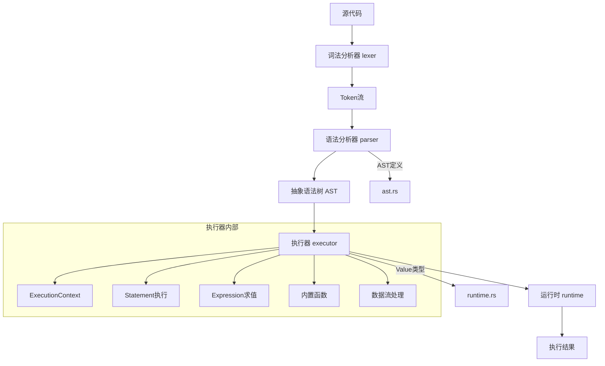
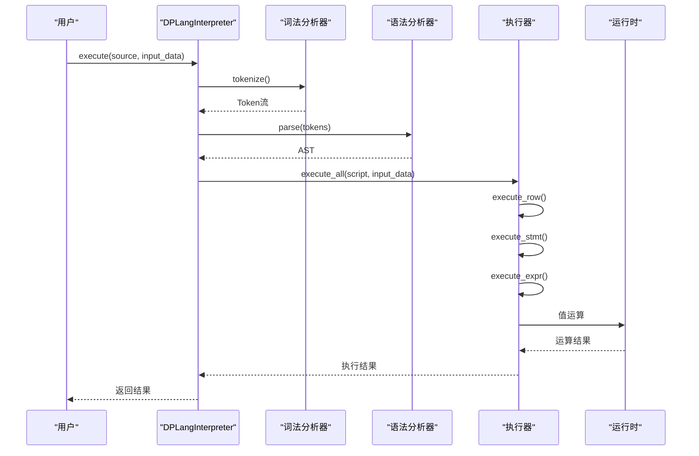

# 项目结构概览

<cite>
**本文档引用的文件**
- [lib.rs](file://src/lib.rs)
- [api.rs](file://src/api.rs)
- [lexer.rs](file://src/lexer.rs)
- [parser/mod.rs](file://src/parser/mod.rs)
- [parser/ast.rs](file://src/parser/ast.rs)
- [executor/mod.rs](file://src/executor/mod.rs)
- [executor/data_stream.rs](file://src/executor/data_stream.rs)
- [executor/statement.rs](file://src/executor/statement.rs)
- [executor/expression.rs](file://src/executor/expression.rs)
- [executor/builtin.rs](file://src/executor/builtin.rs)
- [runtime.rs](file://src/runtime.rs)
</cite>

## 目录
1. [项目结构概览](#项目结构概览)
2. [模块职责划分](#模块职责划分)
3. [模块协同工作流程](#模块协同工作流程)
4. [库入口点与公共API](#库入口点与公共api)
5. [调用流程示例](#调用流程示例)

## 模块职责划分

DPLang项目采用模块化设计，src目录下的各模块具有明确的职责划分：

- **lexer模块**：负责词法分析，将源代码字符串分解为Token流。lexer.rs文件实现了Lexer结构体，包含tokenize方法用于生成Token序列。

- **parser模块**：负责语法分析，将Token流解析为抽象语法树（AST）。该模块包含ast.rs定义AST节点类型，mod.rs实现Parser结构体进行递归下降解析。

- **executor模块**：负责执行AST，包含多个子模块：
  - context.rs：实现ExecutionContext，管理变量作用域
  - statement.rs：实现语句执行逻辑
  - expression.rs：实现表达式求值逻辑
  - builtin.rs：实现内置函数
  - data_stream.rs：实现数据流执行器，处理时间序列数据

- **runtime模块**：提供运行时支持，定义Value枚举类型表示各种值类型，并实现基本运算方法。

- **api模块**：提供公共API接口，封装解释器功能供外部调用。

- **package_loader模块**：负责包的加载和管理。

- **semantic模块**：负责语义分析。

**Section sources**
- [lexer.rs](file://src/lexer.rs#L1-L680)
- [parser/mod.rs](file://src/parser/mod.rs#L1-L800)
- [parser/ast.rs](file://src/parser/ast.rs#L1-L265)
- [executor/mod.rs](file://src/executor/mod.rs#L1-L241)
- [executor/data_stream.rs](file://src/executor/data_stream.rs#L1-L338)
- [executor/statement.rs](file://src/executor/statement.rs#L1-L68)
- [executor/expression.rs](file://src/executor/expression.rs#L1-L366)
- [executor/builtin.rs](file://src/executor/builtin.rs#L1-L590)
- [runtime.rs](file://src/runtime.rs#L1-L550)

## 模块协同工作流程

各模块通过清晰的依赖关系协同工作，形成完整的解释器执行流程：



**Diagram sources**
- [lexer.rs](file://src/lexer.rs#L1-L680)
- [parser/mod.rs](file://src/parser/mod.rs#L1-L800)
- [parser/ast.rs](file://src/parser/ast.rs#L1-L265)
- [executor/mod.rs](file://src/executor/mod.rs#L1-L241)
- [runtime.rs](file://src/runtime.rs#L1-L550)

**Section sources**
- [lexer.rs](file://src/lexer.rs#L1-L680)
- [parser/mod.rs](file://src/parser/mod.rs#L1-L800)
- [parser/ast.rs](file://src/parser/ast.rs#L1-L265)
- [executor/mod.rs](file://src/executor/mod.rs#L1-L241)
- [runtime.rs](file://src/runtime.rs#L1-L550)

## 库入口点与公共API

lib.rs作为库的入口点，通过mod关键字导出各个模块，并将api.rs中的公共API暴露给外部使用者：

```rust
pub mod lexer;
pub mod parser;
pub mod runtime;
pub mod executor;
pub mod package_loader;
pub mod semantic;
pub mod api;

// 导出公共 API
pub use api::DPLangInterpreter;
pub use api::{parse_csv, format_output_csv};
```

这种设计模式实现了模块的封装与接口的暴露，外部使用者只需引入DPLang库即可使用解释器功能，而无需了解内部实现细节。

api.rs中定义的DPLangInterpreter结构体提供了主要的公共接口：

- new方法：创建解释器实例
- from_file方法：从文件创建解释器实例
- execute方法：执行脚本并返回结果
- execute_json方法：执行JSON格式输入的脚本
- execute_csv方法：执行CSV格式输入的脚本

这些API方法封装了词法分析、语法分析和执行的完整流程，为外部使用者提供了简洁的接口。

**Section sources**
- [lib.rs](file://src/lib.rs#L1-L14)
- [api.rs](file://src/api.rs#L1-L364)

## 调用流程示例

以下是一个典型的调用流程示例，展示了各模块如何协同工作：



**Diagram sources**
- [api.rs](file://src/api.rs#L1-L364)
- [lexer.rs](file://src/lexer.rs#L1-L680)
- [parser/mod.rs](file://src/parser/mod.rs#L1-L800)
- [executor/mod.rs](file://src/executor/mod.rs#L1-L241)
- [runtime.rs](file://src/runtime.rs#L1-L550)

**Section sources**
- [api.rs](file://src/api.rs#L1-L364)
- [lexer.rs](file://src/lexer.rs#L1-L680)
- [parser/mod.rs](file://src/parser/mod.rs#L1-L800)
- [executor/mod.rs](file://src/executor/mod.rs#L1-L241)
- [runtime.rs](file://src/runtime.rs#L1-L550)