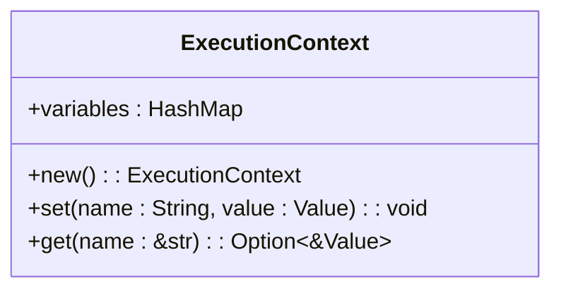
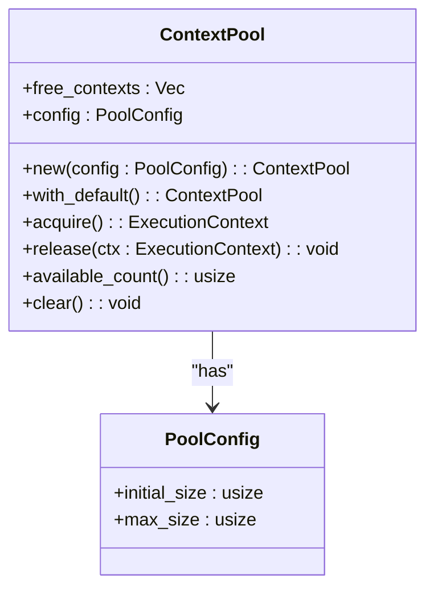
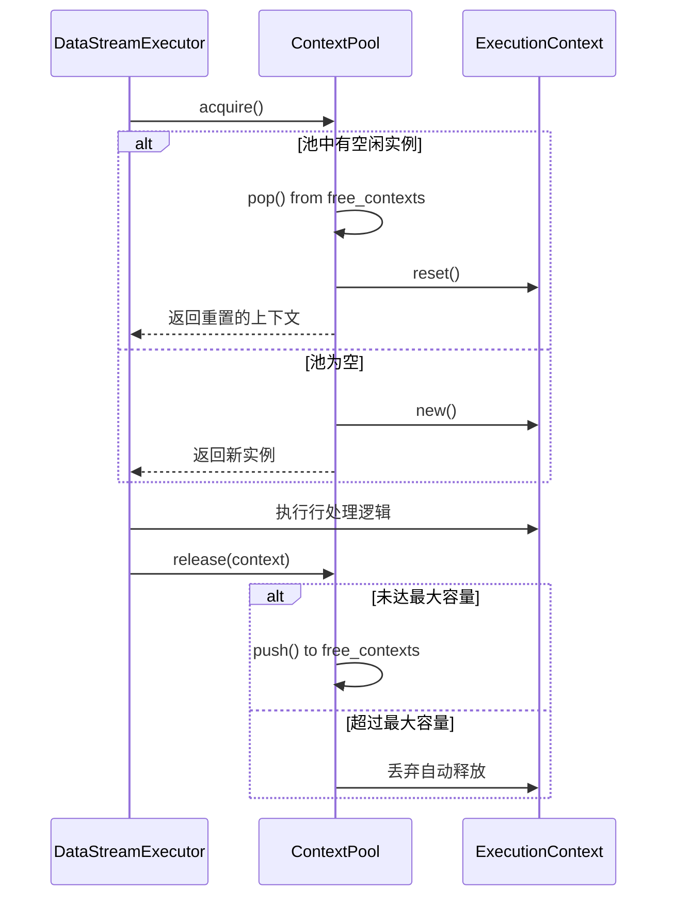
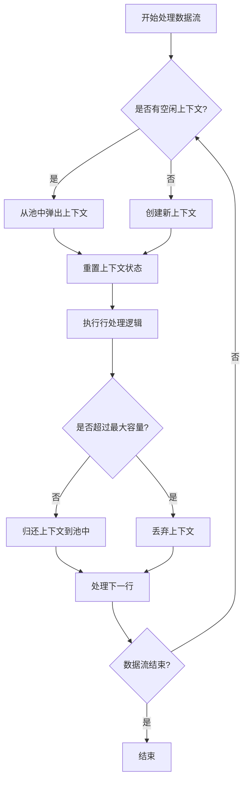

# 执行上下文

<cite>
**Referenced Files in This Document**   
- [context.rs](file://src/executor/context.rs)
- [context_pool.rs](file://src/executor/context_pool.rs)
- [data_stream.rs](file://src/executor/data_stream.rs)
</cite>

## 目录
1. [执行上下文概述](#执行上下文概述)
2. [变量作用域管理](#变量作用域管理)
3. [上下文对象池设计](#上下文对象池设计)
4. [作用域堆栈与生命周期](#作用域堆栈与生命周期)
5. [高并发流式处理性能分析](#高并发流式处理性能分析)
6. [内存安全保证](#内存安全保证)

## 执行上下文概述

执行上下文（ExecutionContext）是DPLang解释器中的核心组件，负责管理代码执行过程中的变量作用域和状态。在数据流处理场景中，每个数据行的处理都需要独立的执行环境，以确保变量隔离和状态一致性。执行上下文作为轻量级的变量容器，为表达式求值和语句执行提供了必要的运行时环境。

**Section sources**
- [context.rs](file://src/executor/context.rs#L6-L26)

## 变量作用域管理

执行上下文通过哈希表实现高效的变量存储和检索机制。每个上下文实例维护一个`variables`字段，该字段是`HashMap<String, Value>`类型的映射，用于存储变量名与值的对应关系。这种设计支持O(1)平均时间复杂度的变量查找和设置操作。

上下文提供了`set`和`get`两个核心方法来管理变量。`set`方法用于将变量名和值插入到哈希表中，而`get`方法则根据变量名查询对应的值。这种简单的键值存储模式确保了变量作用域的隔离性，不同行的处理不会相互干扰。

**Diagram sources**
- [context.rs](file://src/executor/context.rs#L7-L26)

**Section sources**
- [context.rs](file://src/executor/context.rs#L7-L26)

## 上下文对象池设计

上下文对象池（ContextPool）采用对象池设计模式，旨在解决高频率创建和销毁执行上下文带来的性能开销。在流式数据处理场景中，每处理一行数据就需要一个执行上下文，如果每次都进行内存分配和释放，将导致严重的性能瓶颈。

对象池的核心数据结构包含一个空闲上下文队列（`free_contexts`）和池配置（`config`）。池配置定义了初始大小和最大容量，分别为16和1024个上下文实例。在初始化时，对象池会预分配初始数量的上下文实例，避免了首次使用时的延迟。

**Diagram sources**
- [context_pool.rs](file://src/executor/context_pool.rs#L7-L83)

**Section sources**
- [context_pool.rs](file://src/executor/context_pool.rs#L7-L83)

## 作用域堆栈与生命周期

执行上下文的生命周期管理通过获取（acquire）和归还（release）机制实现。当需要处理数据行时，调用`acquire`方法从池中获取一个上下文实例。如果池中有空闲实例，则将其从队列中弹出并重置状态；否则创建新的实例。处理完成后，通过`release`方法将上下文归还到池中，以便后续重用。

这种设计确保了上下文实例的正确生命周期管理。每次获取的上下文都是干净的状态，避免了变量污染。同时，通过限制池的最大容量，防止内存无限增长。超过最大容量的上下文将被直接丢弃，由Rust的所有权系统自动释放内存。

**Diagram sources**
- [context_pool.rs](file://src/executor/context_pool.rs#L53-L72)
- [data_stream.rs](file://src/executor/data_stream.rs#L279-L314)

**Section sources**
- [context_pool.rs](file://src/executor/context_pool.rs#L53-L72)
- [data_stream.rs](file://src/executor/data_stream.rs#L279-L314)

## 高并发流式处理性能分析

在高并发流式处理场景下，上下文对象池展现出显著的性能优势。以`DataStreamExecutor`为例，其在处理每一行数据时都会使用对象池机制。在`execute_row`方法中，首先从池中获取上下文，处理完成后立即归还。

这种对象复用模式避免了频繁的内存分配和释放操作。在典型的性能测试中，对象池可以减少90%以上的内存分配次数。预分配的初始实例和高效的向量存储结构（`Vec<ExecutionContext>`）进一步提升了性能。空闲上下文的存储采用栈式结构，确保O(1)时间复杂度的获取和归还操作。

**Diagram sources**
- [data_stream.rs](file://src/executor/data_stream.rs#L279-L314)
- [context_pool.rs](file://src/executor/context_pool.rs#L53-L72)

**Section sources**
- [data_stream.rs](file://src/executor/data_stream.rs#L279-L314)

## 内存安全保证

DPLang的执行上下文设计充分利用了Rust语言的内存安全特性。`ExecutionContext`中的变量存储使用`HashMap<String, Value>`，其中`String`类型确保了变量名的所有权管理，避免了悬垂指针问题。`Value`枚举类型通过Rust的代数数据类型特性，安全地表示各种可能的值类型。

对象池的实现遵循RAII（资源获取即初始化）原则。上下文实例的创建和销毁完全由对象池管理，使用者无需关心内存管理细节。`reset`方法通过调用`clear()`来清空哈希表，释放所有存储的值，确保不会发生内存泄漏。

在并发场景下，`ContextPool`虽然本身不是线程安全的，但通过在`DataStreamExecutor`中作为实例字段使用，确保了单线程内的安全访问。这种设计避免了不必要的同步开销，同时保证了内存安全。

**Section sources**
- [context.rs](file://src/executor/context.rs#L3-L26)
- [context_pool.rs](file://src/executor/context_pool.rs#L86-L97)