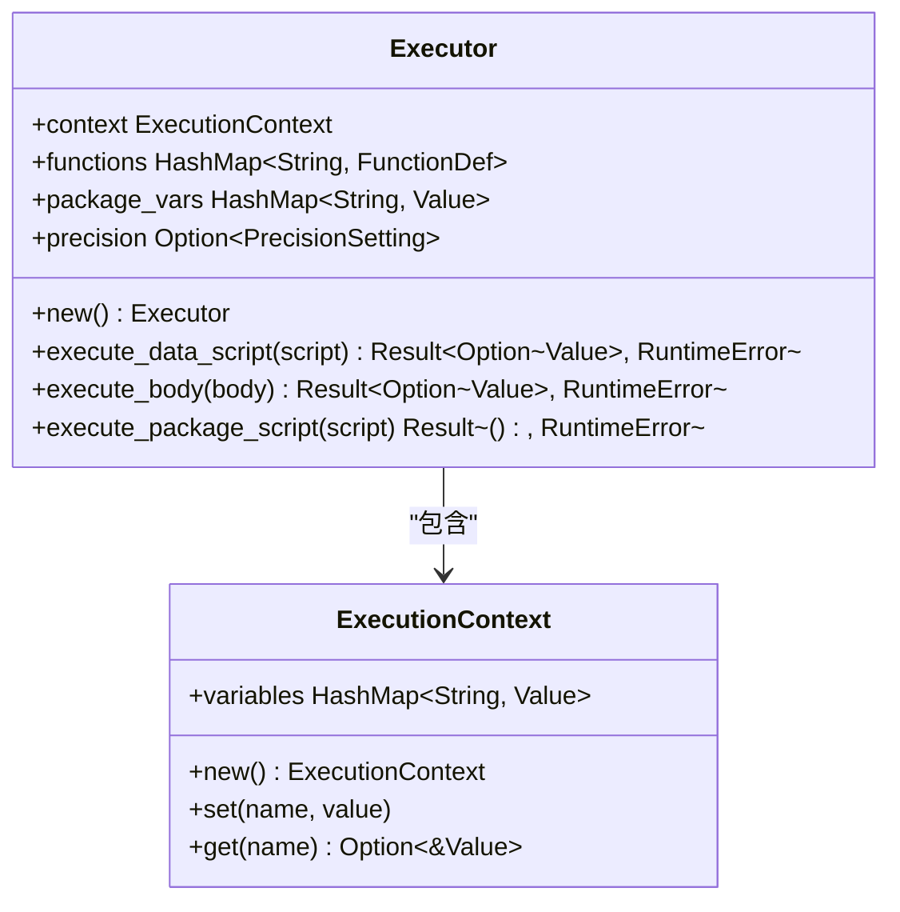
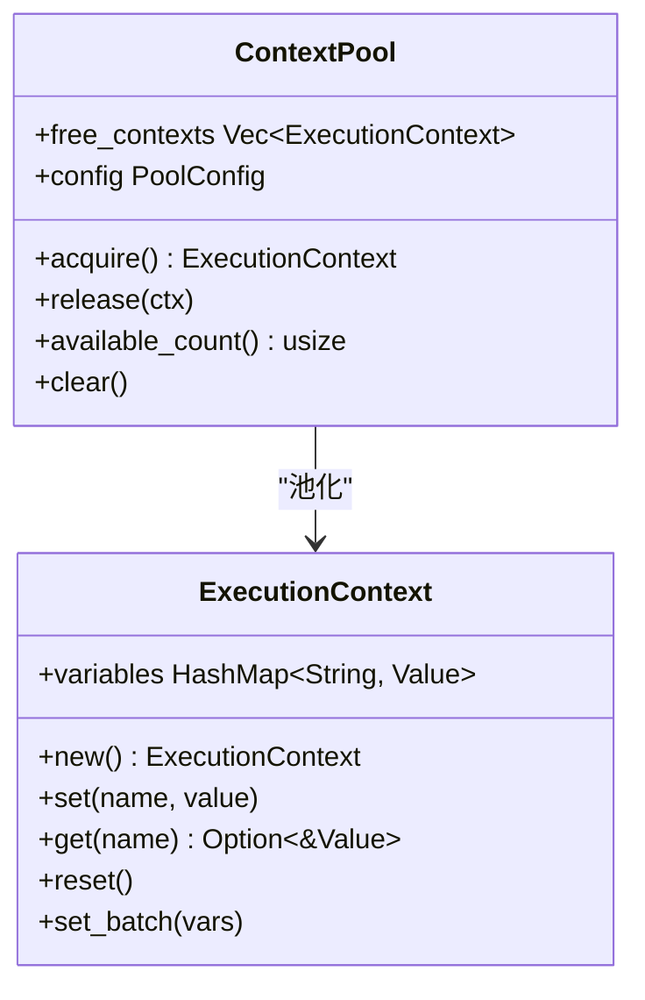
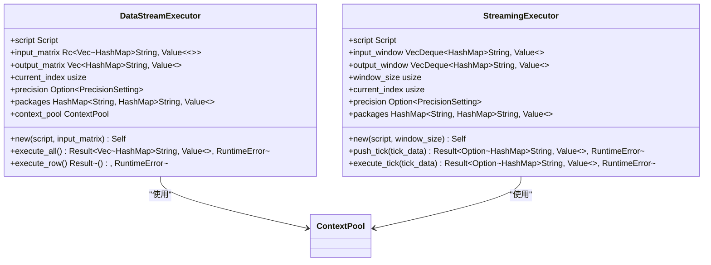
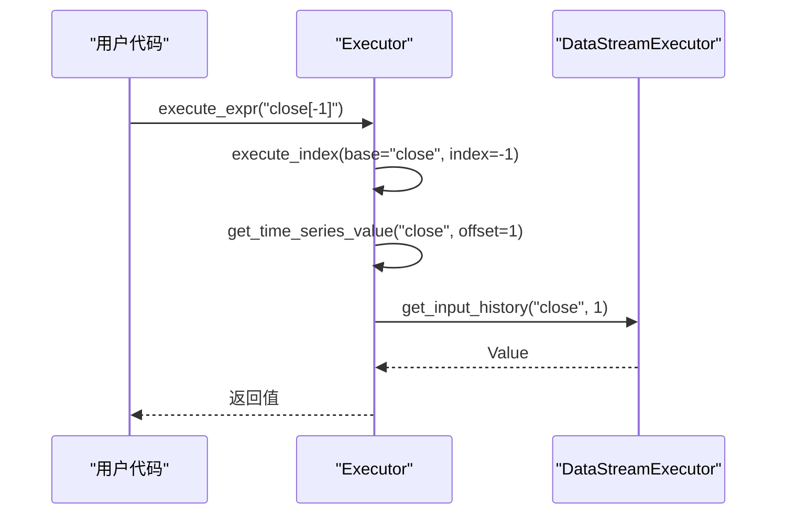
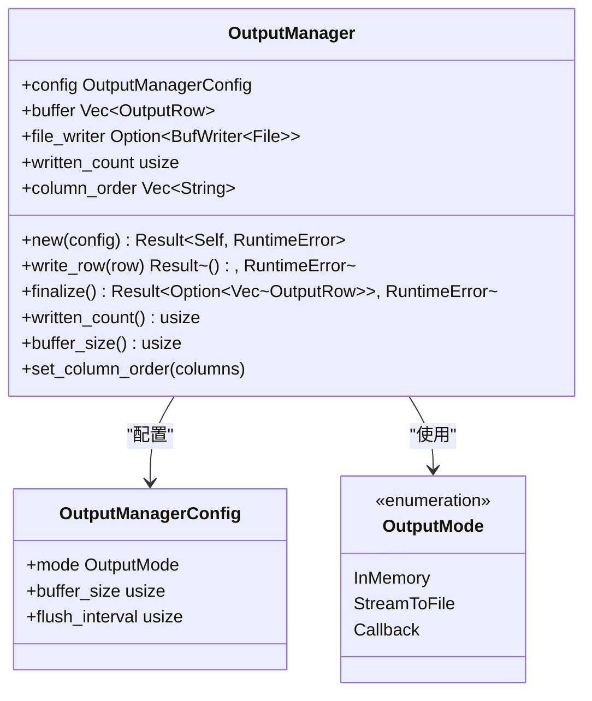
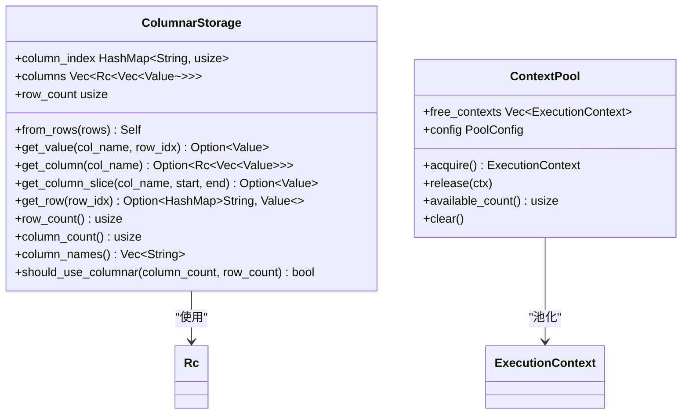

# 执行器与运行时

<cite>
**本文档引用文件**   
- [mod.rs](file://src/executor/mod.rs)
- [context.rs](file://src/executor/context.rs)
- [data_stream.rs](file://src/executor/data_stream.rs)
- [streaming.rs](file://src/executor/streaming.rs)
- [builtin.rs](file://src/executor/builtin.rs)
- [statement.rs](file://src/executor/statement.rs)
- [expression.rs](file://src/executor/expression.rs)
- [context_pool.rs](file://src/executor/context_pool.rs)
- [output_manager.rs](file://src/executor/output_manager.rs)
- [columnar_storage.rs](file://src/executor/columnar_storage.rs)
- [ast.rs](file://src/parser/ast.rs)
- [lexer.rs](file://src/lexer.rs)
- [runtime.rs](file://src/runtime.rs)
- [package_loader.rs](file://src/package_loader.rs)
</cite>

## 目录
1. [执行流程概述](#执行流程概述)
2. [主执行器（Executor）](#主执行器executor)
3. [执行上下文（ExecutionContext）](#执行上下文executioncontext)
4. [流式执行器（DataStreamExecutor）](#流式执行器datastreamexecutor)
5. [流式执行与时间序列](#流式执行与时间序列)
6. [流式输出管理](#流式输出管理)
7. [执行器与包加载](#执行器与包加载)
8. [内置函数与表达式求值](#内置函数与表达式求值)
9. [性能优化机制](#性能优化机制)

## 执行流程概述

DPLang的执行引擎遵循从源代码到结果输出的完整流程：Lexer（词法分析） -> Parser（语法分析） -> AST（抽象语法树） -> Executor（执行器）。该流程始于`lexer.rs`对源代码进行词法分析，生成Token流；随后`parser.rs`将Token流解析为AST结构；最终由`executor`模块中的执行器遍历AST并执行语句。整个执行过程的核心是`Executor`及其相关组件，它们负责管理变量作用域、执行语句和表达式，并处理数据流。

**Section sources**
- [lexer.rs](file://src/lexer.rs#L1-L680)
- [ast.rs](file://src/parser/ast.rs#L1-L265)
- [mod.rs](file://src/executor/mod.rs#L1-L241)

## 主执行器（Executor）

主执行器`Executor`是DPLang执行引擎的核心组件，负责遍历AST并执行语句。它通过`execute_body`方法逐条执行语句体中的语句，遇到`return`语句时立即返回结果。执行器维护一个`ExecutionContext`用于存储变量，并支持包级函数和变量的管理。对于数据脚本，执行器会应用精度设置到返回值。执行器还支持错误处理，当执行主体出现错误且定义了ERROR块时，会执行ERROR块中的语句。

**Diagram sources **
- [mod.rs](file://src/executor/mod.rs#L25-L237)
- [context.rs](file://src/executor/context.rs#L7-L26)

**Section sources**
- [mod.rs](file://src/executor/mod.rs#L25-L237)
- [statement.rs](file://src/executor/statement.rs#L7-L67)
- [expression.rs](file://src/executor/expression.rs#L8-L365)

## 执行上下文（ExecutionContext）

执行上下文`ExecutionContext`是执行器中用于管理变量作用域和状态的核心组件。它使用`HashMap<String, Value>`存储变量，提供`set`和`get`方法来设置和获取变量值。执行上下文在执行器中被复用，通过`ContextPool`对象池避免每行创建新的上下文实例，从而提高性能。上下文还支持批量设置变量和重置状态，确保在不同行的执行之间不会相互影响。

**Diagram sources **
- [context.rs](file://src/executor/context.rs#L7-L26)
- [context_pool.rs](file://src/executor/context_pool.rs#L7-L83)

**Section sources**
- [context.rs](file://src/executor/context.rs#L7-L26)
- [context_pool.rs](file://src/executor/context_pool.rs#L7-L83)

## 流式执行器（DataStreamExecutor）

流式执行器`DataStreamExecutor`实现了逐行处理和零拷贝设计，用于处理时间序列数据。它通过`execute_all`方法逐行执行数据流，每行执行时创建临时执行器并执行语句体。输入数据以`Rc<Vec<HashMap<String, Value>>>`形式共享，实现零拷贝。执行器还维护一个输出矩阵来累积结果。通过`CURRENT_DATA_STREAM`线程局部变量，允许`ref`函数访问历史数据。

**Diagram sources **
- [data_stream.rs](file://src/executor/data_stream.rs#L17-L337)
- [streaming.rs](file://src/executor/streaming.rs#L12-L248)

**Section sources**
- [data_stream.rs](file://src/executor/data_stream.rs#L17-L337)
- [streaming.rs](file://src/executor/streaming.rs#L12-L248)

## 流式执行与时间序列

流式执行器支持时间序列计算，如`close[-1]`。通过`get_time_series_value`和`get_time_series_slice`方法，执行器可以从输入或输出历史中获取指定偏移量的值或切片。这些方法利用`CURRENT_DATA_STREAM`线程局部变量访问当前数据流执行器，从而实现对历史数据的引用。对于负数索引，执行器会转换为相对于当前行的偏移量，并从输入或输出矩阵中获取相应值。

**Diagram sources **
- [mod.rs](file://src/executor/mod.rs#L151-L198)
- [data_stream.rs](file://src/executor/data_stream.rs#L157-L269)

**Section sources**
- [mod.rs](file://src/executor/mod.rs#L151-L198)
- [data_stream.rs](file://src/executor/data_stream.rs#L157-L269)
- [expression.rs](file://src/executor/expression.rs#L81-L145)

## 流式输出管理

流式输出管理器`OutputManager`支持大规模数据的高效输出。它提供三种输出模式：内存模式、流式写入文件和回调模式。在流式写入文件模式下，输出管理器会缓冲数据并定期刷新到文件，避免频繁的I/O操作。通过`set_column_order`方法可以控制CSV输出的列顺序。输出管理器还支持获取已写入行数和缓冲区大小，便于监控输出进度。

**Diagram sources **
- [output_manager.rs](file://src/executor/output_manager.rs#L48-L206)

**Section sources**
- [output_manager.rs](file://src/executor/output_manager.rs#L48-L206)

## 执行器与包加载

执行器支持包的加载和使用。通过`package_loader.rs`，执行器可以从文件系统加载包脚本，并执行包脚本以获取包的变量和函数。加载的包数据被注入到执行器的`package_vars`中，供后续使用。`DataStreamExecutor`和`StreamingExecutor`都提供了`new_with_packages`和`new_with_loader`方法来支持包的加载。包加载器还支持缓存已加载的包，避免重复加载。

**Section sources**
- [package_loader.rs](file://src/package_loader.rs#L11-L155)
- [data_stream.rs](file://src/executor/data_stream.rs#L69-L113)
- [streaming.rs](file://src/executor/streaming.rs#L56-L97)

## 内置函数与表达式求值

执行器支持多种内置函数，如`sum`、`max`、`min`、`length`、`concat`、`map`、`filter`、`reduce`等。这些函数在`builtin.rs`中实现，并通过`execute_builtin`方法调用。表达式求值在`expression.rs`中实现，支持二元运算、一元运算、三元表达式、函数调用、数组索引、切片访问等。对于数组操作，执行器支持向量化运算和广播机制。

**Section sources**
- [builtin.rs](file://src/executor/builtin.rs#L6-L589)
- [expression.rs](file://src/executor/expression.rs#L8-L365)

## 性能优化机制

DPLang执行引擎采用了多种性能优化机制。首先，通过`ContextPool`对象池复用`ExecutionContext`，避免每行创建新的上下文实例。其次，输入数据以`Rc<Vec<HashMap<String, Value>>>`形式共享，实现零拷贝。此外，`ColumnarStorage`将行式数据转换为列式存储，减少HashMap查找开销，支持零拷贝切片访问，并提供缓存友好的内存布局。这些优化机制共同提升了执行引擎的性能。

**Diagram sources **
- [columnar_storage.rs](file://src/executor/columnar_storage.rs#L13-L136)
- [context_pool.rs](file://src/executor/context_pool.rs#L7-L83)

**Section sources**
- [columnar_storage.rs](file://src/executor/columnar_storage.rs#L13-L136)
- [context_pool.rs](file://src/executor/context_pool.rs#L7-L83)