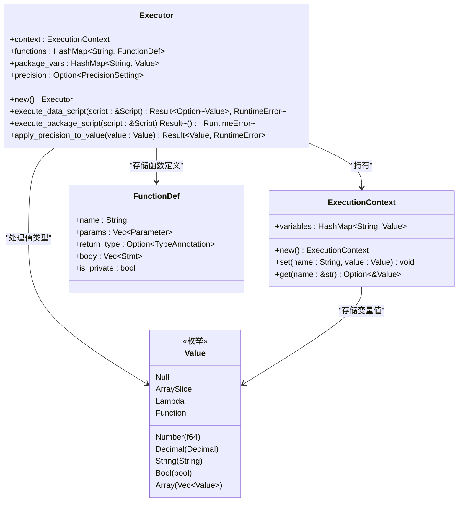
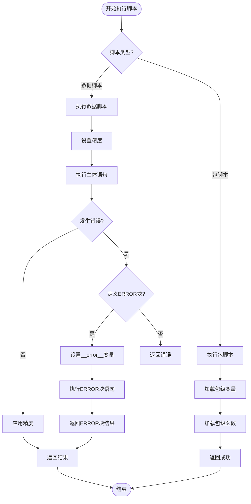
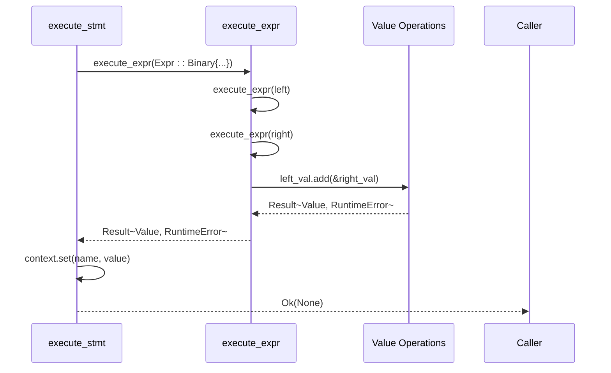
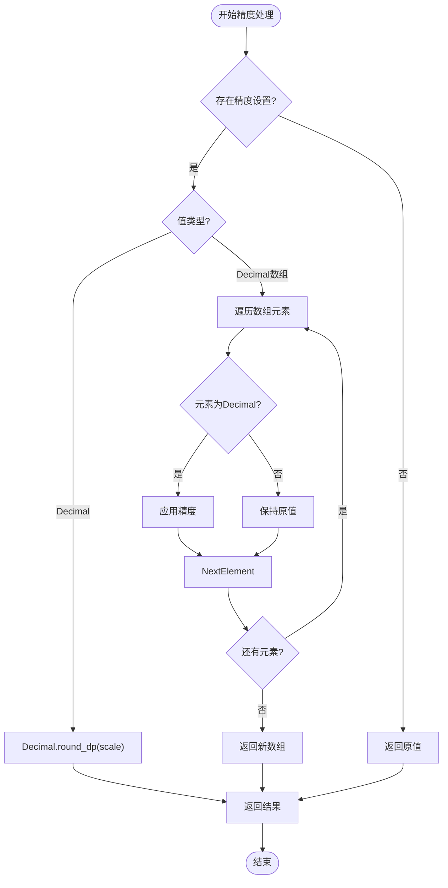

# 核心执行器

<cite>
**本文档中引用的文件**  
- [mod.rs](file://src/executor/mod.rs)
- [context.rs](file://src/executor/context.rs)
- [statement.rs](file://src/executor/statement.rs)
- [expression.rs](file://src/executor/expression.rs)
- [ast.rs](file://src/parser/ast.rs)
- [runtime.rs](file://src/runtime.rs)
- [api.rs](file://src/api.rs)
</cite>

## 目录
1. [简介](#简介)
2. [执行器结构设计](#执行器结构设计)
3. [执行上下文与状态管理](#执行上下文与状态管理)
4. [脚本执行流程](#脚本执行流程)
5. [语句与表达式执行机制](#语句与表达式执行机制)
6. [错误处理与ERROR块执行](#错误处理与error块执行)
7. [数值精度控制](#数值精度控制)
8. [API调用示例](#api调用示例)
9. [总结](#总结)

## 简介

DPLang的核心执行器（Executor）是整个语言解释器的运行时核心组件，负责解析后的脚本执行、变量管理、函数调用、错误处理以及精度控制。执行器通过递归遍历抽象语法树（AST）来实现脚本的逐行执行，支持数据脚本和包脚本两种模式。其设计注重金融计算场景下的精确性与稳定性，特别引入了Decimal类型和精度控制机制。

本文档将深入分析执行器的内部结构、执行逻辑、错误处理机制及精度控制实现，为开发者提供全面的技术参考。

## 执行器结构设计

执行器（Executor）是DPLang中负责脚本执行的核心结构体，封装了执行所需的所有状态和功能。其设计遵循模块化原则，将上下文管理、函数表、变量存储和精度设置分离，确保执行过程的清晰与可维护性。



**图示来源**  
- [mod.rs](file://src/executor/mod.rs#L25-L34)
- [context.rs](file://src/executor/context.rs#L7-L10)
- [runtime.rs](file://src/runtime.rs#L9-L34)
- [ast.rs](file://src/parser/ast.rs#L189-L196)

**本节来源**  
- [mod.rs](file://src/executor/mod.rs#L25-L34)
- [context.rs](file://src/executor/context.rs#L7-L10)

## 执行上下文与状态管理

执行器通过`ExecutionContext`结构体管理当前执行环境中的变量状态。该上下文采用哈希表存储变量名与值的映射，支持动态变量的创建与访问。执行器在执行过程中会不断更新上下文，确保变量作用域的正确性。

`ExecutionContext`提供了`set`和`get`方法用于变量的写入与读取。在函数调用或Lambda表达式执行时，执行器会保存当前上下文，在执行完成后恢复，从而实现作用域隔离。这种设计避免了变量污染，保证了执行的可预测性。

此外，执行器还维护了包级函数表（`functions`）和包级变量表（`package_vars`），用于存储脚本中定义的全局函数和变量。这些表在`execute_package_script`方法中被初始化，并在数据脚本执行时可供访问。

**本节来源**  
- [mod.rs](file://src/executor/mod.rs#L27-L31)
- [context.rs](file://src/executor/context.rs#L7-L26)

## 脚本执行流程

执行器提供了两个核心方法：`execute_data_script`和`execute_package_script`，分别用于执行数据处理脚本和包定义脚本。

### 数据脚本执行

`execute_data_script`方法负责执行数据处理逻辑。其执行流程如下：
1. 提取脚本中的精度设置并更新执行器状态
2. 调用`execute_body`方法执行脚本主体
3. 若执行过程中发生错误且定义了ERROR块，则执行ERROR块
4. 对返回值应用精度控制后返回

该方法确保了在金融计算中即使发生错误也能进行优雅降级处理，通过ERROR块提供备用计算路径。

### 包脚本执行

`execute_package_script`方法用于加载包级定义。其执行流程包括：
1. 遍历包级变量定义，计算初始值并存入`package_vars`和当前上下文
2. 遍历包级函数定义，将其存入`functions`映射表
3. 返回成功状态

此方法实现了模块化编程支持，允许将常用函数和常量封装为包供其他脚本引用。



**图示来源**  
- [mod.rs](file://src/executor/mod.rs#L47-L83)
- [mod.rs](file://src/executor/mod.rs#L97-L116)

**本节来源**  
- [mod.rs](file://src/executor/mod.rs#L47-L116)

## 语句与表达式执行机制

执行器通过递归遍历AST实现语句和表达式的求值。这一过程由`statement.rs`和`expression.rs`两个模块协同完成。

### 语句执行

`execute_stmt`方法处理所有类型的语句，包括赋值、返回、条件分支、表达式语句和解构赋值。每种语句类型都有对应的处理逻辑：
- **赋值语句**：计算右侧表达式的值并存入上下文
- **返回语句**：计算表达式值并作为函数返回值
- **条件语句**：计算条件表达式，根据布尔值决定执行then或else分支
- **解构赋值**：将数组值按模式分解并绑定到多个变量

语句执行采用短路返回机制，一旦遇到`return`语句即终止当前执行体并返回结果。

### 表达式求值

`execute_expr`方法是表达式求值的核心，支持多种表达式类型：
- **字面量**：直接构造对应的`Value`枚举实例
- **标识符**：从上下文中查找变量值，特殊内置变量（如`_index`）通过`get_builtin_variable`获取
- **二元/一元运算**：递归求值操作数后调用`Value`的对应运算方法
- **函数调用**：通过`execute_call`处理，支持内置函数、用户函数和Lambda
- **索引与切片**：支持数组访问和时间序列访问（如`var[-1]`）
- **管道**：实现函数式编程风格的数据流处理

表达式求值的递归特性使其能够处理任意复杂度的嵌套表达式，确保语言的表达能力。



**图示来源**  
- [statement.rs](file://src/executor/statement.rs#L9-L67)
- [expression.rs](file://src/executor/expression.rs#L10-L259)
- [runtime.rs](file://src/runtime.rs#L146-L407)

**本节来源**  
- [statement.rs](file://src/executor/statement.rs#L9-L67)
- [expression.rs](file://src/executor/expression.rs#L10-L259)

## 错误处理与ERROR块执行

执行器实现了完善的错误处理机制，特别针对金融计算场景设计了ERROR块执行流程。当`execute_data_script`执行主体发生错误时，若脚本定义了ERROR块，执行器将自动切换到错误处理模式。

错误处理流程如下：
1. 捕获执行主体的错误结果
2. 检查是否存在ERROR块定义
3. 若存在，将错误信息存入`__error__`特殊变量
4. 逐条执行ERROR块中的语句
5. 若ERROR块中有`return`语句，则返回其结果；否则返回`null`

这种设计允许开发者定义优雅的降级策略，例如在主计算逻辑失败时使用备用算法或默认值，确保系统在异常情况下仍能产生合理输出。

**本节来源**  
- [mod.rs](file://src/executor/mod.rs#L56-L73)

## 数值精度控制

金融计算对数值精度有严格要求，DPLang通过`apply_precision_to_value`方法实现精确的精度控制。该方法基于`PrecisionSetting`配置，对`Decimal`类型的值进行小数位数的四舍五入。

### 实现原理

`apply_precision_to_value`方法的执行逻辑：
1. 检查是否存在精度设置
2. 若存在，根据值类型分别处理：
   - **Decimal值**：调用`round_dp`方法进行指定小数位的四舍五入
   - **Decimal数组**：对数组中每个Decimal元素应用精度
   - **其他类型**：保持不变
3. 返回处理后的值

该方法在`execute_data_script`的最后阶段被调用，确保所有输出值都符合预设的精度要求。

### 金融计算意义

在金融领域，浮点数计算可能导致累积误差，影响交易、计费等关键业务。通过强制精度控制：
- 避免了`0.1 + 0.2 != 0.3`这类浮点精度问题
- 确保财务报表、交易价格等关键数据的准确性
- 符合金融行业对数据精确性的合规要求
- 提高系统在长时间运行下的数值稳定性



**图示来源**  
- [mod.rs](file://src/executor/mod.rs#L124-L148)
- [runtime.rs](file://src/runtime.rs#L138-L143)

**本节来源**  
- [mod.rs](file://src/executor/mod.rs#L124-L148)
- [runtime.rs](file://src/runtime.rs#L138-L143)

## API调用示例

开发者可以通过`api.rs`提供的公共API在Rust程序中直接调用DPLang执行器。以下为典型使用示例：

```rust
use dp_lang::DPLangInterpreter;
use std::collections::HashMap;

// 创建解释器实例
let source = r#"
-- INPUT price:number, quantity:number --
-- OUTPUT total:decimal --

// 设置精度为2位小数
PRECISION 2

total = price * quantity
return [total]
"#;

let interpreter = DPLangInterpreter::new(source);

// 准备输入数据
let mut input = HashMap::new();
input.insert("price".to_string(), Value::Number(19.99));
input.insert("quantity".to_string(), Value::Number(3.0));

// 执行脚本
let result = interpreter.execute(vec![input]);
match result {
    Ok(output) => println!("计算结果: {:?}", output),
    Err(e) => println!("执行错误: {}", e),
}
```

该示例展示了如何在宿主程序中嵌入DPLang脚本，实现动态计算逻辑。API还支持从文件加载脚本、JSON/CSV格式的输入输出等高级功能。

**本节来源**  
- [api.rs](file://src/api.rs#L10-L45)

## 总结

DPLang的核心执行器是一个功能完备、设计精巧的运行时系统。其通过`Executor`结构体统一管理执行状态，利用递归AST遍历实现语句和表达式的求值，结合上下文管理、函数调用、错误处理和精度控制等机制，为金融计算场景提供了可靠的语言支持。

执行器的设计体现了以下几个关键优势：
- **模块化**：将上下文、函数表、变量存储等职责分离
- **健壮性**：完善的错误处理机制确保系统稳定性
- **精确性**：基于Decimal的精度控制满足金融计算要求
- **灵活性**：支持多种数据格式和执行模式

这些特性使DPLang执行器不仅适用于金融领域，也可扩展到其他对计算精度和系统稳定性有高要求的应用场景。