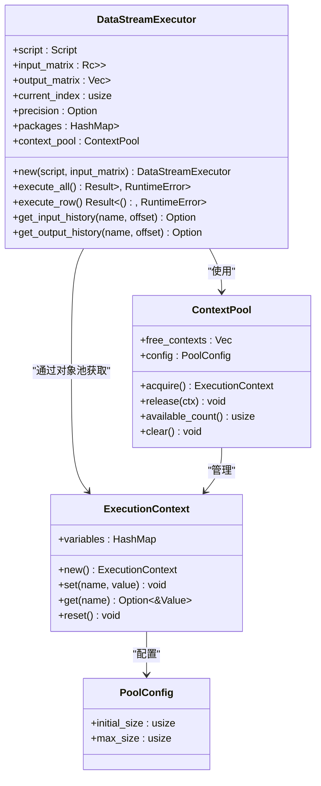
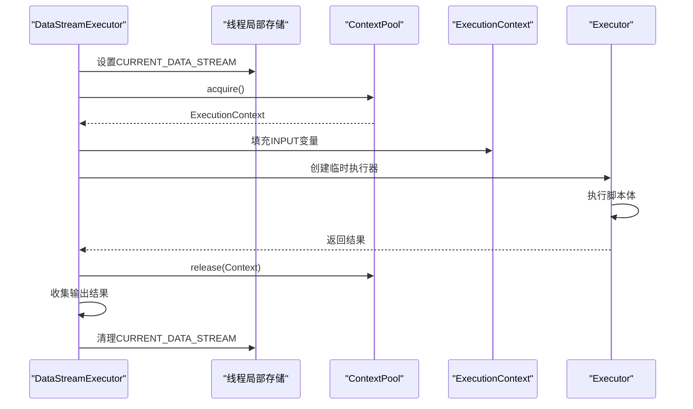
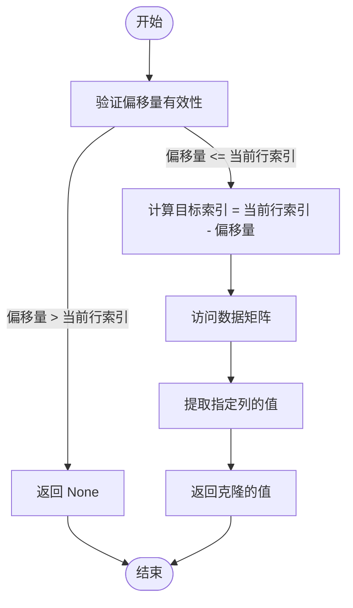
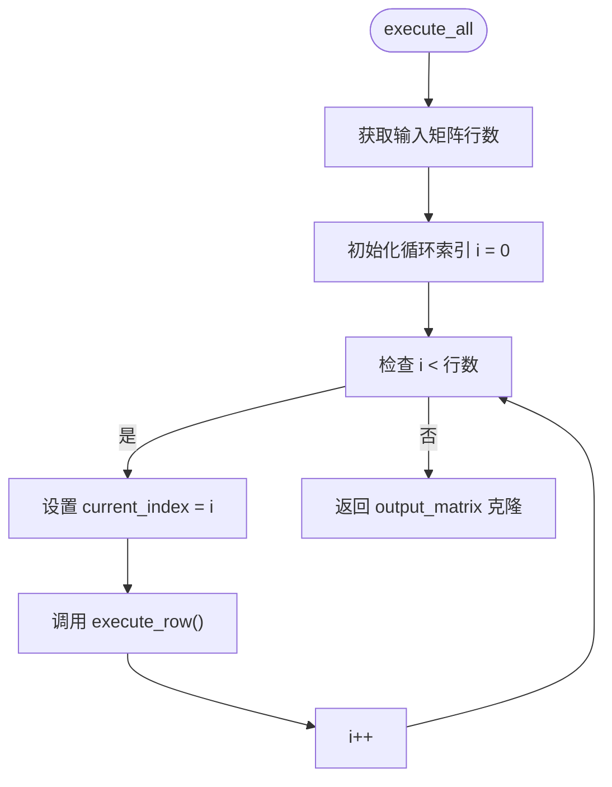

# 流式执行器

<cite>
**Referenced Files in This Document**  
- [data_stream.rs](file://src/executor/data_stream.rs)
- [context_pool.rs](file://src/executor/context_pool.rs)
- [context.rs](file://src/executor/context.rs)
- [builtin.rs](file://src/executor/builtin.rs)
- [streaming.rs](file://src/executor/streaming.rs)
</cite>

## 目录
1. [简介](#简介)
2. [核心架构](#核心架构)
3. [零拷贝输入设计](#零拷贝输入设计)
4. [行级执行流程](#行级执行流程)
5. [上下文对象池机制](#上下文对象池机制)
6. [时间序列历史访问](#时间序列历史访问)
7. [批量执行协调](#批量执行协调)
8. [性能优势分析](#性能优势分析)

## 简介
DPLang流式执行器（DataStreamExecutor）是专为处理大规模时间序列数据而设计的核心组件。该执行器采用逐行处理模式，能够高效处理CSV流数据等大规模数据集，通过零拷贝设计和对象池优化等技术手段，显著提升了数据处理性能。本文档详细阐述其架构设计、关键机制和性能优势。

## 核心架构
流式执行器采用分层架构设计，核心组件包括数据流执行器、上下文对象池和执行上下文。执行器通过线程局部变量与上下文对象池协同工作，实现高效的行级处理。



**Diagram sources**  
- [data_stream.rs](file://src/executor/data_stream.rs#L17-L337)
- [context_pool.rs](file://src/executor/context_pool.rs#L7-L83)
- [context.rs](file://src/executor/context.rs#L7-L26)

**Section sources**  
- [data_stream.rs](file://src/executor/data_stream.rs#L1-L338)
- [context_pool.rs](file://src/executor/context_pool.rs#L1-L137)
- [context.rs](file://src/executor/context.rs#L1-L27)

## 零拷贝输入设计
流式执行器通过Rc<Vec<HashMap<String, Value>>>智能指针实现输入矩阵的零拷贝设计。这种设计允许多个执行器实例共享同一份输入数据，避免了数据复制带来的内存开销和性能损耗。

输入矩阵的设计特点：
- 使用Rc（引用计数）智能指针实现数据共享
- Vec容器存储按行组织的时间序列数据
- HashMap<String, Value>结构存储每行的列名-值对
- 只读共享，确保数据一致性

当输入为空时，执行器会将其规范化为包含一个空行的矩阵，确保处理逻辑的一致性。

**Section sources**  
- [data_stream.rs](file://src/executor/data_stream.rs#L22-L48)

## 行级执行流程
execute_row方法是流式执行器的核心执行单元，负责处理单行数据。该方法通过线程局部变量CURRENT_DATA_STREAM与上下文对象池协同工作，实现高效的行级处理。



**Diagram sources**  
- [data_stream.rs](file://src/executor/data_stream.rs#L272-L336)
- [context_pool.rs](file://src/executor/context_pool.rs#L54-L72)

**Section sources**  
- [data_stream.rs](file://src/executor/data_stream.rs#L272-L336)

### 执行流程详解
1. **线程局部变量设置**：将当前执行器实例指针存入线程局部存储，供ref函数等访问历史数据
2. **上下文获取**：从对象池中获取可重用的执行上下文
3. **输入变量填充**：将当前行的输入数据填充到执行上下文中
4. **脚本执行**：创建临时执行器并执行脚本体
5. **上下文归还**：将使用完毕的上下文归还到对象池
6. **输出收集**：将执行结果收集到输出矩阵
7. **线程局部变量清理**：清理线程局部存储中的执行器引用

## 上下文对象池机制
上下文对象池（ContextPool）通过对象复用技术优化内存分配，避免了每行处理时创建新ExecutionContext的开销。

```mermaid
classDiagram
class ContextPool {
+free_contexts : Vec<ExecutionContext>
+config : PoolConfig
+acquire() ExecutionContext
+release(ctx) void
}
class ExecutionContext {
+variables : HashMap<String, Value>
+reset() void
}
ContextPool --> ExecutionContext : "管理"
note right of ContextPool
对象池配置：
- 初始大小：16
- 最大大小：1024
end note
```

**Diagram sources**  
- [context_pool.rs](file://src/executor/context_pool.rs#L7-L83)
- [context.rs](file://src/executor/context.rs#L7-L26)

**Section sources**  
- [context_pool.rs](file://src/executor/context_pool.rs#L1-L137)

### 对象池工作原理
- **预分配**：初始化时预创建16个ExecutionContext实例
- **获取**：调用acquire()时优先从空闲队列获取，队列为空则创建新实例
- **重置**：获取的上下文会调用reset()方法清空变量，确保状态干净
- **归还**：使用完毕后通过release()归还，未达最大容量时回收复用
- **容量控制**：超过1024个空闲上下文时直接丢弃，防止内存无限增长

## 时间序列历史访问
流式执行器通过get_input_history和get_output_history方法实现时间序列数据的历史引用功能，支持close[-1]等语法的实现。



**Diagram sources**  
- [data_stream.rs](file://src/executor/data_stream.rs#L158-L168)
- [data_stream.rs](file://src/executor/data_stream.rs#L225-L235)

**Section sources**  
- [data_stream.rs](file://src/executor/data_stream.rs#L158-L235)

### 历史访问实现原理
- **输入历史访问**：通过当前行索引减去偏移量计算目标行索引，从input_matrix中获取对应行的列值
- **输出历史访问**：类似输入历史访问，但从output_matrix中获取已计算的输出值
- **边界检查**：确保偏移量不超过当前行索引，防止越界访问
- **空值处理**：目标行或列不存在时返回None，调用方需处理空值情况

## 批量执行协调
execute_all方法负责协调行级执行与结果累积，实现完整的数据流处理过程。



**Diagram sources**  
- [data_stream.rs](file://src/executor/data_stream.rs#L146-L154)

**Section sources**  
- [data_stream.rs](file://src/executor/data_stream.rs#L146-L154)

### 协调机制
- **顺序处理**：按行索引顺序逐行处理，确保时间序列的时序一致性
- **状态管理**：维护current_index状态变量，跟踪当前处理进度
- **结果累积**：将每行的执行结果累积到output_matrix中
- **完整返回**：处理完成后返回完整的输出矩阵克隆

## 性能优势分析
流式执行器在处理CSV流数据时展现出显著的性能优势，主要体现在以下几个方面：

### 内存效率
- **零拷贝设计**：Rc智能指针避免数据复制，大幅降低内存占用
- **对象池优化**：上下文对象池减少内存分配次数，降低GC压力
- **增量处理**：逐行处理避免一次性加载全部数据到内存

### 执行效率
- **局部性优化**：线程局部变量减少跨线程通信开销
- **状态复用**：执行上下文重用避免重复初始化
- **批处理友好**：适合与流式数据源（如CSV解析器）配合使用

### 扩展性
- **并行处理**：可通过分片输入矩阵实现并行处理
- **内存控制**：对象池容量限制防止内存无限增长
- **错误隔离**：单行处理错误不会影响整体执行流程

这些设计使得流式执行器能够高效处理大规模时间序列数据，在金融数据分析等场景中表现出色。

**Section sources**  
- [data_stream.rs](file://src/executor/data_stream.rs#L146-L154)
- [context_pool.rs](file://src/executor/context_pool.rs#L32-L83)