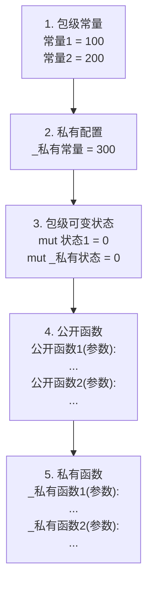

# 代码组织

<cite>
**Referenced Files in This Document**   
- [dev_logs/6.最佳实践.md](file://dev_logs/6.最佳实践.md)
- [src/parser/ast.rs](file://src/parser/ast.rs)
- [src/parser/mod.rs](file://src/parser/mod.rs)
- [src/executor/mod.rs](file://src/executor/mod.rs)
</cite>

## 目录
1. [引言](#引言)
2. [数据脚本结构](#数据脚本结构)
3. [包脚本结构](#包脚本结构)
4. [分段注释规范](#分段注释规范)
5. [代码组织原则](#代码组织原则)
6. [结论](#结论)

## 引言

本文档旨在为 DPLang 语言提供代码组织结构的指导规范，重点介绍数据脚本和包脚本的标准结构模板。通过遵循这些最佳实践，开发者可以编写出结构清晰、逻辑分明、易于维护和理解的大型脚本。文档内容基于 `dev_logs/6.最佳实践.md` 中的指导原则，并结合了语言解析器和执行器的实现细节，确保建议的结构与语言设计和运行时行为保持一致。

**Section sources**
- [dev_logs/6.最佳实践.md](file://dev_logs/6.最佳实践.md#L1-L532)

## 数据脚本结构

数据脚本是 DPLang 中用于处理和转换数据的核心单元。其结构应遵循清晰的逻辑顺序，以提高可读性和可维护性。根据最佳实践，推荐的数据脚本结构如下：

1.  **错误处理声明**：在脚本开头使用 `-- ERROR --` 和 `-- ERROR_END --` 块来定义如何处理运行时异常。这为脚本提供了健壮的错误恢复机制。
2.  **历史数据获取**：集中获取所需的历史数据，例如 `close[-20:0]`。避免在后续计算中重复获取，以提高性能。
3.  **基础指标计算**：计算不依赖于其他复杂指标的简单技术指标，如移动平均线 `MA(close, 5)`。
4.  **派生指标计算**：基于基础指标计算更复杂的派生指标，如使用 `safe_div` 函数计算涨幅。
5.  **业务逻辑**：实现核心的业务判断和决策逻辑，如信号生成或数据过滤。

这种自上而下的结构确保了代码的逻辑流清晰，便于理解和调试。

```mermaid
flowchart TD
A["1. 错误处理声明\n-- ERROR --\n...\n-- ERROR_END --"] --> B["2. 获取历史数据\n历史数据 = close[-20:0]\n昨收 = close[-1]"]
B --> C["3. 计算基础指标\nma5 = MA(close, 5)\nma10 = MA(close, 10)"]
C --> D["4. 计算派生指标\n涨幅 = safe_div(...)\n是否新高 = ..."]
D --> E["5. 业务逻辑\nif 涨幅 > 0 and 是否新高:\n return [code, \"强势\", 涨幅]"]
```

**Diagram sources**
- [dev_logs/6.最佳实践.md](file://dev_logs/6.最佳实践.md#L394-L422)

**Section sources**
- [dev_logs/6.最佳实践.md](file://dev_logs/6.最佳实践.md#L394-L422)
- [src/executor/mod.rs](file://src/executor/mod.rs#L47-L83)
- [src/parser/ast.rs](file://src/parser/ast.rs#L255-L263)

## 包脚本结构

包脚本用于封装可重用的函数和常量。其结构应遵循分层组织原则，以明确区分不同类型的成员。推荐的包脚本结构如下：

1.  **包级常量**：定义脚本级别的常量，如 `涨停阈值 = 0.1`。这些是不可变的配置值。
2.  **私有配置**：以 `_` 开头的常量，用于包内部的配置，对外部不可见。
3.  **可变状态**：使用 `mut` 关键字声明的变量，用于存储包级的可变状态，如计数器或缓存。应谨慎使用。
4.  **公开函数**：不以 `_` 开头的函数，是包对外提供的公共接口。
5.  **私有函数**：以 `_` 开头的函数，仅在包内部使用，实现辅助逻辑。

这种分层结构有助于维护包的封装性，清晰地划分了公共接口和内部实现。



**Diagram sources**
- [dev_logs/6.最佳实践.md](file://dev_logs/6.最佳实践.md#L424-L453)

**Section sources**
- [dev_logs/6.最佳实践.md](file://dev_logs/6.最佳实践.md#L424-L453)
- [src/parser/ast.rs](file://src/parser/ast.rs#L236-L243)
- [src/parser/mod.rs](file://src/parser/mod.rs#L50-L80)

## 分段注释规范

为了进一步增强大型脚本的可读性，建议使用分段注释来划分代码区域。推荐使用 `=========` 分隔符配合有意义的注释来标记不同的逻辑区块。

例如：
```DPLang
# ========== 获取历史数据 ==========
历史20天 = past(close, 20, true)
历史成交量 = past(volume, 5)

# ========== 计算技术指标 ==========
ma5 = MA(close, 5)
ma10 = MA(close, 10)
[dif, dea, macd] = MACD(close, 12, 26, 9)

# ========== 信号判断 ==========
趋势向上 = ma5 > ma10
macd金叉 = dif > dea
```

这种分段方式使得代码结构一目了然，便于开发者快速定位到特定功能的实现区域。

**Section sources**
- [dev_logs/6.最佳实践.md](file://dev_logs/6.最佳实践.md#L478-L493)

## 代码组织原则

良好的代码组织不仅仅是遵循模板，更应理解其背后的原则：

- **单一职责**：每个代码块或函数应专注于完成一个明确的任务。
- **高内聚低耦合**：相关的功能应组织在一起（高内聚），而不同模块之间的依赖应尽可能减少（低耦合）。
- **可预测性**：遵循一致的命名和结构规范，使代码行为对其他开发者来说是可预测的。
- **可维护性**：清晰的结构和注释降低了维护成本，使未来的修改和扩展更加容易。

通过将这些原则与推荐的结构模板相结合，可以显著提升 DPLang 项目的代码质量和开发效率。

**Section sources**
- [dev_logs/6.最佳实践.md](file://dev_logs/6.最佳实践.md#L392-L493)

## 结论

本文档提供了 DPLang 数据脚本和包脚本的标准化组织结构指南。通过采用推荐的分层结构和分段注释规范，开发者可以创建出逻辑清晰、易于理解和维护的高质量代码。遵循这些最佳实践，不仅有助于个人开发，更能促进团队协作，确保代码库的整体一致性和健壮性。