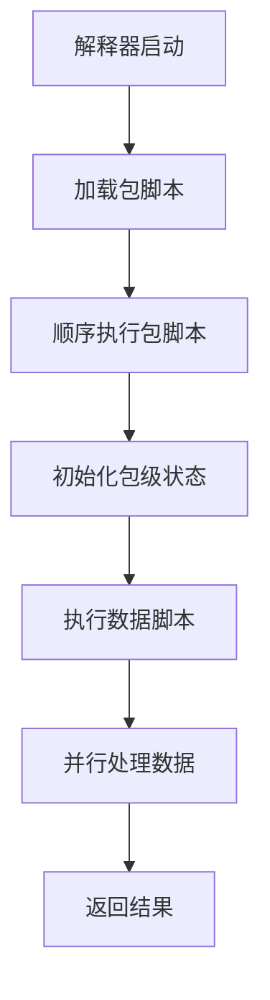

# 包级状态管理

<cite>
**Referenced Files in This Document**  
- [dev_logs/6.最佳实践.md](file://dev_logs/6.最佳实践.md)
- [src/package_loader.rs](file://src/package_loader.rs)
- [src/executor/mod.rs](file://src/executor/mod.rs)
- [src/executor/streaming.rs](file://src/executor/streaming.rs)
</cite>

## Table of Contents
1. [引言](#引言)
2. [包级可变状态的推荐用途](#包级可变状态的推荐用途)
3. [包级可变状态的谨慎使用场景](#包级可变状态的谨慎使用场景)
4. [包级可变状态的不推荐做法](#包级可变状态的不推荐做法)
5. [包脚本的执行特性](#包脚本的执行特性)
6. [最佳实践建议](#最佳实践建议)
7. [结论](#结论)

## 引言
在DPLang语言中，`mut`关键字用于声明包级可变状态。这种状态在包的生命周期内可以被修改，但其使用需要遵循特定的规则和最佳实践，以确保代码的安全性和可维护性。本文档旨在为开发者提供一份全面的指南，说明如何合理使用`mut`声明的可变状态，包括推荐用途、谨慎使用场景和不推荐的做法。通过结合`dev_logs/6.最佳实践.md`中的代码示例，我们将深入探讨包脚本的执行特性，并提供最佳实践建议，帮助开发者设计安全、高效的包结构。

## 包级可变状态的推荐用途
包级可变状态在DPLang中主要用于以下几种场景：

### 统计信息
使用`mut`声明的变量来统计函数调用次数或错误计数，是一种合理且常见的做法。例如，在`统计包`中，可以定义`mut 调用次数 = 0`和`mut 错误计数 = 0`，每次函数被调用或发生错误时递增相应的计数器。

### 缓存
为了提高性能，可以使用`mut`声明的变量来缓存计算结果或频繁访问的数据。例如，`mut _缓存 = []`可以用来存储最近的计算结果，`mut _最后更新时间 = 0`可以用来记录缓存的最后更新时间，从而避免重复计算。

### 配置状态
包级可变状态也可以用于存储配置信息，这些配置可以在包内部被修改。例如，`mut 调试级别 = 0`可以用来控制日志输出的详细程度，通过`更新调试级别(level:number)`函数来动态调整。

**Section sources**
- [dev_logs/6.最佳实践.md](file://dev_logs/6.最佳实践.md#L138-L152)

## 包级可变状态的谨慎使用场景
尽管包级可变状态在某些场景下非常有用，但在处理业务状态的累计时需要格外谨慎。

### 业务状态累计
在包脚本中使用`mut`声明的变量来累计业务状态（如收益、交易次数等）是可行的，因为包脚本是顺序执行且仅执行一次的。例如，`mut 累计收益 = 0.0`和`mut 交易次数 = 0`可以在`记录交易(收益:number)`函数中被更新。然而，这种做法需要确保包的执行顺序和逻辑正确，以避免数据不一致的问题。

**Section sources**
- [dev_logs/6.最佳实践.md](file://dev_logs/6.最佳实践.md#L157-L166)

## 包级可变状态的不推荐做法
在某些情况下，使用包级可变状态是不推荐的，甚至可能导致代码难以维护和调试。

### 频繁修改的临时状态
将`mut`声明的变量用作频繁修改的临时状态是不推荐的。例如，`mut _临时计数 = 0`应该作为函数参数传递，而不是在包级别声明。这样可以避免状态的意外修改和副作用。

### 应该用局部变量的场景
对于应该在函数内部定义的临时结果，不应该使用包级可变状态。例如，`mut _临时结果 = 0`应该在函数内定义为局部变量，以确保其作用域和生命周期的清晰。

**Section sources**
- [dev_logs/6.最佳实践.md](file://dev_logs/6.最佳实践.md#L171-L176)

## 包脚本的执行特性
理解包脚本的执行特性对于合理使用包级可变状态至关重要。

### 顺序执行且仅执行一次
包脚本在解释器启动时顺序执行一次，这意味着包级`mut`变量只能在包内被修改，而数据脚本只能读取这些变量。这种执行模型确保了包级状态的初始化是安全的，不会受到并发执行的影响。

### 并发安全模型
DPLang的并发安全模型基于包脚本的顺序执行和数据脚本的纯函数并行执行。包脚本的顺序执行保证了包级状态的初始化是线程安全的，而数据脚本的纯函数特性允许它们在多线程环境中并行执行，从而提高性能。

**Diagram sources**
- [dev_logs/7.解释器实现设计.md](file://dev_logs/7.解释器实现设计.md#L1048-L1086)
- [src/executor/streaming.rs](file://src/executor/streaming.rs#L214-L237)

**Section sources**
- [dev_logs/7.解释器实现设计.md](file://dev_logs/7.解释器实现设计.md#L1048-L1086)
- [src/executor/streaming.rs](file://src/executor/streaming.rs#L214-L237)

## 最佳实践建议
为了帮助开发者设计安全、高效的包结构，我们提供以下最佳实践建议：

### 合理组织包结构
按照`dev_logs/6.最佳实践.md`中的建议，合理组织包脚本的结构，包括包级常量、私有配置、包级可变状态、公开函数和私有函数。这种结构化的组织方式有助于提高代码的可读性和可维护性。

### 避免变量遮蔽
在使用`mut`声明的变量时，应避免变量遮蔽的问题。例如，不要在Lambda表达式中使用与外部变量同名的参数，以免引起编译错误。

### 使用有意义的命名
为包级可变状态使用描述性强、意义明确的名称，避免使用模糊或无意义的名称。例如，使用`调用次数`而不是`count`，使用`累计收益`而不是`total`。

### 文档化状态用途
在代码中通过注释明确说明每个包级可变状态的用途和修改逻辑，以便其他开发者能够快速理解其作用。

**Section sources**
- [dev_logs/6.最佳实践.md](file://dev_logs/6.最佳实践.md#L424-L453)

## 结论
包级可变状态是DPLang中一个强大的特性，但其使用需要遵循特定的规则和最佳实践。通过合理使用`mut`声明的变量，开发者可以实现统计信息、缓存和配置状态等功能。然而，在处理业务状态累计时需要格外谨慎，并避免将包级可变状态用作临时变量或应作为函数参数传递的数据。理解包脚本的执行特性（顺序执行且仅执行一次）对于设计安全、高效的包结构至关重要。遵循本文档中的最佳实践建议，可以帮助开发者充分利用包级可变状态的优势，同时避免潜在的问题。