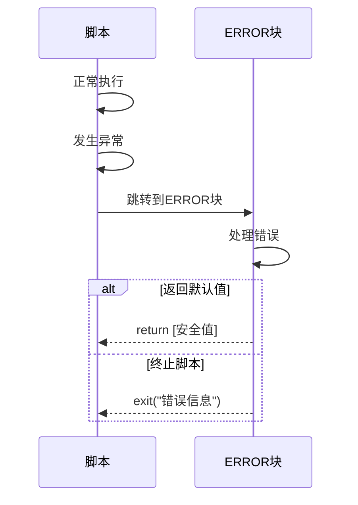
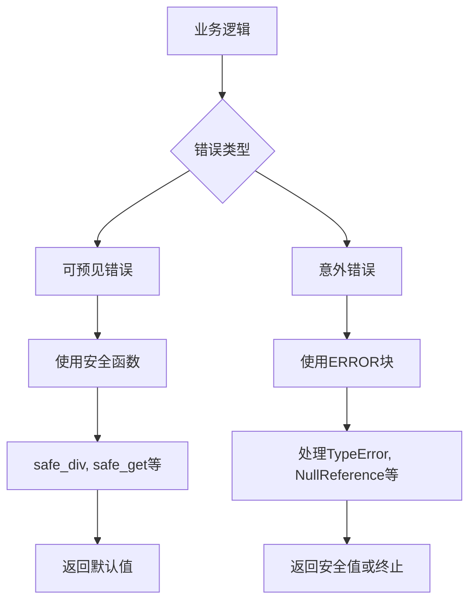
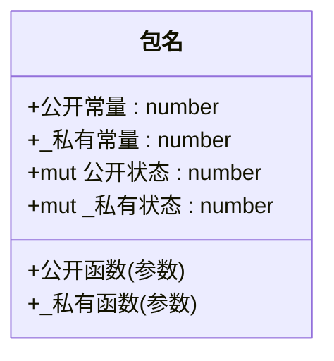

# 最佳实践

<cite>
**本文档引用文件**   
- [6.最佳实践.md](file://dev_logs/6.最佳实践.md)
- [3.类型系统和错误处理.md](file://dev_logs/3.类型系统和错误处理.md)
- [2.语法参考.md](file://dev_logs/2.语法参考.md)
- [builtin.rs](file://src/executor/builtin.rs)
- [expression.rs](file://src/executor/expression.rs)
- [data_stream.rs](file://src/executor/data_stream.rs)
</cite>

## 目录
1. [编码规范](#编码规范)
2. [性能优化技巧](#性能优化技巧)
3. [错误处理模式](#错误处理模式)
4. [包设计原则](#包设计原则)
5. [综合示例](#综合示例)

## 编码规范

### 命名约定

遵循清晰、描述性的命名原则，提高代码可读性。

#### 包级常量
使用描述性名称，清晰表达用途。

**Section sources**
- [6.最佳实践.md](file://dev_logs/6.最佳实践.md#L7-L19)

#### 局部变量
命名应简洁明确，体现业务含义。

**Section sources**
- [6.最佳实践.md](file://dev_logs/6.最佳实践.md#L21-L35)

#### 私有成员
使用 `_` 前缀标识私有成员。

**Section sources**
- [6.最佳实践.md](file://dev_logs/6.最佳实践.md#L37-L55)

#### 函数命名
使用动词开头或描述性名称。

**Section sources**
- [6.最佳实践.md](file://dev_logs/6.最佳实践.md#L57-L76)

#### Lambda 参数
根据逻辑复杂度选择简洁单字母或描述性名称。

**Section sources**
- [6.最佳实践.md](file://dev_logs/6.最佳实践.md#L78-L94)

### 代码格式化建议

#### 避免变量遮蔽
DPLang 完全禁止变量遮蔽，编译期会报错。应使用新变量名或管道操作避免中间变量。

```mermaid
flowchart TD
A[原始变量] --> B{是否需要修改}
B --> |否| C[使用新变量名]
B --> |是| D[使用管道操作]
C --> E[ma5 = MA(close, 5)]
C --> F[ma5_scaled = ma5 * 2]
D --> G[结果 = array |> map(x -> x * 2) |> filter(x -> x > 10)]
```

**Diagram sources **
- [6.最佳实践.md](file://dev_logs/6.最佳实践.md#L96-L129)
- [1.核心设计.md](file://dev_logs/1.核心设计.md#L64-L78)

#### 注释规范
注释应解释业务逻辑或复杂计算，避免重复代码内容。

**Section sources**
- [6.最佳实践.md](file://dev_logs/6.最佳实践.md#L455-L476)

## 性能优化技巧

### 利用向量化运算替代循环

DPLang 支持向量运算和高阶函数，应避免使用循环。

#### 向量运算
支持向量与向量、向量与标量的逐元素运算。

```mermaid
flowchart LR
A[向量运算] --> B[向量+向量]
A --> C[向量*标量]
A --> D[向量>标量]
B --> E[[1,2,3]+[4,5,6]=[5,7,9]]
C --> F[[1,2,3]*2=[2,4,6]]
D --> G[[1,2,3]>1=[false,true,true]]
```

**Diagram sources **
- [2.语法参考.md](file://dev_logs/2.语法参考.md#L202-L224)

#### 高阶函数
使用 map、filter、reduce 等高阶函数替代循环。

```mermaid
flowchart TD
A[数据处理] --> B[map-转换]
A --> C[filter-筛选]
A --> D[reduce-聚合]
B --> E[map(array, x -> x * 2)]
C --> F[filter(array, x -> x > 10)]
D --> G[reduce(array, (a,b) -> a + b)]
```

**Diagram sources **
- [2.语法参考.md](file://dev_logs/2.语法参考.md#L327-L401)
- [builtin.rs](file://src/executor/builtin.rs#L160-L271)

### 合理使用流式处理

#### 管道优化
先过滤减少数据量，再进行复杂计算。

```mermaid
flowchart LR
A[大数据集] --> B{优化策略}
B --> C[先过滤后映射]
B --> D[先映射后过滤]
C --> E[large_array |> filter(x -> x > 阈值) |> map(x -> 复杂计算(x))]
D --> F[large_array |> map(x -> 复杂计算(x)) |> filter(x -> x > 阈值)]
C --> G[推荐：减少计算量]
D --> H[不推荐：增加计算量]
```

**Diagram sources **
- [6.最佳实践.md](file://dev_logs/6.最佳实践.md#L331-L343)

#### 避免重复计算
对时间序列数据只计算一次，利用引用语义。

```mermaid
flowchart TD
A[历史数据] --> B{计算策略}
B --> C[只计算一次]
B --> D[重复计算]
C --> E[历史数据 = close[-20:0]]
C --> F[最大值 = max(...历史数据)]
C --> G[最小值 = min(...历史数据)]
D --> H[最大值 = max(...close[-20:0])]
D --> I[最小值 = min(...close[-20:0])]
C --> J[推荐：高效]
D --> K[不推荐：低效]
```

**Diagram sources **
- [6.最佳实践.md](file://dev_logs/6.最佳实践.md#L295-L310)

## 错误处理模式

### 优先使用安全函数

使用内置安全函数处理可预见的错误，返回 null 或默认值。

#### 安全函数列表
| 函数 | 用途 | 默认值参数 |
|------|------|-----------|
| safe_div | 安全除法 | default |
| safe_get | 安全数组访问 | default |
| safe_number | 安全类型转换 | default |

```mermaid
flowchart TD
A[错误处理] --> B[安全函数]
A --> C[ERROR块]
B --> D[safe_div(a, b, default=0.0)]
B --> E[safe_get(array, index, default=0)]
B --> F[safe_number(value, default=0)]
C --> G[处理意外错误]
```

**Diagram sources **
- [3.类型系统和错误处理.md](file://dev_logs/3.类型系统和错误处理.md#L154-L174)
- [builtin.rs](file://src/executor/builtin.rs#L498-L554)

### 使用ERROR块构建容错脚本

ERROR 块是延迟声明的错误处理函数，在脚本执行发生异常时被调用。

#### 执行机制
1. ERROR 块是声明语句，不影响后续代码正常执行
2. 当任何语句抛出异常时，代码立即停止在出错行
3. 跳转到 ERROR 块执行错误处理逻辑
4. ERROR 块可选择返回默认值或终止脚本



**Diagram sources **
- [3.类型系统和错误处理.md](file://dev_logs/3.类型系统和错误处理.md#L82-L152)
- [7.解释器实现设计.md](file://dev_logs/7.解释器实现设计.md#L1087-L1124)

#### _error 对象
- `_error.type` - 错误类型
  - `"ZeroDivision"` - 除零错误
  - `"TypeError"` - 类型错误
  - `"IndexOutOfBounds"` - 数组越界
  - `"NullReference"` - 空引用
- `_error.message` - 错误描述信息
- `_error.line` - 发生错误的行号

**Section sources**
- [3.类型系统和错误处理.md](file://dev_logs/3.类型系统和错误处理.md#L115-L123)

### 结合使用安全函数和ERROR块

推荐结合使用安全函数和 ERROR 块，分别处理可预见和意外错误。



**Section sources**
- [6.最佳实践.md](file://dev_logs/6.最佳实践.md#L373-L390)

## 包设计原则

### 创建可复用和易于维护的包

#### 包脚本结构
遵循标准的包脚本结构，提高可维护性。

```mermaid
flowchart TD
A[包脚本] --> B[包级常量]
A --> C[私有配置]
A --> D[包级可变状态]
A --> E[公开函数]
A --> F[私有函数]
B --> G[常量1 = 100]
C --> H[_私有常量 = 300]
D --> I[mut 状态1 = 0]
E --> J[公开函数1(参数)]
F --> K[_私有函数1(参数)]
```

**Diagram sources **
- [6.最佳实践.md](file://dev_logs/6.最佳实践.md#L424-L453)

#### 合理使用包级可变状态
- **推荐用途**：统计信息、缓存、配置状态
- **谨慎使用**：业务状态（包脚本顺序执行且仅执行一次）
- **不推荐**：频繁修改的临时状态、应作为函数参数传递的状态

**Section sources**
- [6.最佳实践.md](file://dev_logs/6.最佳实践.md#L131-L176)

#### 访问控制
使用 `_` 前缀表示私有成员，仅包内可访问。



**Diagram sources **
- [1.核心设计.md](file://dev_logs/1.核心设计.md#L98-L115)

## 综合示例

### 数据脚本结构
遵循标准的数据脚本结构，提高代码可读性。

```mermaid
flowchart TD
A[数据脚本] --> B[错误处理声明]
A --> C[获取历史数据]
A --> D[计算基础指标]
A --> E[计算派生指标]
A --> F[业务逻辑]
B --> G[-- ERROR -- ... -- ERROR_END --]
C --> H[历史数据 = close[-20:0]]
D --> I[ma5 = MA(close, 5)]
E --> J[涨幅 = safe_div(close - 昨收, 昨收, default=0.0)]
F --> K[if 涨幅 > 0: return [code, "强势", 涨幅]]
```

**Diagram sources **
- [6.最佳实践.md](file://dev_logs/6.最佳实践.md#L392-L422)

### 高精度计算
金融计算应使用 decimal 类型，避免浮点数精度问题。

```mermaid
flowchart TD
A[金融计算] --> B{数据类型}
B --> C[number类型]
B --> D[decimal类型]
C --> E[买入价 = 100.123]
C --> F[可能有精度误差]
D --> G[买入价 = decimal(100.123)]
D --> H[保持高精度]
D --> I[四舍五入到分]
C --> J[不推荐]
D --> K[推荐]
```

**Section sources**
- [6.最佳实践.md](file://dev_logs/6.最佳实践.md#L270-L293)