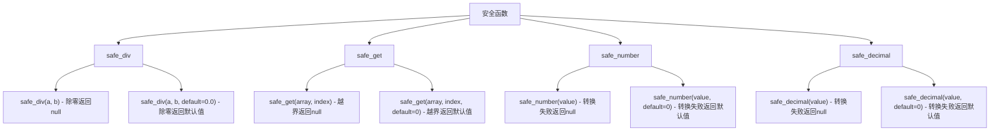
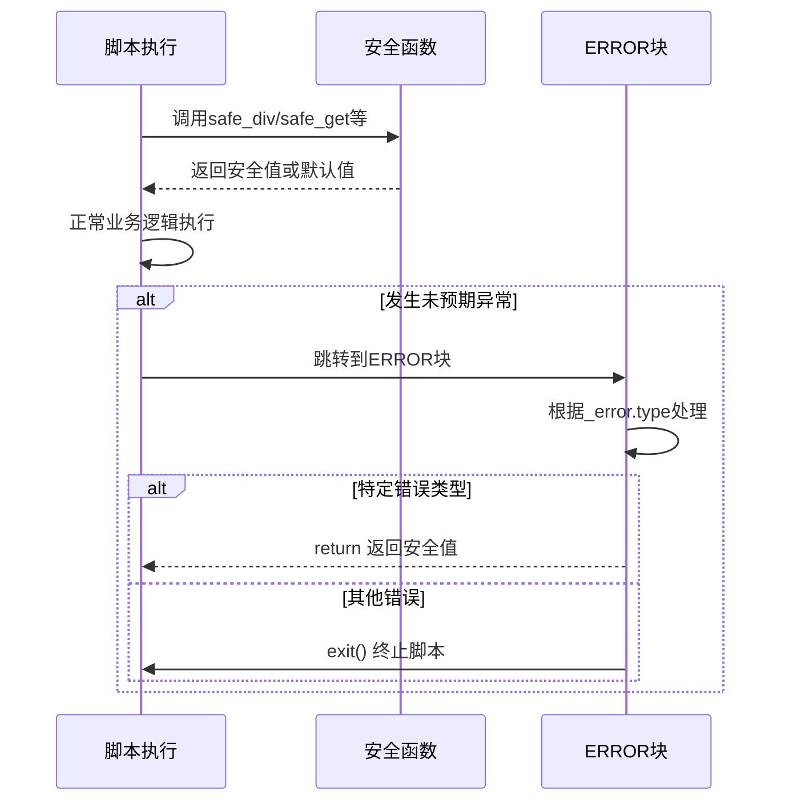
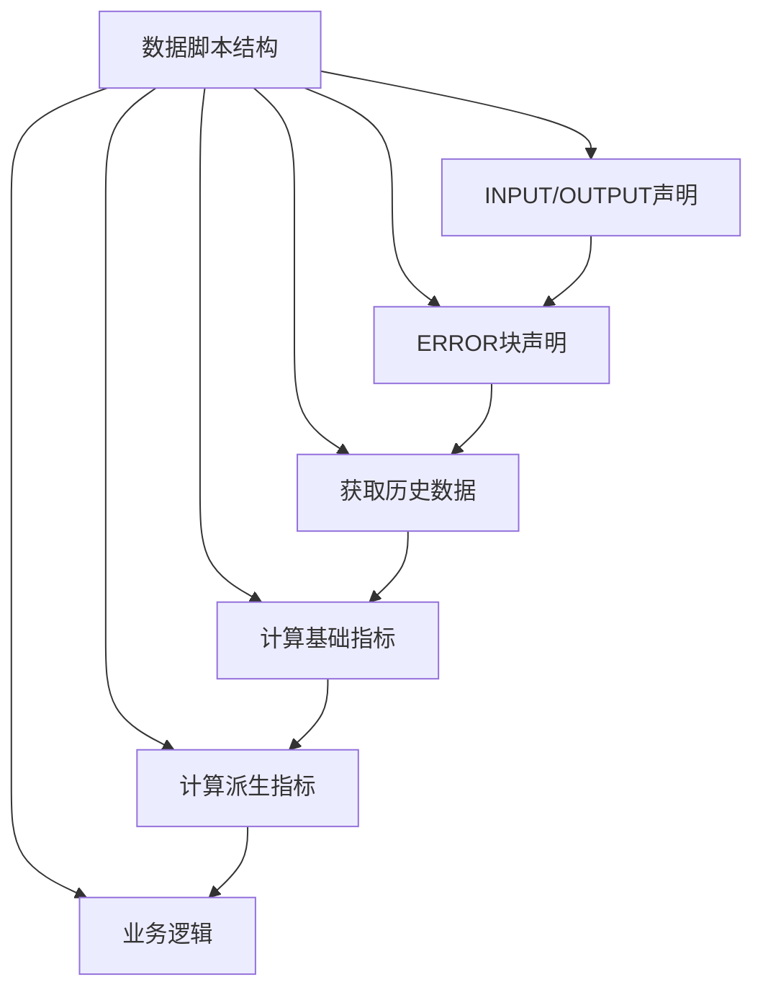

# 错误处理

<cite>
**Referenced Files in This Document**  
- [6.最佳实践.md](file://dev_logs/6.最佳实践.md)
- [3.类型系统和错误处理.md](file://dev_logs/3.类型系统和错误处理.md)
- [4.内置函数参考.md](file://dev_logs/4.内置函数参考.md)
- [builtin.rs](file://src/executor/builtin.rs)
</cite>

## 目录
1. [简介](#简介)
2. [ERROR块异常处理](#error块异常处理)
3. [安全函数使用](#安全函数使用)
4. [协同使用模式](#协同使用模式)
5. [最佳实践示例](#最佳实践示例)
6. [代码组织建议](#代码组织建议)

## 简介
本文档旨在说明如何在DPLang中结合使用ERROR块和安全函数构建容错脚本。通过合理运用这两种错误处理机制，可以确保脚本在面对数据异常时仍能稳定运行，提高生产环境下的可靠性。

**Section sources**
- [6.最佳实践.md](file://dev_logs/6.最佳实践.md#L345-L390)
- [3.类型系统和错误处理.md](file://dev_logs/3.类型系统和错误处理.md#L82-L175)

## ERROR块异常处理
ERROR块是一种延迟声明的错误处理机制，在脚本执行发生异常时被调用。

### 执行机制
- ERROR块是声明语句，不影响后续代码的正常执行
- 当任何语句抛出异常时，代码立即停止在出错行
- 跳转到ERROR块执行错误处理逻辑
- ERROR块可选择返回默认值或终止脚本

### 位置要求
- 一个脚本只能有一个ERROR块
- ERROR块必须在INPUT/OUTPUT声明之后，所有代码之前
- ERROR块内如果`return`，整个脚本终止，返回指定值
- ERROR块内如果`exit()`，整个数据流终止

### 错误类型
- `"ZeroDivision"` - 除零错误
- `"TypeError"` - 类型错误
- `"IndexOutOfBounds"` - 数组越界
- `"NullReference"` - 空引用

**Section sources**
- [3.类型系统和错误处理.md](file://dev_logs/3.类型系统和错误处理.md#L82-L124)
- [3.类型系统和错误处理.md](file://dev_logs/3.类型系统和错误处理.md#L125-L131)

## 安全函数使用
安全函数用于处理可预见的错误情况，避免异常发生。

### 主要安全函数


**Diagram sources**
- [4.内置函数参考.md](file://dev_logs/4.内置函数参考.md#L171-L191)
- [builtin.rs](file://src/executor/builtin.rs#L498-L555)

### 使用优势
- 避免冗长的手动检查代码
- 减少潜在的遗漏情况
- 提高代码可读性和维护性

**Section sources**
- [6.最佳实践.md](file://dev_logs/6.最佳实践.md#L312-L329)
- [4.内置函数参考.md](file://dev_logs/4.内置函数参考.md#L171-L197)

## 协同使用模式
ERROR块与安全函数应结合使用，形成完整的错误处理策略。

### 分层处理原则
1. **第一层 - 安全函数**：处理可预见的错误情况
2. **第二层 - ERROR块**：捕获和处理意外异常

### 典型应用场景
- 使用`safe_div`处理可能的除零情况
- 使用`safe_get`处理数组越界访问
- 在ERROR块中处理其他未预期的运行时异常



**Diagram sources**
- [6.最佳实践.md](file://dev_logs/6.最佳实践.md#L373-L389)
- [3.类型系统和错误处理.md](file://dev_logs/3.类型系统和错误处理.md#L176-L202)

**Section sources**
- [6.最佳实践.md](file://dev_logs/6.最佳实践.md#L373-L390)
- [3.类型系统和错误处理.md](file://dev_logs/3.类型系统和错误处理.md#L176-L202)

## 最佳实践示例
以下是结合使用ERROR块和安全函数的典型示例：

### 完整错误处理模式
```DPLang
-- INPUT code:string, open:number, close:number --
-- OUTPUT code:string, 涨跌幅:number, 状态:string --

-- ERROR --
# 根据错误类型处理
if _error.type == "ZeroDivision":
    return [code, 0, "除零错误"]
if _error.type == "NullReference":
    return [code, 0, "数据缺失"]
# 其他错误终止整个流程
exit("第" + string(_error.line) + "行发生错误: " + _error.message)
-- ERROR_END --

# 使用安全函数处理可预见错误
昨收 = offset(close, -1)
涨幅 = safe_div(close - 昨收, 昨收, default=0.0) * 100

return [code, 涨幅, "正常"]
```

**Section sources**
- [3.类型系统和错误处理.md](file://dev_logs/3.类型系统和错误处理.md#L134-L152)

## 代码组织建议
为了提高代码的可读性和维护性，建议按照以下结构组织代码：



**Diagram sources**
- [6.最佳实践.md](file://dev_logs/6.最佳实践.md#L396-L422)

**Section sources**
- [6.最佳实践.md](file://dev_logs/6.最佳实践.md#L393-L422)