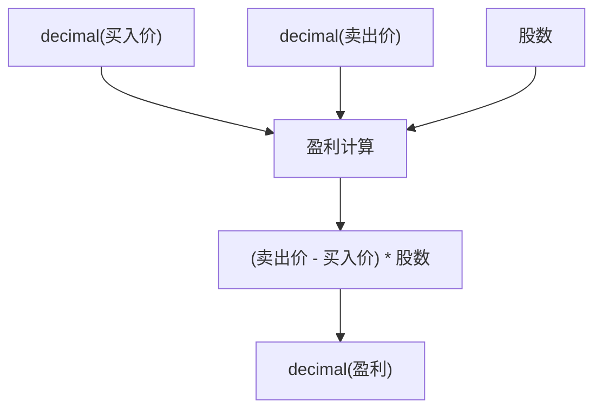
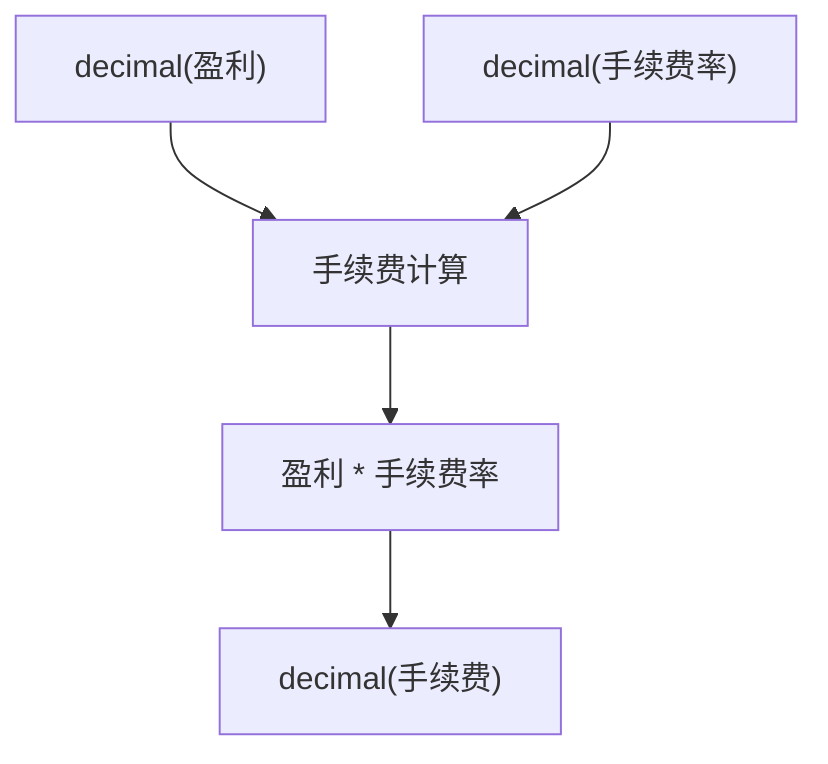

# 高精度计算

<cite>
**本文档引用的文件**   
- [dev_logs/6.最佳实践.md](file://dev_logs/6.最佳实践.md)
- [dev_logs/5.完整示例.md](file://dev_logs/5.完整示例.md)
- [src/runtime.rs](file://src/runtime.rs)
- [src/executor/mod.rs](file://src/executor/mod.rs)
</cite>

## 目录
1. [引言](#引言)
2. [高精度计算实践](#高精度计算实践)
3. [金融场景下的精度保持](#金融场景下的精度保持)
4. [结果四舍五入处理](#结果四舍五入处理)
5. [浮点数计算风险对比](#浮点数计算风险对比)
6. [总结](#总结)

## 引言
在金融计算场景中，数值精度至关重要。微小的计算误差可能在高频交易、复利计算或大规模资金处理中被放大，导致严重的财务偏差。DPLang 提供了基于 `decimal` 类型的高精度计算模式，通过精确的十进制运算避免了传统浮点数（`number`）的精度丢失问题。本指南将详细介绍如何在 DPLang 中正确使用高精度计算，确保财务分析脚本的可靠性。

## 高精度计算实践

### 启用高精度模式
在 DPLang 中，通过 `-- PRECISION decimal --` 声明来开启整个脚本的高精度计算模式。此声明应置于脚本的输入输出声明之后，所有业务逻辑之前。一旦启用，所有涉及 `decimal` 类型的计算都将遵循高精度规则，确保中间结果和最终结果的准确性。

**Section sources**
- [dev_logs/6.最佳实践.md](file://dev_logs/6.最佳实践.md#L274-L275)
- [dev_logs/5.完整示例.md](file://dev_logs/5.完整示例.md#L215-L216)

### 创建高精度数值
使用 `decimal()` 构造函数可以将字符串或数字字面量转换为 `decimal` 类型的高精度数值。这是确保数据从源头就具备高精度的关键步骤。直接使用浮点数字面量（如 `100.123`）将被视为 `number` 类型，从而失去高精度保障。

**Section sources**
- [dev_logs/6.最佳实践.md](file://dev_logs/6.最佳实践.md#L277-L280)
- [dev_logs/5.完整示例.md](file://dev_logs/5.完整示例.md#L221-L222)

## 金融场景下的精度保持

### 盈利计算
在计算股票交易的盈利时，必须使用 `decimal` 类型来表示买入价、卖出价和股数。通过 `decimal()` 构造函数创建这些值，然后进行乘法和减法运算，可以确保盈利计算的精确性，避免因浮点数精度问题导致的微小偏差。

**Diagram sources**
- [dev_logs/6.最佳实践.md](file://dev_logs/6.最佳实践.md#L277-L282)

### 手续费计算
手续费通常基于盈利或交易金额的固定比例计算。同样，手续费率也应通过 `decimal()` 构造函数创建，以保证计算过程的全程高精度。将高精度的盈利与高精度的手续费率相乘，得到的手续费值也将是精确的。

**Diagram sources**
- [dev_logs/6.最佳实践.md](file://dev_logs/6.最佳实践.md#L283-L284)

## 结果四舍五入处理
尽管 `decimal` 类型保证了计算过程的高精度，但最终结果往往需要根据实际业务需求（如货币单位）进行四舍五入。DPLang 提供了 `round()` 函数，可以将 `decimal` 类型的数值四舍五入到指定的小数位数。例如，在人民币计算中，通常需要四舍五入到分（即小数点后两位）。

**Section sources**
- [dev_logs/6.最佳实践.md](file://dev_logs/6.最佳实践.md#L286-L287)
- [dev_logs/5.完整示例.md](file://dev_logs/5.完整示例.md#L231-L232)

## 浮点数计算风险对比
使用传统的 `number` 类型（基于 IEEE 754 双精度浮点数）进行金融计算存在固有的精度风险。由于浮点数在二进制系统中无法精确表示某些十进制小数（如 0.1），在进行加减乘除运算时会产生微小的舍入误差。这些误差在单次计算中可能微不足道，但在复利计算、高频交易或大规模数据聚合中会累积，最终导致显著的偏差。相比之下，`decimal` 类型使用十进制算术，能够精确表示和计算十进制小数，从根本上避免了此类风险。

**Section sources**
- [dev_logs/6.最佳实践.md](file://dev_logs/6.最佳实践.md#L289-L293)

## 总结
在金融计算中，精度是不可妥协的要求。开发者应始终遵循以下最佳实践：1) 使用 `-- PRECISION decimal --` 声明开启高精度模式；2) 通过 `decimal()` 构造函数创建所有涉及金额的数值；3) 在盈利、手续费等关键计算中全程保持 `decimal` 类型；4) 使用 `round()` 函数将最终结果四舍五入到所需的精度。通过严格遵守这些规则，可以构建出可靠、精确的财务分析脚本，确保计算结果的准确无误。