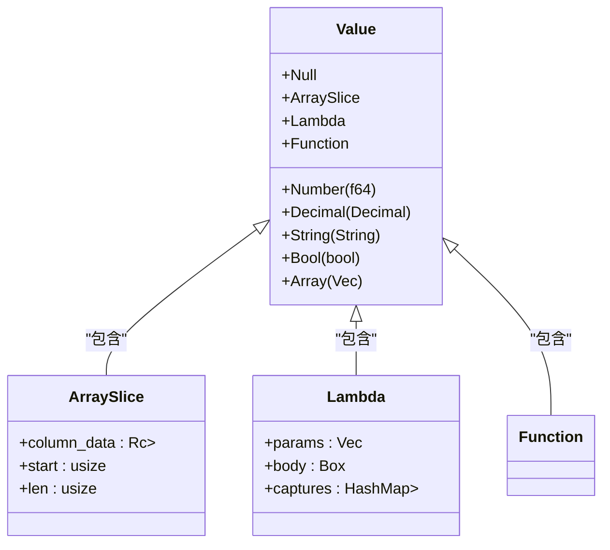

# 核心类型系统

<cite>
**本文档引用文件**   
- [runtime.rs](file://src/runtime.rs)
- [builtin.rs](file://src/executor/builtin.rs)
- [3.类型系统和错误处理.md](file://dev_logs/3.类型系统和错误处理.md)
- [ast.rs](file://src/parser/ast.rs)
- [context.rs](file://src/executor/context.rs)
</cite>

## 更新摘要
**变更内容**   
- 重新组织了Value枚举的类图结构，清晰展示了ArraySlice和Lambda的内部属性
- 新增了ArraySlice和Lambda类型的详细内部结构说明
- 更新了核心类型变体详解部分，补充了ArraySlice和Lambda的属性细节
- 增加了类图以可视化Value枚举的结构关系

## 目录
1. [Value枚举类型概述](#value枚举类型概述)
2. [核心类型变体详解](#核心类型变体详解)
3. [统一number类型的设计理念](#统一number类型的设计理念)
4. [类型转换函数](#类型转换函数)
5. [类型检查函数typeis](#类型检查函数typeis)
6. [INPUT/OUTPUT类型约束语法](#inputoutput类型约束语法)
7. [类型系统保障数据处理的安全性和精确性](#类型系统保障数据处理的安全性和精确性)

## Value枚举类型概述

DPLang的核心类型系统由`runtime.rs`中定义的`Value`枚举类型构成，该类型是运行时值的统一表示。`Value`枚举包含九种核心变体：Number、Decimal、String、Bool、Null、Array、ArraySlice、Lambda和Function，每种类型都有其特定的内存表示和使用场景。该类型系统的设计旨在提供灵活的数据处理能力，同时确保金融计算的精确性和数据处理的安全性。



**图示来源**
- [runtime.rs](file://src/runtime.rs#L6-L33)

**节来源**   
- [runtime.rs](file://src/runtime.rs#L9-L34)

## 核心类型变体详解

### Number类型
`Number`类型使用`f64`作为底层表示，用于存储浮点数。该类型支持自动位宽提升和类型提升，确保在计算过程中不会发生溢出或精度丢失。例如，当整数运算结果超出`int32`范围时，会自动提升到`int64`；当进行除法运算时，会自动从整数提升到浮点数。

### Decimal类型
`Decimal`类型使用`rust_decimal::Decimal`库实现，专为金融计算设计，提供高精度的十进制运算。该类型避免了浮点数运算中的精度问题，适用于货币计算等对精度要求极高的场景。

### String类型
`String`类型使用Rust的`String`类型作为底层表示，用于存储文本数据。该类型支持字符串拼接等操作，并在显示时自动添加引号。

### Bool类型
`Bool`类型使用Rust的`bool`类型作为底层表示，用于存储布尔值。该类型在条件判断中具有明确的真值语义。

### Null类型
`Null`类型表示空值，用于表示缺失或未定义的数据。该类型在数据处理中起到重要的占位作用。

### Array类型
`Array`类型使用`Vec<Value>`作为底层表示，用于存储值的集合。该类型支持向量运算和广播操作，能够高效处理数组数据。

### ArraySlice类型
`ArraySlice`类型表示数组的切片视图，提供零拷贝的数组访问能力。该类型包含三个内部属性：
- **column_data**: 底层列数据的共享引用（`Rc<Vec<Value>>`）
- **start**: 切片的起始索引（`usize`）
- **len**: 切片的长度（`usize`）

这种设计允许在不复制数据的情况下创建数组的子视图，特别适用于时间序列数据处理。

### Lambda类型
`Lambda`类型表示匿名函数，包含以下内部属性：
- **params**: 参数列表（`Vec<String>`）
- **body**: 函数体（`Box<Expr>`）
- **captures**: 捕获的变量环境（`HashMap<String, Box<Value>>`）

该类型支持函数式编程范式，允许在运行时创建和传递函数，同时通过捕获机制保持闭包的完整性。

### Function类型
`Function`类型表示用户定义的函数（包函数），包含一个指向函数定义的智能指针（`Box<FunctionDef>`）。该类型用于组织和复用代码逻辑。

**节来源**
- [runtime.rs](file://src/runtime.rs#L9-L34)

## 统一number类型的设计理念

DPLang的`number`类型设计理念是通过自动类型提升机制来简化数值计算，同时确保计算的正确性和安全性。该设计包含三个层次的提升机制：

### 位宽提升（int32→int64）
当整数运算结果超出`int32`范围时，系统会自动将结果提升到`int64`，防止溢出错误。例如：
```dplang
a = 100                    # number (底层int32)
b = 10000000000            # number (底层int64，自动提升)
c = a + b                  # number (底层int64)
```

### 类型提升（int→float）
当进行除法等可能产生小数的运算时，系统会自动将整数提升到浮点数。例如：
```dplang
x = 10                     # number (底层int)
y = 3                      # number (底层int)
z = x / y                  # number (底层float64: 3.333...)
```

### 精度提升（number→decimal）
在金融计算中，可以通过`decimal`函数将`number`类型提升到`Decimal`类型，确保计算的高精度。例如：
```dplang
价格 = 100.12              # number (底层float64)
精确价格 = decimal(100.12)  # decimal (高精度)
总金额 = 精确价格 * 1000    # decimal (保持高精度)
```

**节来源**
- [3.类型系统和错误处理.md](file://dev_logs/3.类型系统和错误处理.md#L16-L37)

## 类型转换函数

DPLang提供了一系列类型转换函数，用于在不同类型之间进行显式转换：

### 数值转换函数
- `int(3.14)`：截断小数，返回3
- `floor(3.14)`：向下取整，返回3
- `ceil(3.14)`：向上取整，返回4
- `round(3.14)`：四舍五入，返回3
- `round(3.14159, 2)`：保留2位小数，返回3.14

### 其他转换函数
- `decimal("100.12")`：转换为`decimal`类型
- `string(123)`：转换为字符串类型
- `number("123.45")`：转换为`number`类型

这些函数在`builtin.rs`中通过`execute_builtin`方法实现，提供了安全的类型转换能力。

**节来源**
- [3.类型系统和错误处理.md](file://dev_logs/3.类型系统和错误处理.md#L43-L52)
- [builtin.rs](file://src/executor/builtin.rs#L8-L46)

## 类型检查函数typeis

`typeis`函数用于检查值的类型，返回布尔值。该函数支持检查所有核心类型：
- `typeis(value, "number")`
- `typeis(value, "decimal")`
- `typeis(value, "string")`
- `typeis(value, "bool")`
- `typeis(value, "null")`
- `typeis(value, "array")`

该函数在运行时通过模式匹配实现类型检查，为条件逻辑和错误处理提供了基础支持。

**节来源**
- [3.类型系统和错误处理.md](file://dev_logs/3.类型系统和错误处理.md#L54-L61)

## INPUT/OUTPUT类型约束语法

DPLang支持三种INPUT/OUTPUT类型约束语法，提供了灵活的类型声明方式：

### 完全类型声明
明确指定每个输入输出参数的类型：
```dplang
-- INPUT code:string, close:number, volume:number --
-- OUTPUT code:string, signal:string, score:number --
```

### 类型推断
从数据自动推断类型，无需显式声明：
```dplang
-- INPUT code, close, volume --
-- OUTPUT code, signal, score --
```

### 混合模式
部分参数显式声明类型，其余参数自动推断：
```dplang
-- INPUT code:string, close, volume --  # code明确为string，其他推断
```

此外，还支持`decimal`精度模式，指定整个脚本使用`decimal`计算：
```dplang
-- INPUT price:decimal, amount:decimal --
-- PRECISION decimal --  # 整个脚本使用decimal计算
```

**节来源**
- [3.类型系统和错误处理.md](file://dev_logs/3.类型系统和错误处理.md#L63-L80)

## 类型系统保障数据处理的安全性和精确性

DPLang的类型系统通过多种机制保障数据处理的安全性和精确性：

### 运行时错误处理
系统定义了多种运行时错误类型，如`ZeroDivision`、`TypeError`等，确保在发生错误时能够及时捕获和处理。例如，除零操作会抛出`ZeroDivision`错误，防止程序崩溃。

### 安全函数
提供了一系列安全函数，如`safe_div`、`safe_get`、`safe_number`等，这些函数在发生错误时返回默认值或`null`，避免程序中断。例如：
```dplang
result = safe_div(a, b, default=0.0)       # 除零返回0.0
value = safe_get(array, index, default=0)  # 越界返回0
```

### 金融计算精度保障
通过`Decimal`类型和`decimal`函数，确保金融计算的高精度。结合`-- PRECISION decimal --`声明，可以全局启用高精度计算模式，避免浮点数精度问题。

### 类型安全的向量运算
支持向量运算和广播操作，同时进行类型检查，确保数组运算的安全性。例如，数组加法会检查两个数组的长度是否匹配，避免越界访问。

这些机制共同构成了DPLang强大的类型系统，为数据处理提供了坚实的安全和精确性保障。

**节来源**
- [3.类型系统和错误处理.md](file://dev_logs/3.类型系统和错误处理.md#L82-L244)
- [runtime.rs](file://src/runtime.rs#L409-L503)
- [builtin.rs](file://src/executor/builtin.rs#L498-L573)