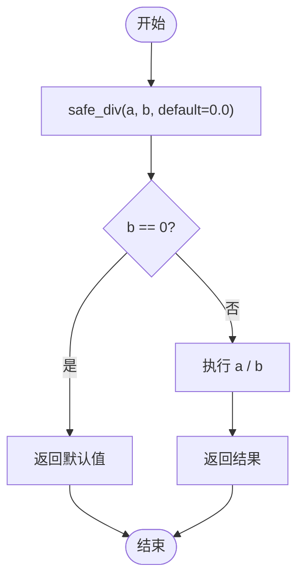

# 类型系统与错误处理

<cite>
**Referenced Files in This Document**  
- [runtime.rs](file://src/runtime.rs)
- [builtin.rs](file://src/executor/builtin.rs)
- [dev_logs/3.类型系统和错误处理.md](file://dev_logs/3.类型系统和错误处理.md)
- [expression.rs](file://src/executor/expression.rs)
- [statement.rs](file://src/executor/statement.rs)
- [mod.rs](file://src/executor/mod.rs)
</cite>

## 目录
1. [类型系统](#类型系统)
2. [Value枚举类型详解](#value枚举类型详解)
3. [统一number类型设计理念](#统一number类型设计理念)
4. [引用语义行为](#引用语义行为)
5. [错误处理机制](#错误处理机制)
6. [ERROR块错误处理](#error块错误处理)
7. [安全函数防御性编程](#安全函数防御性编程)
8. [null值处理](#null值处理)
9. [运行时异常处理](#运行时异常处理)

## 类型系统

DPLang的类型系统设计旨在提供灵活性与安全性的平衡。系统支持多种基础类型，包括Number、Decimal、String、Bool、Null、Array和Lambda等，每种类型都有其特定的使用场景和语义。类型系统通过Value枚举类型实现，该类型是运行时值的核心表示。

**Section sources**
- [runtime.rs](file://src/runtime.rs#L7-L34)

## Value枚举类型详解

Value枚举类型是DPLang运行时的核心数据结构，定义了所有可能的值类型。该枚举包含以下变体：

- **Number**: 表示浮点数，用于常规数值计算
- **Decimal**: 高精度十进制数，专用于金融计算等需要精确精度的场景
- **String**: 字符串类型，用于文本数据处理
- **Bool**: 布尔值，用于条件判断
- **Null**: 空值，表示缺失或未定义的数据
- **Array**: 数组类型，用于存储有序的值集合
- **ArraySlice**: 数组切片，提供零拷贝的数组视图
- **Lambda**: 匿名函数，支持函数式编程特性
- **Function**: 用户定义的函数

每种类型都有其特定的语义和操作方法。例如，Number类型支持基本的算术运算，而Array类型支持向量化的操作。

```mermaid
classDiagram
class Value {
+Number(f64)
+Decimal(Decimal)
+String(String)
+Bool(bool)
+Null
+Array(Vec<Value>)
+ArraySlice{column_data : Rc<Vec<Value>>, start : usize, len : usize}
+Lambda{params : Vec<String>, body : Box<Expr>, captures : HashMap<String, Box<Value>>}
+Function(Box<FunctionDef>)
}
Value : +to_bool() bool
Value : +to_number() Result<f64, RuntimeError>
Value : +to_number_or_default(default : f64) Result<f64, RuntimeError>
Value : +is_null() bool
Value : +to_decimal() Result<Decimal, RuntimeError>
Value : +apply_precision(scale : u32) Result<Value, RuntimeError>
Value : +add(other : &Value) Result<Value, RuntimeError>
Value : +sub(other : &Value) Result<Value, RuntimeError>
Value : +mul(other : &Value) Result<Value, RuntimeError>
Value : +div(other : &Value) Result<Value, RuntimeError>
```

**Diagram sources**
- [runtime.rs](file://src/runtime.rs#L9-L34)

**Section sources**
- [runtime.rs](file://src/runtime.rs#L9-L34)

## 统一number类型设计理念

DPLang采用统一的number类型设计，旨在简化数值处理并提高代码的可读性。该设计的核心理念是自动类型提升和精度管理：

1. **位宽自动提升**: 当数值超出当前表示范围时，系统会自动提升到更大的位宽，防止溢出
2. **类型自动提升**: 在进行除法等操作时，整数会自动提升为浮点数，确保计算精度
3. **精度提升**: 对于需要高精度计算的场景，可以显式转换为Decimal类型

这种设计使得开发者无需关心底层的数值表示细节，可以专注于业务逻辑的实现。

**Section sources**
- [dev_logs/3.类型系统和错误处理.md](file://dev_logs/3.类型系统和错误处理.md#L16-L37)

## 引用语义行为

DPLang中的引用语义主要体现在ArraySlice类型上。ArraySlice通过共享引用（Rc<Vec<Value>>）实现零拷贝的数组视图，这在处理大型数据集时可以显著提高性能。当创建数组切片时，不会复制底层数据，而是共享对原始数据的引用。

这种设计特别适用于数据流处理场景，其中需要频繁地访问数据子集而不需要复制整个数据集。引用语义确保了内存效率，同时保持了数据的一致性。

**Section sources**
- [runtime.rs](file://src/runtime.rs#L17-L24)

## 错误处理机制

DPLang提供了两种主要的错误处理方式：通过ERROR块捕获运行时错误，以及使用安全函数进行防御性编程。这两种方式可以结合使用，以构建健壮的数据处理脚本。

**Section sources**
- [dev_logs/3.类型系统和错误处理.md](file://dev_logs/3.类型系统和错误处理.md#L82-L83)

## ERROR块错误处理

ERROR块是一种延迟声明的错误处理机制，当脚本执行过程中发生异常时会被调用。其执行机制如下：

1. ERROR块是声明语句，不影响后续代码的正常执行
2. 当任何语句抛出异常时，代码立即停止在出错行
3. 跳转到ERROR块执行错误处理逻辑
4. ERROR块可选择返回默认值或终止脚本

ERROR块必须在INPUT/OUTPUT声明之后，所有代码之前，并且一个脚本只能有一个ERROR块。在ERROR块中，可以通过`_error`对象访问错误信息，包括错误类型、消息和行号。


**Diagram sources**
- [dev_logs/3.类型系统和错误处理.md](file://dev_logs/3.类型系统和错误处理.md#L84-L122)
- [mod.rs](file://src/executor/mod.rs#L44-L76)

**Section sources**
- [dev_logs/3.类型系统和错误处理.md](file://dev_logs/3.类型系统和错误处理.md#L84-L122)
- [mod.rs](file://src/executor/mod.rs#L44-L76)

## 安全函数防御性编程

DPLang提供了一系列安全函数，用于在可预见的错误情况下进行防御性编程。这些函数在发生错误时返回null或指定的默认值，而不是抛出异常：

- **safe_div**: 安全除法，除零时返回null或默认值
- **safe_get**: 安全数组访问，越界时返回null或默认值
- **safe_number**: 安全类型转换，转换失败时返回null或默认值

这些安全函数特别适用于处理可能包含缺失或无效数据的场景，允许脚本继续执行而不会中断。



**Diagram sources**
- [builtin.rs](file://src/executor/builtin.rs#L498-L517)
- [dev_logs/3.类型系统和错误处理.md](file://dev_logs/3.类型系统和错误处理.md#L158-L174)

**Section sources**
- [builtin.rs](file://src/executor/builtin.rs#L498-L517)
- [dev_logs/3.类型系统和错误处理.md](file://dev_logs/3.类型系统和错误处理.md#L158-L174)

## null值处理

null值在DPLang中表示缺失或未定义的数据。系统提供了多种方式来处理null值：

1. **is_null()方法**: 检查值是否为null
2. **to_number_or_default()方法**: 将null转换为指定的默认值
3. **安全函数**: 如safe_get和safe_number，可以处理包含null值的情况

在进行数值计算时，null值会引发类型错误，因此需要在计算前进行适当的处理。最佳实践是使用安全函数或显式检查null值，以确保数据处理的健壮性。

**Section sources**
- [runtime.rs](file://src/runtime.rs#L115-L118)

## 运行时异常处理

DPLang的运行时异常处理机制结合了ERROR块和安全函数两种方式。对于可预见的错误（如除零、数组越界），推荐使用安全函数进行防御性编程；对于意外的异常，则使用ERROR块进行集中处理。

这种分层的错误处理策略使得脚本既能够优雅地处理常见错误，又能够在发生严重问题时提供有意义的错误信息。通过合理使用这两种机制，可以构建出既健壮又易于调试的数据处理脚本。

**Section sources**
- [dev_logs/3.类型系统和错误处理.md](file://dev_logs/3.类型系统和错误处理.md#L176-L203)