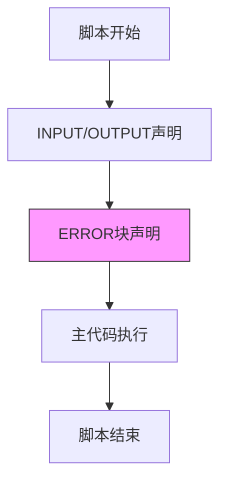
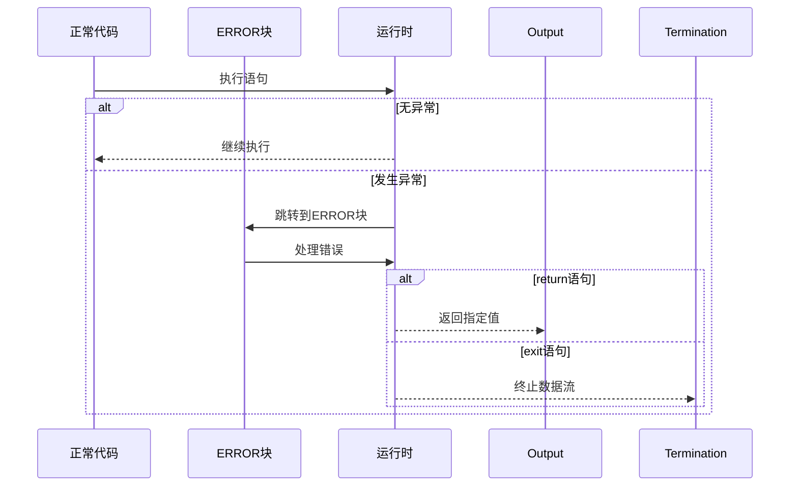
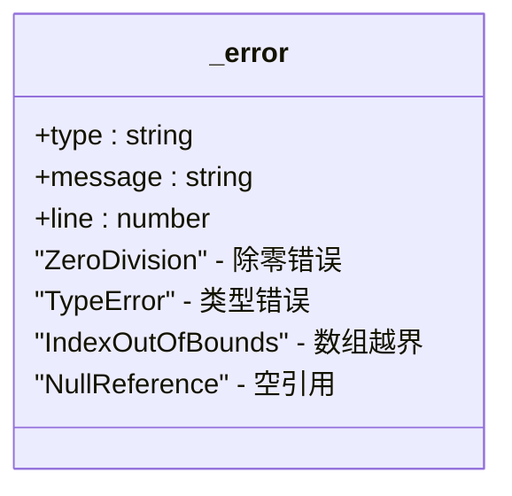
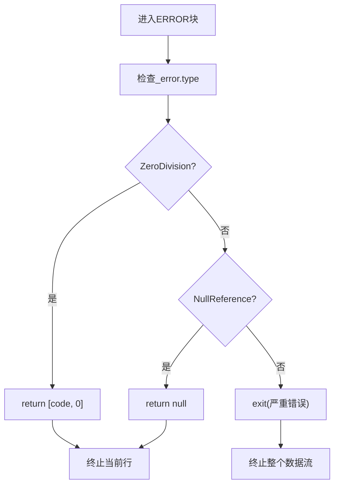
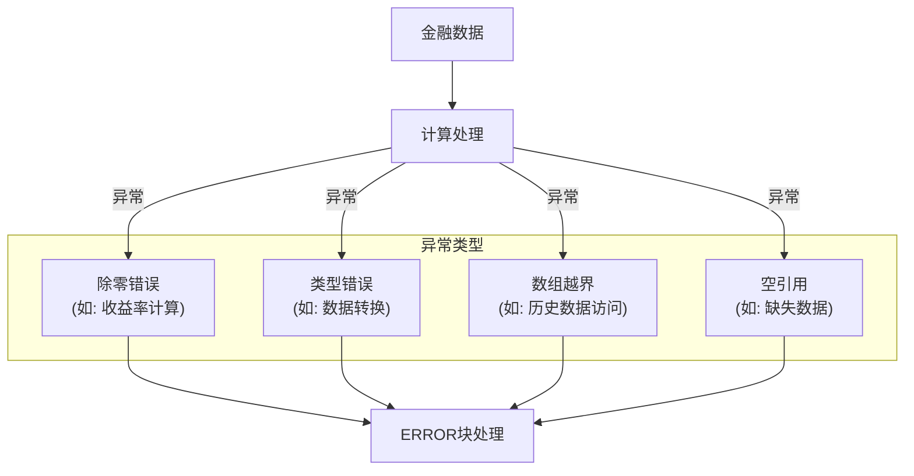
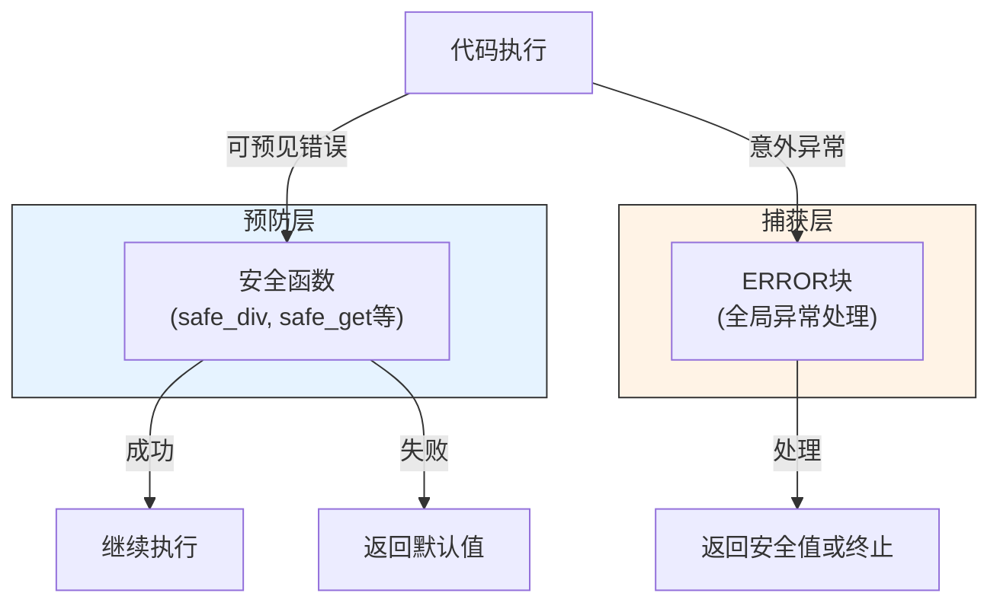

# ERROR块机制

<cite>
**本文档引用的文件**   
- [dev_logs/3.类型系统和错误处理.md](file://dev_logs/3.类型系统和错误处理.md)
- [src/runtime.rs](file://src/runtime.rs)
- [src/executor/mod.rs](file://src/executor/mod.rs)
- [src/executor/statement.rs](file://src/executor/statement.rs)
- [src/executor/expression.rs](file://src/executor/expression.rs)
- [src/parser/ast.rs](file://src/parser/ast.rs)
- [src/semantic.rs](file://src/semantic.rs)
</cite>

## 目录
1. [ERROR块机制概述](#error块机制概述)
2. [声明位置与唯一性要求](#声明位置与唯一性要求)
3. [执行时机与流程控制](#执行时机与流程控制)
4. [_error对象结构与应用](#_error对象结构与应用)
5. [终止行为：return与exit](#终止行为return与exit)
6. [与正常执行流程的解耦设计](#与正常执行流程的解耦设计)
7. [金融数据分析中的异常捕获](#金融数据分析中的异常捕获)
8. [与安全函数的协同使用](#与安全函数的协同使用)
9. [常见误用模式及解决方案](#常见误用模式及解决方案)

## ERROR块机制概述

ERROR块是DPLang中用于处理运行时异常的延迟声明式错误处理函数。它在脚本执行过程中发生异常时被调用，提供了一种集中式的错误处理机制。ERROR块作为全局错误处理函数，允许开发者定义统一的异常响应策略，确保脚本在遇到运行时错误时能够优雅地处理而不是直接崩溃。

**Section sources**
- [dev_logs/3.类型系统和错误处理.md](file://dev_logs/3.类型系统和错误处理.md#L84-L86)

## 声明位置与唯一性要求

ERROR块在脚本中的声明位置有严格要求：必须位于INPUT/OUTPUT声明之后，且在所有其他代码之前。这种位置约束确保了在执行主体代码前，错误处理机制已经就绪。每个脚本只能定义一个ERROR块，保证了错误处理逻辑的唯一性和可预测性。

**Diagram sources **
- [dev_logs/3.类型系统和错误处理.md](file://dev_logs/3.类型系统和错误处理.md#L125-L128)
- [src/parser/ast.rs](file://src/parser/ast.rs#L260-L262)

## 执行时机与流程控制

当脚本执行过程中任何语句抛出异常时，执行流会立即停止在出错行，并跳转到ERROR块执行错误处理逻辑。这种即时跳转机制确保了错误能够被及时捕获和处理。ERROR块的执行不会影响正常代码的编译和语法检查，它作为一种运行时保护机制存在。

**Diagram sources **
- [dev_logs/3.类型系统和错误处理.md](file://dev_logs/3.类型系统和错误处理.md#L88-L93)
- [src/executor/mod.rs](file://src/executor/mod.rs#L44-L76)

## _error对象结构与应用

_error对象是ERROR块中可用的内置对象，包含三个核心属性：type、message和line。其中type表示错误类型（如"ZeroDivision"、"TypeError"等），message提供错误的详细描述信息，line记录发生错误的行号。这些信息使开发者能够精确识别和分类不同类型的运行时异常。

**Diagram sources **
- [dev_logs/3.类型系统和错误处理.md](file://dev_logs/3.类型系统和错误处理.md#L115-L123)
- [src/runtime.rs](file://src/runtime.rs#L408-L416)

## 终止行为：return与exit

在ERROR块中，return语句会终止当前行的执行并返回指定值，而exit语句则会终止整个数据流的处理。这种双重终止机制提供了灵活的错误处理策略：return适用于需要为当前数据行提供默认值的场景，而exit适用于遇到严重错误需要立即停止整个处理流程的情况。

**Diagram sources **
- [dev_logs/3.类型系统和错误处理.md](file://dev_logs/3.类型系统和错误处理.md#L129-L130)
- [src/executor/statement.rs](file://src/executor/statement.rs#L16-L18)

## 与正常执行流程的解耦设计

ERROR块与正常执行流程采用解耦设计，这意味着ERROR块的声明不会影响主体代码的执行路径。这种设计实现了关注点分离：主体代码专注于业务逻辑，而ERROR块专注于异常处理。解耦设计还确保了代码的可读性和可维护性，开发者可以清晰地区分正常流程和异常处理逻辑。

**Section sources**
- [dev_logs/3.类型系统和错误处理.md](file://dev_logs/3.类型系统和错误处理.md#L90-L91)
- [src/semantic.rs](file://src/semantic.rs#L179-L214)

## 金融数据分析中的异常捕获

在金融数据分析场景中，ERROR块能够有效捕获常见的运行时异常，如除零错误（在计算收益率时）、类型错误（在数据转换时）、数组越界（在访问历史数据时）等。通过预先定义的错误处理策略，可以确保即使在数据异常的情况下，分析流程也能继续进行，提高了数据处理的鲁棒性。

**Diagram sources **
- [dev_logs/3.类型系统和错误处理.md](file://dev_logs/3.类型系统和错误处理.md#L134-L152)
- [src/runtime.rs](file://src/runtime.rs#L236-L246)

## 与安全函数的协同使用

ERROR块应与安全函数协同使用，形成分层的错误处理策略。对于可预见的错误（如可能的除零操作），应优先使用safe_div、safe_get等安全函数；而对于意外的运行时异常，则由ERROR块统一处理。这种组合方式既提高了代码的健壮性，又避免了过度依赖全局错误处理。

**Diagram sources **
- [dev_logs/3.类型系统和错误处理.md](file://dev_logs/3.类型系统和错误处理.md#L176-L203)
- [src/executor/expression.rs](file://src/executor/expression.rs#L262-L287)

## 常见误用模式及解决方案

常见的ERROR块误用包括：在ERROR块中执行复杂逻辑导致性能问题、忽略某些错误类型、在ERROR块中修改全局状态等。解决方案是保持ERROR块简洁，仅执行必要的错误处理操作，并结合安全函数处理可预见的异常，避免将ERROR块作为常规控制流使用。

**Section sources**
- [dev_logs/3.类型系统和错误处理.md](file://dev_logs/3.类型系统和错误处理.md#L204-L243)
- [src/executor/mod.rs](file://src/executor/mod.rs#L56-L72)