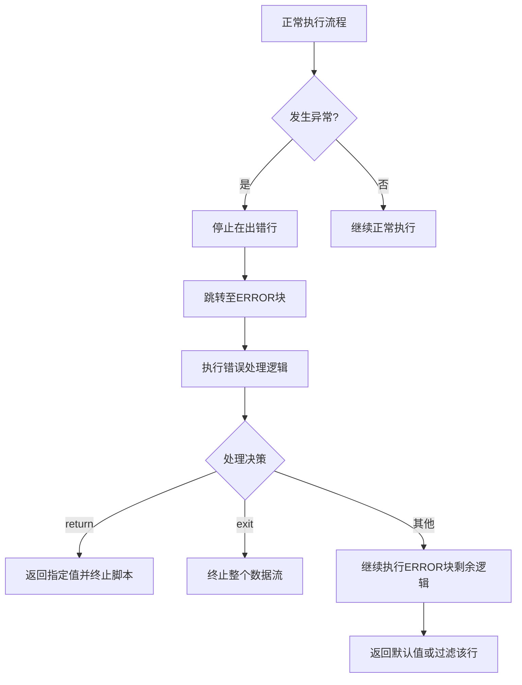

# 错误处理机制

<cite>
**本文档引用文件**  
- [builtin.rs](file://src/executor/builtin.rs)
- [statement.rs](file://src/executor/statement.rs)
- [expression.rs](file://src/executor/expression.rs)
- [context.rs](file://src/executor/context.rs)
- [data_stream.rs](file://src/executor/data_stream.rs)
- [runtime.rs](file://src/runtime.rs)
- [ast.rs](file://src/parser/ast.rs)
- [3.类型系统和错误处理.md](file://dev_logs/3.类型系统和错误处理.md)
- [4.内置函数参考.md](file://dev_logs/4.内置函数参考.md)
- [2.语法参考.md](file://dev_logs/2.语法参考.md)
- [5.完整示例.md](file://dev_logs/5.完整示例.md)
</cite>

## 目录
1. [ERROR块错误处理机制](#error块错误处理机制)
2. [安全函数体系](#安全函数体系)
3. [错误处理综合应用](#错误处理综合应用)
4. [常见编译期错误](#常见编译期错误)

## ERROR块错误处理机制

ERROR块是DPLang中用于处理运行时异常的核心机制，其作为延迟声明的错误处理函数，在脚本执行发生异常时被调用。该机制通过中断正常执行流程并跳转至错误处理逻辑，确保程序的健壮性和可控性。

### 执行流程与跳转机制

当脚本执行过程中任何语句抛出异常时，执行流程立即停止在出错行，并跳转至预先声明的ERROR块执行错误处理逻辑。ERROR块本身是声明语句，不影响后续代码的正常执行顺序，仅在异常发生时激活。



**Diagram sources**
- [3.类型系统和错误处理.md](file://dev_logs/3.类型系统和错误处理.md#L88-L113)
- [runtime.rs](file://src/runtime.rs#L409-L483)

### 位置与唯一性约束

ERROR块的声明必须遵循严格的语法规则：
- ⚠️ 一个脚本中只能存在一个ERROR块，确保错误处理逻辑的集中和明确。
- ⚠️ ERROR块必须位于INPUT/OUTPUT声明之后，所有业务代码之前，以保证其声明的延迟性。
- ⚠️ ERROR块内若使用`return`语句，将终止当前脚本的执行并返回指定值。
- ⚠️ ERROR块内若调用`exit()`函数，将终止整个数据流的处理。

**Section sources**
- [3.类型系统和错误处理.md](file://dev_logs/3.类型系统和错误处理.md#L125-L130)

### 内置_error对象

在ERROR块中，可通过内置的`_error`对象获取详细的错误信息，用于精细化的错误处理。该对象包含以下属性：
- `_error.type`: 错误类型，如`"ZeroDivision"`（除零）、`"TypeError"`（类型错误）、`"IndexOutOfBounds"`（数组越界）、`"NullReference"`（空引用）。
- `_error.message`: 错误的描述信息，提供具体的错误原因。
- `_error.line`: 发生错误的行号，便于定位问题。

通过检查`_error.type`，可以针对不同类型的错误采取不同的恢复策略，例如对除零错误返回安全值，而对其他严重错误则选择终止流程。

**Section sources**
- [3.类型系统和错误处理.md](file://dev_logs/3.类型系统和错误处理.md#L115-L123)
- [2.语法参考.md](file://dev_logs/2.语法参考.md#L256-L260)

## 安全函数体系

为避免可预见的运行时错误，DPLang提供了一套安全函数体系，这些函数在遇到错误情况时不会抛出异常，而是返回`null`或用户指定的默认值，从而实现优雅降级。

### 安全除法 (safe_div)

`safe_div(a, b, default=0.0)`函数用于执行安全的除法运算。当除数`b`为零时，函数不会抛出"除零错误"，而是返回`null`或由`default`参数指定的默认值（如0.0），有效防止了因数据异常导致的流程中断。

**Section sources**
- [3.类型系统和错误处理.md](file://dev_logs/3.类型系统和错误处理.md#L159-L161)
- [builtin.rs](file://src/executor/builtin.rs#L498-L518)

### 安全数组访问 (safe_get)

`safe_get(array, index, default=0)`函数用于安全地访问数组元素。当索引`index`超出数组边界时，函数不会抛出"数组越界"错误，而是返回`null`或指定的默认值（如0），确保程序在处理不完整或异常数据时仍能继续运行。

**Section sources**
- [3.类型系统和错误处理.md](file://dev_logs/3.类型系统和错误处理.md#L163-L165)
- [builtin.rs](file://src/executor/builtin.rs#L520-L555)

### 安全类型转换 (safe_number)

`safe_number(value, default=0)`函数用于安全地将值转换为数字类型。当转换失败时（例如将字符串"abc"转为数字），函数不会抛出"类型错误"，而是返回`null`或指定的默认值（如0），使得数据清洗和预处理过程更加鲁棒。

**Section sources**
- [3.类型系统和错误处理.md](file://dev_logs/3.类型系统和错误处理.md#L167-L169)
- [builtin.rs](file://src/executor/builtin.rs#L557-L574)

## 错误处理综合应用

在实际的金融数据分析场景中，应结合使用ERROR块和安全函数，构建一个健壮的数据处理管道。

### 结合使用策略

- **使用ERROR块处理意外异常**：对于无法预见的严重错误（如空引用、未知函数调用），应在ERROR块中进行捕获，并根据错误类型决定是返回`null`过滤该行数据，还是调用`exit()`终止整个流程。
- **使用安全函数处理可预见的边界情况**：对于已知的潜在问题（如除零、数组越界、类型转换失败），应优先使用`safe_div`、`safe_get`、`safe_number`等安全函数进行处理，避免触发异常。

这种分层处理策略既能保证程序的稳定性，又能最大限度地保留有效数据。

```mermaid
flowchart LR
A[数据输入] --> B{可预见的边界情况?}
B --> |是| C[使用安全函数处理<br>(safe_div, safe_get等)]
B --> |否| D[正常业务逻辑]
D --> E{发生意外异常?}
E --> |是| F[跳转至ERROR块]
F --> G[根据_error.type决策]
G --> H[返回默认值或终止]
E --> |否| I[正常输出]
C --> I
```

**Diagram sources**
- [3.类型系统和错误处理.md](file://dev_logs/3.类型系统和错误处理.md#L178-L202)
- [5.完整示例.md](file://dev_logs/5.完整示例.md)

## 常见编译期错误

除了运行时错误，DPLang在编译阶段也会进行严格的检查，防止多种常见错误。

### 变量遮蔽与未定义变量

- **变量遮蔽**：禁止在同一作用域内重复定义已存在的变量，例如`ma5 = MA(close, 5)`后再次`ma5 = ma5 * 2`是非法的。
- **未定义变量**：使用未声明的变量会触发编译错误，例如`result = undefined_var + 1`。

### 访问控制与类型不匹配

- **私有成员访问**：包内的私有变量和函数（以`_`开头）只能在包内访问，外部脚本无法读取或修改。
- **类型不匹配**：OUTPUT声明的字段类型必须与`return`语句返回的值类型一致，否则会报错。
- **返回值字段数不匹配**：`return`语句返回的字段数量必须与OUTPUT声明的数量完全匹配。

这些编译期检查确保了代码的正确性和安全性，避免了因逻辑错误导致的运行时崩溃。

**Section sources**
- [3.类型系统和错误处理.md](file://dev_logs/3.类型系统和错误处理.md#L204-L243)
- [2.语法参考.md](file://dev_logs/2.语法参考.md)