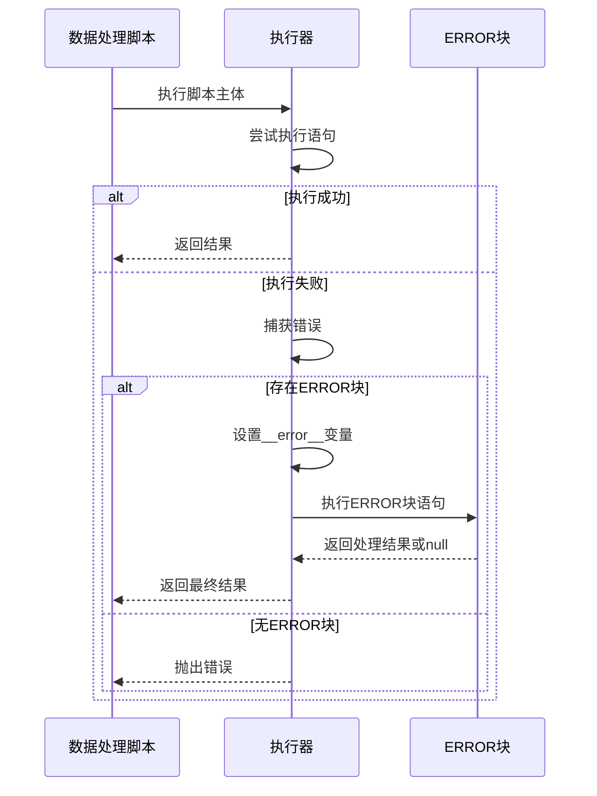
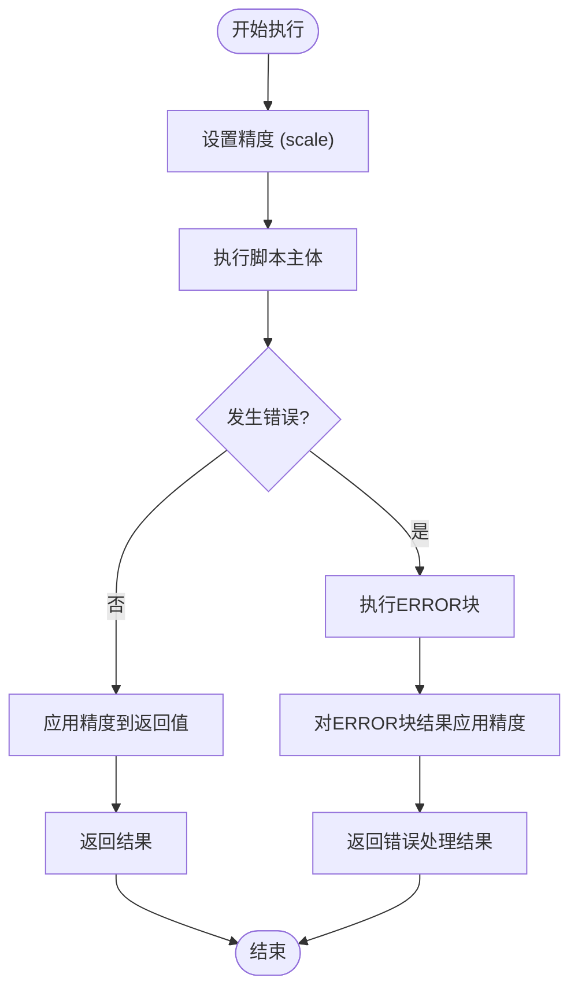
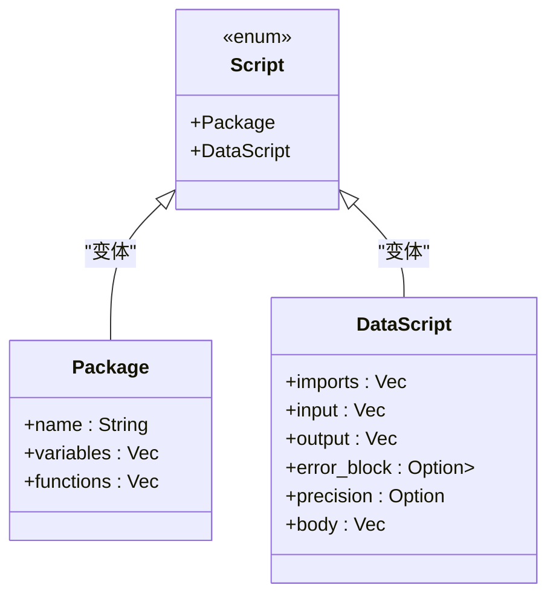
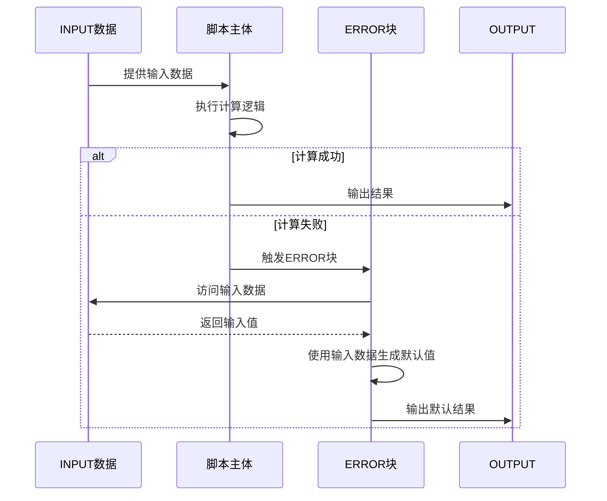

# 特殊声明

<cite>
**本文档引用的文件**  
- [lexer.rs](file://src/lexer.rs)
- [ast.rs](file://src/parser/ast.rs)
- [package_loader.rs](file://src/package_loader.rs)
- [context.rs](file://src/executor/context.rs)
- [statement.rs](file://src/executor/statement.rs)
- [expression.rs](file://src/executor/expression.rs)
- [runtime.rs](file://src/runtime.rs)
</cite>

## 目录
1. [INPUT和OUTPUT声明](#input和output声明)
2. [IMPORT声明](#import声明)
3. [ERROR声明](#error声明)
4. [PRECISION声明](#precision声明)
5. [PACKAGE声明](#package声明)
6. [跨声明交互示例](#跨声明交互示例)

## INPUT和OUTPUT声明

INPUT和OUTPUT声明用于定义数据处理脚本的输入和输出参数。在词法分析阶段，lexer.rs中的`scan_special_declaration`函数将`-- INPUT ... --`和`-- OUTPUT ... --`形式的特殊标记识别为`TokenType::Input`和`TokenType::Output`，并提取其中的内容。这些内容通常包含参数列表，如`x:number`。

在语法分析阶段，ast.rs中的`Script`枚举定义了`DataScript`变体，其中包含`input: Vec<Parameter>`和`output: Vec<Parameter>`字段。这些字段在解析过程中被填充，表示脚本的输入和输出参数。每个`Parameter`包含参数名和可选的类型注解。

在执行阶段，`DataStreamExecutor`会根据`input`参数从输入矩阵中提取数据，并将`output`参数的计算结果存储到输出矩阵中。输入参数在执行时被设置为上下文变量，供脚本主体使用。

**Section sources**
- [lexer.rs](file://src/lexer.rs#L473-L487)
- [ast.rs](file://src/parser/ast.rs#L258-L259)
- [data_stream.rs](file://src/executor/data_stream.rs#L40-L77)

## IMPORT声明

IMPORT声明用于加载外部包，实现代码复用和模块化。在词法分析阶段，`scan_special_declaration`函数将`-- IMPORT ... --`形式的标记识别为`TokenType::Import`，并提取包名列表。

在语法分析阶段，`DataScript`结构体中的`imports: Vec<String>`字段存储了导入的包名。这些包名在执行阶段由`PackageLoader`处理。

`PackageLoader`负责从文件系统加载包。它在多个默认路径（如`packages`子目录、当前目录、`stdlib`目录）中查找以`.dp`为扩展名的包文件。加载过程包括：读取文件内容、词法分析、语法分析，并验证脚本是否为`Package`类型。加载的包被缓存以提高性能。

在执行阶段，`DataStreamExecutor`使用`PackageLoader`批量加载所有导入的包，并将包中的变量和函数注入执行上下文，使得脚本可以通过`包名.成员名`的形式访问包内容。

**Section sources**
- [lexer.rs](file://src/lexer.rs#L488-L493)
- [ast.rs](file://src/parser/ast.rs#L257)
- [package_loader.rs](file://src/package_loader.rs#L56-L143)
- [data_stream.rs](file://src/executor/data_stream.rs#L75-L105)

## ERROR声明

ERROR声明定义了一个错误处理块，用于在脚本执行出错时进行异常处理。在词法分析阶段，`-- ERROR --`被识别为`TokenType::Error`，`-- ERROR_END --`被识别为`TokenType::ErrorEnd`。

在语法分析阶段，`DataScript`结构体中的`error_block: Option<Vec<Stmt>>`字段存储了错误处理块的语句列表。该字段为`Option`类型，表示错误处理块是可选的。

在执行阶段，`Executor`的`execute_data_script`方法首先尝试执行脚本主体。如果执行过程中发生错误，且定义了`error_block`，则执行错误处理块。在执行前，将错误信息存储在名为`__error__`的特殊变量中，供错误处理块内的语句访问。错误处理块执行完毕后，返回`null`或处理结果。

**Diagram sources**
- [ast.rs](file://src/parser/ast.rs#L260)
- [mod.rs](file://src/executor/mod.rs#L44-L76)

**Section sources**
- [lexer.rs](file://src/lexer.rs#L22-L23)
- [ast.rs](file://src/parser/ast.rs#L260)
- [mod.rs](file://src/executor/mod.rs#L44-L76)

## PRECISION声明

PRECISION声明用于控制高精度计算的小数位数。在词法分析阶段，`-- PRECISION ... --`被识别为`TokenType::Precision`，并提取精度设置内容。

在语法分析阶段，`DataScript`结构体中的`precision: Option<PrecisionSetting>`字段存储了精度设置。`PrecisionSetting`结构体包含一个`scale: u32`字段，表示小数位数。

在执行阶段，`Executor`在执行脚本前设置精度。当执行结果需要返回时，`apply_precision_to_value`方法会将结果转换为`Decimal`类型，并根据`scale`进行四舍五入。这确保了计算结果的精度符合声明要求，适用于金融计算等对精度要求高的场景。

**Diagram sources**
- [ast.rs](file://src/parser/ast.rs#L217-L221)
- [mod.rs](file://src/executor/mod.rs#L44-L76)

**Section sources**
- [lexer.rs](file://src/lexer.rs#L24)
- [ast.rs](file://src/parser/ast.rs#L261)
- [runtime.rs](file://src/runtime.rs#L137-L143)

## PACKAGE声明

PACKAGE声明用于定义包脚本，实现代码的模块化和复用。在词法分析阶段，`package`关键字被识别为`TokenType::Package`。

在语法分析阶段，`Script`枚举的`Package`变体包含`name: String`、`variables: Vec<VariableDef>`和`functions: Vec<FunctionDef>`字段。`name`是包名，`variables`是包级变量，`functions`是包内定义的函数。

包脚本与数据处理脚本不同，它不包含`INPUT`、`OUTPUT`等声明，而是专注于定义可重用的变量和函数。包文件通常以`.dp`为扩展名，存储在特定目录中，供其他脚本通过`IMPORT`声明加载。

**Diagram sources**
- [ast.rs](file://src/parser/ast.rs#L247-L263)

**Section sources**
- [lexer.rs](file://src/lexer.rs#L12)
- [ast.rs](file://src/parser/ast.rs#L247-L263)

## 跨声明交互示例

特殊声明之间可以相互交互，实现复杂的脚本逻辑。例如，可以在ERROR块中使用INPUT数据进行错误日志记录或降级处理。

在执行时，即使脚本主体因错误而中断，ERROR块仍然可以访问由INPUT声明定义的上下文变量。这使得错误处理可以基于原始输入数据做出智能决策，例如返回输入数据的简单变换作为降级结果，而不是完全失败。

**Diagram sources**
- [context.rs](file://src/executor/context.rs#L6-L26)
- [statement.rs](file://src/executor/statement.rs#L7-L67)
- [expression.rs](file://src/executor/expression.rs#L8-L365)

**Section sources**
- [context.rs](file://src/executor/context.rs#L6-L26)
- [statement.rs](file://src/executor/statement.rs#L7-L67)
- [expression.rs](file://src/executor/expression.rs#L8-L365)