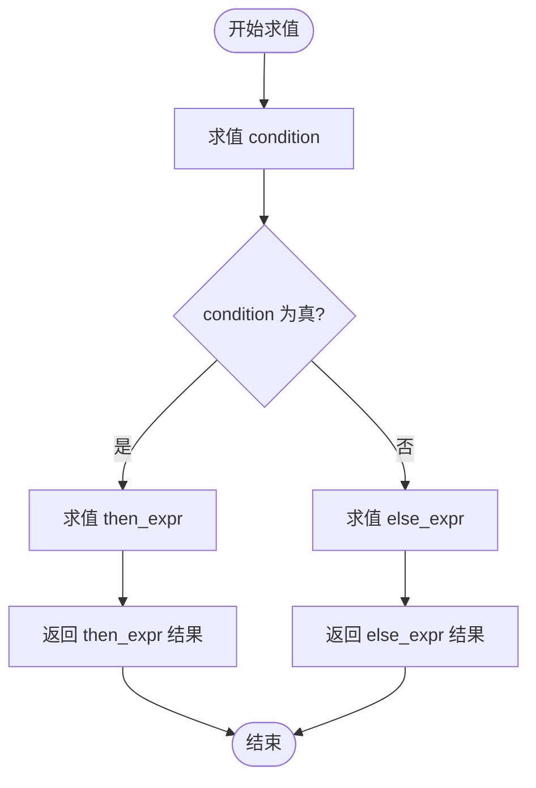
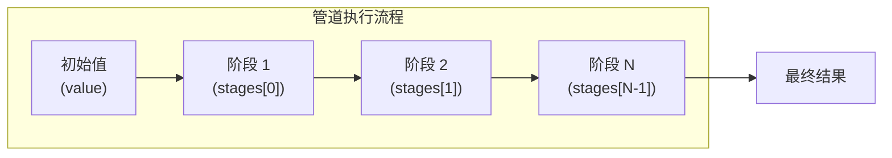

# 表达式

<cite>
**本文档引用文件**   
- [ast.rs](file://src/parser/ast.rs)
- [mod.rs](file://src/parser/mod.rs)
- [expression.rs](file://src/executor/expression.rs)
- [runtime.rs](file://src/runtime.rs)
</cite>

## 目录
1. [算术、比较和逻辑表达式](#算术比较和逻辑表达式)
2. [三元条件表达式](#三元条件表达式)
3. [管道表达式](#管道表达式)
4. [数组构造和展开运算符](#数组构造和展开运算符)
5. [性能优化建议](#性能优化建议)

## 算术、比较和逻辑表达式

DPLang中的表达式通过`ast.rs`文件中的`Expr`枚举进行建模。算术、比较和逻辑表达式均以二元运算（`Binary`）的形式表示，其结构包含左操作数、运算符和右操作数。运算符的类型由`BinaryOp`枚举定义。

算术运算符包括加法（`+`）、减法（`-`）、乘法（`*`）、除法（`/`）、取模（`%`）和幂运算（`^`），分别对应`BinaryOp::Add`、`BinaryOp::Sub`、`BinaryOp::Mul`、`BinaryOp::Div`、`BinaryOp::Mod`和`BinaryOp::Pow`。比较运算符包括大于（`>`）、小于（`<`）、大于等于（`>=`）、小于等于（`<=`）、等于（`==`）和不等于（`!=`），分别对应`BinaryOp::Gt`、`BinaryOp::Lt`、`BinaryOp::GtEq`、`BinaryOp::LtEq`、`BinaryOp::Eq`和`BinaryOp::NotEq`。逻辑运算符包括逻辑与（`and`）和逻辑或（`or`），分别对应`BinaryOp::And`和`BinaryOp::Or`。

这些表达式在抽象语法树（AST）中被表示为`Expr::Binary`节点，其`left`和`right`字段为`Box<Expr>`类型，允许嵌套表达式。例如，表达式`a + b * c`会被解析为一个`Binary`节点，其左操作数为`a`，右操作数为`b * c`的`Binary`节点。

**Section sources**
- [ast.rs](file://src/parser/ast.rs#L27-L31)
- [ast.rs](file://src/parser/ast.rs#L88-L109)

## 三元条件表达式

三元条件表达式（`condition ? then : else`）在DPLang中通过`Expr::Ternary`结构体在AST中表示。该结构体包含三个字段：`condition`（条件表达式）、`then_expr`（条件为真时执行的表达式）和`else_expr`（条件为假时执行的表达式）。所有三个字段均为`Box<Expr>`类型，确保了表达式的嵌套能力。

在解析过程中，三元表达式具有特定的优先级。根据`mod.rs`文件中的`parse_ternary`方法，三元表达式在解析器的优先级层次中位于逻辑或（`or`）之后，且其`else`部分会递归调用`parse_ternary`，以支持串联的三元表达式（如`a ? b : c ? d : e`）。

在执行阶段，`expression.rs`文件中的`execute_expr`方法会首先求值`condition`，然后根据其布尔值结果选择执行`then_expr`或`else_expr`。这种实现方式确保了短路求值，即只有被选中的分支才会被求值。

**Diagram sources **
- [ast.rs](file://src/parser/ast.rs#L39-L44)
- [expression.rs](file://src/executor/expression.rs#L69-L75)

## 管道表达式

管道表达式（`|>`）在DPLang中提供了一种函数式编程风格的链式调用机制。其AST结构由`Expr::Pipeline`表示，该结构体包含`value`（管道的初始值）和`stages`（管道的各个阶段）两个字段。`value`是一个`Box<Expr>`，而`stages`是一个`Expr`的向量。

管道表达式的解析由`mod.rs`文件中的`parse_pipeline`方法处理，它具有最低的运算符优先级。这意味着表达式`a |> f() |> g()`会被正确解析为`(a |> f()) |> g()`。

在执行时，`expression.rs`文件中的`execute_expr`方法会从`value`开始，然后依次将前一个阶段的结果作为第一个参数传递给下一个阶段的函数调用。例如，`prices |> filter(p -> p > 100) |> sum`的执行过程如下：首先`prices`的值被计算，然后该值作为第一个参数传入`filter`函数，`filter`的返回值再作为第一个参数传入`sum`函数。

**Diagram sources **
- [ast.rs](file://src/parser/ast.rs#L80-L84)
- [expression.rs](file://src/executor/expression.rs#L231-L245)

## 数组构造和展开运算符

DPLang支持数组字面量和展开运算符（`...`）。数组字面量在AST中由`Expr::Array`表示，其`elements`字段是一个`Expr`的向量，允许数组中包含任意表达式。

展开运算符在AST中由`Expr::Spread`表示，其`inner`字段为一个`Box<Expr>`，通常指向一个数组表达式。展开运算符的主要用途是在数组构造或函数调用中将一个数组的元素“展开”为独立的元素。例如，在数组构造`[1, 2, ...arr, 4]`中，`...arr`会将`arr`数组的所有元素插入到新数组中。

虽然`Spread`节点在AST中被创建，但其具体的展开逻辑通常在执行器的上下文中处理，例如在解构赋值或函数调用参数传递时。`expression.rs`文件中的`execute_expr`方法对`Spread`节点的处理目前是直接返回内部表达式的结果，表明实际的展开操作是在更高层次的执行逻辑中完成的。

**Section sources**
- [ast.rs](file://src/parser/ast.rs#L23-L24)
- [ast.rs](file://src/parser/ast.rs#L71-L72)
- [expression.rs](file://src/executor/expression.rs#L211-L213)

## 性能优化建议

为了优化DPLang表达式的性能，特别是管道表达式，应避免在管道链中进行昂贵的重复计算。由于管道是线性执行的，每个阶段的输出都依赖于前一个阶段的输出，因此将计算密集型操作提前或缓存其结果可以显著提高效率。

例如，如果一个管道中需要多次使用同一个复杂计算的结果，应将其提取到管道之外，或使用一个专门的函数来计算并返回所有需要的值。此外，利用DPLang的向量运算特性，尽可能使用内置的高阶函数（如`map`、`filter`、`reduce`）来替代显式的循环，可以利用底层的优化实现。

另一个关键的优化点是避免在`Expr::Spread`操作中展开大型数组，因为这可能导致内存的大量复制。在设计数据处理流程时，应考虑使用引用或切片来代替直接的值复制。

**Section sources**
- [expression.rs](file://src/executor/expression.rs#L231-L245)
- [builtin.rs](file://src/executor/builtin.rs#L160-L188)