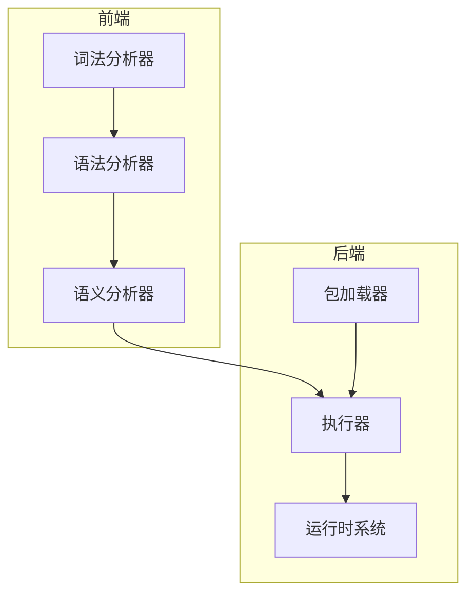

# 项目概述

<cite>
**Referenced Files in This Document**   
- [README.md](file://README.md)
- [src/lib.rs](file://src/lib.rs)
- [src/lexer.rs](file://src/lexer.rs)
- [src/parser/ast.rs](file://src/parser/ast.rs)
- [src/semantic.rs](file://src/semantic.rs)
- [src/runtime.rs](file://src/runtime.rs)
- [src/executor/mod.rs](file://src/executor/mod.rs)
- [src/executor/streaming.rs](file://src/executor/streaming.rs)
- [src/package_loader.rs](file://src/package_loader.rs)
- [src/api.rs](file://src/api.rs)
- [src/main.rs](file://src/main.rs)
- [dev_logs/1.核心设计.md](file://dev_logs/1.核心设计.md)
</cite>

## 目录
1. [项目定位与设计哲学](#项目定位与设计哲学)
2. [核心特性](#核心特性)
3. [语言解析链](#语言解析链)
4. [运行时系统](#运行时系统)
5. [流式执行引擎](#流式执行引擎)
6. [包管理系统](#包管理系统)
7. [主要使用场景](#主要使用场景)
8. [AI友好与中文标识符](#ai友好与中文标识符)
9. [架构概览](#架构概览)
10. [集成与使用](#集成与使用)

## 项目定位与设计哲学

DPLang 是一个纯粹的语言解释器，专注于提供简洁而强大的数据处理能力。其核心定位是作为金融数据分析领域的专用语言，通过极简的语法和高效的执行机制，满足快速原型开发和数据探索的需求。

其设计哲学强调语言核心的简洁性：
- **语言本身只提供核心计算能力**：包括表达式、函数、流程控制等基础功能。
- **业务逻辑通过扩展机制实现**：保持语言核心的纯净，避免功能膨胀。
- **专注做好一件事**：即“数据处理语言”，不追求成为通用编程语言。

这种设计使得 DPLang 能够在保持轻量的同时，通过开放的扩展机制适应复杂的业务需求。

**Section sources**
- [README.md](file://README.md#L5-L18)
- [dev_logs/1.核心设计.md](file://dev_logs/1.核心设计.md#L34-L45)

## 核心特性

DPLang 提供了一套完整且强大的特性集，旨在为数据处理任务提供高效、灵活的解决方案。其核心特性包括完整的语言解析链、强大的运行时系统、流式执行引擎以及包管理系统。

**Section sources**
- [README.md](file://README.md#L19-L117)

## 语言解析链

DPLang 的语言解析链由词法分析、语法分析和语义分析三个阶段构成，确保了代码的正确性和健壮性。

### 词法分析器 (Lexer)

词法分析器负责将源代码分解为一系列有意义的标记（Token）。DPLang 的词法分析器支持：
- **中文标识符**：允许使用中文作为变量名和函数名。
- **缩进敏感语法**：利用缩进来表示代码块，提升代码可读性。
- **完整的运算符支持**：包括算术、逻辑、比较和特殊运算符（如管道 `|>` 和 Lambda 箭头 `->`）。

### 语法分析器 (Parser)

语法分析器采用递归下降解析器，将 Token 流构建成抽象语法树（AST）。它支持：
- **正确的运算符优先级**：确保表达式按预期顺序求值。
- **丰富的表达式解析**：涵盖算术、逻辑、三元条件和管道表达式。
- **语句解析**：支持赋值、条件分支和返回语句。
- **Lambda 表达式和数组字面量**：提供函数式编程的基础。
- **包导入机制**：通过 `-- IMPORT --` 声明导入外部包。

### 语义分析器 (Semantic Analyzer)

语义分析器在执行前进行静态检查，以捕获潜在错误。其功能包括：
- **未定义变量检测**：防止使用未声明的变量。
- **变量遮蔽检测**：完全禁止变量遮蔽，简化作用域分析。
- **未使用变量警告**：提示开发者清理冗余代码。
- **作用域管理**：正确处理 if 块、Lambda 和函数中的变量作用域。

**Section sources**
- [README.md](file://README.md#L21-L41)
- [src/lexer.rs](file://src/lexer.rs#L1-L680)
- [src/parser/ast.rs](file://src/parser/ast.rs#L1-L265)
- [src/semantic.rs](file://src/semantic.rs#L1-L571)

## 运行时系统

DPLang 的运行时系统是其强大功能的核心，提供了丰富的数据类型和高效的运算能力。

### 类型系统 (Value)

运行时支持多种数据类型，包括：
- **Number**：浮点数。
- **Decimal**：高精度小数。
- **String**：字符串。
- **Bool**：布尔值。
- **Null**：空值。
- **Array**：数组，支持向量化运算。
- **Lambda**：函数值，支持高阶函数。

### 向量运算

向量运算是 DPLang 的一大亮点，它允许对数组进行逐元素的运算，极大地简化了数据处理逻辑：
- **数组逐元素运算**：例如 `[1, 2, 3] * 2` 得到 `[2, 4, 6]`。
- **广播机制**：标量可以与数组自动扩展进行运算。
- **完整的算术和逻辑运算支持**：适用于各种数据处理场景。

**Section sources**
- [README.md](file://README.md#L42-L57)
- [src/runtime.rs](file://src/runtime.rs#L1-L550)

## 流式执行引擎

流式执行引擎是 DPLang 高效处理大规模数据的关键。

### 核心执行器 (Executor)

核心执行器负责执行 AST，其功能包括：
- **表达式求值**：计算各种表达式的值。
- **变量管理和作用域**：维护执行上下文。
- **条件语句 (if/else)**：支持分支逻辑。
- **Lambda 表达式执行**：支持函数式编程范式。
- **用户自定义函数**：允许定义和调用函数。
- **包导入和成员访问**：支持模块化编程。
- **错误处理机制 (ERROR 块)**：提供结构化的错误处理。
- **精度控制 (PRECISION)**：控制数值计算的精度。

### 流式处理 (DataStreamExecutor)

流式处理引擎支持逐行处理数据，具有零拷贝设计，非常适合处理时间序列数据：
- **逐行流式处理**：内存占用低，适合大数据集。
- **零拷贝设计**：避免不必要的数据复制，提升性能。
- **CSV 输入输出支持**：方便与外部数据交互。
- **时间序列索引**：通过 `var[-1]` 等语法访问历史数据。

**Section sources**
- [README.md](file://README.md#L58-L75)
- [src/executor/mod.rs](file://src/executor/mod.rs#L1-L241)
- [src/executor/data_stream.rs](file://src/executor/data_stream.rs#L1-L338)
- [src/executor/streaming.rs](file://src/executor/streaming.rs#L1-L249)

## 包管理系统

DPLang 的包管理系统允许开发者扩展语言功能。

### PackageLoader

包加载器负责从文件系统加载包：
- **从 `.dp` 文件自动加载包**：简化包的使用。
- **多路径搜索**：支持在 `packages/`、当前目录和 `stdlib/` 中搜索包。
- **包缓存机制**：避免重复加载，提升性能。
- **包变量和函数导出**：支持模块间的资源共享。

**Section sources**
- [README.md](file://README.md#L110-L117)
- [src/package_loader.rs](file://src/package_loader.rs#L1-L272)

## 主要使用场景

DPLang 适用于多种数据处理场景，包括：
- **数据处理管道**：用于清洗、转换和聚合 CSV/JSON 数据。
- **嵌入式脚本引擎**：为应用程序提供可配置的计算逻辑。
- **规则引擎**：动态配置和执行业务规则。
- **数据分析工具**：用于快速原型开发和数据探索。
- **教学工具**：作为编译原理和解释器实现的学习案例。

**Section sources**
- [README.md](file://README.md#L457-L466)

## AI友好与中文标识符

DPLang 在设计上充分考虑了 AI 友好性和人类可读性：
- **AI 友好**：语法极简明确，学习成本低，节省 token。
- **支持中文标识符**：允许使用中文变量名和函数名，使代码更贴近自然语言，例如 `价格 = 100` 和 `总价 = 价格 * 数量`。

这些特性使得 DPLang 不仅易于人类理解和编写，也便于 AI 模型生成和理解代码。

**Section sources**
- [README.md](file://README.md#L119-L228)
- [dev_logs/1.核心设计.md](file://dev_logs/1.核心设计.md#L34-L36)

## 架构概览

DPLang 的架构设计清晰，各模块职责分明。

**Diagram sources **
- [src/lib.rs](file://src/lib.rs#L1-L14)
- [README.md](file://README.md#L373-L411)

## 集成与使用

DPLang 可以作为独立的 CLI 工具或作为 Rust 库集成到其他项目中。

### 作为 CLI 工具

通过命令行运行脚本，支持从 CSV 文件或交互式输入获取数据。

### 作为库使用

在 Rust 项目中，通过 `dplang` 依赖集成，使用 `DPLangInterpreter` API 执行脚本。

**Section sources**
- [README.md](file://README.md#L257-L347)
- [src/api.rs](file://src/api.rs#L1-L364)
- [src/main.rs](file://src/main.rs#L1-L229)